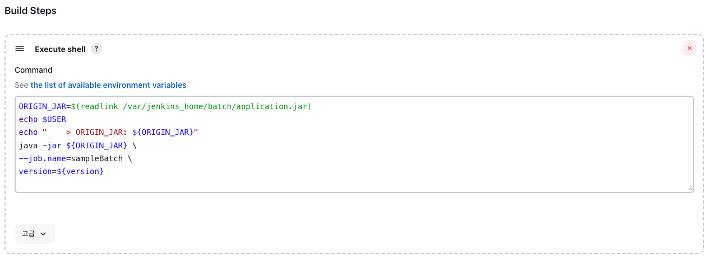
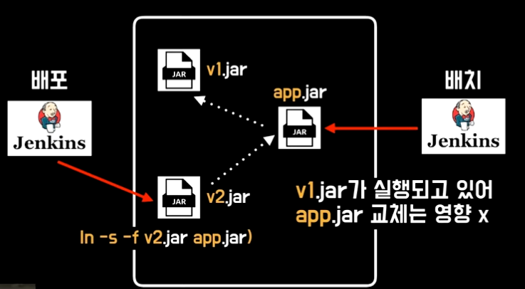

## **Batch Jenkins 서버 설정** 
Batch Jenkins 서버는 Code Deploy에 의해서 배치 어플리케이션이 배포되어야 한다. 따라서 Code Deploy Agent가 설치되어야 한다. 
ubuntu 리눅스 기준으로 아래 명령어로 필요한 패키지를 설치한다.
```shell
sudo apt-get update
sudo install ruby
sudo install wget 
```
다음으로 agent를 설치한다. 
```shell
cd /home/ec2-user
wget https://aws-codedeploy-ap-northeast-2.s3.amazonaws.com/latest/install
chmod +x ./install
sudo ./install auto
```
다음 명령어를 입력해 Code Deploy Agent가 제대로 설치되어 있는지 확인한다. 
```shell
sudo service code-deploy status
```

위와 같은 결과가 나오면 제대로 설치되어 있는 것이다. 다음으로 배포될 위치에 디렉토리를 생성한다. 
나는 배치 jenkins를 컨테이너를 이용했기 때문에, 컨테이너에 마운트된 호스트의 디렉토리에 배포될 디렉토리를 만들었다.
```shell
cd /home/ubuntu/jenkins 
mkdir batch
cd batch
mkdir deploy
mkdir jar 
``` 
## **Code Deploy 테스트** 
Code Deploy에서 jar 파일을 가져와 배치 jenkins에 배포해볼 것이다. 
가져오는 방식은 S3에 zip 파일을 올리면 Code Deploy에서 해당 zip 파일을 배치 jenkins에 배포한다. 

해당 과정은 이후에 배포 Jenkins를 이용해서 자동화될 것이다.

우선 zip 파일을 생성한 디렉토리를 하나 만들고, 해당 디렉토리에 모든 파일을 모은다.
```shell
mkdir -p code-deploy-member-batch
./gradlew :member-batch:clean :member-batch:build
cp member-batch/build/libs/*.jar code-deploy-member-batch
cp member-batch/code-deploy/*.yml code-deploy-member-batch
cp member-batch/code-deploy/*.sh code-deploy-member-batch
cd code-deploy-member-batch 
```
이후에 zip 파일로 압축한다.
```shell
zip -r code-deploy-member-batch *
```


그리고 만들어진 zip 파일을 S3에 업로드 하자


이제 Code Deploy 페이지에서 배포를 생성한다. 

그리고 배포 생성화면에서 배포 그룹, 개졍 유형, 개정 위치를 지정한다. 

개정 위치는 zip 파일이 저장된 S3 URI를 지정해주어야 한다. 

이후 배포를 시작하고 성공하면 다음과 같은 결과 화면을 통해 성공했음을 알 수 있다. 
배치 jenkins 서버에도 파일이 잘 옮겨져 있다.


이로써 Code Deploy가 배치 jenkins에 성공적으로 연동되었음을 확인할 수 있었다. 이젠 배포 jenkins를 이용해서 
빌드하고 배포하는 작업을 자동화할 것이다. 

## **배포 Jenkins에서 ci/cd 파이프라인 생성** 
이제 배포 Jenkins 서버에서 파이프라인을 생성할 것이다. 기존에 직접 Code Deploy에서 배포 했던 작업을 Jenkins를 이용해서 자동화 하는 작업이다.
파이프라인 이름은 ```member-batch-deploy```로 지정하였다. 


파이프라인의 소스 코드를 따로 git으로 관리하기 때문에 구성 > pipeline에 아래와 같이 github 주소를 작성해주었다.

개인적으로 이런 파이프라인을 git을 이용해 코드로 관리하면 아래와 같은 이점이 있다고 생각한다.
- 개발자들 간의 협업이 쉬워진다.
- 롤백 및 버전 관리가 쉬워진다. 
- 리뷰를 통해 좀 더 안전하게 소스 코드를 관리할 수 있다. 


아래는 배치 어플리케이션을 배포하기 위해 작성된 pipeline 코드이다. 
```shell
pipeline {
    agent any

    tools {
        gradle "Gradle 7.6"
        jdk "jdk17"
    }
    environment {
        GIT_DISTRIBUTE_URL = "https://github.com/devforlove/deploy.git"
    }
    stages {
        stage("Preparing Job") {
            steps {
                script {
                    try {
                        GIT_DISTRIBUTE_BRANCH_MAP = ["dev" : "develop", "qa" : "release", "prod" : "main"] // (1)

                        env.GIT_DISTRIBUTE_BRANCH = GIT_DISTRIBUTE_BRANCH_MAP[STAGE]

                        print("Deploy stage is ${STAGE}")
                        print("Deploy service is ${SERVICE}")
                        print("Deploy git branch is ${env.GIT_DISTRIBUTE_BRANCH}")
                    }
                    catch (error) {
                        print(error)
                        currentBuild.result = "FAILURE"
                    }
                }
            }
            post {
                failure {
                    echo "Preparing Job stage failed"
                }
                success {
                    echo "Preparing Job stage success"
                }
            }
        }
        stage("Cloning Git") {
            steps {
                script {
                    try {
                        git url: GIT_DISTRIBUTE_URL, branch: GIT_DISTRIBUTE_BRANCH, credentialsId: "GIT_CREDENTIAL" // (2)
                    }
                    catch (error) {
                        print(error)
                        currentBuild.result = "FAILURE"
                    }
                }
            }
            post {
                failure {
                    echo "Git clone stage failed"
                }
                success {
                    echo "Git clone stage success"
                }
            }
        }
        stage("Building Jar") {
            steps {
                script {
                    try {
                        sh("rm -rf deploy")
                        sh("mkdir deploy")

                        sh("gradle :${SERVICE}:clean :${SERVICE}:build -x test")

                        sh("cp /var/jenkins_home/workspace/${env.JOB_NAME}/${SERVICE}/build/libs/*.jar ./deploy/${SERVICE}.jar") // (3)
                        sh("cp /var/jenkins_home/workspace/${env.JOB_NAME}/${SERVICE}/codedeploy/appspec.yml ./deploy")
                        sh("cp /var/jenkins_home/workspace/${env.JOB_NAME}/${SERVICE}/codedeploy/deploy.sh ./deploy")
                        zip(
                            zipFile: "deploy.zip",
                            dir: "/var/jenkins_home/workspace/${env.JOB_NAME}/deploy"
                        )
                    }
                    catch (error) {
                        print(error)
                        sh("rm -rf /var/jenkins_home/workspace/${env.JOB_NAME}/*")
                        currentBuild.result = "FAILURE"
                    }
                }
            }
            post {
                failure {
                    echo "Build jar stage failed"
                }
                success {
                    echo "Build jar stage success"
                }
            }
        }
        stage("Upload To S3") {
            steps {
                script {
                    try {
                        withAWS(credentials: "AWS_CREDENTIAL") { // (4)
                            s3Upload(
                                    path: "${env.JOB_NAME}/${env.BUILD_NUMBER}/${env.JOB_NAME}.zip",
                                    file: "/var/jenkins_home/workspace/${env.JOB_NAME}/deploy.zip",
                                    bucket: "batch-repo"
                            )
                        }
                    }
                    catch (error) {
                        print(error)
                        sh("rm -rf /var/jenkins_home/workspace/${env.JOB_NAME}/*")
                        currentBuild.result = "FAILURE"
                    }
                }
            }
        }
        stage("Deploy") {
            steps {
                script {
                    try {
                        withAWS(credentials: "AWS_CREDENTIAL") { // (5)
                            createDeployment(
                                    s3Bucket: 'batch-repo',
                                    s3Key: "${env.JOB_NAME}/${env.BUILD_NUMBER}/${env.JOB_NAME}.zip",
                                    s3BundleType: 'zip',
                                    applicationName: 'batch-deploy',
                                    deploymentGroupName: 'batch-deploy-group',
                                    deploymentConfigName: 'CodeDeployDefault.AllAtOnce',
                                    description: 'Batch deploy',
                                    waitForCompletion: 'true',
                                    ignoreApplicationStopFailures: 'false',
                                    fileExistsBehavior: 'OVERWRITE'// [Valid values: DISALLOW, OVERWRITE, RETAIN]
                            )
                        }
                    }
                    catch (error) {
                        print(error)
                        sh("rm -rf /var/jenkins_home/workspace/${env.JOB_NAME}/*")
                        currentBuild.result = "FAILURE"
                    }
                }
            }
            post {
                failure {
                    echo "Deploy stage failed"
                }
                success {
                    echo "Deploy stage success"
                }
            }
        }
        stage("Clean Up") {
            steps {
                script {
                    sh("rm -rf /var/jenkins_home/workspace/${env.JOB_NAME}/*")
                }
            }
        }
    }
}
```
(1): 사용자가 지정한 매개변수에 따라서 다른 브랜치를 빌드하고 배포하게 된다.
- 하나의 파이프라인으로 모든 환경을 적용하고, 달라지는 부분만 매개변수로 처리하는 것이 좋은 설계라고 생각한다. 그래야 중복으로 인한 불일치가 발생하지 않기 때문이다.
- 매개변수는 '구성 > General > 이 빌드는 매개변수가 있습니다.'에서 설정할 수 있다. 


(2): git clone 명령어를 통해서 배치 어플리케이션 소스코드를 가져오는 부분이다. git과 연동하는 credential이 필요하다.
- GIT_DISTRIBUTE_URL: 배치 어플리케이션의 github url을 지정한다. 
- GIT_DISTRIBUTE_BRANCH: 배포하고자 하는 branch를 지정한다.

(3): clone해서 가져온 배치 어플리케이션을 빌드한 jar, appspec.yml, deploy.sh 파일을 deploy 폴더로 복사하고, 압축한다.

(4): 압축된 deploy.zip 파일을 S3로 업로드하는 부분이다. 
- path: zip 파일이 저장되는 S3 버킷 내의 위치 
- file: S3로 업로드 하려는 zip 파일 경로 
- bucket: zip 파일이 저장되는 S3 버킷 

(5): Code Deploy에 배포 요청을 한다. 
- s3Bucket: zip 파일이 저장되어 있는 버킷의 위치
- s3Key: S3내에 zip 파일이 저장되어 있는 경로
- s3BundleType: 파일 타입 
- applicationName: Code Deploy 어플리케이션 이름 
- deploymentGroupName: Code Deploy 배포 그룹 이름 

위의 파이프라인으로 실행을 해보면 모든 단계가 성공하고, 배치 jenkins 서버에도 파일들이 전달되었음을 확인할 수 있다.


여기까지 jenkins를 이용해 배치 어플리케이션을 배치 jenkins 서버에 배포하는 내용이다.
다음은 배치 jenkins 서버에서 배치 어플리케이션을 실행해볼 것이다. 

## **배치 Jenkins 서버에서 배치 어플리케이션 실행** 
우선 배치 jenkins 서버에서 배치 어플리케이션을 수행할 item을 생성한다. Freestyle project를 선택했다. 

'구성 > General > 이 빌드는 매개변수가 있습니다'에서 version을 매개변수로 주어서 버전 변화에 따라 배치 어플리케이션을 반복 수행할 수 있도록 하였다. 

그리고 '구성 > Build Steps'에서 Spring Batch 어플리케이션을 수행하는 스크립트를 작성하였다. 

```shell
ORIGIN_JAR=$(readlink /var/jenkins_home/batch/application.jar) # (1) 
echo "    > ORIGIN_JAR: ${ORIGIN_JAR}"
java -jar ${ORIGIN_JAR} \ 
--job.name=sampleBatch \
version=${version}
```
(1) readlink
- application.jar에 링크된 원본 jar 파일을 찾는다. 
- **Batch 실행시 원본 jar를 실행하기 때문에 배포로 application.jar에 링크된 파일이 변경되어도 실행중이던 Batch 작업이 종료되지 않는다.**
- readlink를 사용함으로써 배치 어플리케이션의 무중단 배포가 가능해졌다. 

readlink의 원리를 좀 더 자세히 설명해보자면

아래 이미지를 보면 ```lsn -s -f``` 명령어를 통해 app.jar가 v1.jar와 링크되어 있었다.
따라서 배치 jenkins에서 readlink를 이용해서 app.jar로 작업을 수행하면 v1.jar가 수행된다.
만약 새롭게 배포되어서 app.jar와 링크된 jar파일이 v2.jar로 변경되더라도 기존 v1.jar는 영향을 받지 않고 작업을 수행할 수 있다. 


이제 완료된 item을 시작해보겠다. 


아래는 jenkins의 Console Output 화면이다.
readlink를 통해서 원본 jar 파일을 제대로 가져오는 것을 확인할 수 있다. 
그리고 배치 어플리케이션도 의도했던 대로 동작함을 확인할 수 있다.


이상 Spring Batch를 젠킨스로 관리하는 방법에 대해 다루어 보았다.  
이번에 Jenkins로 배치 어플리케이션을 관리해보니, jenkins의 여러 가지 기능이 Spring Batch와 어울린다고 생각되었다. 
앞으로 Jenkins로 Spring Batch를 관리하는 방법에 대해 많이 다루어볼 예정이다. 