이번 글에서는 2편에 걸쳐서 AWS EKS와 GitOps를 활용한 ArgoCD를 구축할 예정이다.

최근에는 인프라 관리도 코드로 구성하는 경우가 많아졌다. 
인프라가 Cloud 형태로 서비스 되기 시작하면서 API로 자유롭게 제어가 가능해졌기 때문이다. 내가 생각하는 IAC(Infrastructure as code)의 특징은 아래와 같다
- Code를 통해 언제든 인프라를 손쉽게 재현할 수 있다.
- Code와 Varaible의 조합으로, 동일 형상의 인프라 환경을 여러 번 반복/재조합 하여 생성 가능하다.

이처럼 코드의 중요성이 커짐에 따라 git으로 인프라 환경을 관리하는 gitOps 방식이 대두되기 시작했다. 그렇다면 gitOps란 무엇일까?
GitOps란 Git을 기반으로 한 개발 / 배포 프로세스 자동화 방법이다. 
모든 코드를 git으로 관리하면 좋은점은 무엇일까? 아래와 같은 장점이 있다고 생각한다. 

- 다수의 개발자가 협업 가능
- 원천 코드의 단일화
- 코드 수정 시 리뷰 및 승인 프로세스 추가 
- 버저닝 및 롤백 가능 
- 안전한 보관

아래는 gitOps의 flow이다.
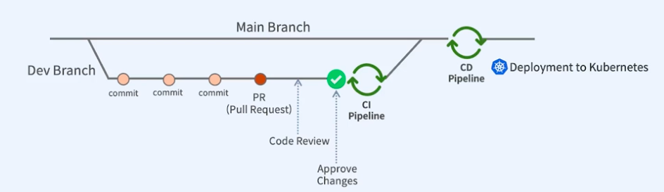
모든 단계에서 자동화 프로세스가 진행됨을 알 수 있다. PR이후 Code Review를 통해 승인이 되면 CI가 진행된다. 그리고 CD pipeline이 진행된다. 
또한 git을 통해서 투명한 코드 관리를 할 수 있고, 누가 언제 코드 변경을 수행했는지가 모두 기록된다. 그러므로 Infrastructre의 히스토리가 유지되고, 리뷰어의 승인 절차를 통해 신뢰성 높은 infrastructure code를 유지할 수 있다.

## **ArgoCD?**
gitOps가 git을 통한 자동화 방식이라면, ArgoCD는 kubernetes를 위한 선언적인 GitOps CD 도구이다. 선언적 도구이기 때문에 개발자가 원하는 상태를 지정하면, 현재 상태와 상관 없이 지정된 최종 상태로 수렴하려는 특징이 있다. 또한 gitOps CD 도구이기 git에서 사용할 수 있는 기능은 모두 사용 가능하다. 따라서 리뷰 승인 프로세스 뿐만아니라, 변경 사항들이 모두 버저닝되고, 롤백 가능하다. 
그러면 이제 본격적으로 EKS를 구축하고 ArgoCD를 설치해보도록 하겠다. 먼저 이번 글에서 구축할 EKS Cluster 구성이다.

## **EKS Cluster 구성도**
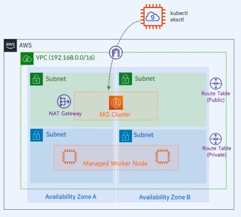
구성을 설명하자면
- vpc안에 외부에 노출되는 public subnet을 두고 kubernetes의 컨트롤 플레인을 위치시킨다. 따라서 외부에 있는 cloud9이 컨트롤 플레인에 곧바로 접근가능하다.
- 데이터 플레인 즉 노드 그룹은 컨트롤 플레인에서만 접근할 것이기 때문에, private subnet에 위치시켰다. 그리고 가용성을 위해 AZ이 다른 두 개의 subnet에 각각 노드를 구성했다.
- cloud9은 외부 네트워크에 구축하였고, eksctl을 설치하여 eks 구성 자동화에 사용할 것이다. 또한 kubectl도 설치하여 외부 네트워크에 위치한 cloud9 인스턴스에서 eks 컨트롤 플레인으로 요청할 것이다.

### **cloud 9 구성**
환경 생성 버튼을 눌러 Cloud9 환경 설정을 시작한다.
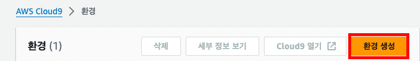

아래는 설정화면이다. 인스턴스 유형은 CLI에서 컨트롤 플레인에 요청만 할 것이므로 인스턴스를 최소 사양으로 지정해도 된다. 
플랫폼은 권장하는 설정인 'Amazon Linux 2023'으로 지정했다. 그리고 시간 제한은 유저가 cloud9에서 작업을 하지 않을 경우, 일정 시간이 지나면 절전 모드로 변경되는 옵션이다. 
여기선 30분으로 지정했다.

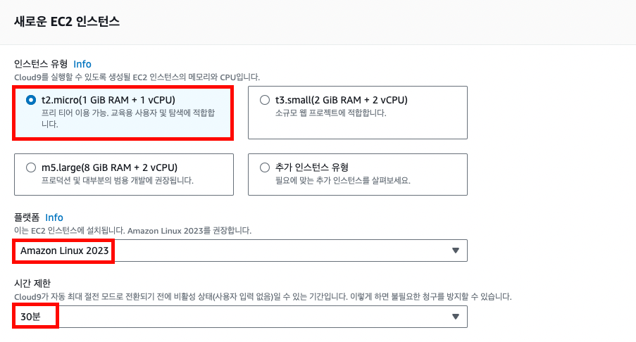

그리고 생성 버튼을 누르면 cloud9 인스턴스 생성이 시작된다. 인스턴스 생성이 완료되면 아래와 같은 화면이 만들어질 것이다.

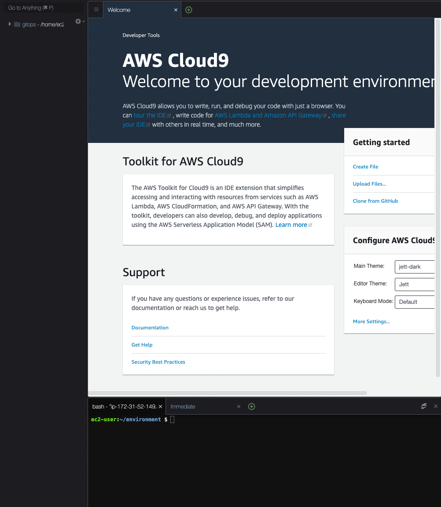

다음으로는 cloud9에서 kubernetes 컨트롤 플레인에 요청을 하기 위해서 kubectl을 설치해야한다. 아래는 설치하기 위한 명령어이다.
```shell
curl -O https://s3.us-west-2.amazonaws.com/amazon-eks/1.25.9/2023-05-11/bin/linux/amd64/kubectl
curl -O https://s3.us-west-2.amazonaws.com/amazon-eks/1.25.9/2023-05-11/bin/linux/amd64/kubectl.sha256
sha256sum -c kubectl.sha256 kubectl: OK
chmod +x ./kubectl
mkdir -p $HOME/bin && cp ./kubectl $HOME/bin/kubectl && export PATH=$HOME/bin:$PATH > echo 'export PATH=$HOME/bin:$PATH' >> ~/.bashrc
```
kubectl 버전이 출력되면 제대로 설치된 것이다.
```shell
kubectl version
```

다음으로는 구성 자동화를 위한 eksctl 설치를 위한 명령어이다.
```shell
PLATFORM=$(uname -s)_$ARCH
curl -sLO "https://github.com/eksctl-io/eksctl/releases/latest/download/eksctl_$PLATFORM.tar.gz"
curl -sL "https://github.com/eksctl-io/eksctl/releases/latest/download/eksctl_checksums.txt" | grep $PLATFORM | sha256sum --check
tar -xzf eksctl_$PLATFORM.tar.gz -C /tmp && rm eksctl_$PLATFORM.tar.gz 
sudo mv /tmp/eksctl /usr/local/bin
```
다음으로는 kubernetes 클러스터에 어플리케이션 배포를 관리하기 위한 오픈소스 패키지 관리 도구인 Helm을 설치해볼 것이다. 이 Helm을 이용하면 kubernetes 상의 리소스를 패키지화하여 손쉽게 관리하고 업데이트 할 수 있다.
```shell
curl -fsSL -o get_helm.sh https://raw.githubusercontent.com/helm/helm/main/scripts/get-helm-3
chmod 700 get_helm.sh
./get_helm.sh
```
이젠 AWS Access Key, Secret Key를 설정할 것이다.

cloud9은 기본적으로 AWS CLI를 사용할 수 있는 Credential가 설정된 환경으로 제공하지만, eksctl을 사용하기 위한 일부 권한이 제외된 설정이다. 따라서 administrator 권한을 설정할 것이다.
IAM에서 administrator 정책을 가진 사용자를 생성하고 해당 사용자의 accessKey, secretKey, region을 cloud9에 지정해주어야 한다.

cloud9에 아래와 같이 입력하면 적용된다.
```shell
export AWS_ACCESS_KEY_ID=<ACCESSKEY>
export AWS_SECRET_ACCESS_KEY=<SECRETKEY>
export AWS_DEFAULT_REGION=ap-northeast-2
```
cloud9의 설정은 완료되었다. 이젠 EKS를 생성할 차례이다.

## **EKS 구성**
```shell
eksctl create cluster --name gitops --region ap-northeast-2
```
cloud9에서 위의 명령어를 사용하면 gitops라는 cluster명으로 EKS가 자동으로 구성된다. 
region은 ap-northeast-2로 지정했으므로 서울 리전에 생성된다. 아래와 eks 콘솔 화면에서 활성화된 eks 클러스터가 노출된다면 성공이다.

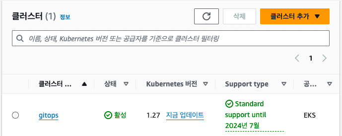

다음으로 EKS의 추가 기능을 설치할 것이다. eks 콘솔의 추가기능 탭에서 아래의 추가기능 들을 활성화 할 것이다.

- Amazon VPC CNI: EKS 클러스터가 EC2 노드에 Pod를 배포할때, 네트워크 ENI를 사용해주도록 추가 기능 지원
- Amazon EBS CSI 드라이버: 클러스터가 영구 볼륨을 사용할 때, EBS 볼륨을 활용할 수 있게끔 해주는 드라이버
- Kube-proxy: Pod의 리소스가 배포되는 EC2 워커 노드와 파드간 네트워크 통신을 담당하는 기능
- CoreDNS: EKS 클러스터 내에서 DNS 역할을 해주는 추가 기능

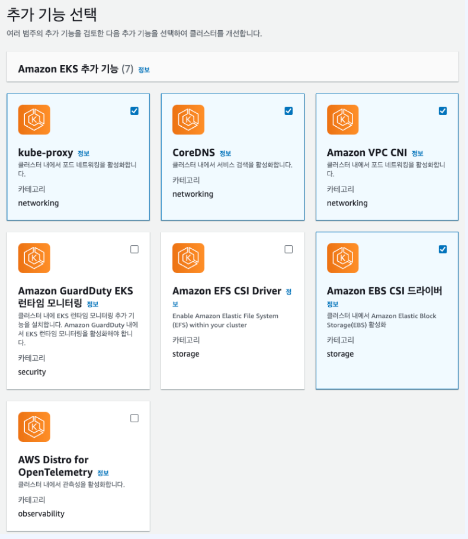

## **AWS Load Balancer Controller**

이번에는 AWS Load Balancer Controlle를 동적으로 프로비저닝 해주기 위한 설정을 할 것이다. kubernetes에서 service type: LoadBalancer이거나 Ingress를 사용할 때 동적으로 aws 리소스를 생성해주기 위함이다.
OIDC 자격증명 공급자를 생성한다.
```shell
eksctl utils associate-iam-oidc-provider \
--region ap-northeast-2 \ # 리전
--cluster eks\ # 클러스터명
--approve
```
이렇게 OIDC 자격증명을 발급하면 직접 키를 관리하지 않고, 단기 토큰을 받기 때문에 보안적으로 우수하다. 이 토큰을 통해 aws의 다양한 리소스들을 프로비저닝 할 수 있다.
다음으로 IAM 정책을 생성해 주어야 한다.
```shell
curl -O https://raw.githubusercontent.com/kubernetes-sigs/aws-load-balancer-controller/v2.5.4/docs/install/iam_policy.json
aws iam create-policy --policy-name AWSLoadBalancerControllerIAMPolicy --policy-document file://iam_policy.json
```
위의 명령어를 사용한 이후 aws IAM에는 다음과 같은 AWSLoadBalancerControllerIAMPolicy 정책이 생성된 것을 볼 수 있다.

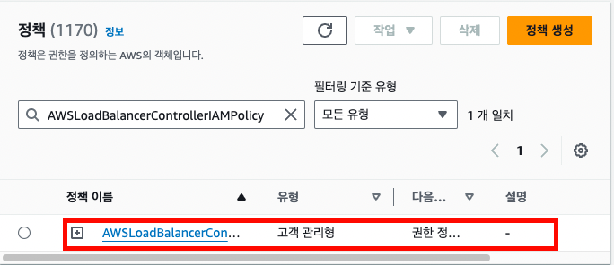

이후 해당 정책을 사용하는 service account를 생성해 주어야 한다. 아래는 service account를 생성해주는 명령어이다.
```shell
eksctl create iamserviceaccount \
--cluster=gitops \ #클러스터 명
--namespace=kube-system \
--name=aws-load-balancer-controller \
--role-name AmazonEKSLoadBalancerControllerRole \
--attach-policy-arn=arn:aws:iam::<ACCOUNT_ID>:policy/AWSLoadBalancerControllerIAMPolicy \
--approve
```

kube-system 네임스페이스에 aws-load-balancer-controller 이름의 service account가 제대로 생성된 것을 확인할 수 있다.

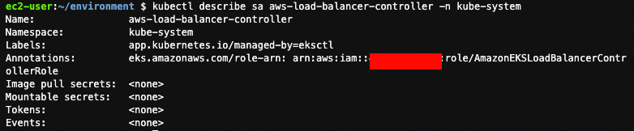

이젠 helm을 이용해서 Load Balancer Controller를 생성할 것이다.
```shell
helm repo add eks https://aws.github.io/eks-charts
helm repo update eks
helm install aws-load-balancer-controller eks/aws-load-balancer-controller -n kube-system --set clusterName=gitops --set serviceAccount.create=false --set serviceAccount.name=aws-load-balancer-controller
```
helm으로 생성 성공시, aws-load-balancer-controller deploy가 kube-system 네임스페이스에 생성된 것을 확인할 수 있다.

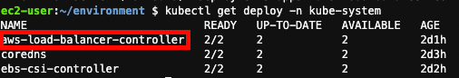


## **ECR 리포지토리 생성**
ECR은 AWS에서 제공하는 이미지 저장소이다. ECR이 필요한 이유는 워커 노드에서 이미지를 다운로드 받은 후 Pod로 실행해야 하는데, 여기서 이미지를 저장할 공용 이미지 저장소가 필요하기 때문이다. 
생성 방법은 간단하다. 리포지토리 생성 버튼을 누르면 아래와 같이 생성 화면에서 프라이빗/퍼블릭 여부를 선택하고 리포지토리 이름을 지정하면 된다.


여기서는 프라이빗에 backend 라는 리포지토리 이름을 지정하였다.

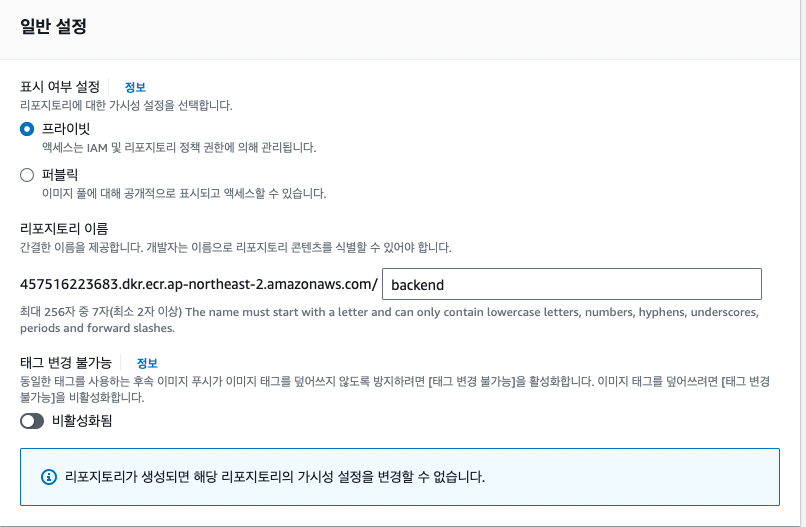

이상 여기까지가, argoCD를 이용한 CI/CD 배포 프로세스를 구축하기 위한 인프라 설정단계였다. 
이후 다음 글에서는 본격적으로 ArgoCD를 이용한 CI 부터 CD 단계까지 구축하는 방법에 대해서 글을 이어나가보고자 한다.
