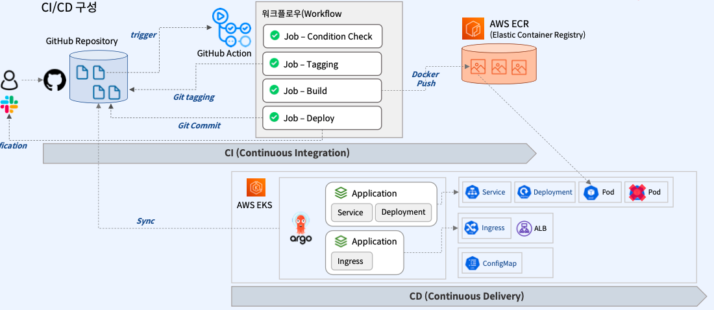
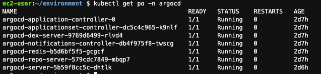
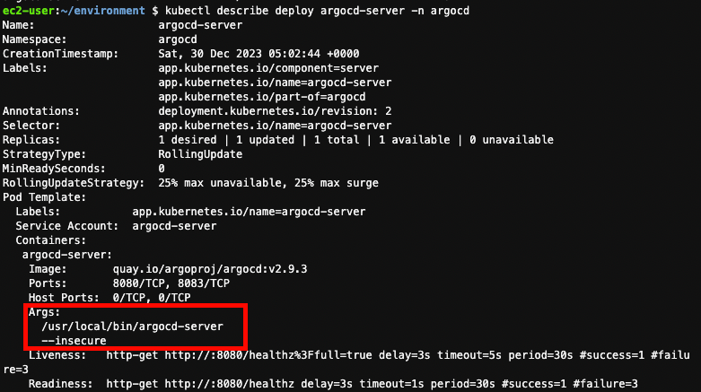
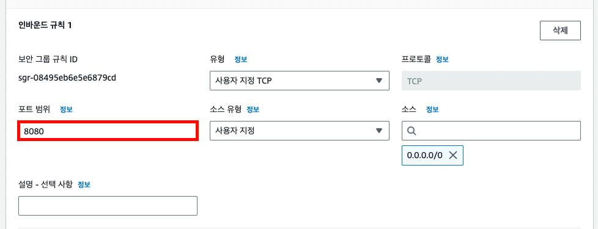
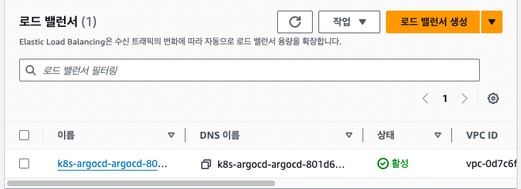
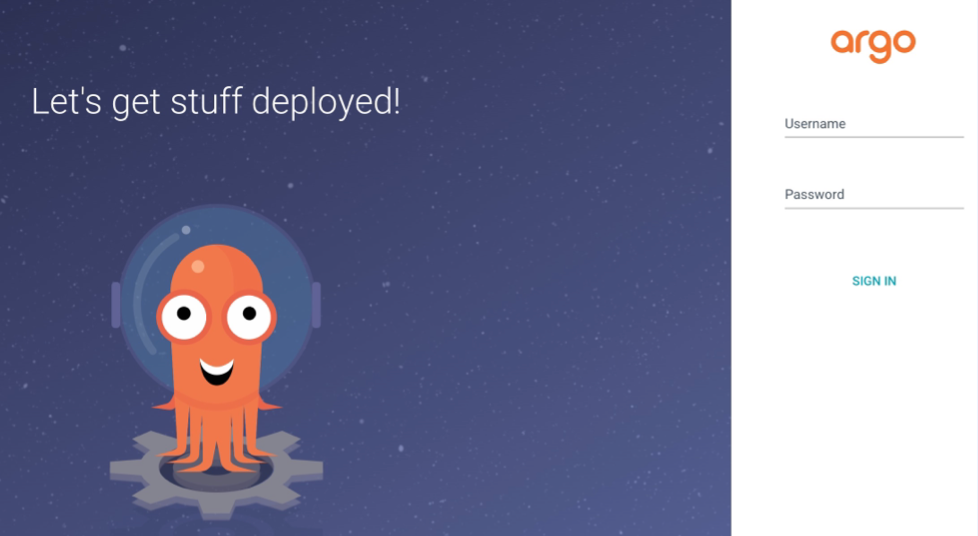
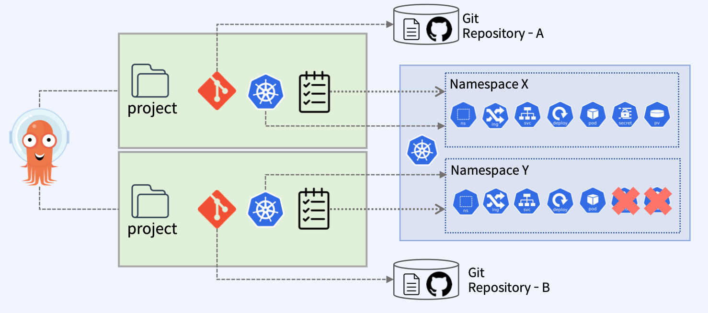

이번 글에는 저번글에 이어서 ArgoCD를 설치하고 직접 CI/CD를 구축해볼 것이다.

구축하고자 하는 CI/CD의 전체적인 흐름은 아래와 같다.



1. github 리포지토리에 push가 되거나 수동 트리거되는 이벤트가 발생하면, GitHub Action이 자동으로 트리거 된다.
2. 이후 GitHub Action의 플로우에서 조건 체크, 태깅, 빌드, 배포 등의 과정을 거친다.
3. workflow의 과정 중에 ECR에 이미지가 올라간다.
4. github 리포지토리에 변경사항이 발생하면, ArgoCD가 변경을 감지하여 Sync를 수행한다.
5. ArgoCD에 Sync가 수행되면서, ECR에 올라가 있는 이미지를 pull 받아서 새로운 pod에 반영한다.

지금 부터 만들고자 하는 CI/CD 프로세스는 위의 흐름을 그대로 진행할 것이다.

## **ArgoCD 설치**
먼저 kubernetes 내에 ArgoCD 설치를 위한 argocd namespace를 생성한다. 이후 ArgoCD 구축을 위한 yaml 파일을 받고 리소스를 설치한다.
```shell
kubectl create namespace argocd
kubectl apply -n argocd -f https://raw.githubusercontent.com/argoproj/argo-cd/stable/manifests/install.yaml
```

이후 argocd 네임스페이스에서 확인해 보면 필요한 리소스들이 제대로 설치되어 있음을 확인할 수 있다.



하지만 아직 ingress가 구축되어 있지 않기 때문에, 외부에서 접근을 할 수 있는 상태는 아니다. 이번에는 ingress를 구축하여 argocd에 접근할 수 있도록 해볼 것이다. 
그 전에 ArgoCD의 pod들은 http 요청이 들어오면 https로 Redirect 수행되도록 설정하고 있다. 이번 예제에서는 ALB를 통해 http로 서비스 되도록 구성할 예정이므로, 관련 설정을 변경해야 한다.

```shell
kubectl -n argocd patch deployment argocd-server --type json -p='[ { "op": "replace", "path":"/spec/template/spec/containers/0/args","value": ["/usr/local/bin/argocd-server","--insecure"] }]'
```

아래와 같이 argocd-server의 Args의 설정에 --insecure가 추가된다.



또한 argocd-server가 사용하는 8080 포트 허용 인바운드 룰을 추가한다.



argocd-server로 접속하기 위한 service인 argocd-server-nodeport도 생성한다. 
아래는 service.yml의 내용이다.
```yaml
apiVersion: v1
kind: Service
metadata:
  labels:
    app: argocd-server-nodeport
  name: argocd-server-nodeport
  namespace: argocd
spec:
  ports:
    - name: "80"
      port: 80
      protocol: TCP
      targetPort: 8080
  selector:
      app.kubernetes.io/name: argocd-server
        sessionAffinity: None
        type: NodePort
```
```shell
kubectl apply -f service.yml
```

NodePort 타입의 Service를 생성하면 다음으로는 Ingress를 생성하여 외부 네트워크에서 argocd-server로 접근할 수 있도록 해야 한다.

```yaml
apiVersion: networking.k8s.io/v1
kind: Ingress
metadata:
  name: argocd
  namespace: argocd
  annotations:
    alb.ingress.kubernetes.io/listen-ports: '[{"HTTP": 80}]' 
    alb.ingress.kubernetes.io/scheme: internet-facing 
    alb.ingress.kubernetes.io/target-type: ip 
    alb.ingress.kubernetes.io/healthcheck-path: /healthz 
    alb.ingress.kubernetes.io/healthcheck-protocol: HTTP 
    alb.ingress.kubernetes.io/success-codes: '200' 
    alb.ingress.kubernetes.io/security-groups: #로드밸런서 보안 그룹 ID	 
    alb.ingress.kubernetes.io/subnets: #자신의 public subnet 입력
spec:
  ingressClassName: alb
  rules:
    - http:
        paths:
          - pathType: Prefix
            path: /
            backend:
              service:
                name: argocd-server-nodeport
                port:
                  number: 80
```
public subnet과 로드밸런서 보안 그룹 ID는 자신의 정보를 입력해야 한다.
```shell
kubectl apply ‒f ingress.yml
```

동적으로 AWS 로드밸런서가 프로비저닝된다.



이젠 로드밸런서의 DNS로 argocd에 접속가능하다.



아이디와 패스워드는 argocd 배포 후 자동 생성된 argocd-initial-admin-secret에 저장되어 있다. 아래 명령을 통해 랜덤 생성된 Password를 확인할 수 있다. (Username은 admin이다)

```shell
kubectl -n argocd get secret argocd-initial-admin-secret -o jsonpath="{.data.password}" | base64 -d
```

여기까지 ArgoCD 구축을 끝마치고, ArgoCD에 대한 기본설정을 해보고자 한다.

## ArgoCD 기본 설정
ArogCD에서는 project라는 개념이 중요하다. project 별로 git 리포지토리도 별도록 사용할 수 있고, 배포 할 수 있는 항목도 제한된다. 더 나아가 배포할 수 있는 대상 클러스터와 네임 스페이스도 분리된다.

ArgoCD에 접속하는 사용자는 특정 프로젝트에 속해, 해당 프로젝트에서 허용된 리소스에만 접근할 수 있다.


project를 생성하기 전에 먼저 git repository를 ArgoCD에 등록할 것이다. Settings > Developer settings 에서 token을 생성한다. repo 권한만 있으면 되기 때문에 해당 권한만 체크하였다.


그리고 ArgoCD에서 리포지토리를 추가한다. Settings > CONNECT REPO에서 추가하는데, 연결 방식은 HTTPS로 선택한다. 이전에 github에서 생성했던 토큰을 password에 입력한다.


이제 repository 연결을 완료했으니, ArgoCD에서 project를 만들어 보자. 먼저 ArgoCD 화면에서 Settings > Projects 로 들어가서 projects를 생성한다.


이전에 project 마다 접근 가능한 리포지토리와 쿠버네티스 리소스가 주어진다고 하였는데, project를 생성할 때 접근 가능한 리소스를 지정해준다. SOURCE REPOSITORY에는 방금 연결한 git repository의 url을 적어주었다. DESTINATION에는 ArgoCD가 있는 쿠버네티스의 모든 리소스에 접근 가능하도록 설정하였다.

다음으로는 project에 속해있는 Application을 생성해주어야 한다. Application은 kubernetes에 배포되는 리소스들을 그룹으로 묶어서 정의한 단위이다. 따라서 ArgoCD를 통해 배포되는 모든 리소스들은 Application 단위로 관리된다. 리소스들을 개별로 관리하는 대신, 욲어서 관리함에 따라 관리 편의성이 높다.


project를 지정해주고, 리포지토리와 관리하고자 하는 리소스가 있는 path를 지정해준다. 마지막으로 kubernetes 네임스페이스도 지정해준다.

ArgoCD의 기본적인 설정도 완료하였다. 이제는 본격적인 CI/CD 프로세스를 구축해볼 것이다.

Github Action을 이용한 CI 프로세스 구축
gitOps를 이용하기 위해 github에서 Github Actions를 설정해 볼 차례이다.

우선 Spring Boot 프로젝트 내부에 .github/workflows 디렉토리를 만들고 workflow를 정의하는 build.yml 파일을 생성하였다.


다음으로 아래는 build.xml 파일의 구성 내용이다.

name: "[BACKEND] Build"
on:
workflow_dispatch:
inputs:
tag:
description: "`x.y.z-backend.NN` 형태로 버전을 입력해주세요. (ex. 0.1.0-backend.05)"
required: true
default: 0.0.1-backend.00
env:
TAG: ${{ github.event.inputs.tag }}
SLACK_WEBHOOK_URL: ${{secrets.SLACK_WEBHOOK_URL}}
BACKEND_ECR_REPOSITORY: ${{ secrets.BACKEND_ECR_REPOSITORY }}
BUILD_PATH: "~/backend-build-tmp"

permissions:
id-token: write
contents: write
name: name은 말그대로 workflow의 이름이다.
on:  이 부분에서는 workflow가 트리거 되는 방식을 정의한다. 이번 예제에서는 수동으로 트리거 할 것이기 때문에 'workflow_dispatch'를 선택하였다. 그리고 input 값으로는 태그명만 받을 것이기 때문에 tag 속성을 추가하였다.
description: 태그 명에 대한 부연 설명을 의미한다.
required: 필수 값임을 의미한다.
default: 만약 태그명을 지정하지 않으면, 선택되는 태그명이다.
evn: 이후에 사용할 환경변수 설정을 하는 부분이다.
permissions: id-token, contents를 추가하였다.
id-token: ECR 레포지토리로 접근시 oidc 사용을 위한 임시 토큰 발급에 대한 write 권한 추가
contents: workflow가 위치해 있는 git repository에 대한 권한 추가로 tag 추가를 위한 write 권한 추가
위의 설정을 모두 추가한 후 Github Actions 탭을 들어가면 아래와 같이 tag를 지정한 이후 workflow를 트리거하는 부분이 추가된다.


jobs
다음으로는 workflow의 작업을 정의하는 jobs 부분이다. 여기서는 condition_check, tagging, build 과정을 거친다.

jobs:
condition_check:
runs-on: ubuntu-latest
steps:
- name: check tag format
run: |
if [[ !(${{ env.TAG }} =~ ^(0|[1-9][0-9]*)\.(0|[1-9][0-9]*)\.(0|[1-9][0-9]*)\-backend\.[0-9]{2}$) ]];
then
echo "You entered an incorrect tag format."
exit 1
fi
tagging:
needs: condition_check
runs-on: ubuntu-latest
steps:
- uses: actions/checkout@v2
- name: Create Tag
run: |
git tag ${{ env.TAG }}
git push origin ${{ env.TAG }}
build:
needs: tagging
runs-on: ubuntu-latest
steps:
- name: Check out code
uses: actions/checkout@v3
- name: Set Up JDK 17
uses: actions/setup-java@v3
with:
java-version: '17'
distribution: 'adopt'
- name: Build Java Sample Code
run: |
mkdir -p $BUILD_PATH
./gradlew build
cp -rf build/libs/* $BUILD_PATH/
- name: Configure AWS credentials
uses: aws-actions/configure-aws-credentials@v1
with:
role-to-assume: ${{ secrets.ASSUME_ROLE_ARN }}
aws-region: ap-northeast-2
role-session-name: GithubActionSession
- id: build-image
name: Build and Tag Image
env:
BACKEND_ECR_REPOSITORY: ${{ env.BACKEND_ECR_REPOSITORY }}
IMAGE_TAG: ${{ env.TAG }}
run: |
docker build -t $BACKEND_ECR_REPOSITORY:$IMAGE_TAG $BUILD_PATH/
- id: login-ecr
name: Login to Amazon ECR
uses: aws-actions/amazon-ecr-login@v1
- id: push-image-to-aws-ecr
name: Push image to Amazon ECR
env:
BACKEND_ECR_REPOSITORY: ${{ env.BACKEND_ECR_REPOSITORY }}
IMAGE_TAG: ${{ env.TAG }}
run: |
docker push $BACKEND_ECR_REPOSITORY:$IMAGE_TAG
condition_check: 사용자가 입력한 태그에 대한 유효성 검사를 하는 부분이다.
tagging: 입력한 태그 값을 기반으로 태그를 push 한다.
needs: condition_check가 완료되고 수행되어야 하기 때문에, condition_check가 완료되면 tagging이 실행된다.
build: 빌드는 실질적으로 java 어플리케이션을 빌드하고, 도커 이미지를 빌드하여 ECR에 푸시하는 과정까지 포함된다.
Set up JDK 17: 자바 어플리케이션이 jdk 17버전이기 때문에 버전을 17 버전으로 맞추는 부분이다.
Build Java Sample code: 자바 어플리케이션을 빌드하고 $BUILD_PATH에 복사한다.
Configure AWS credentials: Github Actions에서 AWS 리소스를 이용하기 위해 oidc 인증을 하는 부분이다. 나중에 이미지를 ECR에 푸시하기 위해 필요한 부분이다.
Build and Tag Image: jar 파일을 도커 이미지로 패키징하는 과정이다.
Login to Amazon ECR: ECR에 로그인한다.
Push image to Amazon ECR: 빌드된 도커 이미지를 ECR에 푸시한다.
Configure AWS credentials 과정에서 AWS의 oidc 인증을 하기 위한 역할을 생성해야 한다.  우선 자격 증명 공급자를 추가한다.


다음으로 웹 자격 증명으로 역할을 생성한다.


역할을 생성한 후 신뢰 관계는 아래와 같은 모습이어야 한다.


"Condition": {
"StringEquals": {
"token.actions.githubusercontent.com:aud": "sts.amazonaws.com"
},
"StringLike": {
"token.actions.githubusercontent.com:sub": "repo:<myGithubName>/<myRepositoryName>:*"
}
}
myGithubName, myRepositoryName 은 각자 자신의 github 이름과 리포지토리 이름을 지정해야 한다. 이후 역할의 ARN 정보를 github secret에 입력해주어야 한다.


이제 완료하였으면 workflow를 트리거 해보자. 트리거 되어서 아래와 같은 화면이 나온다면 성공이다. ecr에도 이미지가 제대로 올라가 있는 것을 확인할 수 있다.


여기까지 CI를 구축하는 부분이다. 물론 여기서 CD까지 구축하여야 완료된다. CD는 이번글의 주제인 ArgoCD로 구축할 것이다.

ArgoCD를 이용한 CD 프로세스 구축
이제부터는 CD를 구축하는 부분이다. 아래는 Github Action 스크립트에 배포를 정의한 부분이다.

deploy:
needs: build
runs-on: ubuntu-latest
steps:
- name: Setup Kustomize
uses: imranismail/setup-kustomize@v1
- name: Checkout kustomize repository
uses: actions/checkout@v3
- name: Update Kubernetes resources
run: |
cd k8s/gitops
kustomize edit set image humancat-backend-image=${{ env.BACKEND_ECR_REPOSITORY }}:${{ env.TAG }}
- name: Commit & Push Image
uses: actions-js/push@master
with:
message: '[DEPLOY] Update Image ${{ env.BACKEND_ECR_REPOSITORY }}:${{ env.TAG }}'
branch: master
github_token: ${{ secrets.GITHUB_TOKEN }}
Update Kubernetes resources: kustomize 명령어를 이용해 태그 버전을 변경한다. 만약 변경이 되면 ArgoCD에서 변경을 감지해서 OutOfSync 상태로 변경된다.
Commit & Push Image: 태그가 변경된 상태를 git repository에 푸시한다.
태그가 변경되면 아래와 같이 git history에 남게된다.


이제 Github Action을 트리거 해보자 다음과 같은 화면이 보이면 deploy 단계까지 모두 성공했다는 것을 의미한다.


그리고 ArgoCD의 Application은 OutOfSync 상태로 보인다. SYNC 버튼을 누르면 동기화 작업이 진행된다.


동기화 작업 이후 pod와 service가 yaml 파일에 선언해 두었던 대로 생성되어있는 것을 확인할 수 있다


