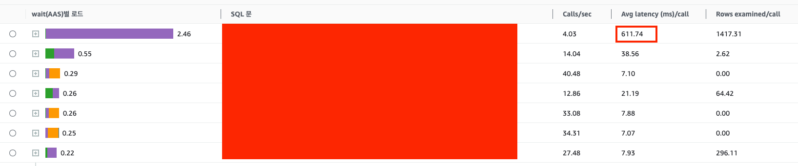
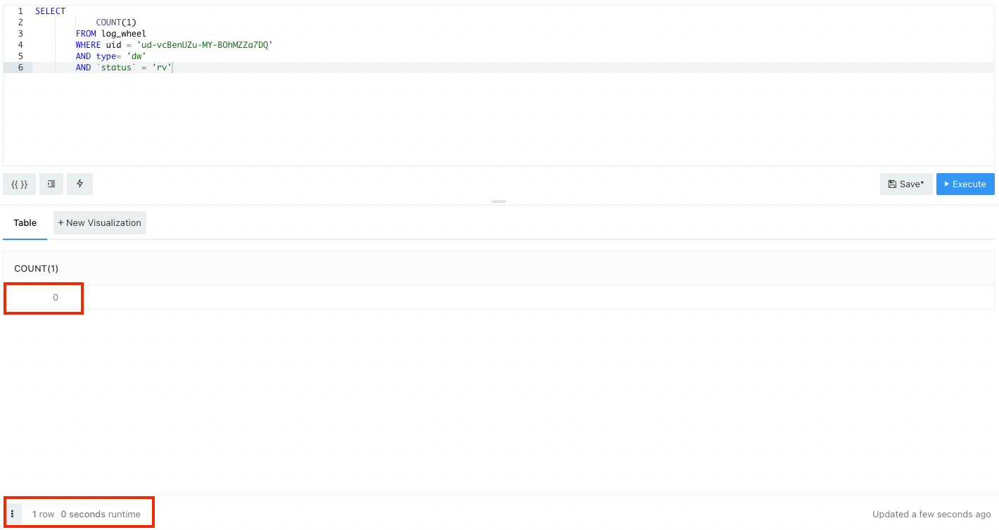
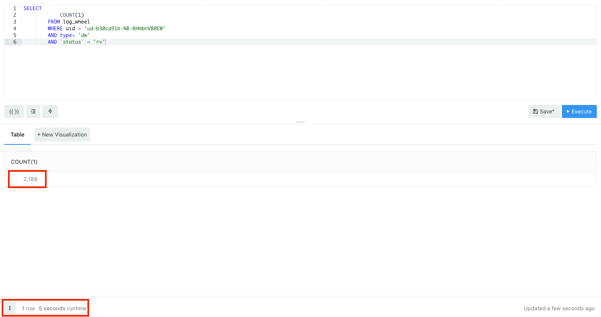
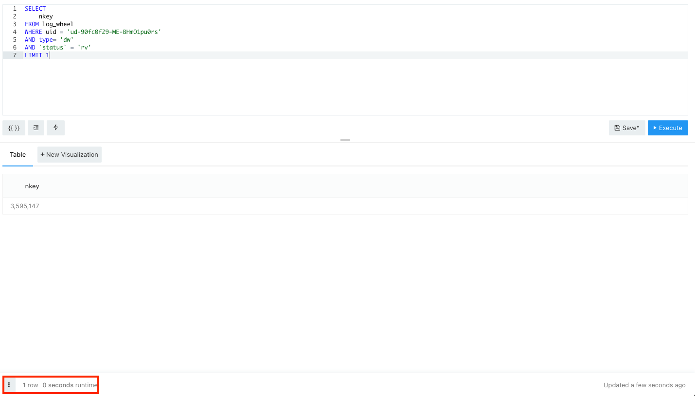

제가 운영하는 서비스에는 고질적으로 느린 쿼리가 있습니다. 평균 611.34ms의 실행시간을 보여주지만 문제는 특정 사람에게는 쿼리 실행시간이 유독 느리게 처리됩니다.  

Slow Query 리스트를 보았을 때 독보적으로 느린 쿼리를 볼 수 있습니다. 



문제가 되는 쿼리는 특정 유저가 이벤트를 진행했는지 여부를 체크하는 쿼리였습니다. 
대략적인 코드는 이렇습니다. 

```sql
SELECT
    COUNT(1)
FROM log_wheel
WHERE uid = 'ud-90fc0f29-ME-BHmO1pu0rs'
AND type= 'dw'
AND `status` = 'rv'
```

이상한 점은 어떤 유저는 쿼리 수행시간이 빠른 반면, 어떤 유저는 느려서 쿼리가 5초 이상 수행되기도 했습니다. 
그리고 공통적으로 count 결과값이 클수록 쿼리 수행 시간이 느렸습니다. 

count가 0개인 유저의 쿼리 수행시간입니다. 



반면, count가 2188개인 유저의 쿼리 수행시간입니다.



문제는 ```COUNT(1)```에 있었습니다. 
쿼리와 관련된 기능을 간단히 말씀드리면 유저는 접속시 하루에 한번 이벤트를 진행하고 관련된 레코드가 테이블에 기록됩니다. 따라서 오래된 유저일수록 더 많은 레코드가 누적되므로 더 느립니다. 
확인 결과 오래된 유저의 쿼리 속도가 느린 것을 확인했습니다. 

그렇다면 왜 레코드 수가 많을 수록 COUNT() 쿼리가 느렸을까요? 이유는 COUNT의 동작방식에 있습니다. COUNT는 레코드의 전체 갯수를 가져와야 하기 때문에 결국 모든 레코드를 읽어야 합니다.
만약 select 쿼리가 디스크 블록을 접근해야 하는 쿼리라면 COUNT에서 반환하는 갯수만큼 디스크에 접근해서 데이터를 가져와야합니다. 

테이블에 걸린 인덱스는 확인 결과 (uid, type, date)로 걸려있었습니다. 결국 select 쿼리에 ```status``` 조건은 인덱스를 이용하지 못하기 때문에 디스크에 접근할 수 밖에 없었습니다.  
이것이 COUNT의 결과값에 따라 인덱스의 성능 차이가 나는 원인이었습니다.  

## 해결 

결국 쿼리 실행시 디스크 접근을 최소한으로 줄이는 것이 중요하다 판단했습니다. 결국 두가지 방법으로 해결 방법을 압축했습니다. 
- 커버링 인덱스 사용 
- LIMIT 사용 

### 커버링 인덱스 사용

커버링 인덱스란, 쿼리를 충족시키는데 필요한 모든 데이터를 갖고 있는 인덱스를 말합니다. 위에서 이미 (uid, type, date) 인덱스가 존재했지만 status를 포함하지 못했기 때문에 커버링 인덱스로 사용하지 못했습니다.
따라서 커버링 인덱스를 이용하기 위해서 (uid, type, status) 인덱스를 사용해야 하는 상황이었습니다. 

하지만 테이블에 이미 많은 인덱스가 걸려 있었고, 테이블에 쌓인 레코드 수도 많았기에 새로운 인덱스를 추가로 걸 수 없는 상황이었습니다. 
결국 다른 방식으로 디스크 접근을 최소화 해야 했습니다. 

### LIMIT 사용 

결국 택한 방법은 LIMIT를 이용한 방법입니다. Mysql에서는 LIMIT 건수 만큼 레코드를 찾으면 결과를 반환한다는 특징을 이용했습니다. 
그래서 만약 LIMIT 1 로 결과값을 찾으면, 유저가 이벤트를 진행했는지 여부를 알 수 있습니다. 굳이 COUNT로 모든 레코드의 갯수를 찾을 필요 없이 하나의 레코드만 찾으면 결과를 바로 반환하기 때문입니다. 

수정된 쿼리는 다음과 같습니다. 
```sql
SELECT
    nkey
FROM log_wheel
WHERE uid = 'ud-90fc0f29-ME-BHmO1pu0rs'
AND type= 'dw'
AND `status` = 'rv'
LIMIT 1
```

COUNT(1)을 없애고 Primary Key인 nkey를 반환합니다. 그리고 LIMIT 1을 반환하기 때문에 레코드를 하나라도 찾으면 유저가 이벤트를 수행했는지 여부를 알 수 있습니다. 

위와 같이 쿼리를 수정하고 이전에 레코드 갯수가 2188 이었던 유저의 쿼리 수행시간을 측정해보았습니다. 



쿼리 수행시간이 0초대로 확실히 줄어든 것을 확인할 수 있었습니다. 

