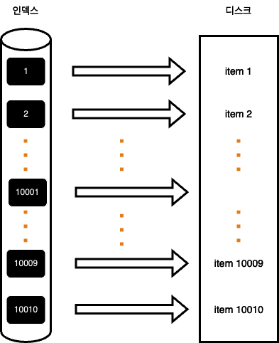
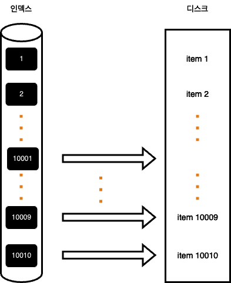

커버링 인덱스란 쿼리를 충족시키기 위해서 필요한 모든 데이터를 갖고 있는 인덱스를 말합니다. 인덱스만으로 쿼리를 처리할 수 있기 때문에 디스크에 접근할 필요가 없습니다. 

커버링 인덱스를 이용하면 쿼리의 수행속도를 비약적으로 개선할 수 있습니다. 그래서 이번글에서는 제가 실제로 제가 운영하는 서비스에서 커버링 인덱스를 반영했던 경험에 대해 공유해보고자 합니다.
커버링 인덱스를 이용하기 위해서는 쿼리의 ```SELECT```, ```WHERE```, ```ORDER BY```, ```GROUP BY``` 등에서 사용되는 모든 칼럼이 인덱스 칼럼 안에 모두 포함되어야 합니다. 

예를 들면, 아래와 같은 쿼리가 있다고 가정해 봅시다.  
```sql
SELECT book_name
FROM books
WHERE books.author = '홍길동'
ORDER BY books.createdAt = '2020-01-11'
```

위의 쿼리에서는 select 절에서 book_name칼럼, where 절에서 author칼럼, order by 절에서 createdAt 칼럼을 사용하고 있습니다. 따라서 위의 쿼리를 처리하기 위해서 필수적으로 필요한 book_name, author, createdAt 칼럼을 모두 포함하고 있는 인덱스가 커버링 인덱스가 되는 것입니다.  그리고 커버링 인덱스는 pk를 포함하고 있습니다. 즉, 커버링 인덱스는 id, book_name, author, createdAt 이 네가지 칼럼을 포함하고 있는 인덱스가 될 것입니다.

위의 예시에서는 select 문이 book_name만을 반환했지만, 보통 select에는 조회에 필요한 모든 칼럼들이 들어갑니다. 그래서 보통의 경우에는 select 절로 인해서 커버링 인덱스를 적용할 수 없습니다. 
조회에 필요한 데이터까지 모두 인덱스의 칼럼으로 파함할 수는 없기 때문입니다. 

그래서 실제로 커버링 인덱스를 적용하는 부분은 select를 제외한 나머지만을 우선적으로 수행해야 합니다.
예를 들어, 아래와 같은 쿼리가 있다고 가정해보겠습니다. 
```sql
SELECT *
FROM items
WHERE item_type = 'grocery'
ORDER BY id DESC
OFFSET 페이지번호
LIMIT 페이지 사이즈
```

만약 items 테이블에 10개의 칼럼이 있다고 하면, 인덱스는 모든 인덱스를 포함해야 하기 때문에 커버링 인덱스를 적용하기 어려울 것입니다.
그래서 위와 같은 쿼리에 커버링 인덱스를 적용하기 위해서는 아래와 같이 변경해야 합니다.

```sql
SELECT  *
FROM  items as i
JOIN (SELECT id
FROM items
WHERE item_type = 'grocery'
ORDER BY id DESC
OFFSET 페이지번호
LIMIT 페이지사이즈) as temp on temp.id = i.id
```

select 절이 id만 조회하기 때문에, 커버링 인덱스를 적용하기 위한 인덱스는 item_type, id 칼럼만 포함하면 됩니다.    
그리고 내부에서 커버링 인덱스로 빠르게 조회하여 id(primary key)를 반환하고, id를 이용하여 외부 테이블과 JOIN하고 있습니다. 
처음 쿼리는 커버링 인덱스를 이용하지 못했지만, 위의 쿼리는 커버링 인덱스를 이용할 수 있기 때문에 훨씬 더 빠른 조회 성능을 보여줍니다. 


## 커버링 인덱스가 빠른 이유?

그렇다면 커버링 인덱스는 왜 빠를까요? 그 부분에 대해 알아보겠습니다.
아까도 말씀드렸듯이 커버링 인덱스는 쿼리에 필요한 모든 칼럼을 가지고 있는 인덱스라고 하였습니다. 이러한 특징으로 인해 커버링 인덱스를 이용하게 되면, 쿼리를 처리하기 위해서 DB 디스크에 접근하지 않아도 되는 이점이 생기게 됩니다.
일반적으로 인덱스를 이용해 조회하는 쿼리가 느려지는 부분은 인덱스를 검색하고 대상이 되는 row를 디스크에서 읽어 오는 경우 발생합니다. 만약 커버링 인덱스를 이용하지 않는 쿼리가 있다고 가정해 봅시다.

```sql
SELECT * FROM items
ORDER BY id DESC
OFFSET 10000 limit 10
```

위의 쿼리를 조회하기 위해서는 10010개 row 만큼 디스크에 접근을 해야 합니다. 그만큼 쿼리의 수행 속도는 느려질 수밖에 없습니다.



아래는 위의 쿼리를 개선한 쿼리입니다.

```sql
SELECT * FROM items as i
JOIN (SELECT id
FROM items
ORDER BY id
LIMIT 1000, 10) as temp
ON temp.id = i.id
```

위의 쿼리를 보면 JOIN 절 안의 서브 쿼리가 커버링 인덱스가 적용된 상태입니다. 따라서 먼저 서브쿼리에 대해서 커버링 인덱스를 통해 10개 만큼의 row를 조회합니다. 
그리고 10개의 row에 대해서만 디스크에 접근해서 필요한 칼럼들을 가져오게 됩니다.



기존 방식이 전체 offset 만큼 디스크에 접근했던 것에 대비하면 디스크에 접근하는 횟수를 많이 줄이게 됨을 알 수 있습니다.

## 구현 코드
JPA와 Querydsl을 이용해서 커버링 인덱스를 적용했던 방식에 대해 이야기 해보겠습니다.
먼저 JPA와 Querydsl에서는 from 절에 서브쿼리를 지원하지 않습니다. 그래서 이를 우회하기 위해서는 아래와 같은 과정이 필요합니다.

1. 커버링 인덱스를 통해 페이징에 필요한 pk를 조회
2. 조회된 pk를 이용한 join 쿼리로 필요한 칼럼항목들 조회

아래는 Querydsl에서 해당 로직을 구현한 코드입니다.
```java
public List<BookPaginationDto> paginationCoveringIndex(String name, int pageNo, int pageSize) {
        // 1) 커버링 인덱스로 대상 조회
        List<Long> ids = queryFactory
                .select(book.id)
                .from(book)
                .where(book.name.like(name + "%"))
                .orderBy(book.id.desc())
                .limit(pageSize)
                .offset(pageNo * pageSize)
                .fetch();

        // 1-1) 대상이 없을 경우 추가 쿼리 수행 할 필요 없이 바로 반환
        if (CollectionUtils.isEmpty(ids)) {
            return new ArrayList<>();
        }

        // 2)
        return queryFactory
                .select(Projections.fields(BookPaginationDto.class,
                        book.id.as("bookId"),
                        book.name,
                        book.bookNo,
                        book.bookType))
                .from(book)
                .where(book.id.in(ids))
                .orderBy(book.id.desc())
                .fetch();
}
```


위의 코드를 살펴보면 먼저 커버링 인덱스를 이용해서 페이징에 필요한 Primary Key 들을 조회합니.

```java
List<Long> ids = queryFactory
        .select(book.id)
        .from(book)
        .where(book.name.like(name + "%"))
        .orderBy(book.id.desc())
        .limit(pageSize)
        .offset(pageNo * pageSize)
        .fetch();
```


그리고 조회된 Primary Key 들을 이용해 추가적으로 필요한 칼럼들을 JOIN으로 가져옵니다. 이때 커버링 인덱스로 조회된 id(Primary Key) 리스트가 in절에 전달됩니다.  

```java
queryFactory
    .select(Projections.fields(BookPaginationDto.class,
            book.id.as("bookId"),
            book.name,
            book.bookNo,
            book.bookType))
    .from(book)
    .where(book.id.in(ids))
    .orderBy(book.id.desc())
    .fetch();
```

위와 같은 방식을 이용하게 되면 커버링 인덱스를 통해 디스크 접근 횟수를 크게 감소시킬 수 있습니다. 대량의 레코드에 접근하는 쿼리라면 더 큰 성능 향상을 보여줄 것입니다.

## 커버링 인덱스의 단점
커버링 인덱스는 대부분의 방식에 적용할 수 있는 방식임을 확인했습니다. 하지만 커버링 인덱스에도 몇개의 단점이 있습니다.

- 첫번째는 너무 많은 인덱스가 필요하다는 점입니다.
커버링 인덱스는 필요한 칼럼을 모두 담고 있어야 하기 때문에 새롭게 커버링 인덱스가 적용되어야 할 지점이 생긴다면 새롭게 인덱스가 추가될 수 있습니다.

- 두번째는 인덱스의 크기가 너무 커집니다.
커버링 인덱스를 만족하기 위한 칼럼을 계속해서 추가하게 되면, 인덱스의 크기는 커질 수밖에 없습니다. select, where, order by, group by 등에서 사용되는 모든 칼럼을 포함하고 있어야 하기 때문이죠. 이는 인덱스의 크기를 크게 만들어 데이터베이스의 성능 저하, 저장 용량 증가와 같은 문제를 야기할 수 있습니다.

이상 커버링 인덱스를 이용한 쿼리 성능 향상에 대해 이야기해보았습니다. 
긴글 읽어 주셔서 감사합니다. 

