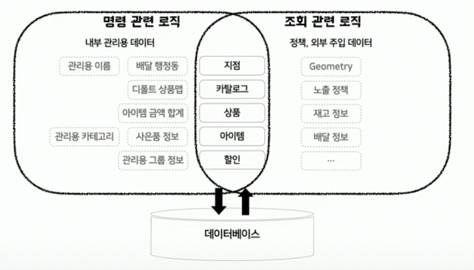
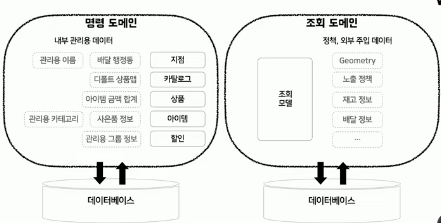
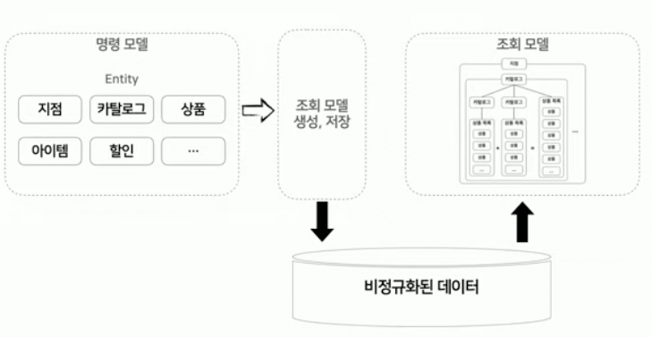
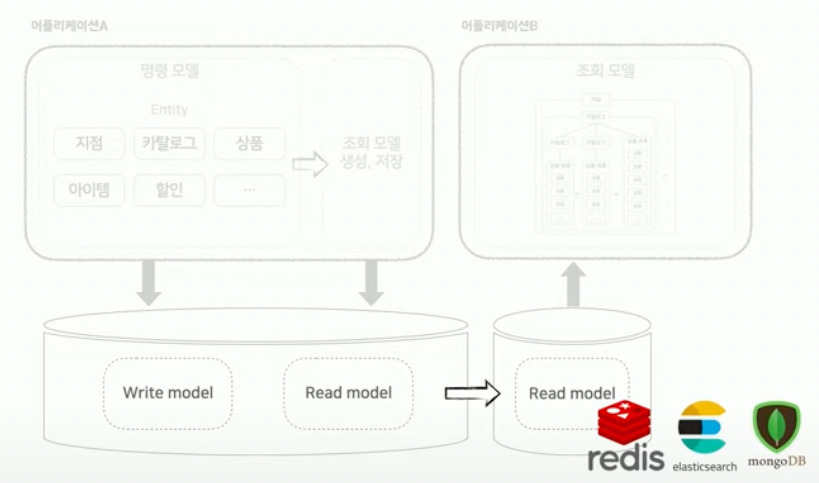
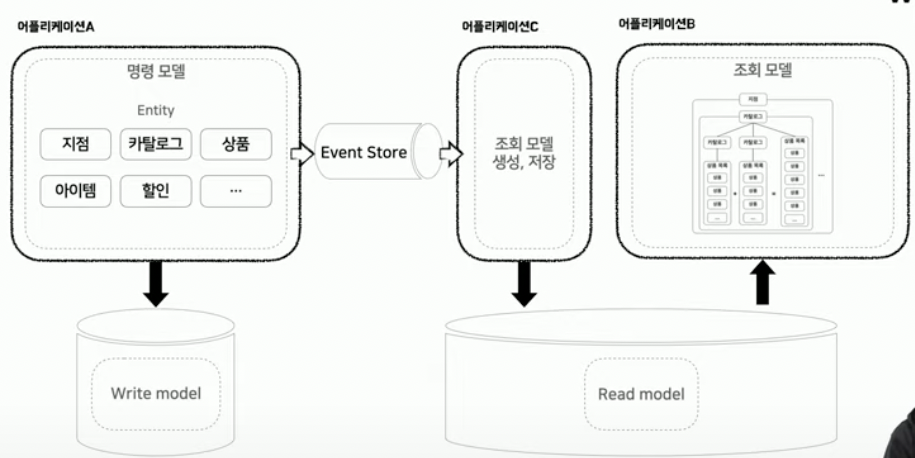

## CQRS 개념  

CQRS는 Command Query Responsibility Segmentation의 약자입니다. 
- Command는 명령이라는 의미이고 시스템의 데이터를 변경하는 기능입니다.
- Query는 시스템의 데이터를 조회하는 기능입니다.
- Responsibility는 구성요소의 역할로 구성요소에는 클래스, 함수, 모듈, 패키지 크게는 웹서버, DB 등이 있습니다. 
- Segmentation은 역할에 따라 구성 요소를 나누는 것을 의미합니다. 

결국 CQRS의 뜻을 정리해보면 **명령 역할을 수행하는 구성 요소와 쿼리 역할을 수행하는 구성 요소를 나누는 것**이 CQRS입니다.

CQRS에서 핵심이 되는 개념은 모델을 분리하는 것입니다. 모델도 결국 구성요소이기 때문에 명령을 위한 모델과 조회를 위한 모델을 나누어야 합니다.
만약 하나의 모델로 명령과 조회를 처리한다면 아래와 같은 문제가 발생할 것입니다. 
- 코드 역할/책임 모호해진다.
- 의미/가독성 등이 나빠진다. 
- 유지보수성이 떨어진다. 

예를 들면 하나의 주문 모델을 명령과 조회에서 사용한다고 가정해보겠습니다. 명령에서는 주문 로직에 따라 주문 아이템 리스트를 조회할지 말지를 결정합니다. 따라서 지연 로딩으로 가져오는 것이 적합합니다. 
하지만 조회 모델에서는 주문 화면에 아아템 리스트를 항상 보여줘야 하기 때문에 즉시 로딩 방식이 더 적절할 수 있습니다.

이처럼 명령과 조회에 따라 모델이 동작 방식이 변경될 가능성이 큽니다. 그리고 차이는 서비스가 발전할 수록 더욱 커집니다. 
이외에도 명령 모델과 조회 모델을 분리해야 하는 이유는 아래와 같습니다. 
- 명령과 쿼리는 다루는 데이터가 다르다. 
- 명령과 쿼리는 코드 변경 빈도, 사용자가 다르다. 
- 기능마다 성능 요구가 다르다. 

## CQRS 구현 방식 

CQRS의 구현 방식은 다음과 같습니다. 
- 같은 프로세스, 같은 DB, 다른 테이블
  - 명령과 조회가 코드 수준에서 나뉘고, 데이터 수준에서도 나뉘는 방식입니다. 다만 같은 DB를 바라보고 있습니다. 명령과 조회가 하나의 시스템에 같이 있기 때문에 구현이 쉽고, 트랜잭션으로 정합성 보장이 쉽습니다.
- 같은 프로세스 다른 DB
  - 명령쪽 데이터가 변경되면, 쿼리쪽 DB에 변경을 전파합니다. 명령쪽은 RDB를 사용하고 쿼리쪽 DB는 Redis와 같은 인메모리 DB를 사용할 수 있습니다. 
- 다른 프로세스, 다른 DB
  - 명령과 쿼리가 시스템으로 분리가 되는 형태입니다. 따라서 변경된 내용을 담고 있는 이벤트를 메세지 큐로 전파하는 방식이 많이 사용됩니다.

## 다른 프로세스, 다른 DB로 CQRS를 구현하는 방법 

위의 구현 방식 중에 범용적으로 많이 사용되는 방식인 다른 프로세스, 다른 DB로 CQRS를 구현하는 과정을 이야기해보겠습니다. 
해당 내용은 태균님이 발표하신 [B마트 전시 도메인 CQRS 적용하기](https://www.youtube.com/watch?v=fg5xbs59Lro&t=1731s)를 바탕으로 합니다.

단순한 서비스에서는 명령과 조회 모델을 같이 사용해도 불편이 크지 않습니다. 하지만 문제는 서비스가 복잡해지면서 부터 시작됩니다. 
점점 서비스가 복잡해지면서 명령에서 사용하는 데이터와 조회에서 사용하는 데이터가 차이가 생깁니다. 

 

이렇게 점점 서비스가 복잡해지면서 하나의 모델로 명령과 조회를 모두 처리할 수 없는 상태에 도달하게 됩니다. 
이 때가 CQRS를 이용하여 명령과 조회 모델을 분리해야 하는 시점입니다.

## 모델 분리하기

조회 모델을 만든다는 것은 최적화된 스키마를 비정규화 해야 한다는 것을 의미합니다. 보통 명령 모델은 중복을 없애기 위해 정규화된 형태로 데이터를 저장합니다. 이렇게 정규화된 데이터 형태는 저장에선 효율적일 수 있어도 조회에서는 비효율적입니다. 
연관된 데이터들을 join을 이용해서 가져와야 하기 때문에 성능적인 손해를 볼 수 밖에 없습니다. 

따라서 조회 모델은 최적의 상태로 만들기 위해 비정규화된 상태로 저장을 하게 됩니다. 자세히는 명령 모델이 생성되거나, 변경되는 시점에 조회 모델을 생성하고 비정규화된 데이터 그 자체를 저장합니다. 
이 과정을 통해 조회 모델 조회시에 DB에 있는 데이터를 join 같은 연산작용 없이 그대로 가져올 수 있는 환경이 마련됩니다.

이는 적은 횟수로 명령을 수행하고, 많은 횟수로 조회가 수행되는 곳에 효과적으로 적용될 수 있습니다.

## 성능 더 높이기 

데이터가 분리되어 존재하기에 서로 다른 저장소를 이용할 수 있습니다. 이는 조회를 위해 더 최적화된 저장소를 이용할 수 있음을 의미합니다.
조회 모델을 위해 redis, elastic search, mongoDB 등을 이용할 수 있습니다. 

## 이벤트 소싱 

조회 모델의 생성에 대한 책임은 이벤트 소싱 패턴을 이용해서 분리할 수 있습니다. 이벤트 소싱 패턴은 어떤 어플리케이션으로 부터 발생한 이벤트를 이벤트 스토어에 저장하고 이를 여러 시스템에서 구독하여 다룰 수 있는 패턴입니다.
이벤트 소싱을 이용해서 데이터를 관리하는 측면과 조회 모델을 생성하는 측면을 분리할 수 있습니다. 따라서 명령 모델 생성 및 변경 시에 해당 어플리케이션에서 조회 모델을 생성하는 것이 아니라 단지 이벤트 스토어에 이벤트를 저장합니다. 
그리고 이벤트에 관심있는 다른 시스템에서 이벤트를 구독하여 조회 모델을 생성합니다. 

## 감지 대상과 이벤트 

이벤트 변경 감지를 위한 기능에는 다음의 기능들이 있습니다.  

JPA EntityListeners
- @Entity 혹은 @MappedSuperclass 객체 메서드에 어노테이션 지정으로 사용 가능 
- Callback 지정 함수 선언이 간단하다 (@Persist, @PostPersist, @PreUpdate 등 7가지)
- 해당 엔티티만 인자로 반환할 수 있기 때문에 어떤 값에서 어떤 값으로 변경되는 지를 알기는 어렵다. 

Hibernate - EventListener
- 26가지 디테일한 상황에 콜백 
- 받고자 하는 상황에 따른 인터페이스를 구현한 클래스를 등록하는 방식 
- 보다 상세한 정보 전달 (변경된 프로퍼티, 이전 상태, 현재 상태 등등)
- 모든 엔티티 변경 사항이 전달 됨

Hibernate Interceptor
- Session 혹은 SessionFactory에 Interceptor 등록 가능 
- EventListener에 비해 적은 콜백 종류 
- 저장될 데이터 조장 가능 

Spring AOP
- Method에만 설정 가능 
- Method 실행 전/후, 반환 후, 예외 상황, 어노테이션이 붙은 경우 등 
- Pointcut 문법으로 동작 
- deleteInBatch와 같이 EntityManager 라이프 사이클을 타지 않는 예외적인 상황에 적용 

