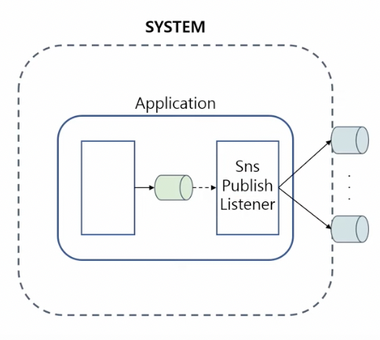
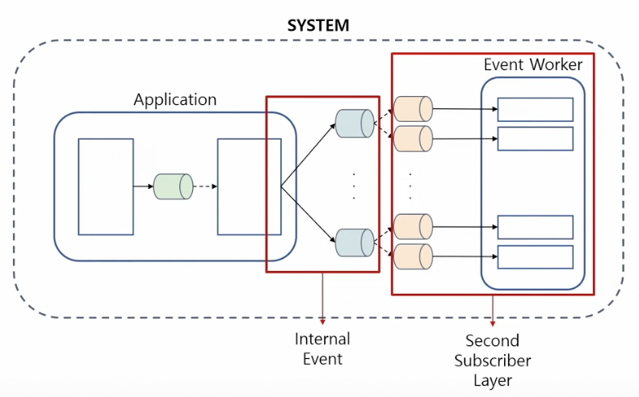
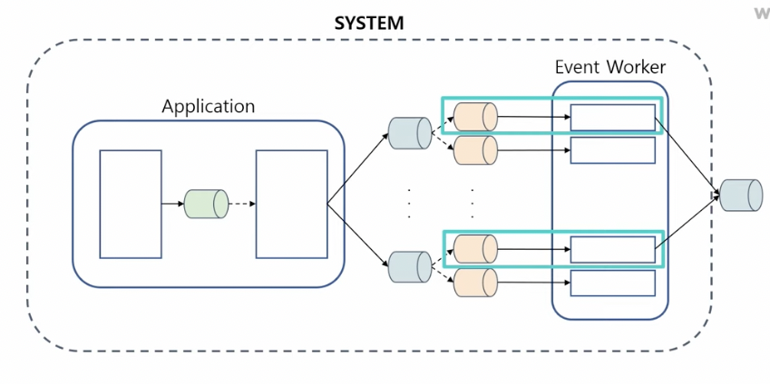
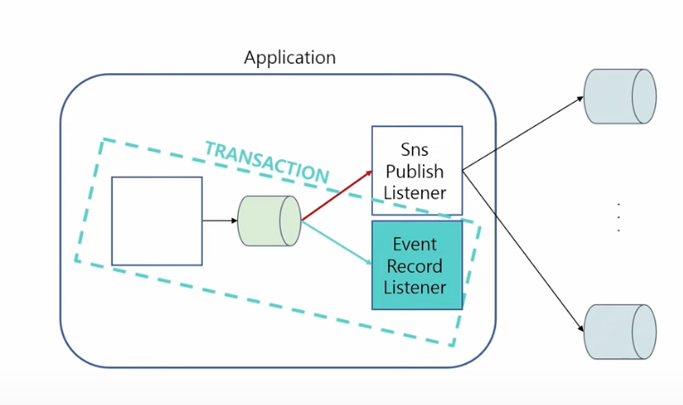
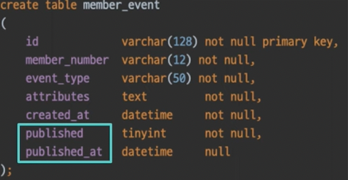

이번글은 우아콘2022의 권용근님의 발표를 기반으로 작성되었다.

MSA에서 이벤트 기반 아키텍쳐가 많이 사용된다. 그리고 이러한 이벤트 기반 아키텍처는 보통 다른 시스템과의 결합도를 낮추기 위해 사용된다. 하지만, 하나의 시스템에서도 이벤트 기반 아키텍처를 통해 관심사를 분리할 수 있다. 
이번 글에서는 권용근님의 발표를 기반으로 하나의 시스템에서 이벤트 기반 아키텍처를 통해 어떻게 결합도를 낮추었는지에 대해 다룬다.

## 이벤트 기반 아키텍처
마이크로서비스는 애플리케이션을 느슨하게 결합된 서비스의 모임으로 구조화하는 서비스 지향 아키텍처 스타일의 일종인 소프트웨어 개발 기법이다.
마이크로 서비스는 위의 정의에서 볼 수 있듯이, 느슨한 결합을 통해 각 서비스를 연결한다. 그리고 이벤트 기반 아키텍처는 이러한 요구를 충족해준다. 그렇다면 어떤 것을 이벤트로 봐야할까?

만약 회원이 탈퇴를 할 때, 회원이 포함되어 있는 가족 계정도 탈퇴해야 하는 경우를 가정해보자.

```java
public void initCertificationOwn(MemberNumber memberNumber) {
	member.initCertificationOwn(memberNumber);
	eventPublisher.familyLeave(memberNumber);
}
```

```java
public void leave(MemberNumber memberNumber) {
    family.leave(memberNumber);	
}
```

위의 코드를 보면, 회원이 탈퇴한 이후 가족 계정 탈퇴 이벤트를 발행하는 것을 볼 수 있다. 이렇게 되면 두 시스템 간에 물리적인 결합도는 제거가 되지만, 여전히 논리적인 결합이 존재한다.
'멤버 탈퇴 -> 가족 계정 탈퇴' 라는 논리적인 결합이 존재하기 때문이다. 따라서 이벤트에는 달성하려는 목적이 포함되어서는 안된다. 그저 도메인 이벤트 자체를 발행해야 한다. 

위의 경우 어떠한 목적도 포함되어 있지 않은 '회원이 탈퇴했다'라는 이벤트가 발행되어야 할 것이다.

```java
public void initCertificationOwn(MemberNumber memberNumber) {
	member.initCertificationOwn(memberNumber);
	eventPublisher.initCertificationOwn(memberNumber);
}
```

```java
public void leave(MemberNumber memberNumber) {
    family.leave(memberNumber);	
}
```

위 코드는 개선된 코드이다. 자신에 대한 이벤트를 발행함으로서 이벤트에는 가족 계정에 대한 어떠한 목적이 포함되지 않는다. 그저 회원이 탈퇴 했다는 도메인 이벤트를 발행했을 뿐이다.
위와 같이 이벤트를 발행하면, 두 시스템 간에 물리적, 논리적 결합도가 느슨해지게 된다.


## 단일 어플리케이션에서 이벤트 기반 아키텍처 구축
위의 내용을 기반으로 하나의 시스템에서 3가지 이벤트 종류와, 3가지 구독자 계층을 정의할 수 있다.

### 첫번째 구독자 계층(어플리케이션 이벤트)
이벤트를 통해 느슨한 결합을 만들어야 하는 일은 어플리케이션 내부에도 발생할 수 있다. 도메인 로직과 관련 없는 부가적인 작업이 어플리케이션 내부에도 존재할 수 있기 때문이다. 대표적인 것이 메시징 시스템에 대한 이벤트 발행 작업이다. 따라서 kafka, sns 등 메세징 시스템에 대한 이벤트 발행은 Spring에서 제공하는 ApplicationEvent를 이용할 수 있다.



### 두번째 구독자 계층(내부 이벤트)
두번째 구독자 계층이 다루는 내부 이벤트는 첫번째 구독자 계층의 구독자가 발행하는 이벤트이다. 내부 이벤트는 시스템 내의 이벤트 처리기가 구독하게 된다. 첫번째 구독자 계층이 어플리케이션 내부의 비관심사를 다루었다면, 두번째 구독자 걔층은 어플리케이션 내부에서 다루지 않았던 모든 비관심사를 다루게된다.



보통 비관심사와 도메인 로직을 하나의 시스템에서 관리하면, 시스템의 응집도를 낮추게 된다. 이러한 비관심사는 시스템 내부 이벤트를 통해 처리되어야 한다. 위의 그림에서는 Event Worker가 내부 이벤트를 처리한다. 도메인의 응집을 높이고, 비관심사에 대한 결합을 낮추기 위해서는 이러한 구조가 필요하다.
그렇다면, 어플리케이션 이벤트와 내부 이벤트를 구분하는 기준은 무엇일까? 어떤 이벤트를 선택하느냐는 Trade Off에 따라 달라진다.

- 어플리케이션 이벤트
  - 주요 행위와 트랜잭션 공유
  - 주요 행위와 성능을 공유
- 내부 이벤트
  - 주요 행위와 트랜잭션 분리
  - 주요 행위와 성능을 분리

만약, 주요 행위와 강한 정합성 보장이 필요한 작업은 어플리케이션 이벤트를 통해 발행되어야 한다. 하나의 어플리케이션에서 트랜잭션을 통해 정합성을 보장 받을 수 있기 때문이다. 반면, 그렇지 않다면 내부 이벤트로 처리되어야 한다.

## 외부 시스템(외부 이벤트)
다음은 외부 시스템과의 관심사 분리를 위한 외부 이벤트 발행이다. 내부 이벤트를 다루는 특정 구독자가 외부 이벤트 발행을 담당하게 된다. 외부 이벤트는 MSA 타 시스템이 구독자가 된다.



그런데 시스템을 보면 내부 이벤트를 외부 이벤트로 사용해도 되지 않는가라는 의문이 들 수도 있다. 
하지만 내부 이벤트와 외부 이벤트를 분리하는 것은 분명 의미가 있다. 내부 이벤트와 외부 이벤트를 분리함으로써 내부에는 열린, 외부에는 닫힌 이벤트를 제공할 수 있기 때문이다.

만약 내부 이벤트에서 필요 없는 필드를 제거한다고 해도, 구독자가 하나의 시스템에 속해 있기 때문에 영향의 범위를 파악하고 관리하기가 쉽다. 
하지만 외부 이벤트는 발행자가 시스템 내부에 있지만 이벤트 구독자는 외부 시스템에 있다. 외부 시스템은 내부 시스템과 달리 관리할 수 없다. 데이터를 추가한다면 다시는 제거할 수 없을 수 있고, 제거한다면 영향의 범위를 파악하기가 어려워진다.
**이런 이유로 내부 이벤트는 열려 있지만, 외부 이벤트는 닫혀 있다.**

닫혀 있는 외부 이벤트를 안전하고 유연한 고정적인 형태로 제공하기 위해 이벤트 일반화가 필요하다. 

## 이벤트 일반화
이벤트를 수행하려는 행위는 광범위하지만, 이벤트를 인지하는 과정은 쉽게 일반화 할 수 있다. 

- 언제(시간)
- 누가(식별자)
- 무엇을 하여(행위)
- 어떤 변화가(속성)

이렇게 크게 4가지 정보만 있어도 어떠한 시스템에서 이벤트를 인지할 수 있다. 
하지만 외부 시스템에서는 일반화된 정보 뿐만 아니라 추가적인 정보가 더 필요할 수 있다. 그렇다고 특정 구독자를 위한 정보를 이벤트에 추가한다면, 다른 시스템과의 결합도가 생기게 된다. 이 문제를 해결하기 위해서 zero-payload를 사용할 수 있다.
**Zero-payload 방식은 이벤트의 순서에 대한 보장 문제를 해결하는 방식으로도 사용되지만, 두 시스템 간의 결합도를 낮추기 위한 방법으로도 많이 사용된다.**

## 이벤트 저장소 구축
많은 메세지 큐가 신뢰성 있는 정책들을 제공하지만, 내부 이벤트를 발행하는 중에는 Http를 통해 이벤트를 발행하기 때문에 메세지가 유실되는 문제가 발생할 수 있다. 도메인 로직은 처리되었는데, 이벤트는 발행되지 않는 불일치 상태가 발생할 수 있는 것이다. 이 문제는 SpringApplication 이벤트의 기능으로 도메인 로직과 메세지 생성을 하나의 트랜젹션으로 묶어서 해결할 수 있다.



만약 이벤트가 제대로 발행되지 못했더라도, 도메인 로직이 성공했다면 이벤트 저장소에 이벤트가 저장되는 것이 보장된다. 따라서 추후에 재발행을 통해서 이벤트를 처리할 수 있게된다. 이는 도메인 로직과 이벤트 생성이 하나의 트랜잭션에 있어야 위와 같은 정합성을 보장할 수 있기 때문에, 도메인 로직과 이벤트 생성 로직이 같은 RDBMS를 사용한다는 것을 의미한다.
그리고, 이벤트에 발행이 되었는지 여부, 언제 발행이 되었는지에 대한 정보가 추가되어야 한다. 그래야 추후에 batch 작업을 통해 이벤트 재발행을 할 수 있다.

