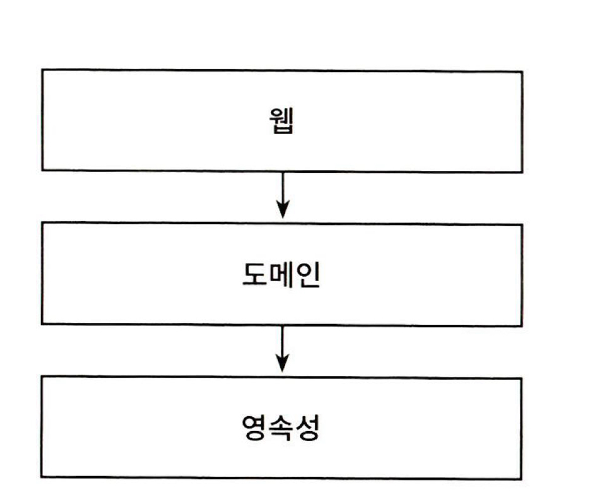
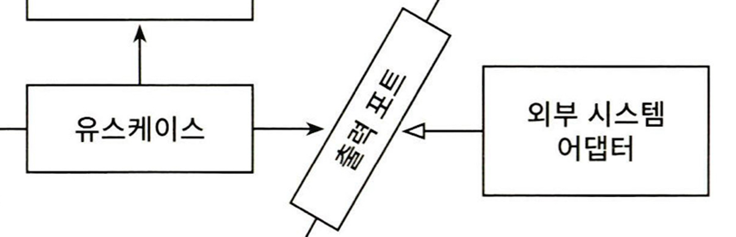
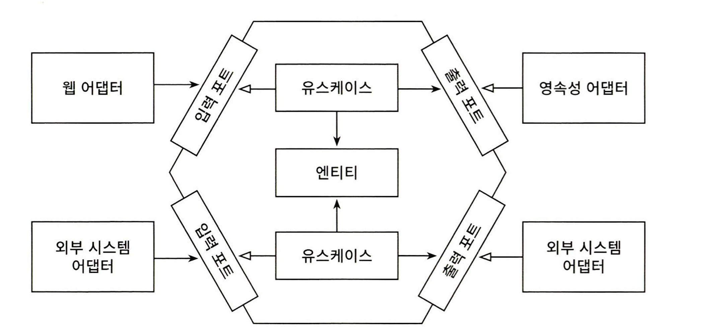
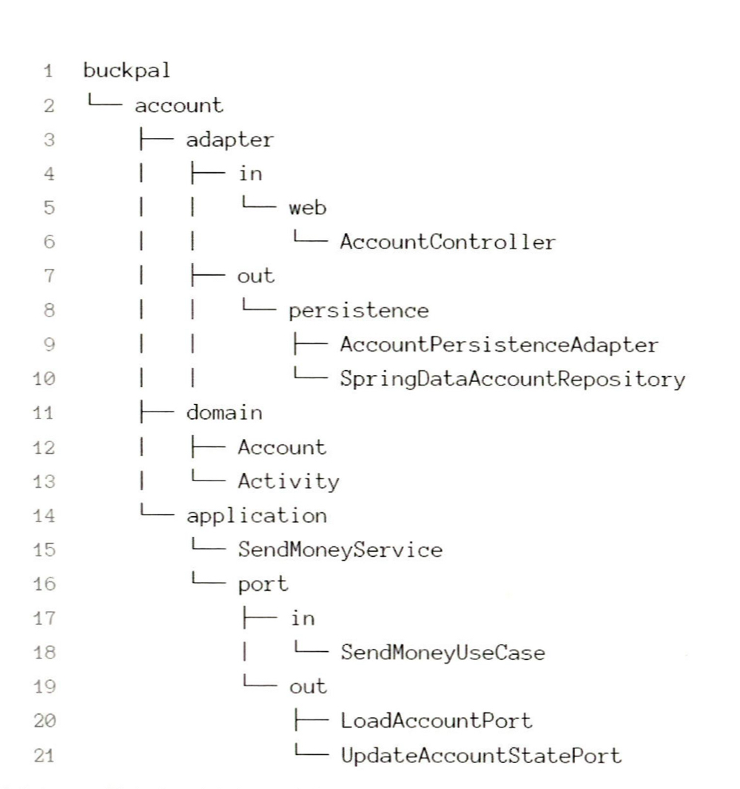
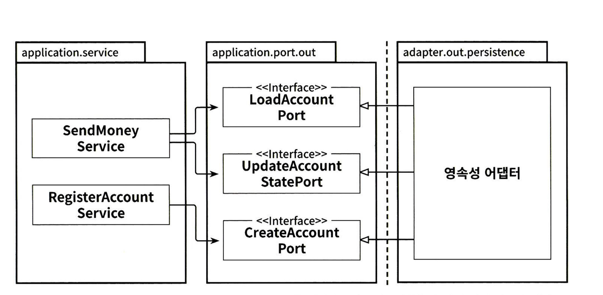
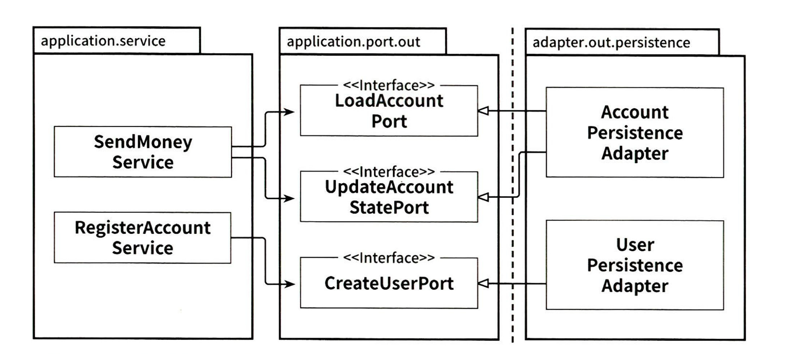

이번 글에서는 [만들면서 배우는 클린아키텍처](https://www.aladin.co.kr/shop/wproduct.aspx?ItemId=283437942)를 읽고 헥사고날 아키텍처를 구성하는 방법론에 대해 알아볼 것입니다.  

## 계층형 아키텍처
클린아키 텍처를 다루기 전에 기존 아키텍처는 어떤 문제가 있는지 알아보겠습니다.
대표적인 아키텍처로는 계층형 아키텍처가 있습니다. 
의존성의 방향은 웹->도메인->영속성으로 이어집니다. 



하지만 계층형 아키텍처에는 다음의 문제점이 있습니다. 

- DB 주도 설계:
  - 계층형 아키텍처에서 도메인 계층은 영속성 계층에 의존하기 때문에 자연스럽게 데이터베이스에 의존합니다. 영속성 계층이 가장 기반이 되는 계층이 되기 때문에 영속성 계층을 먼저 구현하게 됩니다.
  - 자연스럽게 도메인 기반의 설계에서 거리가 멀어집니다. 
- 강제하는 아키텍처 규칙이 약하다.
- 테스타하기 어렵다. 
- 넓은 서비스 
  - 계층형 아키텍처에서는 서비스의 '너비'에 관한 규칙을 강제하지 않기 때문에 여러 개의 유스케이스를 담당하는 아주 넓은 서비스가 만들어집니다.
- 동시 작업이 어렵다.
  - 영속성 계층의 작업이 완료되어야 도메인 로직을 작업할 수 있습니다. 이는 여러 개발자들이 동시에 개발할 때 병목현상을 유발합니다. 
  - 그리고 넓은 서비스로 인해 여러 개발자가 동시에 작업하기 힘듭니다. 이는 병합 충돌을 유발하는 원인이 됩니다.    

## 핵사고날 아키텍처 
헥사고날 아키텍처는 계층형 아키텍처의 단점을 해결할 수 있는 방법을 제공합니다. 
아래 그림에서 핵심은 의존성의 방향이 바깥쪽에서 안쪽으로 향한다는 점입니다. 이는 **모든 의존성의 방향이 저수준에서 고수준으로 향한다는 것을 보여줍니다.** 

대표적으로 두가지 원칙을 핵심 원칙으로 다룹니다.

- 단일 책임 원칙
- 의존성 역전 원칙 

### 단일 책임 원칙 
단일 책임 원칙은 '컴포넌트를 변경하는 이유는 오직 하나여야 한다.'는 원칙입니다.  
하지만 변경해야 하는 이유는 의존 관계에 따라 너무 쉽게 전파됩니다. 많이 의존하면 할수록 더 많은 변경해야 하는 이유가 생깁니다.
따라서 도메인 계층은 어떠한 계층에도 의존하지 않게 합니다. 도메인 계층은 다른 계층에 의존하지 않기 때문에 비즈니스의 변경이 아닌 다른 이유에 의해 도메인 계층이 변경되는 상황을 막습니다. 

### 의존성 역전 원칙 
헥사고날 아키텍처는 의존성이 항상 저수준에서 고수준을 향한다고 말씀드렸습니다. 그렇기에 도메인 계층은 저수준 계층의 변경에 자유로울 수 있었습니다. 이를 위해 헥사고날 아키텍처에서는 의존성 역전을 활용합니다.
의존성 역전 원칙은 '코드상의 어떤 의존성이든 그 방향을 바꿀 수 있다'는 원칙입니다. 보통 인터페이스를 저수준에서 구현하게 함으로써 의존 관계의 방향을 변경합니다. 
헥사고날 아키텍처에선 애플리케이션 코어에 리포지토리에 대한 인터페이스를 만들고, 실제 리포지토리는 영속성 계층에서 구현합니다.

밑의 그림에서 어댑터가 출력 포트(인터페이스)에 의존하게 되면서 의존성의 방향이 바뀜을 확인할 수 있습니다. 이젠 의존성 역전 원칙의 도움으로 모든 의존성이 도메인 코드를 향합니다. 



위의 두 원칙을 확실히 지킴으로써 **헥사고날 아키텍처는 도메인 코드가 바깥으로 향하는 의존성을 확실히 차단합니다.**

### 도메인 엔티티와 영속성 엔티티의 분리 
또한 도메인 계층과 영속성 계층을 확실하게 분리하기 위해 각 계층에서 사용하는 모델도 분리되어야 합니다. 그렇기에 도메인 계층에서 사용한 엔티티 클래스를 영속성 계층에서 사용할 수 없고 두 계층에서 각각 엔티티를 만들어야 합니다.
도메인 엔티티를 영속성 계층으로 부터 분리하는 것은 도메인이 자유롭게 발전할 수 있는 중요한 토대가 됩니다. 

### 헥사고날 아키텍처 구조

아래 이미지는 헥사고날 아키텍처의 구조를 보여줍니다. 위에서 이야기했듯이 외부의 저수준 계층인 어댑터에서 고수준 계층인 어플리케이션 코어(유스케이스와 엔티티)에 의존합니다.
가작 바깥쪽에 있는 계층은 애플리케이션과 다른 시스템 간의 연결을 담당하는 어댑터입니다. 

어댑터에는 두가지 종류가 있습니다. 
- 주도하는 어댑터
- 주도되는 어댑터

주도하는 어댑터는 외부의 요청을 받아서 애플리케이션 코어를 호출합니다. 대표적으로 HTTP 요청을 받는 웹 어댑터가 있습니다. 주도하는 어댑터는 어플리케이션 코어를 직접 호출하는 것이 아닌 인터페이스인 입력 포트를 통해 애플리케이션 코어를 호출합니다. 그리고 유스케이스 클래스는 입력 포트를 구현합니다. 
주도되는 어댑터는 애플리케이션 코어에 의해 호출됩니다. 대표적으로 영속성 어댑터가 있습니다. 애플리케이션 코어는 출력 포트를 호출하고, 주도되는 어댑터는 출력 포트를 구현하기 때문에 의존성 역전(DIP)이 발생합니다. 결과적으로 의존의 방향이 도메인 코드로 집중됩니다.  



## 패키지 구조 

패키지 구조는 아키텍처를 반영해야 합니다. 



위의 패키지 구조는 헥사고날 아키텍처의 구조를 반영합니다. 
가장 상위의 account 패키지는 DDD의 Bounded-Context를 나타냅니다. 그리고 이 Bounded-Context에 포함된 도메인 모델은 account.domain 패키지에 들어있는 Account와 Activity 클래스입니다.

(1): adapter 패키지는 내부에 in과 out 패키지를 가지고 있습니다.
  - in 패키지는 인바운드 어댑터를 포함합니다. 이 패키지에는 입력 포트를 구현한 어댑터가 포함됩니다. 
  - out 패키지는 아웃바운드 어댑터를 포함합니다. 이 패키지에는 출력 포트를 구현한 어댑터가 포함됩니다. 
  in과 out 패키지 각각의 내부에는 web과 persistence 패키지를 포함합니다. web 패키지 내부에는 웹 어댑터인 Controller가 들어있습니다. persistence 패키지 내부에는 영속성 어댑터가 들어있습니다.

(2): domain 패키지에는 도메인 모델이 포함됩니다.

(3): application 패키지는 도메인 모델을 둘러싼 서비스 계층을 포함합니다. SendMoneyService는 입력 포트 인터페이스인 SendMoneyUseCase를 구현합니다. 
  - in 패키지는 입력 포트 인터페이스를 포함합니다. 
  - out 패키지는 출력 포트 인터페이스를 포함합니다. 

이처럼 패키지 구조를 통해서 헥사고날 아키텍처의 구조를 나타내고 있습니다. 표현력 있는 패키지 구조는 개발이 진행될 수록 코드가 아키텍처로부터 멀어지는 것을 방지합니다. 
그리고 클래스를 어디에 둘지 고민하는 시간을 줄여 개발 생산성을 높여줍니다. 

## 유스케이스 구현 

유스케이스는 도메인 모델을 감싸는 서비스 계층을 의미합니다. 유스케이스는 핵심 도메인 로직을 도메인 모델에 위임하고, 도메인 계층과 영속성 계층을 연결하는 역할을 합니다. 
아래는 유스케이스의 주요 역할입니다. 

- 입력을 받는다. 
- 비즈니스 규칙을 검증한다.
- 도메인 모델 상태를 변경한다. 
- 출력을 반환한다. 

앞서 이야기했듯이 유스케이스는 입력 포트를 구현하고, 내부에서는 출력 포트를 호출합니다. 그리고 핵심 비즈니스 로직을 도메인 모델에 위임하고, 모델의 내부 상태를 변경합니다. 그리고 변경된 결과를 영속성 계층에 반영합니다. 

### 입력 유효성 검증 
유스케이스에서 제대로 작업이 처리되려면 먼저 입력된 값이 유효한지 검증을 해야 합니다. 하지만 입력 유효성 검증은 유스케이스의 역할이 아닙니다. 유스케이스의 역할은 도메인 모델과 영속성 계층의 연결이 주요 역할이기 때문입니다. 
그렇기에 입력 유효성 검증은 입력 모델에서 처리되어야 합니다. 입력 모델은 유스케이스에 인자로 넘어가는 객체를 말합니다. 

아래와 같은 유스케이스가 있다고 가정하겠습니다. 

```java
@RequiredArgsConstructor
@Transactional
public class SendMoneyService implements SendMoneyUseCase {
	
	private final LoadAccountPort loadAccountPort;
	private final AccountLock accountLock;
	private final UpdateAccountStatePort updateAccountStatePort;
	
	@Override
    public boolean sendMoney(SendMoneyCommand command) {
		// TODO 비즈니스 규칙 검증 
        // TODO 모델 상태 조작 
        // TODO 출력 값 변환 
    }
}
```

위의 유스케이스 클래스에서 입력 값에 대한 유효성 검자는 입력 모델에서 행해져야 합니다. 따라서 입력 모델인 ```SendMoneyCommand``` 클래스에서 유효성 검증을 하겠습니다. 
이를 위해 Bean Validation API의 SelfValidating을 상속 받았습니다. 이제 입력 모델이 유스케이스에 유효하지 않은 입력이 들어오는 것을 막는 보호막 역할을 하게됩니다. 

```java
@Getter
public class SendMoneyCommand extends SelfValidating<SendMoneyCommand> {
	
	@NotNull
	private final AccountId sourceAccountId;

	@NotNull
	private final AccountId targetAccountId;
		
	@NotNull
	private final Money money;
	
	public SendMoneyCommand(
            AccountId sourceAccountId,
            AccountId targetAccountId,
            Money money
    ) {
		this.sourceAccountId = sourceAccountId;
		this.targetAccountId = targetAccountId;
		this.money = money;
		
		requireGreaterThan(money, 0);
		this.validateSelf();
    }
}
```

## 웹 어댑터 구현하기 

웹 어댑터는 가장 바깥쪽 어댑터로 웹에서 요청을 받아들이는 어댑터입니다. 그리고 받은 요청을 입력 모델로 변경해서 입력 포트에 전달합니다. 입력 모델은 입력 포트를 구현한 유스케이스에 전달됩니다. 
웹 어댑터의 역할은 다음과 같습니다. 

- HTTP 요청을 자바 객체로 매핑 
- 권한 검사 
- 입력 유효성 검증 
- 입력을 유스케이스의 입력 모델로 매핑 
- 유스케이스 호출 
- 유스케이스의 출력을 HTTP로 매핑 
- HTTP 응답을 반환 

웹 어댑터는 Spring에선 컨트롤러로 표현됩니다. 컨트롤러는 되도록이면 좁게 구현되는 것이 가독성, 유지보수, 테스트 측면에서 좋습니다. 따라서 유스케이스를 반영하여 클래스명을 짓고, 좁은 역할만 갖는 것이 좋습니다. 
```AccountController``` 에서 많은 유스케이를 처리하는 것보단 유스케이스 별로 ```SendMoneyAccountController```와 같은 컨트롤러를 생성하는 것이 더 적합합니다. 
만약 ```SendMoneyAccountController```에서만 쓰이는 출력 모델이 있다면 package-private으로 선언하고 별도의 패키지로 관리하는 것이 적합합니다. 다른 컨트롤러에서 해당 출력 모델에 접근하는 것은 단일 책임 원칙에 위배되기 때문입니다.

## 영속성 어댑터 구현하기 

영속성 어댑터는 가장 바깥쪽에서 출력 포트를 통해 입력을 받습니다. 입력 모델은 도메인 엔티티나 특정 데이터베이스 연산 전용 객체입니다. 그리고 데이터베이스 응답을 출력 모델로 매핑해서 반환합니다. 
여기서 중요한 것은 입출력 모델이 모두 어플리케이션 코어에 해당한다는 것입니다. 의존성 역전 원칙으로 인해 어댑터가 출력 포트를 구현하기 때문입니다. 출력 포트의 입출력 모델은 어플리케이션 코어에 속합니다.

### 포트 인터페이스 나누기 

유스케이스는 영속성 어댑터가 구현하는 포트에 의존합니다. 따라서 포트가 유스케이스가 필요한 행위만 정확히 가지고 있는 것이 중요합니다. 필요하지 않은 메서드에 생긴 의존성은 코드를 이해하고 테스트하기 어렵게 만들기 때문입니다. 
따라서 넓은 인터페이스를 자신이 필요한 인터페이스만 알면 되도록 행위별로 인터페이스를 분리해야 합니다. 이것이 '인터페이스 분리 원칙'입니다.  

아래 그림에서 서비스는 자신이 필요한 포트 인터페이스에만 의존하고 있습니다. 그리고 각 포트는 정확히 자신의 역할을 표현하고 있습니다. 포트는 서비스에서 정확히 필요한 행위만을 가진 좁은 형태의 인터페이스가 되었습니다.  



### 영속성 어댑터 나누기 

영속성 어댑터는 DDD의 애그리거트 단위로 나누는 것이 적합합니다. 그래야 Bounded-Context의 영속성 요구사항을 분리하기 좋기 때문입니다.
보통 하나의 Bounded-Context에 속한 모델들은 같은 저장소에 저장되기 때문입니다.  

아래 그림에서 ```AccountPersistenceAdapter```는 Account 애그리거트의 영속성 어댑터를 구현하고 있습니다.
```UserPersistenceAdapter```는 User 애그리거트의 영속성 어댑터를 구현합니다. 



## 정리

헥사고날 아키텍처를 구성하는 구체적인 방법론에 대해 알아보았습니다. 계층형 아키텍처는 의존성의 방향이 상위 계층에서 하위 계층으로 향했습니다. 그렇기에 데이터베이스 주도 개발을 할 수 밖에 없는 한계를 가지고 있습니다. 
반면에 헥사고날 아키텍처에서 가장 핵심이 되는 원칙은 의존성의 방향이 저수준에서 고수준으로 향한다는 것이었습니다. 이는 도메인 주도 개발이 가능하게 합니다.  
그리고 이를 위해 단일 책임 원칙과 의존성 역전 원칙을 적극적으로 사용하고 있습니다. 구체적으로는 포트를 이용해서 어댑터에서 어플리케이션 코어를 의존하도록 합니다. 

- 유스케이스 구현에서는 입력 포트를 구현하고 출력 포트를 통해서 아웃 바운드 어댑터를 호출합니다. 입력 유효성 검사는 유스케이스의 역할이 아니기에 입력 모델에서 유효성 검사를 했습니다.
- 웹 어댑터는 입력 포트를 통해 유스케이스를 호출합니다. 웹 어댑터는 HTTP 요청을 역직렬화 하여 객체로 변환하고 이를 입력 모델로 변경해 유스케이스에 넘겨주는 것이 주요 역할이었습니다. 
  - 웹 어댑터는 되도록 좁은 형태로 유지되는 것이 좋습니다. 유지보수 테스트에 더욱 이롭기 때문입니다. 따라서 유스케이스를 반영하는 이름을 짓고 좁은 형태로 구현하는 것이 좋습니다. 
- 영속성 어댑터는 출력 포트를 구현하고, 유스케이스에 의해 호출됩니다. 영속성 어댑터의 주요 역할은 외부 시스템인 DB와 연결하는 역할을 합니다. 
  - 포트 인터페이스는 유스케이스가 필요한 역할을 가진 좁은 형태로 구현되는 것이 좋습니다. 따라서 최소한의 메서드만 가지면서 자신의 역할을 반영한 이름을 짓는 것이 좋습니다. 
  - 영속성 어댑터는 애그리거트당 하나의 영속성 어댑터가 적절합니다. 보통 하나의 애그리거트는 같은 영속성 요구사항을 갖기 때문입니다.