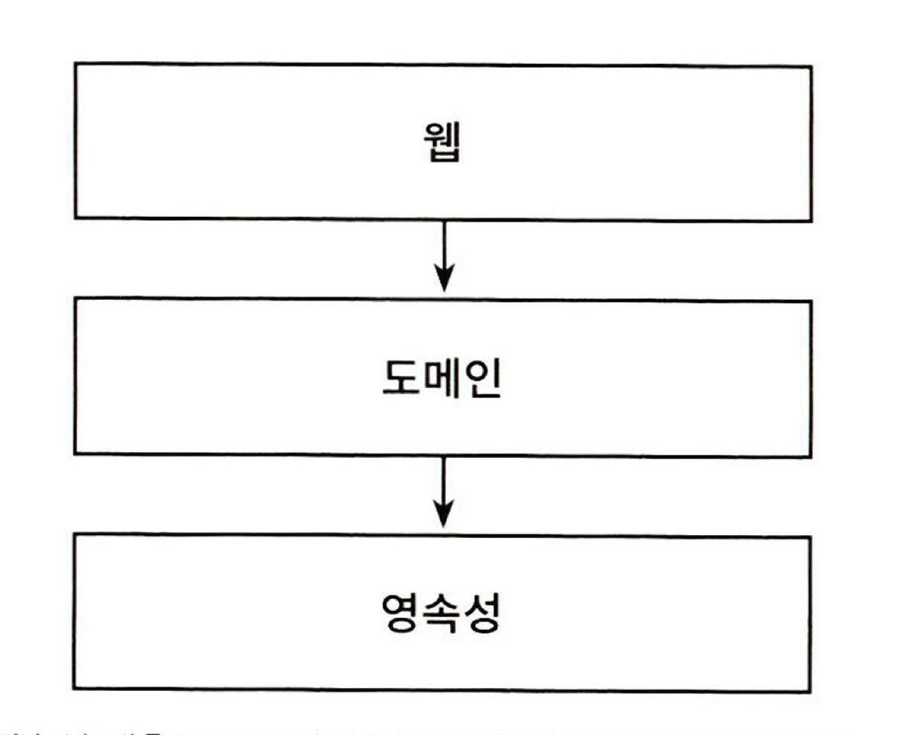
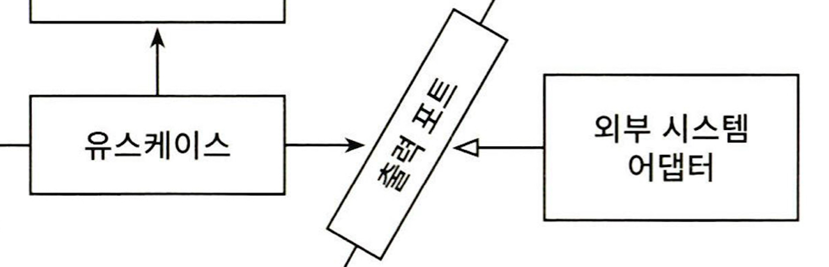
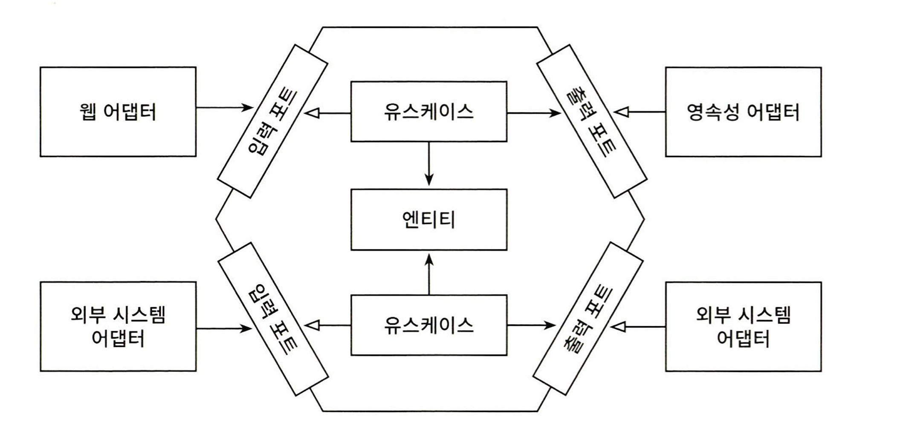
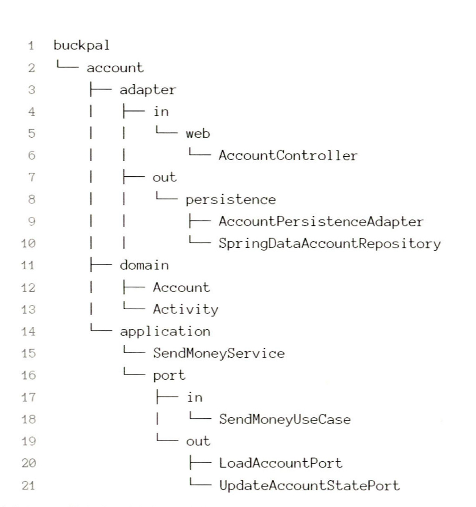

이번 글에서는 만들면서 배우는 클린아키텍처를 읽고 헥사고날 아키텍처를 구성하는 방법론에 대해 알아볼 것입니다.  

## 계층형 아키텍처
클린아키 텍처를 다루기 전에 기존 아키텍처는 어떤 문제가 있는지 알아보겠습니다.
대표적인 아키텍처로는 계층형 아키텍처가 있습니다. 
의존성의 방향은 웹->도메인->영속성으로 이어집니다. 

하지만 계층형 아키텍처에는 다음의 문제점이 있습니다. 

- DB 주도 설계:
  - 계층형 아키텍처에서 도메인 계층은 영속성 계층에 의존하기 때문에 자연스럽게 데이터베이스에 의존합니다. 영속성 계층이 가장 기반이 되는 계층이 되기 때문에 영속성 계층을 먼저 구현하게 됩니다.
  - 자연스럽게 도메인 기반의 설계에서 거리가 멀어집니다. 
- 강제하는 아키텍처 규칙이 약하다.
- 테스타하기 어렵다. 
- 넓은 서비스 
  - 계층형 아키텍처에서는 서비스의 '너비'에 관한 규칙을 강제하지 않기 때문에 여러 개의 유스케이스를 담당하는 아주 넓은 서비스가 만들어집니다.
- 동시 작업이 어렵다.
  - 영속성 계층의 작업이 완료되어야 도메인 로직을 작업할 수 있습니다. 이는 여러 개발자들이 동시에 개발할 때 병목현상을 유발합니다. 
  - 그리고 넓은 서비스로 인해 여러 개발자가 동시에 작업하기 힘듭니다. 이는 병합 충돌을 유발하는 원인이 됩니다.    

## 핵사고날 아키텍처 
헥사고날 아키텍처는 계층형 아키텍처의 단점을 해결할 수 있는 방법을 제공합니다. 
아래 그림에서 핵심은 의존성의 방향이 바깥쪽에서 안쪽으로 향한다는 점입니다. 이는 **모든 의존성의 방향이 저수준에서 고수준으로 향한다는 것을 보여줍니다.** 

대표적으로 두가지 원칙을 핵심 원칙으로 다룹니다.

- 단일 책임 원칙
- 의존성 역전 원칙 

### 단일 책임 원칙 
단일 책임 원칙은 '컴포넌트를 변경하는 이유는 오직 하나여야 한다.'는 원칙입니다.  
하지만 변경해야 하는 이유는 의존 관계에 따라 너무 쉽게 전파됩니다. 많이 의존하면 할수록 더 많은 변경해야 하는 이유가 생깁니다.
따라서 도메인 계층은 어떠한 계층에도 의존하지 않게 합니다. 도메인 계층은 다른 계층에 의존하지 않기 때문에 비즈니스의 변경이 아닌 다른 이유에 의해 도메인 계층이 변경되는 상황을 막습니다. 

### 의존성 역전 원칙 
헥사고날 아키텍처는 의존성이 항상 저수준에서 고수준을 향한다고 말씀드렸습니다. 그렇기에 도메인 계층은 저수준 계층의 변경에 자유로울 수 있었습니다. 이를 위해 헥사고날 아키텍처에서는 의존성 역전을 활용합니다.
의존성 역전 원칙은 '코드상의 어떤 의존성이든 그 방향을 바꿀 수 있다'는 원칙입니다. 보통 인터페이스를 저수준에서 구현하게 함으로써 의존 관계의 방향을 변경합니다. 
헥사고날 아키텍처에선 도메인 계층에 리포지토리에 대한 인터페이스를 만들고, 실제 리포지토리는 영속성 계층에서 구현합니다.

밑의 그림에서 어댑터가 출력 포트(인터페이스)에 의존하게 되면서 의존성의 방향이 바뀜을 확인할 수 있습니다. 이젠 의존성 역전 원칙의 도움으로 모든 의존성이 도메인 코드를 향합니다. 

위의 두 원칙을 확실히 지킴으로써 **헥사고날 아키텍처는 도메인 코드가 바깥으로 향하는 의존성을 확실히 차단합니다.**

### 도메인 엔티티와 영속성 엔티티의 분리 
또한 도메인 계층과 영속성 계층을 확실하게 분리하기 위해 각 계층에서 사용하는 모델도 분리되어야 합니다. 그렇기에 도메인 계층에서 사용한 엔티티 클래스를 영속성 계층에서 사용할 수 없고 두 계층에서 각각 엔티티를 만들어야 합니다.
도메인 엔티티를 영속성 계층으로 부터 분리하는 것은 도메인이 자유롭게 발전할 수 있는 중요한 토대가 됩니다. 

### 헥사고날 아키텍처 구조

아래 이미지는 헥사고날 아키텍처의 구조를 보여줍니다. 위에서 이야기했듯이 외부의 저수준 계층인 어댑터에서 고수준 계층인 어플리케이션 코어(유스케이스와 엔티티)에 의존합니다.
가작 바깥쪽에 있는 계층은 애플리케이션과 다른 시스템 간의 연결을 담당하는 어댑터입니다. 

어댑터에는 두가지 종류가 있습니다. 
- 주도하는 어댑터
- 주도되는 어댑터

주도하는 어댑터는 외부의 요청을 받아서 애플리케이션 코어를 호출합니다. 대표적으로 HTTP 요청을 받는 웹 어댑터가 있습니다. 주도하는 어댑터는 어플리케이션 코어를 직접 호출하는 것이 아닌 인터페이스인 입력 포트를 통해 애플리케이션 코어를 호출합니다. 그리고 유스케이스 클래스는 입력 포트를 구현합니다. 
주도되는 어댑터는 애플리케이션 코어에 의해 호출됩니다. 대표적으로 영속성 어댑터가 있습니다. 애플리케이션 코어는 출력 포트를 호출하고, 주도되는 어댑터는 출력 포트를 구현하기 때문에 의존성 역전(DIP)이 발생합니다. 결과적으로 의존의 방향이 도메인 코드로 집중됩니다.  

## 패키지 구조 

패키지 구조는 아키텍처의 구조를 담고 있어야 합니다. 즉 패키지의 구조만 보더라도 아키텍처가 어떻게 구성되어 이 

