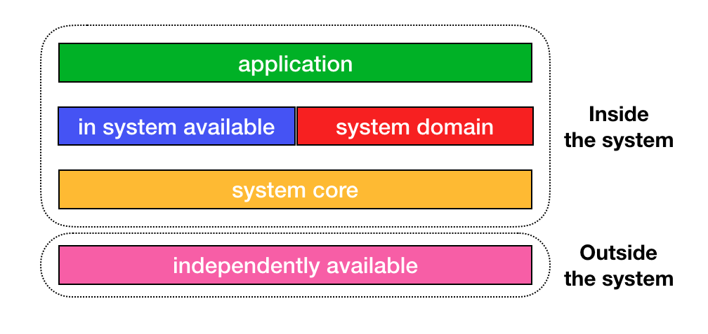
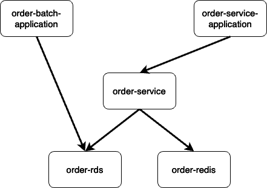
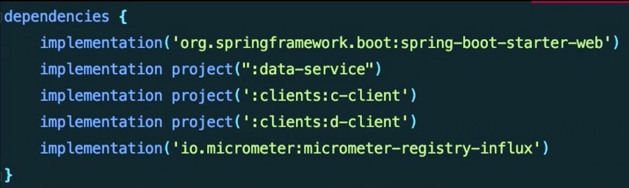

이 글은 우아한테크세미나의 권용근님 강연을 기반으로 한다.

여러 세미나, 강연을 보면서 멀티모듈을 어떻게 설계해야 할지에 대해 정리해보고자 한다. 멀티모듈을 만들고, 사용은 많이 해봤지만 잘 사용하는 방법을 알고싶어졌다. 그래서 이번 글에서는 강연 내용을 기반으로 내가 생각하는 좋은 멀티모듈 설계에 대해 작성해보고자 한다. 


## 멀티모듈의 필요성

우선 우리는 왜 멀티모듈을 사용해야 할까? 에 대해 논의해보고자 한다. 멀티모듈을 사용해야 하는 이유는 여러가지가 있지만 추려보자면

- 작업 수행 및 히스토리 파악을 한 군데에서 할 수 있다.
- 서비스를 분리하기 수월하다.
- 공통 모듈에 배포 의존성을 줄일 수 있다.
- 중복된 코드를 공통 모듈에서 관리할 수 있다.


## 실패한 멀티모듈 프로젝트 
하지만 이런 멀티모듈도 잘못 사용하면 큰 문제를 만날 수 있다. 가장 크게 문제로 다가올 수 있는 부분이 common이라 불리는 공통 모듈이라고 할 수 있다. 만약 common에 모든 코드를 몰아 넣는다면 common을 사용하는 모든 모듈들은 common이 변경될 때마다 영향을 받게 된다. 이 내용에 대해 정리해보자면
1. 스파게티 코드
common에 모든 코드를 몰아 넣는다면, 2~300개 클래스가 얽히게 된다. 나중에 common을 분해하려고 해도 분해할 수 없는 상황이 발생한다. 결과적으로는 common의 소스코드를 변경하게 되면 의존하고 있는 모든 모듈이 영향을 받는 문제가 발생한다.
2. 의존성 덩어리
comon에서 애플리케이션에서 사용하는 모든 의존성을 끌어다 쓰게된다. 결국에는 사용하지 않는 의존성도 common에 있다는 이유로 의존하는 모든 모듈들이 같은 의존성을 가지게 된다. 스프링 부트는 자동구성을 지원하기에 사용하지도 않는 빈이 생성될 가능성이 생긴다.
3. 공통 설정
각 모듈들은 세밀하게 적용해야 하는 설정들이 있다. 예를 들면 connection pool size, thread pool, Timeout 들의 설정 등이 있다. 하지만 만약 common에서 이러한 설정을 갖게 된다면 큰 문제로 번질 수 있다. common에서 가진 설정들이 모든 모듈들에 공통으로 적용되기 때문이다.

## 멀티 모듈 계층 구조
그래서 최대한 공통 모듈인 common에 코드를 넣는 것을 지양해야 한다. 모듈에 대한 정의를 명확히 하고, 역할과 책임을 명확히 해야 한다. 내부적으로는 아래와 같이 기준을 나눌 수 있다.



- 독립 모듈 계층
- 공통 모듈 계층
- 도메인 모듈 계층
- 내부 모듈 계층
- 애플리케이션 모듈 계층

## 독립 모듈 계층
시스템, 비즈니스 로직과 무관하게 어디에서나 사용 가능한 라이브러리 성격의 모듈들이 위치한다. 해당 계층의 모듈들은 서비스에 독립적이기 때문에 따로 오픈소스화 할 수 있는 모듈들이다. 이 계층은 더 좋은 라이브러리가 나오면 언제든 대체 될 수 있기 때문에 내부 모듈들에 대한 의존성을 전혀 갖지 않아야 하는 계층이다.

## 공통 모듈 계층
어쩔 수 없이 공통 모듈이 필요한 경우가 있다. 이런 경우에는 가장 큰 제약사항을 둔다.
- Type, Util 등을 정의한다.
- 가능하면 사용하지 않는다.

이 모듈은 내부 모듈 뿐만아니라 외부의 의존 관계 자체를 갖지않는다.

```java
bootJar.enabled = false
jar.enabled = true

dependencies {

}
```

## 도메인 모듈 계층
이 계층은 오로지 도메인에 집중한다. 저장소와 밀접한 중심 도메인을 다루는 계층은 더 견고하고 특별하게 격리되고 관리되어야 하기 때문에 반드시 분리되어야 한다. 도메인 모듈 계층은 아래와 같은 원칙을 갖는다.

- 하나의 모듈은 최대 하나의 인프라스트럭처에 대한 책임만 갖는다.
- 도메인 모듈을 조합한 더 큰 단위의 도메인 모듈이 있을 수 있다.

도메인 모듈 계층에서는 다중 인프라 스트럭처 사용 모듈에서 주의를 할 점이 있다. 다중 인프라 스트럭처를 사용할 때 하나의 모듈은 하나의 인프라스트럭쳐에 대한 책임을 가져야 한다는 것이다. 두 개 이상의 인프라스트럭쳐에 대한 책임을 가지면 의존 관계가 꼬일 가능성이 있다. 예를 들면, RDBMS를 사용하는 모듈에서 redis에 대한 의존성을 추가하면 문제가 생긴다. 예를 들면 조회만을 위해서 해당 도메인 모듈을 사용해야 하는 상황에서도 Redis에 대한 설정과 의존을 추가해주어야 한다. Batch에서는 RDBMS에 대한 의존성만 필요한데 불필요한 redis에 대한 의존성까지 가져가야 하는 상황이 생기는 것이다.
만약 하나의 도메인 모듈 계층이 여러 인프라스트럭쳐에 대한 의존성을 가져야 한다면 해당 모듈을 RDBMS, redis를 사용하는 모듈로 각각 분리할 수 있다.



이렇게 하면 하나의 도메인 모듈에서는 하나의 인프라스트럭처에 대한 책임만 갖게 된다. **그리고 위와 같이 두 인프라스트럭처에서 관계가 생길 때, 두 모듈을 품는 모듈을 만들 수 있다.** 위 그림에서 order-service가 order-rds와 order-redis 모듈을 품는 형태이다.

## 내부 모듈 계층
저장소, 도메인 외 시스템에서 필요한 모듈들은 이 계층에 포함된다.  이 계층은 아래와 같은 원칙을 갖는다. 

- 어플리케이션, 도메인 비즈니스에 대해 모른다.

내부 모듈 계층은 전반적인 시스템을 서포트하기 위해 필요한 계층이다. 사용되는 경우는 아래와 같다.

- core-web
  - 웹에 대한 필수적인 의존성들을 가지고 있다. 주로 web filter를 이용한 보안, 로깅에 활용된다.
- xxx-client
  - 외부의 시스템과 통신을 책임지는 모듈이다. 이 모듈은 비즈니스와 관계 없이 요청에 대한 응답의 사용성을 책임지고, 요청에 대한 책임과 스펙을 책임진다. 
- xxx-event-publisher
  - 특정 이벤트에 대한 처리를 담당한다. 여기서 말하는 이벤트는 Spring ApplicationEvent 를 말하며, 이벤트가 발생했을 때 SQS 로 이벤트를 전송하거나, 로그를 남기는 등 특정 행위를 처리한다. 

## 어플리케이션 모듈 계층
이 계층은 독립적으로 실행 가능한 어플리케이션 모듈 계층이다. 이 어플리케이션 모듈 계층은 독립 모듈 계층, 도메인 모듈 계층, 내부 모듈 계층, 공통 모듈 계층을 사용성에 따라 의존성을 추가하여 사용한다.



위와 같이 의존성에 다양한 계층의 모듈들을 조합해서 사용하는 계층이 어플리케이션 모듈 계층이다. 

## 정리
멀티모듈을 만들지만 알고 있었지, 어떻게 멀티모듈을 '잘' 사용할지는 몰랐던 것 같다. 이번에 권용근님의 강연을 블로그에 정리하면서 SRP가 잘 분리된 확장성 있는 멀티모듈을 만들 수 있겠다는 감을 잡았다.
멀티모듈을 위와 같이 설계함으로써 얻는 이득을 정리해보자면

추상화가 명확해진다. 하나의 모듈은 **명확한 역할**이 부여 되기 때문에, 변경시 영향의 범위를 파악하기 훨씬 쉬어진다. 그리고 역할과 책임에 대한 애매함이 없어짐으로써 어떤 모듈에서 어느정도까지를 개발되야할지 명확해진다.
모듈들은 **최소한의 필요한 의존성**만 같게된다. 특히 스프링 부트에서는 의존성을 추가하기만 하더라도 자동구성으로 인해 불필요한 동작을 하게될 가능성이 있다. 멀티모듈을 잘 설계하면 각 모듈들은 꼭 필요한 의존성만 갖기 때문에 의도치 않은 동작을 방지할 수 있다.
