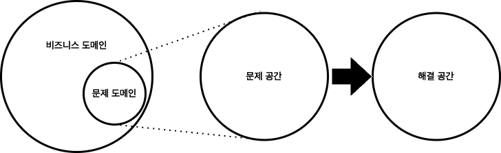
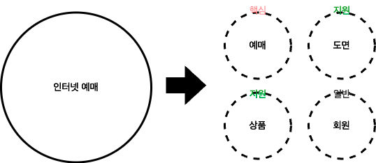
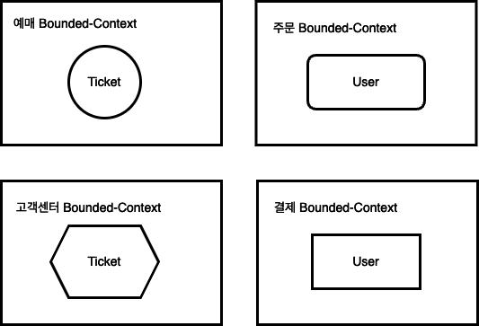
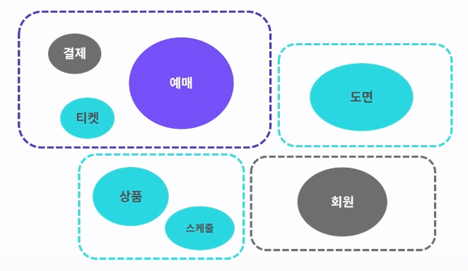
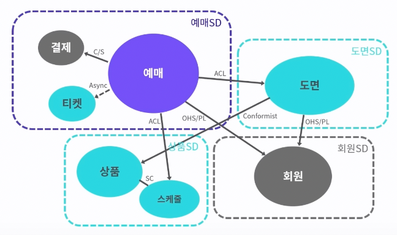

DDD는 전술적 패턴과 전략적 패턴을 포함하는 개념입니다. 개발자들은 주로 개발 과정에서 DDD의 전술적인 개념들을 많이 마주칩니다.
Aggregate, Repository, Adapter등이 그렇습니다. 하지만 DDD의 전술적인 설계에 앞서 DDD의 전략적인 설계도 중요하다고 생각합니다. 

DDD에서는 전략적 설계를 통해서 전체 도메인에서 문제 도메인을 찾고, 문제 영역을 식별합니다. 그리고 문제 영역을 개발자가 작업할 수 있는 해결 영역으로 바꿉니다. 여기서 문제 영역으로 바꾸는 단계까지가 전략적 설계 단계입니다.
이후에 실질적으로 개발자의 코드와 관련되는 전술적 설계가 등장합니다. 이처럼 전략적 설계는 전체 프로젝트의 근본을 이룹니다. 만약 전략적 설계가 제대로 이루어지지 않았다면, 전략적 설계의 토대 위에 만들어지는 전술적 설계도 흔들릴 수 밖에 없습니다.   

결국 중요한 것은 DDD의 본질은 전략적 설계의 방법론이 아니라는 것입니다. DDD는 오히려 추상적인 철학이나 접근법입니다. 그리고 그 본질은 전략적 설계에 근간을 두고 있습니다.

## DDD의 전략적 설계 

### 문제 공간 식별 
도메인은 회사의 현실세계 활동영역을 말합니다. 그리고 도메인에서 소프트웨어로 해결하고자 하는 영역이 문제 도메인이 됩니다. 
DDD의 시작은 이런 문제 도메인을 추출하는 것으로 시작하게 됩니다. 

이후 큰 도메인을 작은 하위 도메인으로 나눕니다. 인터넷 예매라는 문제 도메인을 하위 도메인으로 나눈다면 예매, 도면, 상품, 회원 도메인으로 나눌 수 있습니다. 
그 중 예매 도메인은 인터넷 예매라는 문제 도메인의 핵심 도메인이라고 할 수 있습니다. 따라서 다른 서비스와의 차별점이 생기기 위해서는 예매 도메인에 핵심 역량을 집중해야 합니다.
전략적 설계 단계에서는 이처럼 **전략적 설계를 통해서 먼저 문제 영역을 식별하고, 어느 영역에 리소스를 더 많이 할당해야 할지를 결정하는 것이 중요합니다.**

이렇게 하위 도메인으로 나누고, 하위 도메인의 중요도를 나누는 과정이 문제 공간을 식별하는 과정입니다. 
다음으로는 문제 공간을 해결 공간으로 변경하는 과정입니다. 이를 위해서는 **Bounded-Context**에 대한 개념이 중요합니다. 

### 해결 공간으로 변경 

문제 공간에선 Bounded-Context 간 경계를 설정하고 관계를 설정해야 합니다. Bounded-Context는 의미 그대로 문맥의 경계라고 할 수 있습니다. 그리고 Bounded-Context가 다르면 유비쿼터스 언어도 달라집니다. 
그렇기 때문에 **각 Bounded-Context는 모델의 무결성을 위한 경계**라고 할 수 있습니다.

같은 Ticket이라도 예매 Bounded-Context에서는 예매 티켓이라는 개념이되고, 고객센터 Bounded-Context에서는 고객 문의 티켓이 됩니다. 
마찬가지로 주문 Bounded-Context에서 User는 주문한 유저가 되지만, 결제 Bounded-Context에서는 User가 결제 유저가 됩니다. 

같은 개념이라도 Bounded-Context가 다르면 유비쿼터스 언어가 달라짐을 확인할 수 있습니다. 그리고 각 모델은 각 Bounded-Context의 문제 해결에 필요한 속성과 행위만을 가지고 있습니다. 
따라서 Bounded-Context는 모델 무결성을 갖는 명시적으로 구분되는 경계를 갖습니다. 
이렇게 명확하게 분리함으로써 각 하위 도메인은 다른 하위 도메인에 영향을 미치지 않으면서 개별적으로 발전할 수 있게됩니다. 

하위 도메인과 Bounded-Context 보통 하나의 하위 도메인에 하나 이상의 Bounded-Context가 추가됩니다. 

해결 공간으로의 마지막 단계는 Context-Map 생성입니다. Context-Map은 Bounded-Context 간의 매핑관계를 보여줍니다. 개별 Bounded-Context에 매몰되면 전체를 보지 못할 수도 있습니다. 나무만 보고 숲을 보지 못하는 상황을 방지하려면 전체 비즈니스를 조망할 수 있는 지도가 필요한데 그것이 Context-Map입니다. 
Context-Map은 시스템의 전체 구조를 보여주기 때문에 도메인에 맞게 Bounded-Context를 조절하고 사업의 핵심 도메인을 위해 조직의 역량을 어떤 바운디드 컨텍스트에 집중할지 파악하는데 도움을 줍니다. 

## 정리 
여기까지가 DDD의 전략적 설계입니다. 전략적 설계는 DDD의 근간이 되는 중요한 단계입니다. 아키텍처 전반에 걸쳐 근본을 이루는 단계이기 때문입니다. 전략적 설계 단계에서 문제 도메인을 해결영역으로 만들었다면 이후 DDD의 전술적 설계가 필요한 단계입니다. 
전술적 설계는 각 Bounded-Context 범위에서 이루어지고, 구체적인 방법론을 제공합니다. 