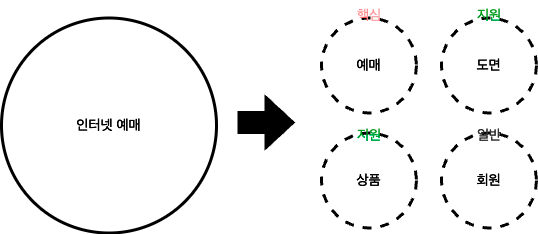

DDD는 전술적 패턴과 전략적 패턴을 포함하는 개념입니다. 개발자들은 주로 개발 과정에서 DDD의 전술적인 개념들을 많이 마주칩니다.
Aggregate, Repository, Adapter등이 그렇습니다. 하지만 DDD의 전술적인 설계에 앞서 DDD의 전략적인 설계도 중요하다고 생각합니다. 

DDD의 전술적 설계는 복잡한 문제 영역을 해결하기 위해 풍부한 도메인 모델을 활용하기 위한 것이고, 모든 문제영역에 전술적 설계를 적용할 수는 없습니다. 
따라서 **전략적 설계를 통해서 먼저 문제 영역을 식별하고, 어느 영역에 리소스를 더 많이 할당해야 할지를 결정하는 것이 중요합니다.** 

결국 중요한 것은 도메인의 본질은 방법론이 아니라는 것입니다. 오히려 추상적인 철학이나 접근법입니다. 그리고 그 본질은 전략적 설계에 근간을 두고 있습니다.

## DDD의 전략적 설계 

도메인은 회사의 현실세계 활동영역을 말합니다. 그리고 도메인에서 소프트웨어로 해결하고자 하는 영역이 문제 도메인이 됩니다. 
DDD의 시작은 이런 문제 도메인을 추출하는 것으로 시작하게 됩니다. 

이후 큰 도메인을 작은 하위 도메인으로 나눕니다. 인터넷 예매라는 문제 도메인을 하위 도메인으로 나눈다면 예매, 도면, 상품, 회원 도메인으로 나눌 수 있습니다. 
그 중 예매 도메인은 인터넷 예매라는 문제 도메인의 핵심 도메인이라고 할 수 있습니다. 따라서 다른 서비스와의 차별점이 생기기 위해서는 예매 도메인에 핵심 역량을 집중해야 합니다. 

