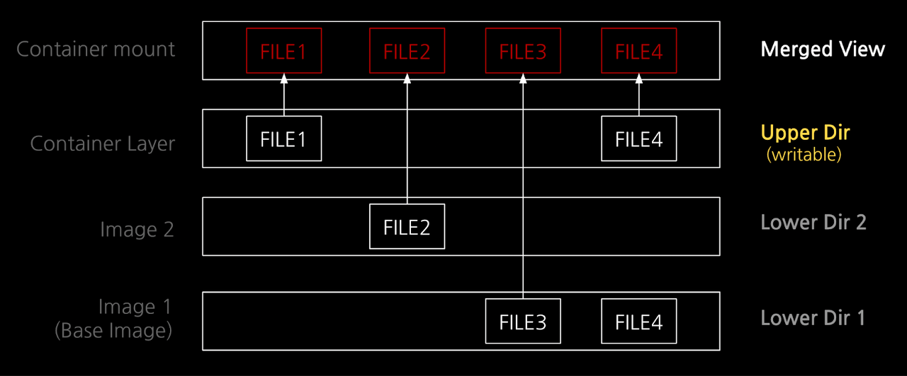
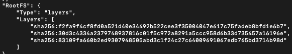
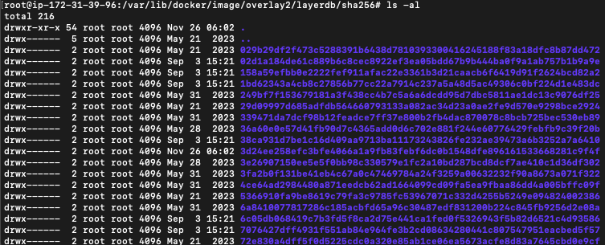
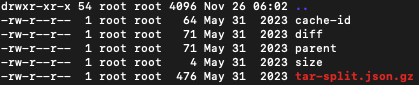
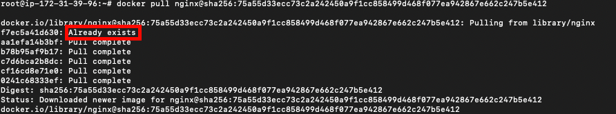
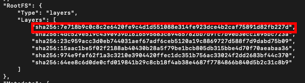
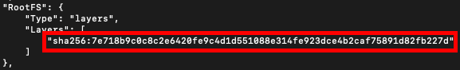
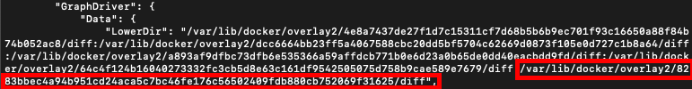
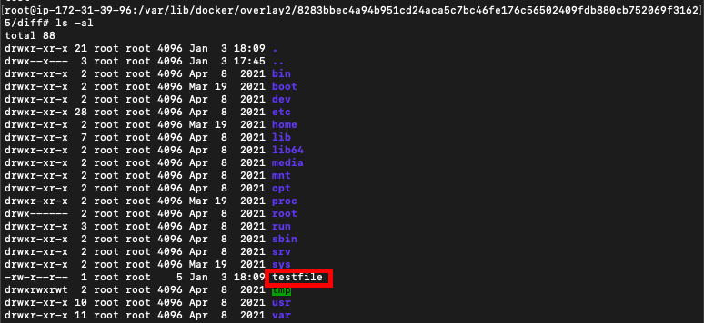
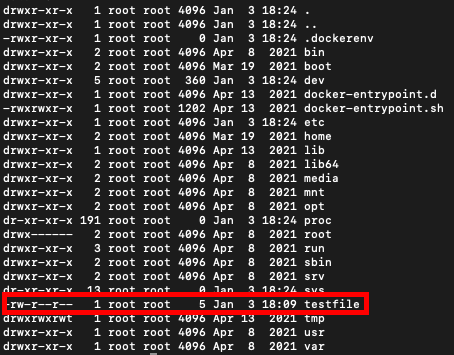

이번 글에서는 도커의 파일 시스템에 대해 이야기해 보고자 한다.
도커는 격리된 환경을 제공해주는 컨테이너로서 많이 사용되고 있는데, 이런 도커는 파일을 오버레이 파일 시스템을 이용해서 제공한다. 오버레이 파일시스템은  이미지 레이어를 층층이 쌓고, 최상위 레이어에서는 각각의 레이어들이 합쳐져 보인다. 그 이외의 특징은 아래와 같다.

각각의 레이어를 합쳐서 통합된 하나의 뷰를 만든다.
레이어의 쌓이는 순서가 중요하다. 만약 두 개의 레이어에 동일한 파일이 있다면, 상위 레이어의 파일이 통합된 뷰에 포함된다.
읽기 전용의 Lower Layer와 읽기/쓰기가 가능한 Upper Layer로 구성된다. 만약 Lower Layer의 파일에 대한 쓰기 작업이 필요하다면,  Upper Layer에 해당 파일을 Copy하고 Write한다.

여기서 중요한 포인트는 Lower Layer는 '읽기 전용'이라는 것이다. Lower Layer가 읽기 전용으로 관리되기 때문에 컨테이너 들은 같은 이미지 레이어를 공유할 수 있다.
도커 컨테이너에서는 최근 OverlayFS2 구현체를 많이 이용한다. OverlayFS2의 구조도 읽기 전용인 Lower Dir와 읽기 쓰기 가능한 Upper Dir 그리고 통합된 뷰인 Merged Dir로 구성된다. pull로 이미지 저장소에서 이미지 레이어를 받으면 여러 이미지 레이어들이 Lower Dir에 저장된다. Lower Dir은 읽기 전용이기 때문에 여러 컨테이너에서 동일한 Lower Dir 이미지 레이어를 참조할 수 있다. 그리고 만약 Lower Dir 파일에 대한 변경이 필요하면 Upper Dir의 파일을 Copy하고 Write하는 과정을 거친다. (CoW, Copy-On-Write) 기존 이미지 레이어, 즉 원본을 수정하지 않고도 신규 쓰거나 수정이 발생한 변경 부분만 새로 커밋하여 레이어를 추가/확장할 수 있다.
Merged view는 오버레이 파일시스템이 마운트 되는 디렉터리이다. 가장 밑의 Lower Dir 부터 Upper Dir까지 마치 셀로판지를 겹쳐 놓은 것처럼 통합된 뷰(Merged View)를 제공한다.



이처럼 도커 컨테이너는 이미지 레이어의 중복을 최소화 하도록 설계되었다. 그리고 여러 컨테이너에서 동일한 레이어를 사용하는 경우에 이를 공유할 수 있어 호스트의 저장공간을 절약하는 측면도 있다. 이렇게 할 수 있는 것은 image layer를 읽기 전용으로 유지하기 때문이다. 하지만 만약 읽기 전용인 image layer를 변경하고자 하면, image layer를 container layer(upper dir)로 복사해오고 변경하기 때문에 일반적인 write와 비교해서 속도도 느리고 오버헤드가 생긴다. contianer layer의 또다른 특징은 휘발성이라는 점이다. 따라서 컨테이너가 삭제되면 container layer도 함께 사라진다. 이를 영속화하기 위해서는 커밋하여 새로운 이미지 레이어로 저장해야 한다.
이제는 도커에서 어떻게 파일 시스템이 구성되어 있는지 살펴보고자 한다.

## 도커 파일 구조
docker image를 pull 받으면, 이미지 레이어 별로 배포 id를 볼 수 있다. 배포 id는 이미지 저장소에서 부여한 id이다.

```shell
# docker pull nginx@sha256:75a55d33ecc73c2a242450a9f1cc858499d468f077ea942867e662c247b5e412

docker.io/library/nginx@sha256:75a55d33...: Pulling from library/nginx
f7ec5a41d630: Pull complete
aa1efa14b3bf: Pull complete
b78b95af9b17: Pull complete
c7d6bca2b8dc: Pull complete
cf16cd8e71e0: Pull complete
0241c68333ef: Pull complete
Digest: sha256:75a55d33...
Status: Downloaded newer image for nginx@sha256:75a55d33...
docker.io/library/nginx@sha256:75a55d33...
```

그리고 각 레이어 별로 고유한 id를 가지고 있다. docker image insepect <이미지 Id> 를 통해 나오는 이미지 정보에서 RootFS를 보면 layer id를 확인할 수 있다. 



도커는 다운로드한 이미지를 로컬에 저장하고 관리하기 위해 "레이어 DB"를 사용한다. 경로는 <도커 루트>/image/overlay2/layerdb에 있다. 레이어 DB는 레이어의 db id를 디렉토리 명으로 사용한다.



파란색 해시값의 디렉터리명이 레이어 "db id"이다. db id는 이미지 레이어를 pull 받을 때 레이어 별로 생성이 된다. db id는 pull 받는 호스트에서 생성이 되고 받을 때마다 달라진다. 각 레이어 DB에는 cache-id(경로 식별), diff(레이어 식별), parent(적층순서 식별) 세 가지 파일이 존재한다.



- cache-id: 이미지 레이어의 로컬 저장 경로를 나타낸다. 저장 경로는 <도커 루트>/overlay2/<cache-id>에 있다. 
- layer-id: 레이어의 고유 id를 의미한다. diff 파일은 레이어 id 값을 가지고 있다. 
- parent: 부모 레이어의 layer db id를 의미한다. 부모 레이어는 바로 밑의 레이어를 의미하고 부모 레이어의 db id를 통해 적층 순서를 정할 수 있다. 물론 베이스 이미지 레이어는 아래 레이어를 가지지 않기 때문에 parent를 가지지 않는다. 


위의 이미지 레이어를 두개의 이미지가 공유하는 것을 실제로 확인해보자. 아래의 nginx, debian 이미지는 같은 이미지 레이어를 공유한다. 이를 위해 두 이미지를 pull 받아 볼 것이다.

```shell
docker pull debian@sha256:b586cf8c850cada85a47599f08eb34ede4a7c473551fd7c68cbf20ce5f8dbbf1
docker pull nginx@sha256:75a55d33ecc73c2a242450a9f1cc858499d468f077ea942867e662c247b5e412
```

같은 이미지 레이어를 공유하기 때문에 아래와 같이 특정 이미지 레이어를 pull할 때, Already exists 라고 표시되는 것을 확인할 수 있다.



이를 docker image inspect 명령어로 확인해보면 더 명확하게 확인할 수 있다.




베이스 레이어 id가 동일한 것을 확인할 수 있다. 권장되는 방법은 아니지만 호스트에서 베이스 레이어에 접근해 파일을 생성해보았다. Lower Dir의 가장 마지막 레이어가 베이스 레이어가 된다.



베이스 레이어의 경로를 확인하고 해당 디렉토리에서 새로운 파일을 생성해보았다. 

```shell
cd /var/lib/docker/overlay2/8283bbec4a94b951cd24aca5c7bc46fe176c56502409fdb880cb752069f31625/diff
echo 'test' > testfile
```



이렇게 추가하고 각각의 이미지를 컨테이너로 실행시키면 동일한 루트에 testfile이 존재한다.



여기서 testfile의 내용을 변경해도 각각의 컨테이너는 변화가 없다. 왜냐하면 testfile의 내용을 변경하면 해당 testfile을 upper layer에 Copy한 후에 Write하기 때문이다. 
```shell
#con1
root@con1:/# echo 'changed' > testfile
root@con1:/# cat testfile
changed

#con2
root@con2:/# cat testfile
test
```

## 정리
도커 컨테이너는 오버레이 파일시스템을 이용해서 레이어 형태로 이미지를 관리한다. 레이어는 읽기만 가능한 Lower Layer, 읽기 쓰기 모두 가능한 Upper Layer로 이루어져 있다. 그리고 이 두 레이어를 병합한 Merged View가 제공된다. Lower Layer는 읽기만 가능하기 때문에 여러 컨테이너에서 참조할 수 있다. 그리고 Lower Layer에서 변경된 파일은 Upper Layer에 복사되고 수정되는 (CopyOnWrite)가 수행된다. 도커 컨테이너는 이렇게 오버레이 파일시스템으로 파일을 관리하기 때문에 불필요한 중복을 줄이고, 저장 용량을 줄인다. 


### Reference
[https://tech.kakaoenterprise.com/171?category=882489](https://tech.kakaoenterprise.com/171?category=882489)
