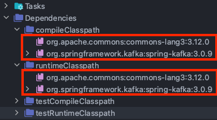
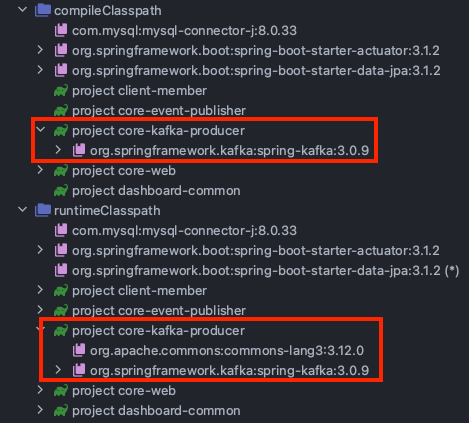
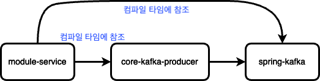
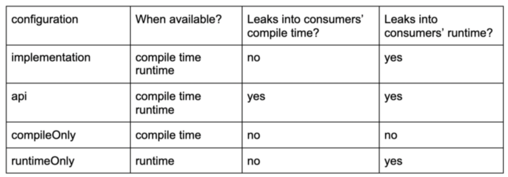
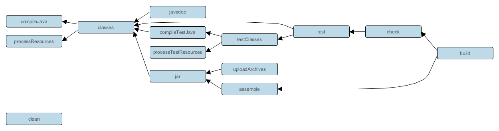
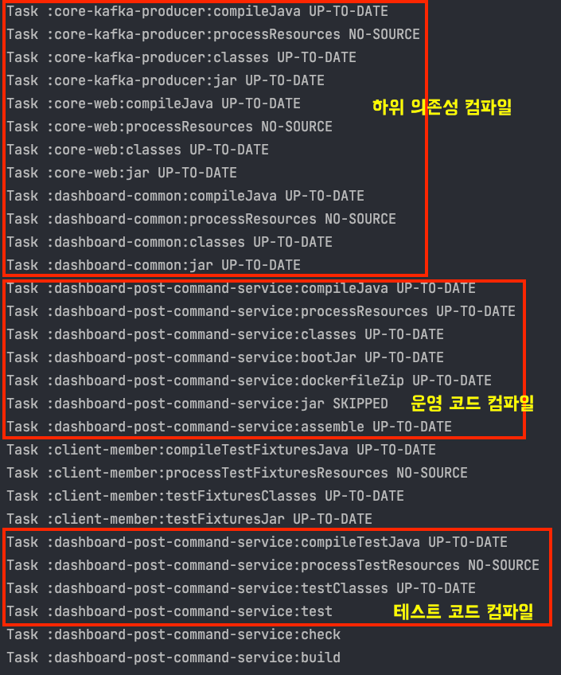

최근 멀티 모듈 프로젝트를 진행하면서 gradle에 대해 너무 모르고 사용하고 있다는 생각이 들었습니다. 
싱글 프로젝트만 진행했을 때는 gradle을 잘 몰라도 문제가 없었기 때문입니다. 하지만 멀티모듈에서는 다른 모듈에 대한 의존성을 사용할 때가 많기 때문에 gradle에 대한 지식이 필수적이라고 생각합니다. 

따라서 몰랐던 gradle의 다양한 기능을 한 번 정리해야 겠다는 생각이 들어 gradle의 docs를 참고하여 이번 기회에 정리해보고자 합니다.

이번 정리는 [Gradle Docs](https://docs.gradle.org/current/userguide/java_plugin.html#sec:java_plugin_and_dependency_management)를 참고하여 작성했습니다.

## implementation vs api 

gradle의 의존성을 작성하다보면 어떤 것을 이용해야 할지 선택하기 어려운 경우가 많습니다. 

우선 ```implementation```과 ```api```를 비교해 보겠습니다. 

#### api 
```api``` configuration은 라이브러리가 제공하는 API에서 사용자에게 노출되어지는 의존성을 선언하는데 사용됩니다. 
**따라서 ```api```로 선언된 의존성을 가진 모듈을 사용하는 소비자(다른 모듈, 혹은 다른 프로젝트 등)에서도 해당 라이브러리의 클래스 및 메서드에 접근할 수 있습니다.** 
이를 위해서, ```api```로 선언된 의존성은 소비자의 compileClassPath와 runtimeClasspath에 모두 포함됩니다. 

#### implementation
```implementation``` configuration은 내부에서 사용되는 의존성을 선언하는데 사용됩니다. **즉 implementation을 사용하여 선언된 의존성은 해당 모듈 내부에서만 사용되고, 다른 모듈에는 노출되지 않습니다.** 
이로 인해 모듈 내부에서 ```implementation```으로 선언되어 사용되는 라이브러리의 변경사항은 다른 모듈에 영향을 미치지 않습니다.
이를 위해서, ```implementation```을 사용하여 선언된 의존성은 소비자의 compileClasspath에는 포함되지 않습니다. 

core-kafka-producer 를 module-service가 의존하고 있다고 가정해봅시다.

### core-kafka-producer[build.gradle]
```java
plugins {
    id 'java-library'
}

dependencies {
    api 'org.apache.httpcomponents:httpclient:4.5.7'
    implementation 'org.apache.commons:commons-lang3:3.5'
}
```
core-kafka-producer의 compileClasspath와 runtimeClasspath 에는 모두 ```api```와 ```implementation```으로 설정한 의존성이 들어간 것을 확인할 수 있습니다. 



여기까지만 봤을 때는 ```api```와 ```implementation``` 의 차이점이 없어보이지만 core-kafka-producer를 의존하고 있는 module-service에서는 차이가 생깁니다. 

### module-service[build.gradle]
```java
plugins {
    id 'java'
}

group 'org.example'
version 'unspecified'

repositories {
    mavenCentral()
}

dependencies {
    implementation project(':core-kafka-producer')
}
```

module-service의 의존관계를 확인하면 아래와 같은 사실을 알 수 있습니다. 
- 의존하는 모듈의 api 의존성: compileClasspath와 runtimeClasspath에 모두 추가됨
- 의존하는 모듈의 implementation 의존성: runtimeClasspath에만 추가됨



즉, api를 이용해서 의존성을 추가하면 module-service 입장에서 의존하고 있는 모듈의 모든 의존성에 접근 가능합니다. core-kafka-producer 모듈이 의존하고 있는 하위 의존성까지 compileClasspath에 가지고 있다는 의미입니다. 
그리고 compileClasspath에 의존성을 가지고 있다는 것은 module-service에서 직접 컴파일 시점에 참조할 수 있다는 것을 의미합니다. 
이를 쉽게 도식화해보면 아래 그림과 같습니다.



core-kafka-producer에서 api를 이용해 spring-kafka를 추가하였기 때문에, core-kafka-producer를 의존하고 있는 module-service는 compileClasspath에 spring-kafka가 추가되었습니다. 
따라서 module-service는 컴파일 시점에 spring-kafka 의존성을 직접 이용할 수 있게 된 것입니다. 

하지만 ```api```를 이용해서 하위 의존성까지 모두 의존한다면 상위 모듈이 너무 많은 의존성에 노출이 될 수 있습니다. 이는 다시 말하면 변화에 유연하지 않을 수 있다는 것을 의미합니다. 
만약 core-kafka-producer가 spring-kafka가 아닌 다른 client를 사용해야 된다면 어떻게 될까요? 그렇다면 module-service도 함께 변경이 되어야 할 것입니다. 그래서 이처럼 변화에 유연하게 대처하기 위해서는 기본적으로 ```implementation``` 사용이 권장됩니다. 
```implementation```을 사용한다면 module-service에서는 직접적으로 spring-kafka에 대한 의존을 가지지 않기 때문입니다. 

## compileOnly vs runtimeOnly

이번에는 ```compileOnly```와 ```runtimeOnly```에 대해 알아보겠습니다. 이 둘도 의존성을 추가해주는 역할을 담당합니다. 하지만 ```implementation```과 ```api```가 compileClasspath와 runtimeClasspath에 모두 의존성을 추가해주었던 것과는 다르게 동작합니다. 
```compileOnly```는 오직 compileClasspath에만 의존성을 추가합니다. 반대로 ```runtimeOnly```는 오직 runtimeClasspath에만 의존성을 추가합니다. 

```compileOnly```의 대표적인 예는 lombok이라고 할 수 있습니다. 컴파일 시에 getter, setter 등 필요한 것을 생성시키고, 런타임 때는 사용하지 않기 때문입니다. 
```runtimeOnly``` 는 주로 DB관련이나 로그 관련 dependency들을 추가할 때 사용한다. 컴파일 타임에는 필요없는데 런타임에 의존하는 의존성들을 ```runtimeOnly```를 이용해서 추가합니다. 

위의 내용을 정리하자면 아래의 표와 같습니다.


## Gradle Task 정리  

Gradle에는 다양한 task들이 있습니다. 아래는 [Gradle Docs](https://docs.gradle.org/current/userguide/java_plugin.html#sec:java_plugin_and_dependency_management) 에 나와 있는 Task의 관계도입니다. 



build Task 실행에 다양한 Task가 포함되어 있음을 확인할 수 있습니다. 

위의 flow를 직접 확인해보겠습니다. 

아래는 ```core-kafka-producer```, ```core-web```, ```dashboard-common```  세 개의 모듈에 의존하고 있는 모듈입니다. 

```java
bootJar.enabled = true
jar.enabled = false

group = 'com.wook.top.post'
version = '1.0.0'

dependencies {
    implementation project(":core-kafka-producer")
    implementation project(":core-web")
    implementation project(":dashboard-common")
}
```
위의 모듈을 build하면 아래와 같은 task 목록이 확인됩니다. 



빌드시에 아래의 순서로 진행됨을 확인할 수 있습니다.

1. 하위 의존성 컴파일 (```compileJava```, ```processResources```, ```jar```)
2. 운영 소스코드 컴파일 (```compileJava```, ```processResources```, ```bootJar```) 
3. 테스트 코드 컴파일 (```compileTestJava```, ```processTestResources```, ```testClasses```) 

각각의 Task의 역할은 다음과 같습니다. 

- compileJava: 자바 소스코드를 모두 컴파일합니다. 보존할 장소(build/classes)가 없다면 폴더를 생성하고 그 안에 파일을 작성합니다. 
- processResources: 리소스 파일을 클래스 디렉터리 안에 복사합니다.
- jar: 실행할 수 없는 Jar 파일을 생성합니다. 
- bootJar: 실행할 수 있는 Jar 파일을 생성합니다. 