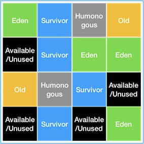
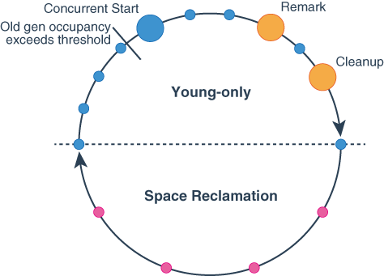
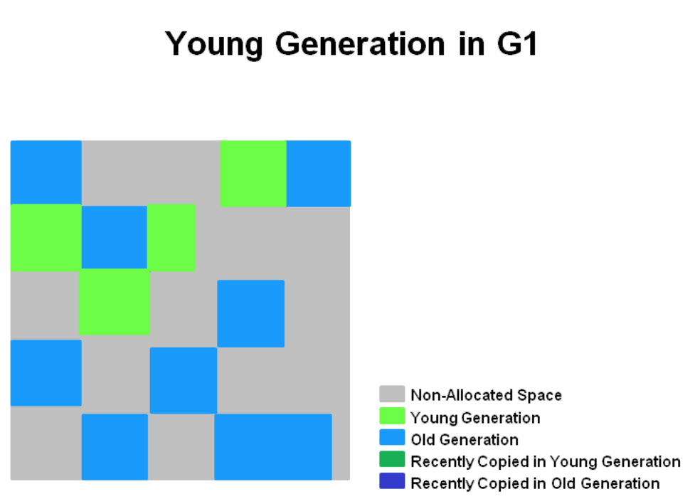
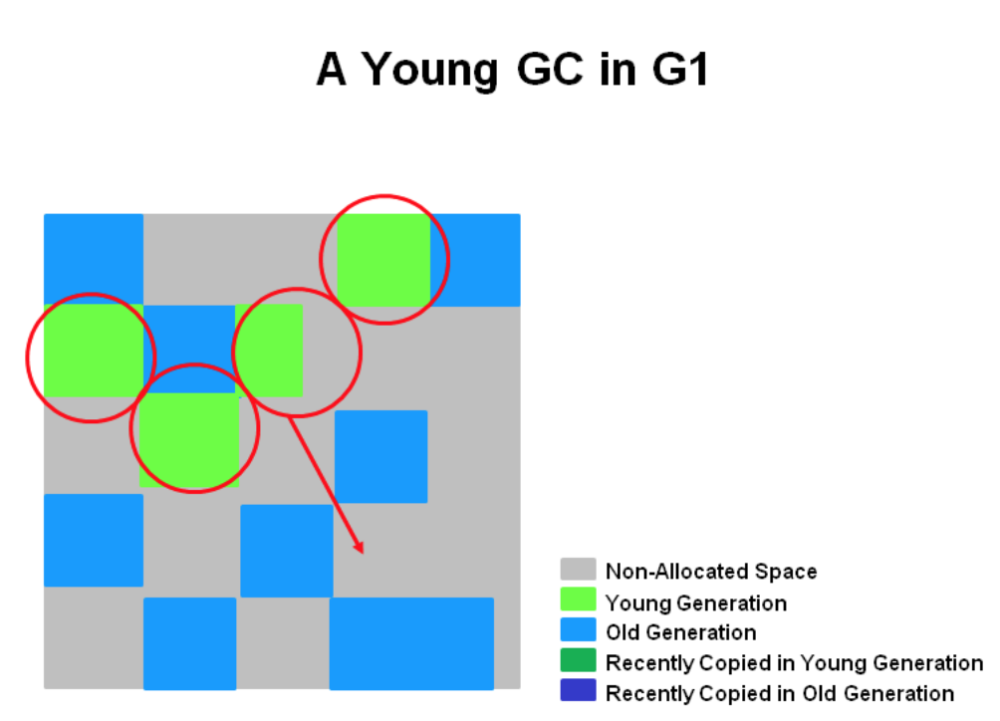
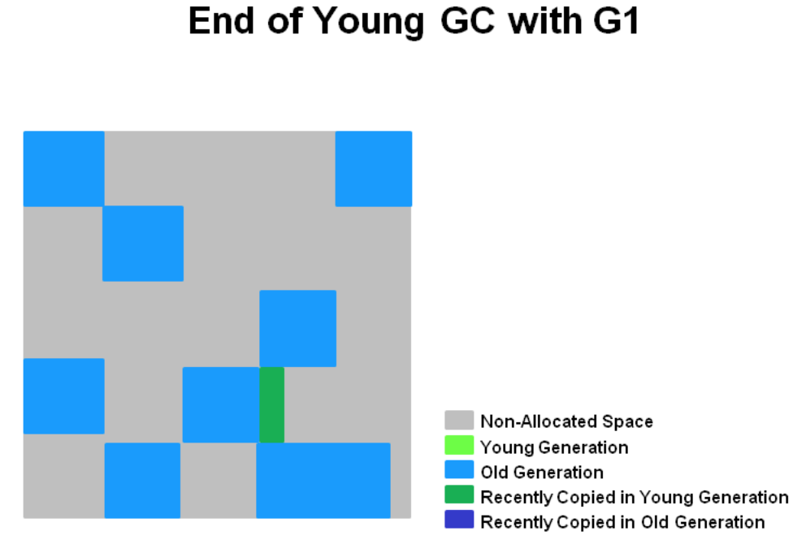
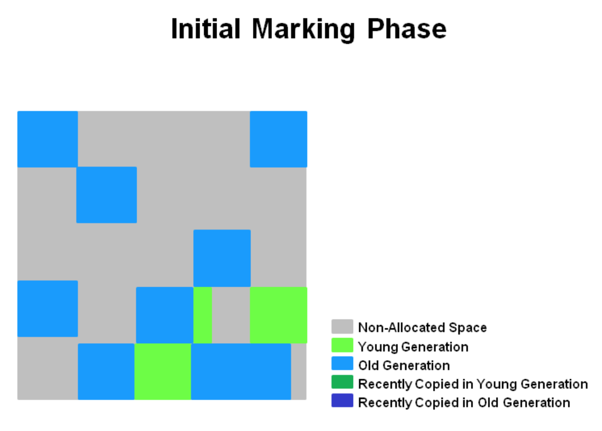
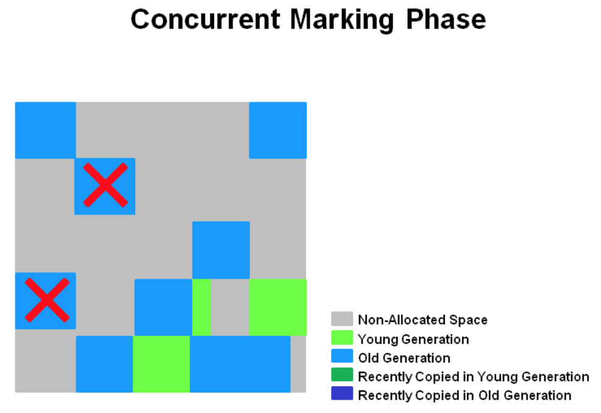
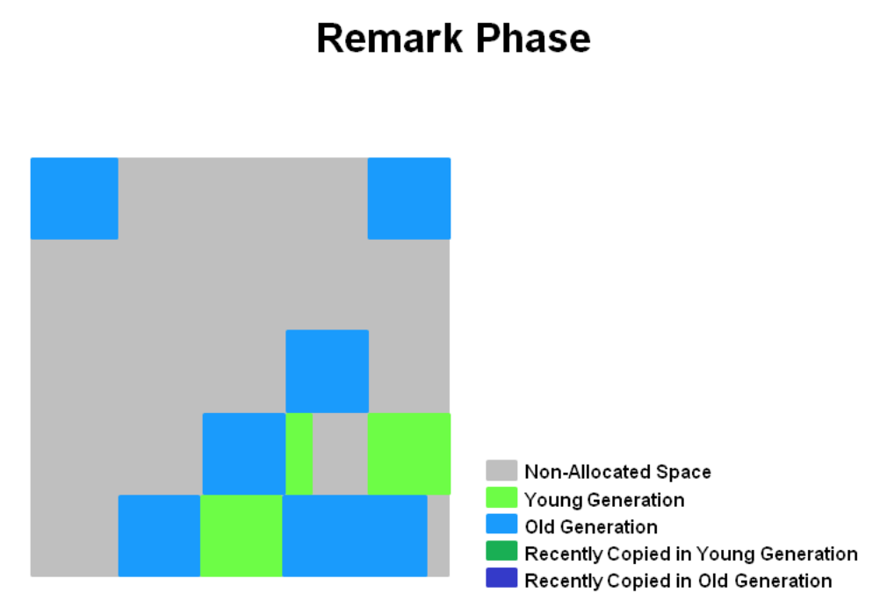
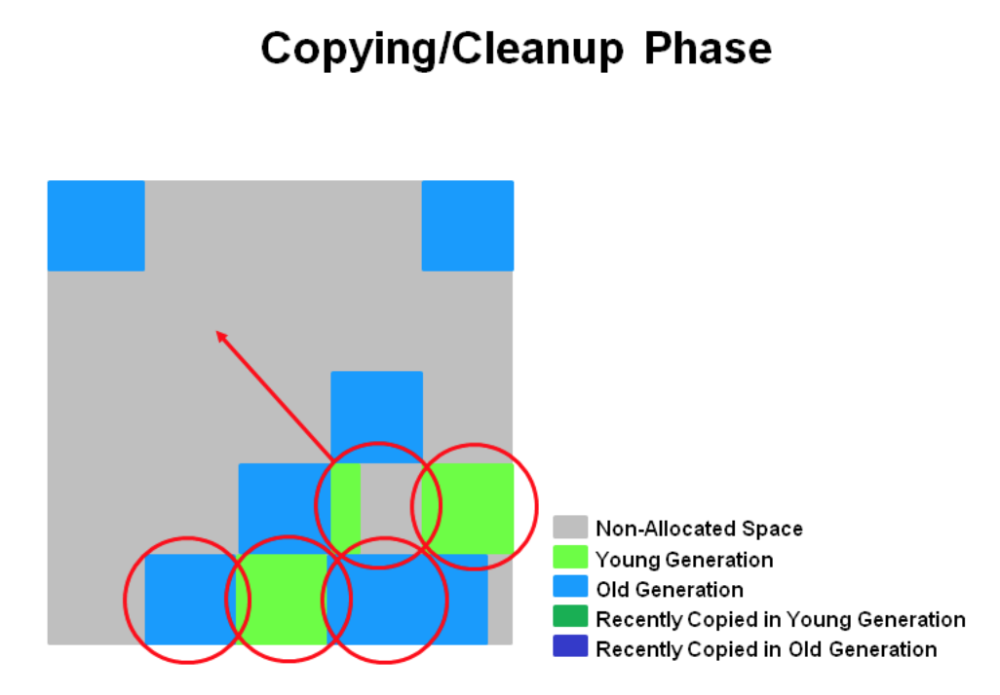

# G1GC
G1GC는 CMS GC를 대체하기 위해서 만들어졌습니다. 

G1GC는 서버의 프로세서와 메모리 사이즈가 커짐에 따라 개선된 GC입니다. G1GC의 가장 큰 특징으로는 힙 메모리를 Region이라는 단위로 나눈다는 점입니다. 
그리고 Region이라는 작은 단위에 대해서 각 스레드가 자신만의 region을 잡고 작업하는 방식으로 GC를 수행합니다. 이는 STW(Stop the world)를 짧게 하는 요인이됩니다.

## G1GC의 힙메모리 구조



위에서 설명 드렸듯이 힙메모리가 여러개의 Region으로 분리되어 있음을 알 수 있습니다. 

## G1GC의 사이클 



G1GC는 그림처럼 young-only phase와 Space Reclamation Phase를 반복합니다. 사이클중 모든 원은 stop-the-world가 발생한 것을 나타냅니다. 
파랑색 원은 Minor GC가 발생했음을 의미하고, 주황원은 Major GC가 발생했음을 의미합니다. 빨간원은 Mixed GC가 밸생했음을 의미합니다. 
그리고 원의 크기가 클수록 소요시간이 깁니다.  

### Minor GC
Minor GC는 Young Generation 영역에서 발생하는 GC라서 관리하는 메모리의 크기가 작아서 빠른 시간 내에 완료됩니다. 


GC 동작 전에 연속되지 않은 메모리 공간에 Young Generation이 Region 단위로 메모리에 할당되어 있습니다. 


Young Generation에 있는 유효 객체를 Survivor Region이나 Old Generation으로 copy 또는 move 합니다. 
이 단계에서 STW(Stop The World)가 발생하고 Eden Region과 Survivor Region의 크기는 다음 Minor GC를 위해 다시 계산됩니다. 


Minor GC를 마치고 나면 Eden 영역에서 Survivor 영역으로 이동하거나 Survivor 영역에서 Old Generation 영역으로 이동했다는 청록생 영역이 생깁니다. 


### Major GC

위의 Minor GC 단계에서 Young Generation 영역에 저장된 객체들 중 Root space 로부터 참조되는 객체들을 Old Generation 영역으로 이동시켰습니다.
```Young-only``` 와 ```Space Reclamation```의 전환은 ```Initiating Heap Occupancy Percent``` 임계값에 도달할 때 시작됩니다.
즉 **힙메모리가 일정 비율로 점유되었을 때, ```Young-only``` 또는 ```Space Reclamation``` 단계로 전환되면서 Major GC가 시작됩니다.**

이와 관련된 옵션은 ```InitiatingHeapOccupancyPercent```입니다. 
- 통칭 IHOP 이라고 부릅니다. 
- default 값은 45입니다. (전체 크기 대비 heap 사용이 45%가 넘어가면 Marking을 시작합니다.)
- 임계값을 넘어서면 ```Mixed GC```가 실행됩니다. 
- G1GC는 ```Mixed GC```로 메모리를 최적화하다가, GC가 독작함에도 여유 공간이 부족하면, ```Major GC```가 동작함으로써 여유 공간을 확보합니다.
- ```Mixed GC``` 는 일부를 대상으로 GC가 동작하고, ```Maxed GC```는 모든 Old 영역을 대상으로 GC가 발생합니다. 

```IHOP```는 Young-only 단계의 Concurrent Start를 trigger 해주는 임계값입니다. 하지만 G1GC는 marking 하는 동안, marking에 소요되는 시간과 Old 영역에서 할당되는 메모리 양을 관찰하여 최적의 IHOP를 자동으로 결정합니다. 
이를 ```Adaptive IHOP```라고 합니다. 이를 위한 옵션은 ```-XX:G1UseAdaptiveIHOP``` 

아래는 Major GC의 단계입니다.

**Initial Mark**


initial Mark 단계는 Survivor 영역에서 Old 영역을 참조하고 있을 수 있는 영역들을 마킹합니다. 
Survivor 영역들을 마킹하는 단계이기 때문에 Minor GC에 의존적이며, STW(Stop The World)가 발생합니다.

**Concurrent Marking**

힙 내의 모든 Old 영역에 대해 GC 대상을 식별합니다. Region 내의 모든 객체가 Garbage라 판단되면 Remark 단계에서 즉시 제거됩니다. 
STW가 발생하지 않습니다. 

**Remark**

Remark 단계는 Concurrent Mark에서 **X표시한 영역을 바로 회수하여 STW를 발생**시킵니다. 
또한, Concurrent Mark 단계에서 작업하던 Mark를 이어서 작업하여 완전히 끝내버립니다.

**CleanUp**

Remark 단계에서 제거한 Region 이외에 livenless가 가장 낮은 Region을 선택하고 새로운 Region으로 이동 또는 복사합니다. 


# ZGC

## Reference
[https://d2.naver.com/helloworld/0128759](https://d2.naver.com/helloworld/0128759)
[https://www.blog-dreamus.com/post/zgc%EC%97%90-%EB%8C%80%ED%95%B4%EC%84%9C](https://www.blog-dreamus.com/post/zgc%EC%97%90-%EB%8C%80%ED%95%B4%EC%84%9C)
[https://velog.io/@gehwan96/Garbage-CollectionGC-2](https://velog.io/@gehwan96/Garbage-CollectionGC-2)