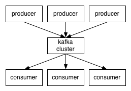
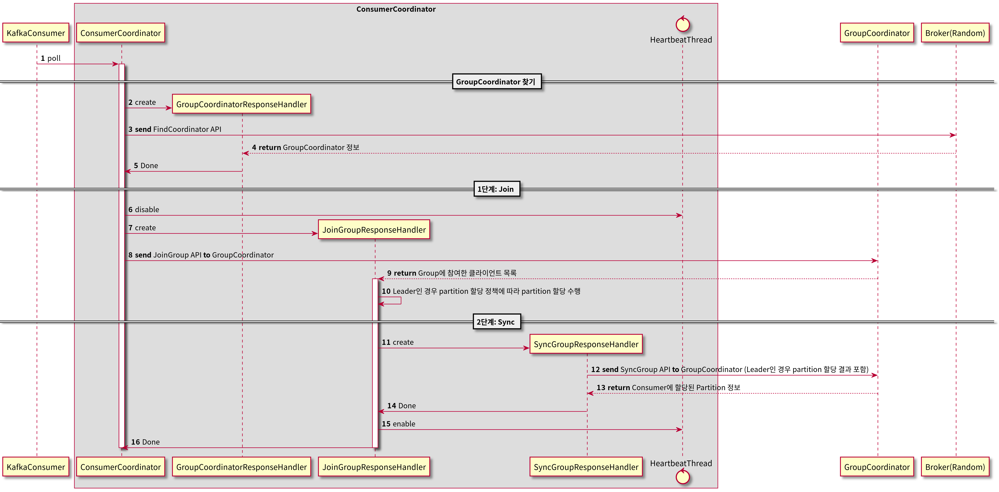
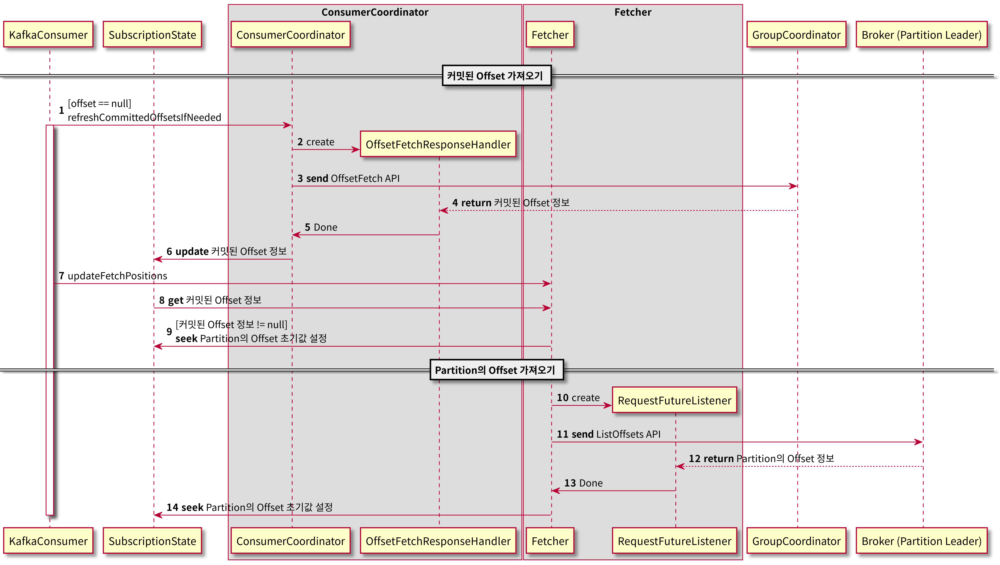
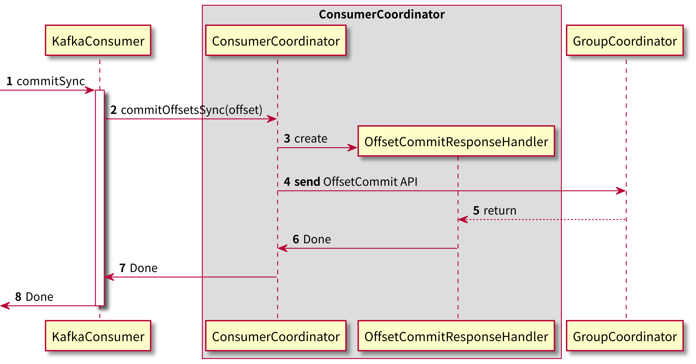

## KafkaConsumer Client 내부 동작 

Apache Kafka는 분산 스트리밍 플랫폼으로 성능이 뛰어나고 원하는 기간만큼 안정적으로 데이터를 저장할 수 있습니다. 
또한 브로커로 분산되어 있기 때문에 뛰어난 가용성과 내결함성을 보여줍니다.



Kafka는 TCP 위에서 동작하는 자체 바이너리 프로토콜을 사용합니다. 모든 바이너리 프로토콜은 요청과 응답의 쌍으로 이루어져 있습니다. 
Kafka 컨슈머도 마찬가지로 자체 바이너리 프로토콜을 적절히 구현하기 때문에 kafka 컨슈머의 내부 동작을 이해하면 kafka의 동작원리를 알 수 있을 것이라 생각합니다. 
그래서 이번 글에서는 kafkaConsumer Client의 동작과정에 대해 분석하고자 합니다. 

## KafkaConsumer의 Poll
KafkaConsumer는 사용자가 직접 사용하는 클래스입니다. KafkaConsumer의 poll 메서드를 사용해서 브로커에서 데이터를 가져올 수 있습니다.
```java
final Properties props = new Properties();  
props.put("bootstrap.servers", brokers);  
props.put("group.id", "testGroup");  
props.put("key.deserializer", "org.apache.kafka.common.serialization.ByteArrayDeserializer");  
props.put("value.deserializer", "org.apache.kafka.common.serialization.ByteArrayDeserializer");

// KafkaConsumer 생성
try (final KafkaConsumer<byte[], byte[]> consumer = new KafkaConsumer<>(props)) {  
    // 구독할 토픽
    consumer.subscribe(Arrays.asList("topic1"));

    // 무한 루프
    while (true) {
        // poll 메서드를 통해 데이터를 가져온다.
        final ConsumerRecords<byte[], byte[]> records = consumer.poll(100);
        for (final ConsumerRecord<byte[], byte[]> record : records) {
            // processing...
        }
    }
}
```

```group.id```에 컨슈머 그룹 Id를 입력하고 subscribe 메서드에 구독할 토픽을 입력한 후 poll 메서드를 호출합니다. 
poll 메서드를 사용하면 kafkaConsumer는 내부 구성 요소들과 협력하여 컨슈머 그룹에 참여한 후 브로커로부터 데이터를 가져옵니다. 

같은 ```group.id```를 사용하는 컨슈머를 묶어서 컨슈머 그룹이라고 합니다. 컨슈머 그룹을 통해서 kafka는 가용성 확보와 병렬 처리를 합니다. 만약 컨슈머 그룹 내에 특정 컨슈머의 처리가 일정 시간(```max.poll.interval.ms```) 보다 정지된다면 해당 컨슈머는 
컨슈머 그룹에서 제외되고 나머지 컨슈머들로만 데이터가 분배됩니다. 

만약 컨슈머 그룹의 처리량을 늘리고 싶다면 ```group.id```가 같은 새로운 kafkaConsumer를 만들어서 poll 메서드를 호출하면 됩니다. 
kafkaConsumer는 파티션을 할당 받아 처리하기 때문에 kafkaConsumer 수를 늘리면 컨슈머 그룹 내 데이터 처리가 확장됩니다. 하지만 파티션은 하나의 컨슈머에만 할당되기 때문에
컨슈머 그룹의 컨슈머가 파티션 갯수 보다 많다면 파티션 수를 초과한 컨슈머는 데이터를 처리하지 못합니다. 

Kafka는 리벨런스를 통해 컨슈머의 할당된 파티션을 다른 컨슈머로 이동시킵니다. 새로운 컨슈머가 추가되거나 컨슈머가 컨슈머 그룹에서 제외되면 리벨런스가 발생합니다. 
리벨런스는 아래의 과정으로 이루어집니다.
- GroupCoordinator 찾기
  - FindCoordinator API를 사용하여 JoinGroup 요청을 보낼 GroupCoordinator를 찾습니다.
- JoinGroup
  - KafkaConsumer들이 JoinGroup API를 사용하여 GroupCoorinator에게 그룹 참여 요청을 보내는 단계입니다. 
  - 가장 먼저 요청을 보낸 KafkaConsumer가 리더로 선정되고 파티션을 할당합니다.
- SyncGroup
  - 컨슈머 리더는 SyncGroup API로 파티션 할당 결과를 전달합니다. 
  - kafkaConsumer들이 SyncGroup API를 호출하여 파티션 할당 결과를 응답받습니다.  



## 오프셋 초기화
브로커에서 데이터를 읽기 위해서는 파티션의 초기 오프셋 값이 필요합니다. 



오프셋 초기화는 커밋된 오프셋을 가져오는 과정과 커밋된 오프셋이 없는 경우 오프셋 초기화 정책에 따라 오프셋을 초기화하기 위해 파티션의 오프셋을 가져오는 과정으로 이루어집니다. 
GroupCoordinator는 OffsetFetch API 응답으로 커밋된 오프셋 정보를 알려줍니다. ConsumerCoordinator는 커밋된 오프셋 정보를 SubscriptionState에 업데이트합니다.

### 파티션의 오프셋 가져오기 
만약 커밋된 오프셋 정보가 없다면 KafkaConsumer는 ```auto.offset.reset``` 설정에 따라 오프셋을 초기화합니다. 
- earliest: 파티션의 가장 처음 오프셋을 사용한다. 
- latest: 파티션의 가장 마지막 오프셋을 사용한다. 
- none: 오프셋을 초기화하지 않는다. 

## HeartBeat
컨슈머가 컨슈머 그룹에 등록되고 나서 등록을 유지하기 위해서는 일정 시간마다 heartBeat을 전송해야 합니다. 
아래는 관련 설정입니다. 
- heartbeat.interval.ms
  - HeartBeat 전송 시간 간격입니다. HeartBeat 스레드는 heartbeat.interval.ms 간격으로 HeartBeat을 전송합니다. 
  - heartbeat.interval.ms의 간격은 항상 session.timeout.ms 보다 작아야 합니다. 
- session.timeout.ms
  - session.time.out.ms 시간 내에 HeartBeat이 도착하지 않으면 브로커는 해당 컨슈머를 그룹에서 제외합니다. 
  - session.time.out.ms는 브로커의 설정 값인 group.min.session.timeout.ms와 group.max.session.timeout.ms 사이의 값이어야 합니다.  
- max.poll.interval.ms
  - poll 메서드는 max.poll.interval.ms 이내에 호출되어야 합니다. 
  - 만약 poll 메서드가 제한 시간 내에 호출되지 않으면 정상적이지 않은 컨슈머라 판단되어 컨슈머 그룹에서 제외됩니다.
  
## 오프셋 커밋 
kafka는 다른 메시지 서비스와 다르게 컨슈머가 오프셋 정보를 관리하기 때문에 데이터를 읽은 후 컨슈머는 적절한 시점에 오프셋을 커밋해야 합니다. 

만약 ```enable.auto.commit``` 설정이 ```true```인 경우 kafkaConsumer가 ```auto.commit.interval.ms```마다 자동으로 오프셋을 커밋합니다. 
자동 커밋 방식은 개발자가 직접 코드를 넣지 않아도 자동으로 커밋하기 때문에 편리합니다. 하지만 비정상적인 클라이언트 종료 등으로 데이터 누락이 발생할 수 있습니다. 이를 방지하기 위해서는 
수동으로 적절한 시점에 오프셋을 커밋해야 합니다. 



```commitSync``` 메서드를 사용하여 오프셋 커밋을 요청하면 kafkaConsumer가 오프셋 커밋 요청이 끝날 때까지 대기하기 때문에 kafkaConsumer가 일시 중지됩니다. 이를 방지하기 위해서는 ```commitAsync``` 메서드를 사용하여 비동기 커밋해야 합니다.

## Record 가져오기
Consumer 리벨런스와 오프셋 초기화 과정이 끝ㅌ나면 KafkaConsumer의 poll 메서드를 통해 브로커로부터 데이터를 가져올 수 있습니다. 
kafkaConsumer의 poll 메서드가 호출되면 먼저 Fetcher의 fetchRecords가 호출됩니다. fetchRecords 메서드는 내부 캐시를 확인하여 이미 가져온 데이터가 있는 경우에는 ```max.poll.records``` 설정 값만큼 레코드를 반환합니다. 
만약 브로커에서 가져온 데이터가 없는 경우에는 Fetcher의 sendFetches 메서드를 호출합니다.

Fetcher가 브로커로부터 응답을 받으면 KafkaConsumer는 Fetcher의 fetchRecords 메서드를 다시 호출하여 사용자에게 반환할 레코드를 가져옵니다. KafakConsumer는 레코드를 사용자에게 반환하기 전에 다음 poll 메서드 호출 시에 브로커로부터 응답을 대기하는 시간을 
없애기 위해 Fetcher의 sendFetches 메서드를 호출한 후 레코드를 반환합니다. 

sendFetches 호출시 요청되는 Fetch API 요청에는 다음 설정들이 사용됩니다. 
- fetch.max.wait.ms
  - 브로커가 Fetch API 요청을 받았을 때 fetch.min.bytes 값만큼 데이터가 없는 경우 응답을 주기까지 최대로 기다리는 시간입니다.
- fetch.min.bytes
  - Fetch API 요청이 왔을 때 브로커가 최소한 fetch.min.bytes 값만큼 데이터를 반환해야 합니다. 
  - 반환할 만큼 데이터가 충분하지 않다면 브로커는 데이터가 누적되길 기다립니다. 
- fetch.max.bytes
  - Fetch API 요청에 대해 브로커가 반환하는 최대 데이터 크기입니다. 
- max.partition.fetch.bytes
  - 브로커가 반환할 파티션당 최대 데이터 크기입니다. 

이상 kafkaConsumer의 동작에 대해 알아보았습니다. 
감사합니다. 