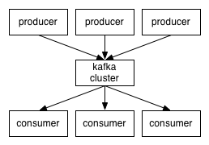
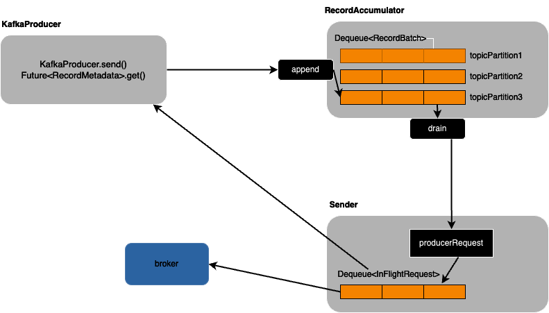
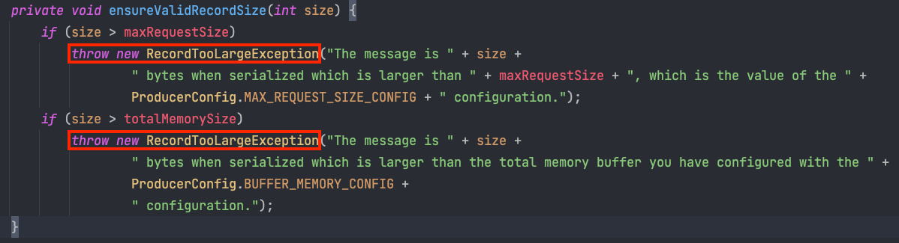
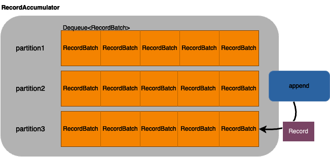
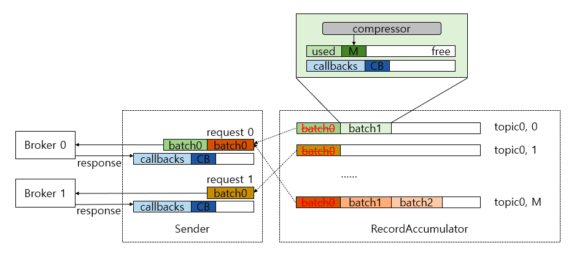

최근에 카프카 클라이언트인 KafkaProducer 내부를 분석했습니다. 

카프카는 분산 스트리밍 플랫폼으로 Producer와 Consumer가 연결되어 데이터가 전달됩니다.



이번 글에서는 Java Producer API인 KafkaProducer Client의 내부 구조를 설명하고, KafkaProducer의 주요 설정이 내부에서 어떻게 동작하는지 알아볼 것입니다. 
추가적으로 실제 코드를 함께 보면서 설명해보겠습니다. 

## KafkaProducer Client 구성요소
KafkaProducer Client는 크게 세 부분으로 이루어져 있습니다.

- kafkaProducer
  - 사용자가 직접 사용하는 부분입니다. send 메서드를 호출해서 Record를 전송합니다. 
- RecordAccumulator
  - KafkaProducer로 메세지를 send 했다고 바로 브로커로 전송되는 것은 아닙니다. 메세지는 내부의 배치 저장소에 파티션별로 잠시 저장되어 있다가, 배치 전송됩니다. 
  - RecordAccumulator는 배치 전송하기 전에 메세지를 저장합니다. 이후에 메세지들은 Sender에 의해 비동기적으로 브로커에 전송됩니다. 
- Sender
  - 실질적으로 메세지를 전송하는 부분입니다. 
  - Sender는 RecordAccumulator에 저장되어 있는 Record 들을 브로커로 전송하는 역할을 합니다.
  - 콜백이 설정되어 있다면 실행하고, 응답의 결과를 Future를 통해 반환합니다. 

아래는 KafkaProducer Client의 전체 구조를 간략하게 표현한 그림입니다. 


## KafkaProducer

send 메서드가 호출되면 KafkaProducer 내부에서는 Serialization, Partitioning, Compression의 과정을 거칩니다.

### Serialization
KafkaProducer에서는 카프카로 전달되는 Key, Value를 Byte Array 형태로 직렬화 합니다.

코드 상에선 아래와 같이 ```ProducerConfig```에 Key, Value를 직렬화 할 각각의 Serializer를 등록해줍니다. 
```java
@Bean
  public ProducerFactory<String, Object> producerFactory() {
      Map<String, Object> config = new HashMap<>();
      config.put(ProducerConfig.BOOTSTRAP_SERVERS_CONFIG, kafkaProperties.getBootstrapServers());
      config.put(ProducerConfig.VALUE_SERIALIZER_CLASS_CONFIG, StringSerializer.class);
      config.put(ProducerConfig.KEY_SERIALIZER_CLASS_CONFIG, StringSerializer.class);

      return new DefaultKafkaProducerFactory<>(config);
  }
```

String Serializer 이외에 다음과 같은 Serializer를 기본적으로 제공하고 있습니다. 
- ByteArraySerializer
-  ByteBufferSerializer
-  BytesSerializer
-  DoubleSerializer
-  IntegerSerializer
-  LongSerializer

### Partitioning

카프카에서는 배치 전송하기 전에 RecordAccumulator에 파티션 별로 저장됩니다. Partitioning 과정은 Record가 어느 파티션에 저장될지를 결정해주는 역할을 합니다. 

개발자가 직접 Partitioner를 지정해주지 않는다면 ```DefaultPartitioner```가 사용됩니다. 
```DefaultPartitioner```의 동작 방식은 아래와 같습니다. 
- Record의 Key값이 있는 경우, Key의 Hash 값을 이용해서 파티션을 결정합니다. 
- Record의 Key값이 없는 경우, 라운드 로빈 방식으로 파티션을 결정합니다. 

### Compression

사용자가 전송하려는 Record는 압축을 함으로써 네트워크 전송 비용도 줄일 수 있고 저장 비용도 줄일 수 있습니다. 
compression.type을 지정하면 압축 시 사용할 코덱을 지정할 수 있습니다. 만약 지정하지 않는다면 기본 값은 none 입니다. 
- gzip 
- snappy
- lz4

## RecordAccumulator

RecordAccumulator는 내부에 파티션 별로 Record를 저장합니다. 만약 serialization 이후의 size가 ```max.request.size``` 또는 ```buffer.memory``` 보다 크다면 ```RecordTooLargeException```이 발생합니다.



그리고 Record는 RecordBatch의 형태로 Deque에 저장됩니다. 아래는 RecordAccumulator의 내부 구조를 나타낸 그림입니다. 



RecordAccumulator의 append 메서드가 호출되면 파티션의 Deque를 찾습니다. 그리고 Deque의 마지막 부분에서 RecordBatch를 꺼내서 Record를 저장할 공간이 충분한지 확인합니다. 
만약 여유 공간이 있다면 해당 RecordBatch에 Record를 추가합니다. 여유 공간이 없다면 BufferPool에서 메모리를 할당 받아서 RecordBatch를 생성합니다. 

여기서 BufferPool의 크기는 ```buffer.memory``` 설정에 의해 결정됩니다. 그리고 RecordBatch의 크기는 ```batch.size```와 저장할 record 크기 중에서 더 큰 값으로 결정됩니다. 
만약 record size가 ```batch.size```보다 크다면 recordBatch에 record가 하나만 저장되고, record size가 ```batch.size``` 보다 작다면 recordBatch에 여러 record가 저장됩니다. 

## Sender

Sender 쓰레드는 RecordAccumulator에 저장된 Record를 꺼내서 Broker로 전송하고 Broker의 응답을 처리합니다. 
RecordAccumulator의 drain 메서드를 통해 브로커별로 전송한 RecordBatch 리스트를 얻을 수 있습니다.



drain() 에서는 먼저 각 Broker Node에 속하는 partition 목록을 얻어옵니다. 그리고 각 Node에 속한 partition을 보면서 Deque First 쪽의 RecordBatch를 하나 꺼내서 RecordBatch List에 추가합니다. 
이렇게 각 노드 별로 RecordBatch List가 ```max.request.size``` 가 넘지 않을 때까지 모읍니다. 모든 Node에 이 동작을 반복하면 Node 별로 전송할 RecordBatch List가 모입니다.

이렇게 각 노드별로 모인 recordBatch List는 producerRequest로 만들어집니다. 이 ```producerRequest``` 가 하나의 요청 단위가 됩니다. 그리고 이 producerRequest 는 InflightRequests라는 브로커별 Deque에 저장됩니다.

InflightRequests의 Deque 사이즈는 ```max.in.flight.requests.per.connection``` 설정값에 의해서 정해집니다. 이 값은 하나의 브로커에 동시에 전송할 수 있는 요청수를 의미합니다. 

```max.in.flight.requests.per.connection``` 1보다 크다면 카프카는 최소한 한번 전송을 보장하기 위해 재전송을 하기 때문에 
전송 실패 상황에서 순서가 바뀔 위험이 있습니다.
```max.in.flight.requests.per.connection```을 1로 설정한다면 순서는 보장되지만 브로커에 동시에 1번의 요청만 할 수 있기 때문에 전송 성능은 떨어집니다. 

ProducerRequest가 완료되면 요청에 포함되어 있던 모든 RecordBatch의 콜백을 실행하고, Broker로 부터 응답을 Future를 이용해서 사용자에게 전달합니다. 그리고 RecordBatch에서 사용한 ByteBuffer를 BufferPool로 반환하면서 Record 전송 처리가 모두 마무리됩니다. 

이상 카프카 클라이언트인 KafkaProducer Client의 내부 구조에 대해 이야기해 보았습니다. 내부 구조를 알아야 이슈 트래킹, 성능 커스텀 등 다양한 작업들을 할 수 있다고 생각합니다. 그래서 kafkaProducer 내부 분석이 의미있는 시간이었습니다.  
다음에는 KafkaConsumer Client의 내부 구조에 대해 포스팅 작성하겠습니다. 감사합니다.