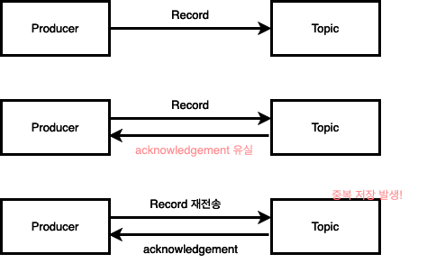
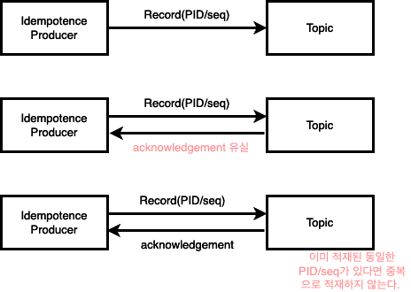
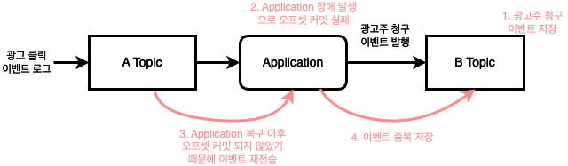
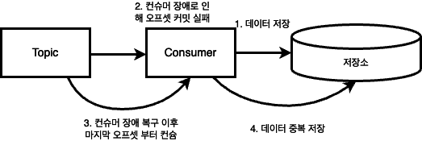
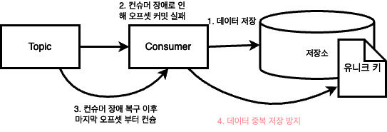
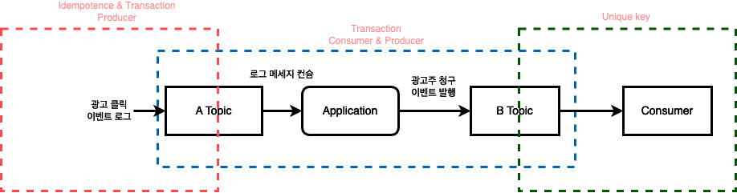

카프카는 이벤트 드리븐 아키텍처에서 중요한 역할을 수행합니다. 특히 카프카는 스트림 이벤트를 다루는데 특화되어 있으며, 실시간 데이터를 처리하는데 적합합니다. 

하지만 카프카는 데이터를 전달 받을 때 네트워크 통신을 통해 데이터를 전달받게 되기 때문에, 메시지 전달 신뢰성이 중요합니다. 만약 네트워크 문제로 메시지가 유실되거나, 중복된다면 서비스에 큰 지장을 줄 수도 있습니다.
카프카 역시 네트워크 문제에 있어 자유로울 수 없기 때문에, 신뢰성 있는 메세지 전송을 위해 다양한 기능을 제공합니다.

- 정확히 한 번 (Exactly-once)
  - 중복, 유실 없이 한 번만 전송하는 것을 의미합니다. 
- 적어도 한 번(At least once)
  - 최소한 한 번 전송하는 것을 의미합니다. 하지만 재전송을 통해 메세지가 중복 발행될 수 있습니다. 
- 최대 한 번(At most once)
  - 최대 한 번 전송하는 것을 의미합니다. 하지만 메세지 유실이 발생할 수 있습니다. 

## 멱등성 프로듀서 

카프카는 기본적으로 메세지 유실을 막기 위해 재전송을 제공합니다. 하지만 네트워크 문제로 인해 카프카에서 acknowledgement 전송이 늦어진다면 프로듀서는 메세지를 중복 전송할 수 있습니다. 



Producer 입장에서는 메세지가 제대로 kafka에 적재되었는지는 알 수 없기 때문에, ack 응답이 늦게 오면 적어도 한 번을 보장하기 위해 재전송하게 됩니다. 
카프카에서는 이처럼 중복으로 메세지가 저장되는 경우를 막기 위해 멱등성 프로듀서를 제공합니다. 그리고 Producer에서 이를 제공하는 방법은 쉽습니다. 

```java
config.put(ProducerConfig.BOOTSTRAP_SERVERS_CONFIG, kafkaProperties.getBootstrapServers());
config.put(ProducerConfig.VALUE_SERIALIZER_CLASS_CONFIG, StringSerializer.class);
config.put(ProducerConfig.KEY_SERIALIZER_CLASS_CONFIG, StringSerializer.class);
config.put(ProducerConfig.ENABLE_IDEMPOTENCE_CONFIG, true); // enable.idempotence true
```

카프카 Producer의 설정인 enable.idempotence를 true로 적용해주면 멱등성 프로듀서가 적용됩니다. 카프카 3.0 이후에는 기본적으로 멱등성 프로듀서가 true로 설정됩니다.
이렇게 멱등성 프로듀서가 적용되면 각각의 레코드에 대해서 PID와 메세지 sequence number를 가지고 있다가 중복 적재 요청이 오면, 이후에 요청된 중복 레코드는 적재하지 않습니다.



## 카프카 트랜잭션

어플리케이션을 만들다 보면 Topic에서 Topic으로 메세지를 전달해야 하는 상황도 생깁니다.  
예를 들면, 사용자의 광고 클릭 로그를 컨슘해서 이벤트를 다른 토픽으로 전달하는 애플리케이션이 있을 수 있습니다. 


하지만 만약 광고 클릭 로그를 컨슘해서 이벤트를 다른 토픽으로 전달하는 애플리케이션에서 이슈가 발생하면 이벤트의 중복이 발생할 수 있습니다. 컨슈머 역할을 하는 애플리케이션에서 커밋을 완료하기 전에 장애가 발생할 수 있기 때문입니다. 
위의 이미지에서는 B Topic에는 메세지가 저장되었는데, Application에서 장애가 발생해서 오프셋을 커밋하지 못한 상황이 발생한 것입니다.  



데이터를 처리했는지 알 수 있는 방법은 커밋된 오프셋을 읽는 방법 뿐이기 때문에 **중복을 막기 위해서는 오프셋 커밋과 레코드의 전달(프로듀스)를 하나로 묶어야만 합니다.**
이러한 중복 상황을 방지하기 위해서는 카프카에서 제공하는 정확히 한 번 전송 기능인 트랜잭션을 이용해야 합니다. 컨슈머와 프로듀서의 작업이 원자적으로 실행되어야 하기 때문입니다. 

즉, 프로듀서가 ack를 받아 작업이 완료되었다면 컨슈머도 오프셋을 커밋해야 합니다. 
만약 프로듀서의 작업이 실패하면, 컨슈머도 오프셋 커밋이 되지 않아야 합니다. 

아래 예제는 컨슈머와 프로듀서를 하나의 트랜잭션으로 묶어주는 예제입니다. 
```java
producerProps.put(TRANSACTIONAL_ID_CONFIG, "AD_TRANSACTION"); // 트랜잭션 프로듀서 옵션
producer.intiTransactions(); // 트랜잭션 프로듀서 초기화 
try {
    while(true) {
        ConsumerRecords<String, String> records = consumer.poll(ofSeconds(10));
		
		// records를 이용한 데이터 처리
        
        producer.beginTransaction();
		producer.send(new ProducerRecord<String, String>("다음 토픽", "처리가 완료된 이벤트"));
		
		// 컨슈머가 오프셋을 커밋하지 않고 프로듀서가 커밋을 수행한다. 
        // 그러므로 반드시 컨슈머의 enable.auto.commit은 false로 설정한다. 
        producer.sendOffsetsToTransaction(getRecordOffset(), CONSUMER_GROUP_ID);
		producer.commitTransaction();
    }	
} catch(KafkaException e) {
	producer.abortTransaction();
}
```

프로듀서가 ```beginTransaction``` 으로 트랜잭션을 시작한 이후, 레코드를 kafka로 전달합니다. 
그리고 컨슈머가 아닌 프로듀서가 오프셋을 커밋합니다. 그리고 마지막으로 프로듀서가 ```commitTransaction``` 으로 트랜잭션을 커밋합니다. 카프카 내부적으로는 트랜잭션 커밋된 메세지만 컨슘될 수 있습니다.  
이를 통해서 프로듀서의 작업이 완료되었는데, 컨슈머의 오프셋 커밋이 실패해서 메세지가 중복 되는 문제를 방지할 수 있습니다. 

그리고 중요한 것은 컨슈머와 프로듀서의 작업이 완료된 커밋된 메세지만 컨슈머에서 읽어야 합니다. 따라서 Consumer 에서도 커밋된 메세지만을 컨슘하기 위해 ```isolation.level```을 read_committed로 설정해주어야 합니다.


## 컨슈머의 중복 적재 방지 

데이터 중복 적재는 컨슈머에서도 일어날 수 있습니다. Consumer에 갑작스런 장애가 발생해서 오프셋 커밋을 하지 못한다면 저장소에 데이터를 중복 저장할 수 있기 때문입니다.  



이처럼 중복을 방지하는 멱등성 컨슈머를 구현하는 방법에 대해 알아보겠습니다. 

### 유니크 키 이용 
이를 해결하기 위해서는 유니크 키를 활용해볼 수 있습니다. 
대표적으로 mysql은 유니크 키를 제공해주기 때문에 중복된 레코드가 저장되는 것을 막을 수 있습니다.




## 정리 
신뢰성 있는 카프카 어플리케이션을 만들기 위해 3가지를 알아보았습니다. 첫번째는 멱등성 프로듀서, 두번째는 트랜잭션, 마지막은 멱등성 컨슈머였습니다.
각각의 방법이 적용되는 영역은 다음과 같습니다.



마지막으로 멱등성 프로듀서, 트랜잭션, 멱등성 컨슈머는 현재 서비스에서 필수적으로 필요한지 고려해보고 적용하는 것이 중요합니다. 그리고 어느 정도의 전달 신뢰성을 보장해야 하는지에 대해 고민이 필요합니다. 
만약 데이터 중복이 발생해도 큰 문제가 발생하지 않는 기능은 굳이 위의 방법을 모두 이용할 필요는 없을 것입니다.   

### Reference
[https://www.youtube.com/watch?v=7_VdIFH6M6Q](https://www.youtube.com/watch?v=7_VdIFH6M6Q)