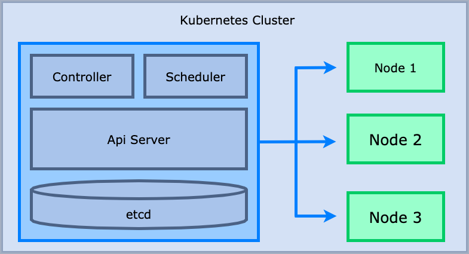
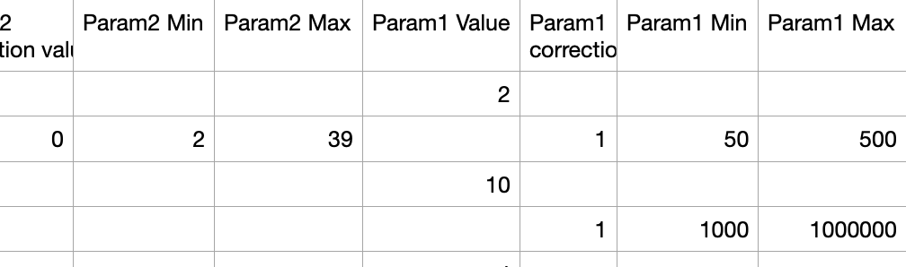

최근에 쿠버네티스를 많이 사용해 보면서 쿠버네티스 아키텍처에 대해 정리를 할 필요성을 느꼈습니다. 단순히 사용법을 아는 것보다, 내부적으로 어떻게 돌아가는지를 알아야 문제 상황에서 더 잘 대응할 수 있을 것이라 생각했기 때문입니다. 

쿠버네티스의 전체적인 아키텍처는 아래와 같습니다.



여기서 kubectl로 쿠버네티스에 pod 생성요청을 했다고 가정해봅시다. 
```bash
kubectl create deploy web --image=hub.example.com/nginx
```
위의 명령어로 쿠버네티스에 요청하면 어떤 일이 발생할까요? 
제일 처음으로 Kubectl의 요청은 쿠버네티스의 api 서버에 도달합니다. 
