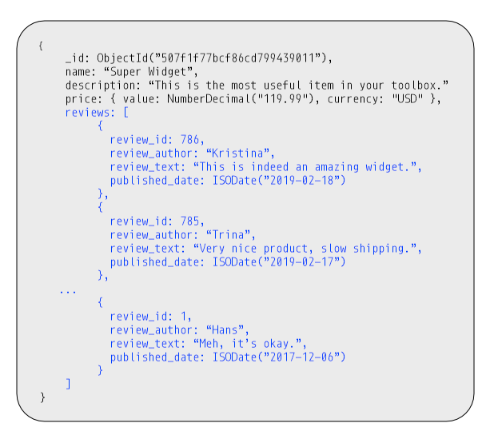
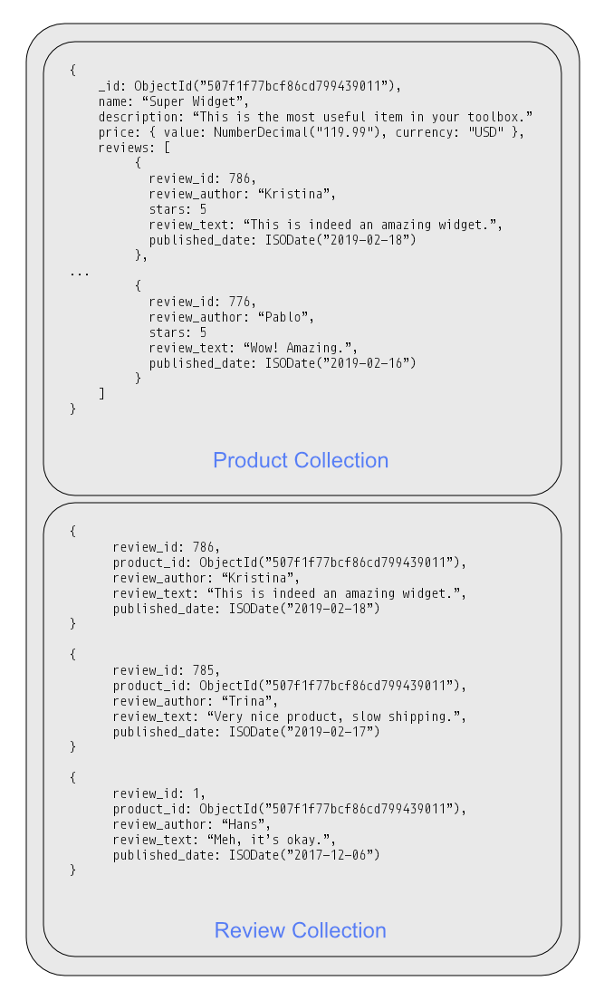

이번글에서는 mongodb의 데이터 모델링에 대해 알아보고자 합니다.
공식 도큐먼트에 설명된 방식에 따르면 크게 두가지 방식이 있습니다.. 

- Embedded Data
- References

## Embedded Data

먼저 Embedded Data 모델입니다. 이 방식에서는 도큐먼트 안에 연관된 도큐먼트를 함께 저장합니다. 연관된 도큐먼트는 배열 형태이거나, 서브 도큐먼트 형태가 됩니다.

유저 컬렉션에 들어가는 도큐먼트에 대한 예시입니다. 
```json
{
  "_id": <ObjectId>,
  "username": "123xyz",
  "contact": {
    "phone": "123-456-7890",
    "email": "xyz@example.com"
  },
  "address": [
    {
      "city": "seoul",
      "zipCode": "123-456"
    },
    {
      "city": "tokyo",
      "zipCode": "abc-789"
    }
  ]
}
```

위의 도큐먼트에서 ```contact```, ```address``` 속성은 각각 서브 도큐먼트와 배열을 값으로 가지고 있습니다. 
이 모델은 애플리케이션 서버에서 한번의 호출로 많은 정보를 가져올 수 있기 때문에 API는 단순한 호출이라는 이점이 있습니다. 
다만 도큐먼트의 사이즈가 커질 수 있습니다. 도큐먼트의 크기가 커지면 working set의 크기가 커져 메모리에 부담을 줄 수 있습니다. 또한 이 방식은 데이터의 중복이 많아지게 되는데, 이는 중복 데이터에 변경이 발생하면 데이터의 일관성을 유지하기 어렵게 만듭니다.

## References

이 모델은 참조해야 할 key만 가지는 모델입니다. 아래 샘플을 보시 듯 곡의 앨범은 앨범ID만 가지고 곡의 아티스트 리스트는 아티스트ID만 가집니다. 
```json
{
    "_id" : ObjectId("5e13540a7c1cd06c3ea596e9"),
    "track_id" : NumberLong(3001),
    "track_nm" : "track title",
    "disk_id" : 1,
          .
          .
          .
    "create_dtime" : ISODate("2019-03-29T12:44:26.000Z"),
    "album" : NumberLong(2001),
    "artist_list" : [
          NumberLong(1001), 
          NumberLong(1002), 
          NumberLong(1003)
    ]
          .
          .
          .
}

```

Reference 모델의 특징은 도큐먼트가 Embedded Data 방식에 비해 가볍고 갱신에 대한 부담이 없습니다. 다만 애플리케이션은 참조하는 대상만큼 쿼리를 호출해야 합니다. 즉 위의 사례에서는 하나의 곡을 조회하기 위해 곡, 아티스트, 앨범 collection에 대해 총 3번 조회해야 합니다.


위의 사례에서 볼 수 있듯이, Embedded Data 방식과 Reference 방식은 서로 상충되는 관계입니다. 
Embedded Data 방식은 조회 성능이 좋지만, 업데이트를 희생합니다. 반면 Reference 방식은 업데이트가 효과적이지만, 조회 성능을 희생합니다. 

이러한 두 방식의 장점을 어느 정도 만족하는 방식이 Subset pattern입니다. 

## Subset pattern 
도큐먼트에 필요한 모든 정보를 저장하면, 조회성능은 분명히 좋아질 것입니다. 하지만 이 방식의 문제는 도큐먼트의 크기가 무한정 커질 수 있다는 점입니다. 
MongoDB는 자주 엑세스하는 데이터를 RAM에 보관합니다. 데이터 및 인덱스의 작업에 대한 메모리가 물리적 RAM 보다 커지면 스왑영역을 사용하면서 디스크 I/O가 발생하고 이는 성능에 안좋은 영향을 끼치게 됩니다.

Subset pattern은 도큐먼트에서 가장 접근이 활발한 데이터만 함께 저장합니다. 따라서 조회성능을 어느정도 유지하면서, 도큐먼트의 크기가 커지는 것을 막을 수 있습니다.
Embedded Data 방식에서는 연관된 데이터를 모두 하나의 도큐먼트에 저장하는 것이 문제였습니다. 하지만 Subset pattern 에선 자주 사용되는 데이터만 도큐먼트에 함께 저장하여 Embedded Data와 Reference 방식의 좋은 점을 혼합했습니다. 

이런 Subset pattern을 적용하기 좋은 사례가 상품과 리뷰입니다. 상품 도큐먼트에는 최신 10개의 리뷰를 함께 저장하고, 오래된 리뷰는 리뷰 컬렉션에 저장합니다.



Subset pattern에선 자주 사용되지 않는 데이터는 다른 컬렉션에 나누어 저장합니다.
한 컬렉션에는 가장 자주 사용되는 데이터가 있고 다른 컬렉션에는 덜 자주 사용되는 데이터가 있습니다. 이는 1-N 관계, N-N 관계 모두에서 사용될 수 있습니다.

Subset pattern은 필요하지 않은 문서 내부에 많은 양의 데이터가 있을 때 매우 유용합니다. 제품 리뷰, 기사 댓글 등이 모두 이 패턴의 사용 사례입니다. 도큐먼트 크기로 인해 Working Set 크기가 압박을 받고, RAM 용량을 초과하는 것을 방지하기 위해서 Subset pattern을 고려해야 합니다.  




## 다양한 패턴 

MongoDB의 모델을 구현하는데에는 Subset pattern 이외에도 다양한 패턴들이 있습니다.
- Attribute pattern
- Computed pattern
- Bucket pattern 
- Extended Reference Pattern 
- Approximation patter
- Tree pattern 

## Attribute pattern 

Attribute 패턴은 유사한 속성을 가진 필드를 위한 인덱스를 제공합니다. 영화 컬렉션이 있다고 가정해봅시다. 
이 컬렉션에는 국가별로 출시 날짜를 필드로 가지고 있다고 가정해보겠습니다.

```json
{
  "title": "Star Wars",
  "director": "George Lucas",
  ...
  "release_US": ISODATE("1977-05-20T01:00:00+01:00"),        
  "release_France": ISODATE("1977-10-10T01:00:00+01:00"),        
  "release_Italy": ISODATE("1977-12-03T01:00:00+01:00"),        
  "release_UK": ISODATE("1978-01-03T01:00:00+01:00")        
}
```

위의 사례에서 만약 출시일을 검색하려면 한 번에 여러 필드를 살펴봐야 합니다. 개봉일을 신속하게 검색하려면 영화 컬렉션에 대한 여러 인덱스가 필요합니다. 
즉, 필드 하나당 하나의 인덱스가 필요합니다.

```json
{"release_US": 1}
{"release_France": 1}
{"release_Italy": 1}
```

Attribte 패턴을 사용하면 이 정보 하위 집합을 배열로 이동하고 인덱싱 요구 사항을 줄일 수 있습니다. 즉 하나의 인덱스를 이용하여 조회할 수 있도록 키-값 데이터로 변경하여 배열에 넣습니다. 

```json
{
    title: "Star Wars",
    director: "George Lucas",
    …
    releases: [
        {
        location: "USA",
        date: ISODate("1977-05-20T01:00:00+01:00")
        },
        {
        location: "France",
        date: ISODate("1977-10-19T01:00:00+01:00")
        },
        {
        location: "Italy",
        date: ISODate("1977-10-20T01:00:00+01:00")
        },
        {
        location: "UK",
        date: ISODate("1977-12-27T01:00:00+01:00")
        },
        … 
    ],
    … 
}
```
각 필드의 공통 속성인 'location'과 'date'를 이용하여 인덱스를 만들 수 있습니다. 최소한의 인덱스로 데이터에 접근하는 것이 가능해졌습니다.  
```json
{ "releases.location": 1, "releases.date": 1}
```
Attribute 패턴은 날짜, 위치와 같은 공통 속성을 가진 필드가 여러개 있을 경우 적합합니다. 문서당 유사한 많은 필드를 대상으로 최소한의 인덱스만을 이용할 수 있습니다.

## Bucket 패턴 

만약 일정 시간 동안 데이터가 스트림으로 들어올 때마다, 그대로 저장하는 경향이 있습니다. 
```json
{
   sensor_id: 12345,
   timestamp: ISODate("2019-01-31T10:00:00.000Z"),
   temperature: 40
}

{
   sensor_id: 12345,
   timestamp: ISODate("2019-01-31T10:01:00.000Z"),
   temperature: 40
}

{
   sensor_id: 12345,
   timestamp: ISODate("2019-01-31T10:02:00.000Z"),
   temperature: 41
}
```

하지만 그보다 특정 시간에 해당하는 집계된 데이터를 구하고 싶을 수 있습니다. 예를 들면 '1시간 마다', '1일 마다' 등 시간별로 묶어진 데이터가 필요하다면 bucket 패턴이 적합합니다. 
그리고 시간대 별로 만들어진 버킷에 집계된 데이터를 저장할 수 있습니다. 

```json
{
    sensor_id: 12345,
    start_date: ISODate("2019-01-31T10:00:00.000Z"),
    end_date: ISODate("2019-01-31T10:59:59.000Z"),
    measurements: [
       {
       timestamp: ISODate("2019-01-31T10:00:00.000Z"),
       temperature: 40
       },
       {
       timestamp: ISODate("2019-01-31T10:01:00.000Z"),
       temperature: 40
       },
       … 
       {
       timestamp: ISODate("2019-01-31T10:42:00.000Z"),
       temperature: 42
       }
    ],
   transaction_count: 42,
   sum_temperature: 2413
} 
```

이렇게 특정 시간대의 데이터를 버킷에 저장하면 생기는 이점은 아래와 같습니다. 
- 도큐먼트 갯수의 감소로 인한 인덱스 성능 향상 
- 조회시 특정 시간대의 집계 데이터를 계산 없이 사용

일반적으로 '2019-01-11 11:00:00' 에 날씨가 어땠는지 보다, '11시-12시'의 평균 날씨가 어땠는지가 더 중요한 점에서 bucket 패턴이 다양한 곳에서 사용될 수 있습니다.

## Computed 패턴