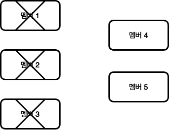
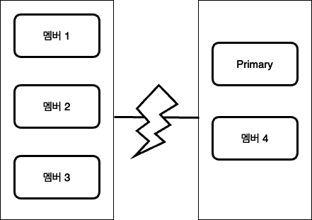

이번 글에서는 MongoDB의 복제 셋에 대해 이야기해보고자 합니다. 복제 셋은 MongoDB의 고가용성을 높여줍니다. 복제 셋을 설정하면 MongoDB는 프라이머리 서버 한 대와, 프라이머리 데이터의 복사본을 갖는 세컨더리 여러 대로 이루어집니다. 
그렇다면 복제 셋은 왜 필요할까요? 어플리케이션을 운영하다 보면 얘기치 못한 이슈로 인해 서버가 죽는 일이 많이 발생합니다. 이 때 만약 단일 서버라면 서비스에는 큰 장애가 발생하게 될 것입니다. 복제 셋은 이러한 상황에서 지속적으로 서비스가 운영될 수 있도록 합니다. 

기본적으로 Primary에만 읽기와 쓰기를 할 수 있습니다. 만약 Secondary에 읽기를 허용한다면 읽기가 가능합니다.   

## 복제 셋 설계 방법

복제 셋에서 중요한 개념은 복제 셋에 과반수 멤버가 있어야만 Primary가 유지될 수 있습니다. 
만약 복제 셋에 멤버가 다섯 개인데, 그 중 세개가 다운된다고 가정해보겠습니다. 그렇다면 멤버는 두개로 과반수에 미치지 못합니다. 따라서 Primary는 유지되지 못하고 Secondary로 강등됩니다. 



물론, 남은 두 멤버로 프라이머리를 선출할 수도 있을 것입니다. 하지만 이렇게 구현된 이유는 Primary가 두개 이상이 되는 것을 막기 위함입니다. 
만약 아래와 같이 네트워크 파티션이 구성되어 있다고 가정해보겠습니다. 



위의 상황에서 데이터 센터간 네트워크 통신에 장애가 발생한다면, 멤버1, 멤버2, 멤버3이 새로운 Primary를 선출할 수도 있습니다. 이렇게 되면 두개의 Primary로 인해 쓰기 충돌이 발생할 수도 있습니다. 따라서 이런 상황을 방지하기 위해 멤버가 과반수가 아니라면 Primary는 Secondary로 변경됩니다. 

## 어떻게 선출하는가?

Primary에 장애가 발생하면, Secondary 중에서 새로운 Primary를 선출합니다. 이 때 아래와 같은 항목을 토대로 검사를 수행합니다. 
- 요청받은 멤버가 프라이머리에 도달할 수 있는가?
- 선출되고자 하는 멤버의 복제 데이터가 최신인가?
- 대신 선출돼야 하는 우선순위가 더 높은 멤버는 없는가?

만약 특정 멤버에 더 높은 우선 순위를 부여한다면, 어떻게 될까요? 
server-4는 우선순위가 1.5이고 다른 멤버들은 1이라고 가정하겠습니다. 
```
> rs.add({"host" : "server-4:27017", "priority" : 1.5})
```

처음에는 가장 최신의 데이터를 가진 Secondary가 Primary가 됩니다. 하지만 server-4가 최신 데이터로 동기화 되면, 현재의 프라이머리는 자동으로 프라이머리의 자격을 내려좋고 server-4가 프라이머리로 선출됩니다. 

## 동기화 

MongoDB는 Primary에서 작성한 oplog를 이용해 데이터 복제를 수행합니다. 어떤 멤버든지 다른 멤버에 대한 동기화 소스로 사용되도록 합니다. 즉, 꼭 Primary 로부터만 복제를 수행하지 않기 때문에, Secondary도 oplog를 가지고 있습니다.  

oplog의 중요한 특징은 아래와 같습니다. 
- 제한 컬렉션에 저장되어서, 한정된 크기를 갖는다. 
  - 제한 컬렉션에 저장되는 특징으로 인해, 만약 개별 oplog가 커지거나 많아지면 oplog의 보관기간이 짧아지게 됩니다. oplog를 이용해서 Secondary를 복구하는 용도로 쓴다면, oplog의 보관기간이 짧아져 오래된 oplog가 삭제되어서 복구할 수 없게 될 수도 있습니다.
- 기본적으로 oplog 연산은 여러 번 재생해도 한 번 재생할 때와 같은 결과를 얻습니다. 즉 멱등합니다.
- oplog는 쓰기 연산이 시스템에 적용될 때와 비슷하게 공간을 차지합니다. 
  - 따라서, 저장하는 도큐먼트의 크기가 커지면 oplog의 크기가 커지면서, oplog의 보관기간이 짧아질 수 있습니다. 
- 삭제나 다중갱신처럼 여러 도큐먼트에 영향을 미치는 연산은 영향 받는 도큐먼트 개수당 하나씩 oplog 연산으로 분할됩니다. 
  - 만약 100만 개의 도큐먼트에 영향을 주는 작업이라면, oplog가 100만개 증가합니다. 따라서 여러 도큐먼트에 영향을 주는 작업도 oplog의 보관기간을 짧게 만듭니다. 

## 롤백 


