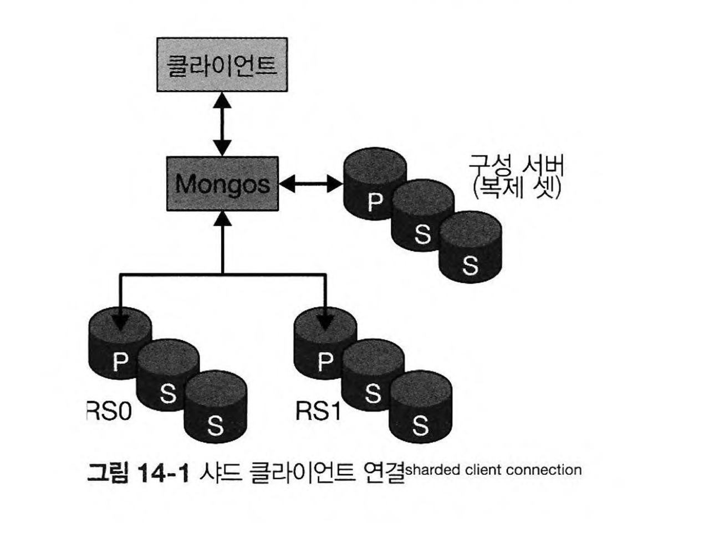

이번 글에서는 MongoDB의 샤딩에 대해 글을 작성해보고자 합니다. 

몽고DB에서 샤딩은 다양한 용도로 사용합니다. 
- 더 자주 사용하는 데이터를 성능이 더 좋은 하드웨어에 배치 
- 데이터셋을 분할해 주로 접근하는 애플리케이션 서버와 가까운 위치에 컬렉션 배치 

물론 주요한 목적은, 데이터 셋을 각 샤드에 분할하여 저장함으로써 읽기와 쓰기에 대한 부하를 분산하는 것입니다. 
몽고DB는 다른 RDMBS와 달리 분산을 자동화 합니다. **즉 몽고DB 내부에서 샤딩을 처리하기 때문에, 애플리케이션 입장에서는 하나의 장비처럼 보입니다.** 
이런 이유로 서버를 추가하고 제거하기 쉽고 이는 확장성이 좋음을 의미합니다. 

## 클러스터 구성 요소 

클러스터의 구성 요소는 다음과 같습니다. 
- Mongos
  - mongos는 구성 서버에 있는 라우팅 테이블을 이용해서 요청을 라우트합니다. 라우터는 데이터가 어느 샤드에 있는지 알기 때문에 요청을 적절한 샤드로 전달할 수 있습니다. 요청에 대한 응답이 있으면 라우터는 응답을 수집하고 통합합니다.
- 구성서버 
  - 라우팅 테이블을 가지고 있어서, Mongos는 구성 서버의 라우팅 테이블을 이용해서 샤드에 접근합니다. 
- 샤드(복제 셋)



샤드를 적용하는 방법은 셸에서 아래의 명령어를 입력합니다.
```
> sh db.users.createIndex({"username" : 1})
> sh.shardCollection("accounts.users", {"username": 1})
```
먼저 샤드키를 적용하려는 필드에 대해서 인덱스를 먼저 적용해야 합니다. 
그리고 shardCollection 으로 'accounts' 데이터베이스의 'users' 컬렉션에 샤드를 적용합니다. 샤드키는 "username"으로 지정됩니다.

## 데이터 샤딩 

shardCollection은 컬렉션을 청크로 나눕니다. 
mongos는 샤드 키가 주어지면 도큐먼트를 어디서 찾을지 항상 알아야 합니다. 