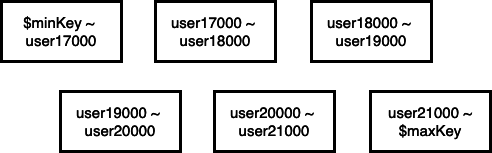

이번 글에서는 MongoDB의 샤딩에 대해 글을 작성해보고자 합니다. 

몽고DB에서 샤딩은 다양한 용도로 사용합니다. 
- 더 자주 사용하는 데이터를 성능이 더 좋은 하드웨어에 배치 
- 데이터셋을 분할해 주로 접근하는 애플리케이션 서버와 가까운 위치에 컬렉션 배치 

물론 주요한 목적은, 데이터 셋을 각 샤드에 분할하여 저장함으로써 읽기와 쓰기에 대한 부하를 분산하는 것입니다. 
몽고DB는 다른 RDMBS와 달리 분산을 자동화 합니다. **즉 몽고DB 내부에서 샤딩을 처리하기 때문에, 애플리케이션 입장에서는 하나의 장비처럼 보입니다.** 
이런 이유로 서버를 추가하고 제거하기 쉽고 이는 확장성이 좋음을 의미합니다. 

## 클러스터 구성 요소 

클러스터의 구성 요소는 다음과 같습니다. 
- Mongos
  - mongos는 구성 서버에 있는 라우팅 테이블을 이용해서 요청을 라우트합니다. 라우터는 데이터가 어느 샤드에 있는지 알기 때문에 요청을 적절한 샤드로 전달할 수 있습니다. 요청에 대한 응답이 있으면 라우터는 응답을 수집하고 통합합니다.
- 구성서버 
  - 라우팅 테이블을 가지고 있어서, Mongos는 구성 서버의 라우팅 테이블을 이용해서 샤드에 접근합니다. 
- 샤드(복제 셋)


샤드를 적용하는 방법은 셸에서 아래의 명령어를 입력합니다.
```
> sh db.users.createIndex({"username" : 1})
> sh.shardCollection("accounts.users", {"username": 1})
```
먼저 샤드키를 적용하려는 필드에 대해서 인덱스를 먼저 적용해야 합니다. 
그리고 shardCollection 으로 'accounts' 데이터베이스의 'users' 컬렉션에 샤드를 적용합니다. 샤드키는 "username"으로 지정됩니다.

## 데이터 샤딩 

shardCollection 명령어는 컬렉션을 샤드키를 이용해서 청크로 나눕니다. 
아래의 그림에서 $minKey는 음의 무한대를 의미하고, $maxKey는 양의 무한대를 의미합니다. 따라서 샤드 키 값은 항상 $minKey와 $maxKey 사이에 있습니다.  



이렇게 나누어진 청크들은 각 샤드에 분배되어 저장됩니다. 이렇게 분배되어 저장되기 때문에 샤드 키를 이용하지 않는다면 mongos는 모든 샤드에 접근해서 데이터를 수집해야 합니다. 샤드 키를 포함하며 단일 샤드나 샤드 서브셋으로 보낼 수 있는 쿼리를 타켓 쿼리라고 합니다. 
모든 샤드로 보내야 하는 쿼리는 분산-수집 쿼리라고 합니다. 보통 어플리케이션에서는 빠른 응답시간이 중요하기 때문에 샤드키를 이용해서 빠르게 데이터를 조회하고 반환하는 것이 중요합니다. 

컬렉션이 분할된 청크는 항상 하나의 샤드에 위치합니다. 그리고 청크가 어느 샤드에 저장되어 있는지에 대한 정보는 구성 서버의 컬렉션에 저장됩니다. Mongos는 구성 서버의 청크 컬렉션을 참고해서 특정 범위의 데이터에 대해 조회를 할 때 필요한 샤드에만 접근해서 데이터를 읽을 수 있습니다. 

## 청크 이동 

만약 특정 청크에 쓰기가 발생하면 어떻게 될까요? 특정 청크의 크기가 커질 것입니다. 만약 제거를 수행하면 청크의 크기가 작아질 것입니다. 