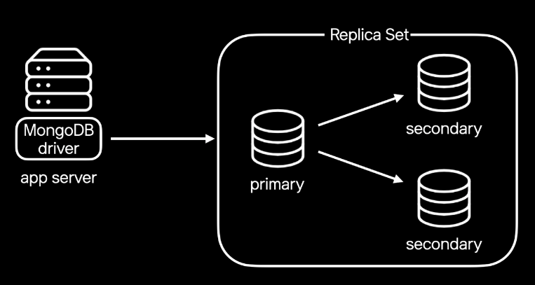
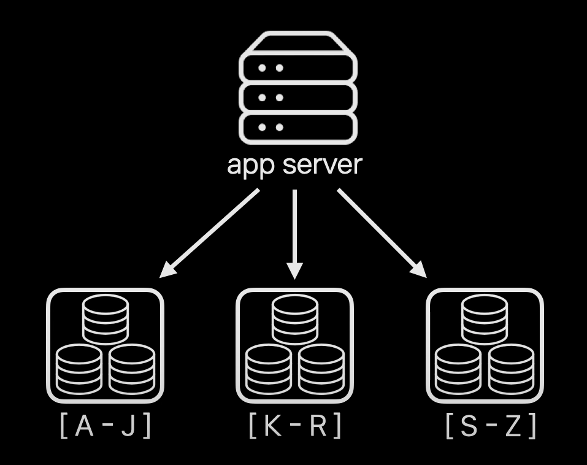
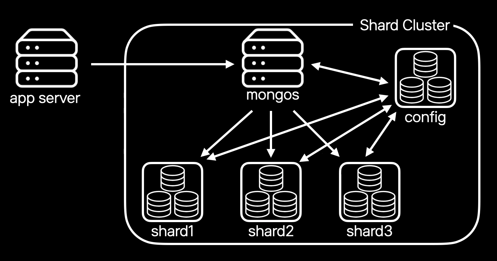
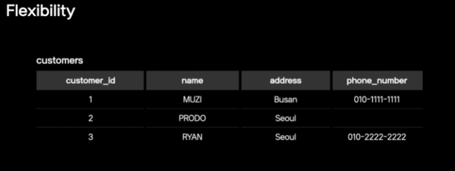
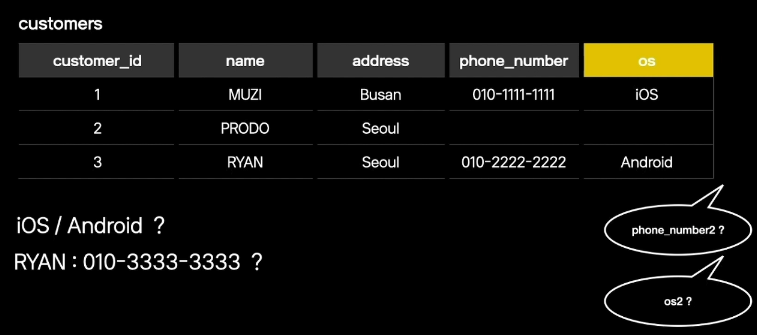
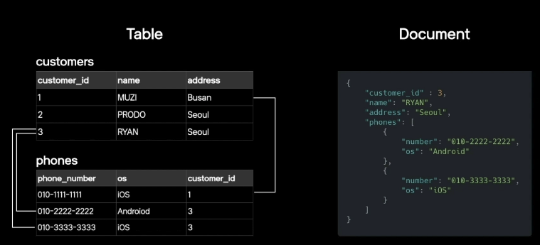
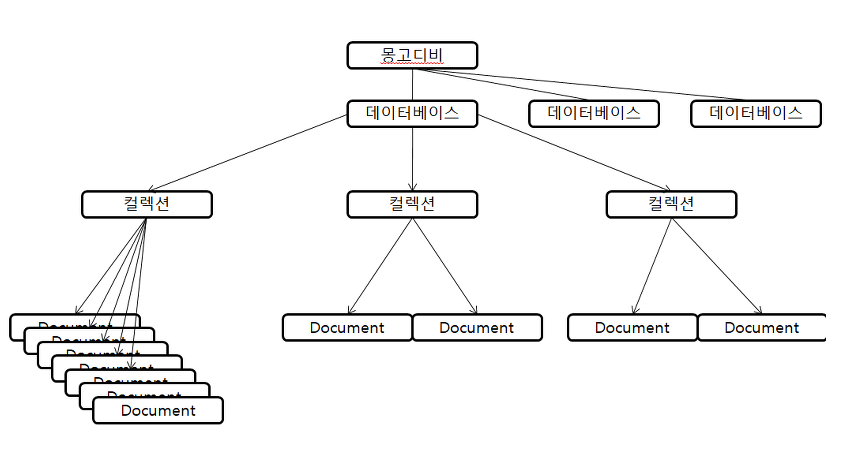
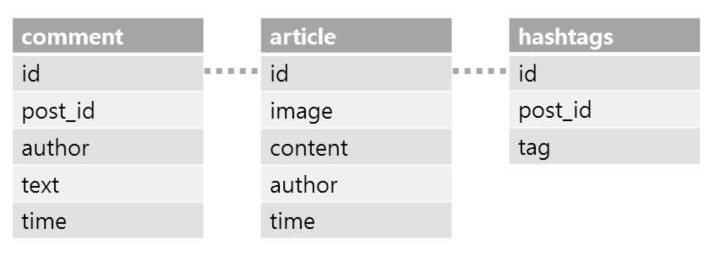

## NoSQL은 무엇인가?

NoSQL은 반정규화에 의한 설계를 기본으로 하기 때문에 빠른 조회속도가 특징입니다. 하지만 반정규화로 중복된 데이터를 저장하기 때문에 RDBMS에 비해 용량이 증가하고, 데이터 변경시 일관성을 유지하기가 힘듭니다. 
또한 비정형화 스키마가 구조이기에 다양한 종류의데이터가 추가되어도 스키마 변경 과정이 필요없습니다.

아래는 NoSQL과 RDBMS를 비교한 표입니다.  

| 항목       | NoSQL                                                 | RDBMS                                                                                           |
|----------|-------------------------------------------------------|-------------------------------------------------------------------------------------------------|
| 데이터 모델   | - 반정규화에 의한 설계가 기본<br/> - 비정형화 스키마 구조로 미리 스키마를 선언하지 않음 | - 엔티티 및 각 엔티티 간 관계를 정의한다.<br/> - 엔티티 정의 시 정규화하여 설계한다.<br/> - 테이블, 칼럼 등 DB 요소에 대한 스키마를 엄격히 관리한다. |  
| 장점       | 쿼리 프로세싱이 단순화되어 대용량 처리 성능이 향상됨                         | 정규화로 인해 데이터 중복이 최소화 되기 때문에 용량이 최소화 되고, 데이터 일관성을 유지하기 쉽다.                                        | 
| 단점       | 데이터를 중복 저장에 의해 용량이 증가하고 데이터 일관성을 유지하기 어렵다.            | 조인이 복잡한 경우 쿼리 프로세싱도 복잡해져 성능이 저하됨                                                                |


## MongoDB란

MongoDB는 NoSQL 데이터베이스 중 대표격이라고 말할 정도로 가장 많이 쓰이는 NoSQL입니다. 
MongoDB는 기존 RDBMS와 달리 문서 지향 데이터 모델을 사용합니다. 

MongoDB만의 장점과 특징은 다음과 같습니다. 
- 신뢰성(Reliability)
- 확장성(Scalability)
- 유연성(Flexibility)
- 인덱스 지원(Index Support)


### 신뢰성(Reliability)

MongoDB는 서버 장애에도 서비스는 지속할 수 있습니다. Primary와 Secondary로 구성된 ReplicaSet 구조로 고가용성을 지원하기 때문입니다. 



Primary는 데이터 쓰기 요청을 처리하고, Secondary는 Primary의 데이터를 복제합니다. 
이렇게 데이터를 복제함으로써 Primary 서버에 장애가 생기더라도 데이터를 유지할 수 있습니다. 

만약 Primary 서버에 문제가 생긴다면, Primary의 데이터를 가지고 있는 Secondary가 Primary로 전환되어 서버를 계속 유지시킵니다. 
그리고 다시 빈 Secondary 서버를 몽고디비가 복구 시켜줌으로서 서버를 유지할 수 있습니다.


### 확장성(Scalability)

MongoDB는 데이터와 트래픽이 증가함에 따라 수평확장이 가능합니다. 
데이터가 증가하여 더이상 하나의 Replica Set에 담을 수 없게 된다면, MongoDB는 데이터를 샤딩하여 분산시킵니다. 



샤딩과정은 서비스 중단없이 온라인으로 진행됩니다. 만약 특정 샤드에 데이터가 몰리면, 다른 샤드로 분산시켜 모든 샤드가 균등하게 데이터를 저장할 수 있도록 합니다. 
이러한 과정을 벨런싱이라고 합니다. 

특히 MongoDB는 서버 내부에서 샤딩을 지원해주기 때문에, Application Server에서는 단순하게 MongoDB에 접근할 수 있게 해줍니다.
아래의 그림은 MongoDB의 구성도입니다. 



각 데이터는 shard1, shard2, shard3에 저장됩니다. config 서버는 데이터가 어느 샤드에 있는지를 알고있습니다. 
그래서 mongos 서버는 Application Server로부터 특정 데이터에 대한 요청을 받으면 config 서버와 통신합니다. 그리고 config 서버는 mongos 서버에 데이터가 어느 샤드에 있는지를 알려줍니다.
따라서 Shard Cluster 외부의 Application Server는 Shard Cluster 내부의 동작에 대해서는 알 필요 없이 mongos를 통해서만 데이터에 접근할 수 있습니다. 이는 Shard Cluster의 변경사항과 무관하게 Application Server의 접근을 단순하게 만들어줍니다. 

### 유연성(Flexibility)

MongoDB는 여러가지 형태의 데이터를 손쉽게 저장할 수 있습니다. 그리고 서비스 요구사항에 맞춰 다양한 종류의 데이터가 추가되어도 스키마 변경 과정 없이 필요한 데이터를 바로 저장하고 읽을 수 있습니다. 
예를들어 날짜를 저장하고 싶은데 테이블에 날짜 관련 칼럼이 없다면 RDBMS는 따로 필드를 추가해야 하는 테이블 조작이 필요합니다. 



만약 위의 RDBMS 테이블에 핸드폰 OS 종류를 구분해야한다면, RDBMS에서 새로운 칼럼을 추가해야 할 것입니다.
그런데 RUAN이라는 사람이 또 휴대폰을 구매하면 어떻게 해야할까요? 새로운 칼럼을 추가해야 할 것입니다.



하지만 MongoDB는 Schema가 없기 때문에 위와 같은 데이터 변경에 유연하게 대처할 수 있습니다. 이는 MongoDB가 JSON 기반에 Document 모델을 사용하기에 가능합니다. Document는 다양한 형태의 데이터를 한번에 담을 수 있으므로 여러가지 정보를 한눈에 볼 수 있게 표현합니다. 
또한 Application에서 다루는 오브젝트와 1:1로 매칭되기 때문에 개발자는 데이터를 쉽고 빠르게 이해할 수 있습니다. 



RDMBS는 복잡하게 테이블이 얽혀있는 것에 반해, NOSQL은 한눈에 보기 쉽도록 가독성이 높아진 것을 확인할 수 있습니다. 


### Index 지원 

MongoDB는 다양한 조건으로 빠른 데이터를 검색합니다. 이는 다른 NoSQL들과 다른 MongoDB 만의 큰 차이점입니다. 

특히 MongoDB는 필요한 필드에 필요한 만큼 생성 가능합니다. 이는 대용량 데이터에서 다양한 조건으로 데이터를 조회할 수 있도록 해줍니다. 
또한 MongoDB는 다양한 형태의 Index를 제공합니다.
- Hashed Index: 샤드 클러스터에서 데이터를 균등하게 분배하고자 할때 사용
- MultiKey Index
- Partial Index
- TTL Index: 제한 시간을 설정하여 오래된 데이터를 자동으로 지워주는 인덱스 
- Geospatial Index: 공간내에 거리나 범위를 계산 


## MongoDB 데이터 모델링 



- Database
  - Collection의 물리적 컨테이너 
- Collection
  - RDBMS에서의 Table과 같은 개념 
  - Document를 포함하고 있다. 
  - RDBMS와 달리 스키마를 따로 갖고 있지 않다. (동적 스키마)
- Document
  - 한개 이상의 Key-Value 쌍으로 이루어져 있다. 
  - 일반 RDBMS에서 레코드에 해당한다. 
- Key/Field
  - RDBMS에서 Column과 같은 개념 
  - 칼럼 명과 저장 값으로 생각할 수 있다. 

MongoDB의 구성정보를 바탕으로 Document 모델링을 해보겠습니다.
인스타그램을 위한 데이터베이스 모델링을 한다고 가정해보겠습니다. 
1. 게시글에는 사진, 설명, 작성자, 장성일이 포함되어 있다. 
2. 게시글에는 0개 이상의 해쉬태그를 가질 수 있다. 
3. 게시글에 댓글을 달 수 있다. 

만약 관계형 데이터베이스를 이용한다면 table은 총 세개가 만들어져야 할 것입니다. 



comment, article, hashtags 테이블들은 각각의 구조(Schema)를 가지고 있고, table 안의 row들은 이 구조를 따라야 합니다. 그리고 각 테이블의 id 관계를 이용해서 세 테이블을 JOIN 해서 한페이지에 출력합니다. 

위와 같은 데이터를 MongoDB에서 처리한다면, MongoDB는 Schma-less 이므로 하나의 Collection 하위에 Document 들이 모두 같은 구조를 가질 필요가 없습니다. 

```json
{
  _id: POST_ID, title: POST_TITLE,
  content: POST_CONTENT,
  author: POST_WRITER,
  hashtags: [ TAG1, TAG2, TAG3 ], // subdocument 
  time: POST_TIME
  comments: [ // subdocument 
     { 
       username: COMMENT_WRITER,
       mesage: COMMENT_MESSAGE,
       time: COMMENT_TIME
     },
     { 
       username: COMMENT_WRITER,
       mesage: COMMENT_MESSAGE,
       time: COMMENT_TIME
     }
  ]
}
```
따라서 위와 같이 하나의 Document 안에 모든 정보를 포함합니다. 
Document 안에 있는 hashtags, comments의 배열과 같은 하위의 Document를 subdocument라고 합니다. 

만약 어떤 게시물에 태그나 댓글이 없다면 해당 필드가 없어도 상관없습니다. (Schema-less)

## Reference
[https://tv.kakao.com/channel/3693125/cliplink/414072595](https://tv.kakao.com/channel/3693125/cliplink/414072595)