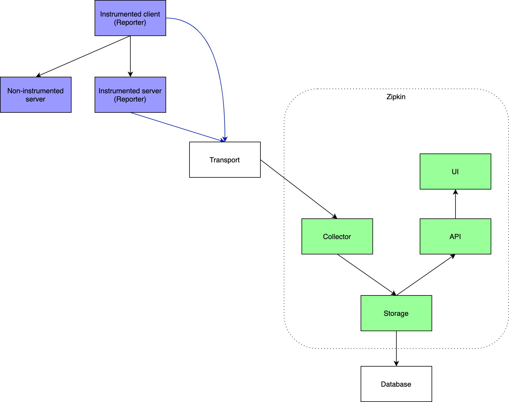

MSA 운영 환경에서는 문제 상황에서 분산 추적을 통해 장애 상황을 빠르게 파악하는 것이 중요합니다. 그리고 이를 가능케 해주는 분산 추적 툴들이 있습니다. 
대표적으로 pinpoint, zipkin 과 같은 오픈소스가 있습니다. 그 중 zipkin의 원리와 간단한 구축에 대해 이야기해보겠습니다. 

zipkin은 트위터에서 분산 추적을 위해 만들었고, 굉장히 활발하게 개발되고 있는 오픈소스 중 하나입니다. 그리고 zipkin과 함께 사용해야 하는 라이브러리가 sleuth 라는 라이브러리입니다. sleuth는 분산 추적을 위한 traceId와 spanId를 생성하는 역할을 합니다.
기존에는 Spring Cloud Sleuth를 통해 트레이싱 기능을 제공했습니다. 하지만 이 프로젝트의 핵심 기능이 Micrometer Tracing 프로젝트로 이관되었습니다.

### 의존성 추가
앞서 말씀드렸듯이, Sleuth의 기능이 micrometer에 포함되었습니다. 띠라서 트레이싱 기능을 사용하기 위해서는 Tracer 인터페이스의 구현체인 ```Brave``` 구현체를 포함하고 있는 micrometer-tracing-bridge-brave 의존성을 추가해주어야 합니다.

```
implementation 'io.micrometer:micrometer-tracing-bridge-brave'
```

Zipkin의 구성에 대해 보겠습니다.


Zipkin의 아키텍처는 간략하게 아래와 같이 설명됩니다. 
1. Reporter가 Transport를 통해서 Collector에 트레이스 정보를 전달합니다. 