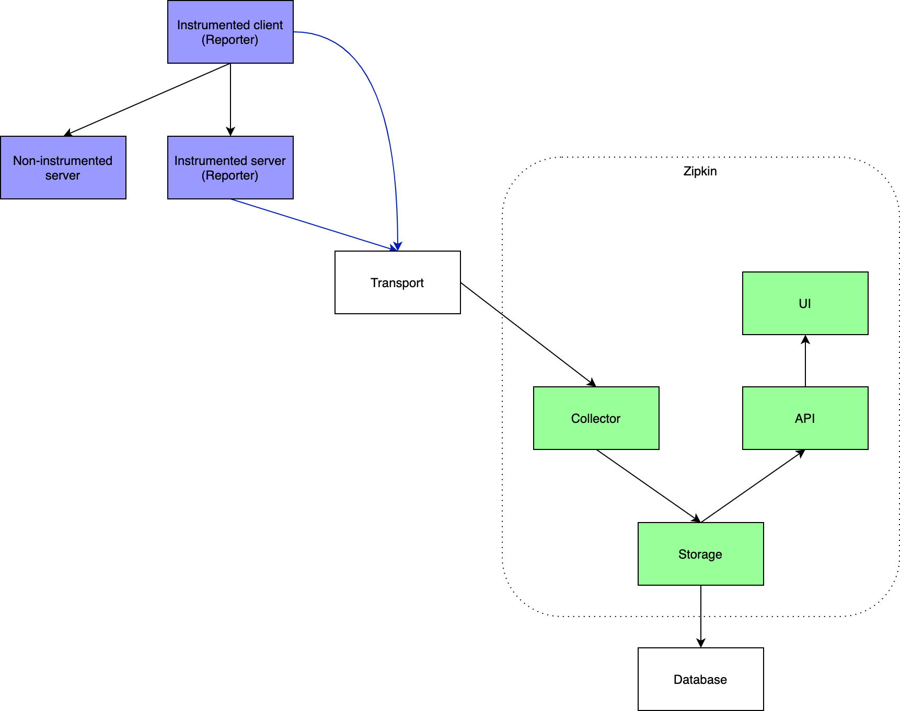
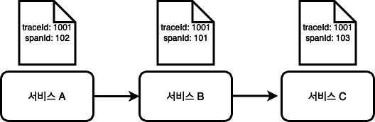
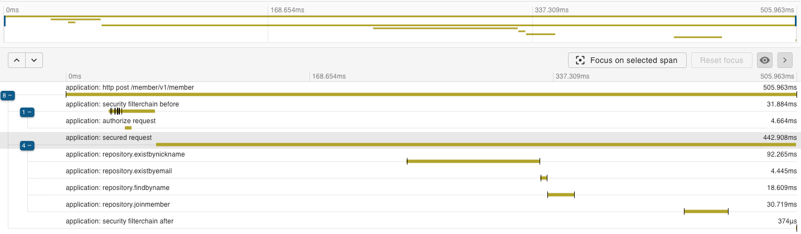

MSA 운영 환경에서는 문제 상황에서 분산 추적을 통해 장애 상황을 빠르게 파악하는 것이 중요합니다. 그리고 이를 가능케 해주는 분산 추적 툴들이 있습니다. 
대표적으로 pinpoint, zipkin 과 같은 오픈소스가 있습니다. 그 중 zipkin의 원리와 간단한 구축에 대해 이야기해보겠습니다. 

zipkin은 트위터에서 분산 추적을 위해 만들었고, 굉장히 활발하게 개발되고 있는 오픈소스 중 하나입니다. 그리고 zipkin과 함께 사용해야 하는 라이브러리가 sleuth 라는 라이브러리입니다. sleuth는 분산 추적을 위한 traceId와 spanId를 생성하는 역할을 합니다.
기존에는 Spring Cloud Sleuth를 통해 트레이싱 기능을 제공했습니다. 하지만 이 프로젝트의 핵심 기능이 Micrometer Tracing 프로젝트로 이관되었습니다.

### 의존성 추가
앞서 말씀드렸듯이, Sleuth의 기능이 micrometer에 포함되었습니다. 띠라서 트레이싱 기능을 사용하기 위해서는 Tracer 인터페이스의 구현체인 ```Brave``` 구현체를 포함하고 있는 micrometer-tracing-bridge-brave 의존성을 추가해주어야 합니다.

```
implementation 'io.micrometer:micrometer-tracing-bridge-brave'
```

Zipkin의 구성에 대해 보겠습니다.

Zipkin의 아키텍처는 간략하게 아래와 같이 설명됩니다. 
1. Reporter가 Transport를 통해서 Collector에 트레이스 정보를 전달합니다.
2. 전달된 트레이스 정보는 Database에 저장됩니다. 
3. Zipkin UI에서 API를 통해 해당 정보를 시각화해서 제공합니다. 



- Reporter
  - 각 서버는 계측 라이브러리를 사용해 Reporter 로서 동작할 수 있습니다. 방금 전에 추가한 ```micrometer-tracing-bridge-brave``` 라이브러리를 추가하면 Tracer 인터페이스를 구현한 ```BraveTracer``` 를 사용할 수 있습니다. 
    ```BraveTracer```를 사용하면 트레이스 데이터를 관리하기 위한 다양한 기능을 사용할 수 있습니다. 
- Database
  - Zipkin에서 데이터를 저장하기 위한 용도로 사용합니다. ElasticSearch, Mysql 등 다양한 저장소를 제공합니다. 


## TraceId, SpanId 이해 

Zipkin의 원리를 이해하기 위해선 ```traceId```와 ```spanId```에 대해 이해해야 합니다. 
- traceId: 최초 클라이언트가 보낸 HTTP 요청의 흐름
- spanId: 서비스, 트랜잭션 별로 다른 값

즉 쉽게 말해, 하나의 traceId에 여러 개의 spanId가 속해있는 형태입니다. 여기서 중요한 점은 고유한 traceId를 통해 분산 환경에서 요청에 대한 추적이 가능해진다는 점입니다.
아래 그림에서 요청이 서비스A, 서비스B, 서비스C를 거친다면, traceId(1001)을 이용해서 요청을 추적하고 어디서 병목이 생기는지를 빠르게 파악할 수 있습니다. 


```braveTracer```를 이용해 트래이싱을 사용한다면 MDC에 traceId와 spanId를 기록합니다. 그리고 traceId와 spanId는 reporter에 의해 헤더에 실려서 zipkin에 전달됩니다.

## AOP를 통한 Tracing 처리 
만약 traceId에 spanId를 추가하고 싶다면 직접 Tracer를 이용해서 spanId를 생성해주어야 합니다.
아래 코드를 보겠습니다. 스프링의 braveTracer를 DI 주입해서 AOP 내에서 repository를 타켓팅하여 별도의 Span 영역으로 처리했습니다.

```java
package com.example.demo.trace;

import io.micrometer.tracing.ScopedSpan;
import io.micrometer.tracing.Tracer;
import org.aspectj.lang.ProceedingJoinPoint;
import org.aspectj.lang.annotation.Around;
import org.aspectj.lang.annotation.Aspect;
import org.springframework.stereotype.Component;

import java.util.Arrays;

@Aspect
@Component
public class TraceJpaAspect {

    private final Tracer tracer;

    public TraceJpaAspect(Tracer tracer) {
        this.tracer = tracer;
    }

    @Around("execution(* com.example.demo.*.repository.*.*(..))")
    public Object traceJpaMethod(ProceedingJoinPoint joinPoint) throws Throwable {
        ScopedSpan span = tracer.startScopedSpan("repository." + joinPoint.getSignature().getName()); // (1)
        // 메서드 인자 가져오기
        Object[] args = joinPoint.getArgs();
        span.tag("method", joinPoint.getSignature().getName()); 
        span.tag("repository name", joinPoint.getSignature().getDeclaringTypeName());
        try {
            span.event("Start repository"); // (2)
            // 메서드 실행
            return joinPoint.proceed();
        } catch (Throwable throwable) {
            span.error(throwable); // 예외 정보를 트레이스에 기록
            throw throwable;
        } finally {
            span.event("End repository");
            span.end(); // (3)
        }
    }
}
```

(1): ```span.startScopedSpan(...)```는 새로운 Span을 시작합니다. 이를 통해 TraceId 범위 내에서 새로운 SpanId를 생성합니다.  
(2): ```span.event(...)```는 Span 내에서 발생한 특정 작업이나 이벤트를 나타냅니다. Span에 이벤트를 기록하는 데 사용됩니다.  
(3): ```span.end()```는 Span에 대한 추적 정보를 완료하는데 사용됩니다. 
  - 추적 Span은 시작과 종료로 표시되며, 스팬 내에서 발생하는 이벤트와 예외 정보를 기록한 이후에는 반드시 종료되어야 합니다. 
  - 종료된 스팬은 추적 시스템에 전송되어 분산 추적 데이터를 구성하고 모니터링 도구에서 사용됩니다. 
  - 추적 스펜을 종료함으로써 해당 작업의 수행이 완료되었음을 나타냅니다. 

위와 같이 추가하고, 실제 어플리케이션에서 기능을 수행하면 zipkin에 다음과 같은 추적 정보를 모니터링 할 수 있습니다.
리포지토리에 AOP를 적용하고 Span을 기록하였기 때문에, DB에 읽기를 할 때마다 Span 정보로 추적할 수 있고 실행시간도 파악할 수 있게 되었습니다.



