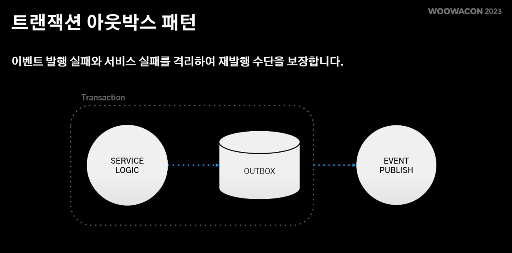

이번 글은 강홍구님의 강연을 기반으로 작성하였습니다.

대규모 트랜잭션을 처리하는 방법?

## 배민 주문 시스템의 특징


위의 그래프에서 볼 수 있듯이, 대부분의 트래픽이 점심과 저녁 시간에 몰리는 특징이 있습니다. 


## 단일 장애 포인트 
배민은 중앙 집중 DB의 장애가 있고, 해당 DB에 장애가 전체 시스템으로 전파되는 문제가 있었습니다. 


RUBY의 장애가 다른 시스템에도 전파가 되는 문제를 해결하기 위해, 중앙 저장소에서 각 시스템을 분리하는 프로젝트를 진행하게 됩니다. 
그리고 시스템 간 통신은 Message Queue 기반으로 통신하도록 합니다. 


이렇게 시스템이 MQ를 통해 느슨하게 연결이 되기 때문에, 주문중계 시스템의 장애가 가게 시스템으로 전파되는 문제를 없앨 수 있었습니다.
그리고 만약 MQ에 지연이 발생하다 하더라도 이벤트가 재소비 될 수 있기 때문에, 빠르게 안정적으로 서비스를 유지할 수 있습니다.

## 대용량 데이터 

기존의 배민 시스템 아키텍처는 아래와 같았습니다.


데이터 쓰기가 발생하는 주문 API 서버와 조회가 발생하는 주문 인터널 API 서버가 같은 주문 DB를 바라봅니다.
하지만 주문 내역 상세 정보를 보여주기 위해서는 많은 정보들이 필요합니다. 


따라서 상세 정보를 조회하기 위해서 RDBMS는 많은 조인(JOIN) 연산을 통해 데이터를 조회하게 됩니다. 이는 조회 성능에 안좋은 영향을 줍니다. 
이는 조회 성능에서는 조회에 최정화된 역정규화 모델을 이용하면 해결할 수 있습니다. 


아래는 개선된 아키텍처입니다.


MongoDB에 하나의 도큐먼트에 주문 에그리거트의 정보를 모두 담아서, 단순 ID 기반으로 도큐먼트를 조회하면 빠른 조회를 보장할 수 있습니다.
결과적으로 커맨드성 요청은 데이터 정합성을 위해 RDBMS에 저장하고, 쿼리성 요청은 빠른 조회를 위해 MongoDB에 저장하는 CQRS를 구축하였습니다.


## 대규모 트랜잭션

주문량이 하루 평균 300만 건이 되면서, AWS에서 제공해주는 최고 사양의 스펙으로도 분당 쓰기 처리량을 감당할 수 없는 상황이 되었습니다.


그리고 샤딩을 이용하기로 하였습니다. 샤드 클러스터를 구성하여 쓰기 부하를 분산하는 방식입니다.

애플리케이션 샤딩에는 두 가지 큰 고민이 있습니다. 
- 샤드 클러스터 내 어느 샤드에 접근할지 결정하는 샤딩전략 
- 여러 샤드에 있는 데이터를 애그리게이트 하는 방법 

### 샤딩 전략 
먼저 어떻게 데이터를 나눌 것인지에 대해서 이야기해보면
- Key Based Sharding
- Range Based Sharding 
- Directory Based Sharding 

위와 같이 세가지 샤딩 전략을 생각해볼 수 있습니다. 

### Key Based Sharding 
key based sharding 방식은 샤드키가 정해지면, 해시 함수에 의해 해시값을 얻고 해시값으로 샤드에 접근합니다. 


이 전략의 장점은 해시 함수만 제대로 구현한다면, 간단하게 샤드들에 데이터를 골고루 분배할 수 있다는 점입니다. 
반면 단점으로는 샤드를 동적으로 추가, 제거할 때 데이터 재배치가 필요합니다. 

### Range Based Sharding 

특정 값의 범위를 기반으로 데이터를 분산하는 전략입니다.  


이 전략은 구현이 간단하다는 장점이 있지만, 데이터가 균등하게 분배되지 않는다는 단점이 있습니다.

### Directory Based Sharding 

Directory Based Sharding 전략은 Key Based Sharding 전략과 비슷합니다. 하지만 차이점은 어떤 샤드에 연결될지 결정하는 값을 룩업(Look Up) 테이블에 저장합니다.


이 전략은 샤드 결정 로직이 룩업 테이블로 분리되어 있기 때문에 동적으로 샤드를 추가하는데 유리합니다. 반면 단점은 룩업 테이블이 단일 장애 포인트가 될 수 있습니다. 


### 위의 전략들을 바탕으로..
배민 주문 시스템은 아래와 같은 특징을 가지고 있었습니다.
- 주문이 정상 동작하지 않으면, 배민 서비스 전체의 좋지 않은 경험으로 이어집니다. 
- 동적 주문 데이터는 최대 30일 만 저장합니다. 

위의 특징들을 기반으로 고려한 중요 포인트는 아래와 같습니다. 
- 단일 장애 포인트는 피한다
  - 주문이 정상 동작하지 않으면, 배민 서비스 전체의 좋지 않은 경험으로 이어지기 때문
- 동적 주문 데이터는 최대 30일 만 저장한다
  - 동적 주문 데이터는 하루 내에 완결이되고, 30일치만 저장하기 때문에 샤드의 추가가 거의 없다. 
  - 샤드가 추가된다 해도 30일이 지나면 데이터는 다시 균등하게 분배 된다.

위의 고려 사항을 기반으로 주문 시스템의 샤딩 전략으로 Key Based Sharding을 선택합니다. 

해시 함수의 내용은 아래와 같습니다.  
```
주문 순번 % 샤드 수 = 샤드번호
```

이렇게 주문 쓰기 요청을 n개의 샤드 분산하여 저장하였기 때문에, 대량의 쓰기 요청도 처리할 수 있게 되었습니다. 

## 복잡한 이벤트 아키텍처 
 
이벤트 기반으로 통신을 하다보니, 다른 시스템에 필요한 이벤트를 무분별하게 발행하다보니 이벤트를 파악하기 어려워졌습니다. 
이를 어떻게 해결해 나갔는지에 대해 이야기합니다. 

배민 시스템은 주요 도메인 로직과 서비스 로직을 이벤트를 기반으로 관심사를 분리합니다.


기존 시스템은 아래와 같이 구성되어 있었습니다. 


하지만 문제는 크게 두가지가 있었습니다. 
- 스프링 애플리케이션 이벤트는 로직을 수행하는 주체를 파악하기 어려웠습니다.
  - 서비스 로직에 대해서 수행하는 주체인 어플리케이션이 달라져서 파악하기 어려워 졌습니다. 
- 이벤트 유실이 발생할 경우 재처리가 어려웠습니다. 
  - sqs에 문제가 발생했을 때, 재처리 하기가 어려웠습니다. 

이를 해결하기 위해 주문 도메인 이벤트는 내부 이벤트로 정의하고 서비스 로직은 외부 이벤트로 정의했습니다. 


### 서비스 로직을 수행하는 주체를 파악하기 어려움

도메인 이벤트의 라이프 사이클 내에서 발생하는 이벤트는 내부 이벤트로 정의하고, 도메인 로직 이외의 서비스 로직을 수행하는 외부 이벤트를 두었습니다.
내부 이벤트에는 서비스 로직으로 부터 결합을 없애기 위해 zero-payload를 이용했습니다. zero-payload 에는 최소한의 데이터만 있기 때문에 추가적인 정보를 주문 저장소에서 채워야 합니다. 
저장소는 조회 성능을 극대화한 MongoDB 서버를 이용했습니다.

이렇게 내부 이벤트와 외부 이벤트를 나눈 덕분에 역할을 좀 더 명확하게 분리할 수 있었습니다. 
주문 어플리케이션에서는 도메인 이벤트만 처리하면서 내부 이벤트를 발행하고, 이벤트 처리기에서는 내부 이벤트를 수신해서 모든 서비스 로직을 처리하게 했습니다.
물론 SQS를 중간에 두어서 네트워크 비용이 더 나올 수는 있었지만, 이벤트 처리의 주체를 단일화 함으로써 서비스 로직을 한 군데에서 처리하는 것에 더 중점을 두었습니다. 

### 이벤트 유실이 발생할 수 있음 

이벤트가 유실되는 문제를 막기 위해서 트랜잭션 아웃박스 패턴을 이용하였습니다. 



결과적으로 도메인 로직과 같은 트랜잭션 안에서 이벤트를 발행하여, 도메인 로직과 이벤트 발행이 일관성을 갖게 하였습니다.


## 최종 아키텍처 

최종 아키텍처는 다음과 같습니다. 


 