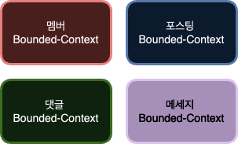
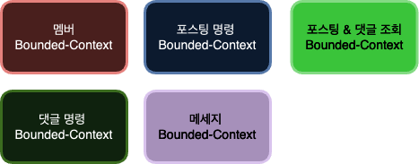
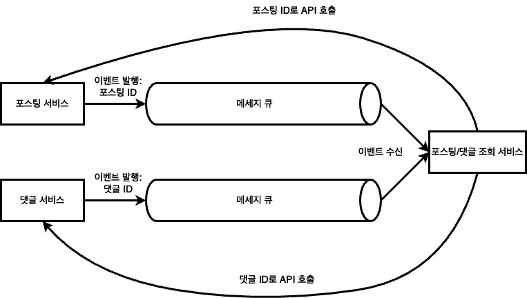
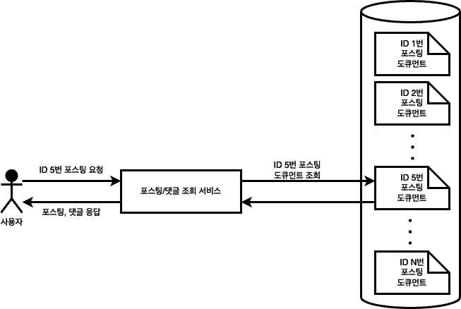

최근 사이드 프로젝트에서 멀티모듈을 사용하면서 적용했던 다양한 패턴들과 적용했던 이유에 대해 공유해보고자 합니다.

제가 진행하는 사이드 프로젝트는 대용량 트래픽을 처리할 수 있는 게시판입니다. 현재 기능은 단순하지만 점점 기능이 복잡해지고, 트래픽이 많아질 것을 고려하여 설계하였습니다.
또한 도메인에 중점을 두면서, 하위 도메인들 간의 결합도를 낮추기 위해 DDD를 기본 디자인으로 선택하여 개발을 진행했습니다.

## CQRS 패턴 

처음에 나누어진 Bounded-Context는 모델 무결성을 지키는 범위에서 아래와 같습니다. 



- 멤버 바운디드 컨텍스트
  - 멤버 관리와 관련된 모든 기능을 제공한다. 
- 포스팅 바운디드 컨텍스트
  - 포스팅 작성및 조회와 관련된 기능을 제공한다.  
- 댓글 바운디드 컨텍스트 
  - 댓글 작성 및 조회와 관련된 기능을 제공한다. 
- 알림 메세지 바운디드 컨텍스트 
  - 알림 메세지를 생성한다. 

하지만 위와 같이 Bounded-Context를 나누면 명령(데이터 생성 및 변경)과 조회가 분리되지 않습니다. 
이렇게 명령과 조회가 분리되지 않으면 다음의 문제가 있습니다. 
- 같은 저장소를 이용하기 때문에, 명령과 조회에 최적화된 성능 최적화를 하기 힘듭니다. 
- 명령 또는 조회의 장애 발생이 전체 시스템의 장애로 이어집니다. 

### 명령과 조회 분리 

위의 문제를 해결하기 위해 명령과 조회를 분리하는 작업을 해야했습니다. 그래서 아래와 같이 명령과 조회가 분리된 Bounded-Context가 만들어졌습니다.



상대적으로 조회 요청을 많이 받는 포스팅과 댓글을 명령과 조회로 분리했습니다. 명령과 조회를 시스템으로 분리했기 때문에 각 시스템은 목적에 맞는 최적화된 저장소를 이용할 수 있습니다. 명령을 담당하는 시스템은 안정성과 데이터 정합성이 중요하기 때문에 RDBMS를 이용하는 것이 적합합니다. 

조회 시스템은 데이터의 조회 속도가 중요합니다. 그렇기에 반정규화를 통해 복잡한 조회 프로세스 없이 빠르게 데이터를 조회하기 위해 NoSQL을 이용하는 것이 적합합니다. 포스팅과 댓글을 하나로 묶은 이유도 데이터를 반정규화 하여 조회를 빠르게 하기 위합입니다.

## 이벤트 기반 아키텍처 

명령과 조회의 데이터를 동기화 하기 위해 이벤트 기반 아키텍처를 사용했습니다. 포스팅, 댓글 명령 시스템에선 데이터의 변경이 발생하면 메세지 큐를 이용하여 이벤트를 발행합니다. 이벤트에는 다른 시스템에 대한 목적이 전혀 들어있지 않습니다. 단지 데이터가 변경되었다는 이벤트만을 발행합니다.
이처럼 이벤트에는 다른 시스템에 대한 목적이 전혀 들어있지 않기 때문에 명령과 조회 시스템 간의 결합도는 낮아집니다.


### Zero-Payload

여기서 이벤트의 순서와 상관없이 항상 데이터의 최신 상태를 유지하기 위해 Zero-Payload 방식을 사용했습니다.
zero-payload란 요청의 본문 payload 부분이 없다는 것을 의미합니다. 따라서 이벤트를 발행할 때는 id 같은 식별할 수 있는 최소한의 데이터를 이벤트로 발행합니다.
그리고 이후 이벤트를 수신한 서비스는 받은 id로 이벤트를 발행한 쪽에 API 콜을 하여 필요한 전체 데이터를 가져옵니다.    



zero-payload를 이용하는 장점은 다음과 같습니다. 
- 이벤트의 순서를 유지하기 쉽다.
  - 이벤트의 순서가 뒤바뀌더라도, 결국 마지막에 호출한 API로 전달받은 데이터가 최신 데이터가 됩니다. 따라서 이벤트의 순서와 무관하게 항상 최신 데이터로 갱신됩니다. 
- 시스템간의 결합도를 낮출 수 있다. 
  - 같은 이벤트를 수신하더라도, 시스템 별로 원하는 데이터가 다를 수 있습니다. 그래서 최소한의 데이터만 이벤트로 발행하고 각 시스템에서 필요한 데이터는 추가적인 API 호출로 전달받습니다.   

### Transactional Outbox 패턴 

포스팅 서비스와 댓글 서비스에서 이벤트 발행이 실패할 경우 이벤트가 유실될 위험이 있습니다. 그래서 이벤트 유실을 막기 위해 **Transactional Outbox 패턴**으로 명령(command)와 동일한 Transaction에서 이벤트 정보를 DB에 저장했습니다. 

**Transactional Outbox 패턴**에선 이벤트가 발생하면, 이벤트를 발행하기 전에 하나의 트랜잭션 내에서 이벤트를 저장합니다. 
JPA EntityListers를 사용했는데 하나의 트랜잭션임을 보장하기 트랜잭션 커밋 직전(```BEFORE_COMMIT```)에 이벤트를 저장합니다.  

```java
@TransactionalEventListener(phase = TransactionPhase.BEFORE_COMMIT)
public void handle(PostInsertEvent event) {
    Post post = event.getPost();
    InternalPostEvent coverEvent = new InternalPostEvent(
            post.getPostId(),
            PostEventType.INSERT,
            post.getTitle(),
            post.getWriterId()
    );
    postEventRepository.save(coverEvent);
    Events.raise(coverEvent);
}
```

이후 이벤트가 발행되면 이벤트의 ```is_published```를 true로 업데이트 해주었습니다. 만약 이벤트의 ```is_published```가 여전히 false라면 추후에 재발행을 통해 처리되지 않은 이벤트를 추가적으로 처리할 수 있습니다.

```java
@Slf4j
@Service
@Transactional
@RequiredArgsConstructor
public class PostInternalEventHandler {

	private final PostInsertEventPublishPort postInsertEventPublishPort;
	private final EntityManager em;

	@TransactionalEventListener(phase = TransactionPhase.AFTER_COMMIT)
	public void handle(InternalPostEvent event) {
		publish(event);
		try {
			postInsertEventPublishPort.publish(
				PostEvent.of(event.getPostId(), PostEventType.INSERT)
			);
		} catch (Exception e) {
			log.warn("Internal Cover event publish failed {}.", e.getMessage());
		}
	}

	private void publish(InternalPostEvent event) {
		em.merge(event).publish();
	}
}
```

## 조회 모델 반정규화 

이벤트를 받은 포스팅/댓글 조회 서비스는 데이터를 반정규화 하여 저장하도록 했습니다. 저장소로는 NoSQL의 한 종류인 MongoDB를 이용하였습니다. 
데이터를 반정규화 하였기 때문에, JOIN 같은 복잡한 조회 프로세스 없이 빠르게 데이터를 조회할 수 있습니다. 

아래는 포스팅/조회 도큐먼트 모델 예시입니다. 

```json
{
  "id": ObjectId("65d0646cc833341e64b9d3a2"),
  "postId": 2
  "writerId": 12,
  "title": "...",
  "content": "...",
  "comments": [
    {
      "commentId": 1,
      "author": "John",
      "comment": "good job"
    },
    {
      "commentId": 2,
      "author": "Chris",
      "comment": "hi"
    },
    {
      "commentId": 3,
      "author": "Dave",
      "comment": "I think so too"
    }
  ]
}

```

포스팅/댓글 조회 서비스는 포스팅의 ID만 있으면 도큐먼트를 조회하여 빠르게 데이터를 반환할 수 있습니다. 




## 마무리 

이번에 개인 프로젝트를 하면서 처음으로 CQRS를 적용해보았습니다.
처음이라서 아직 미흡한 부분도 있을 것이라고 생각합니다. 그래서 새로운 것들을 알게되고, 미흡했던 부분을 발견할 때마다 지속적으로 프로젝트를 개선해볼 생각입니다.


