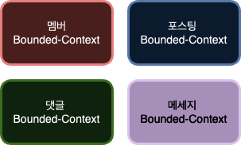
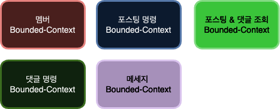

최근 사이드 프로젝트에서 멀티모듈을 사용하면서 적용했던 다양한 패턴들과 적용했던 이유에 대해 공유해보고자 합니다. 

제가 진행하는 사이드 프로젝트는 대용량 트래픽을 처리할 수 있는 게시판입니다. 현재 기능은 단순하지만 점점 기능이 복잡해질 것을 고려하였습니다. 
그래서 도메인에 중점을 두면서, 하위 도메인들 간의 결합도를 낮추기 위해 DDD를 기본 디자인으로 선택하여 개발을 진행했습니다. 

## CQRS 패턴 

처음에 나누어진 Bounded-Context는 모델 무결성을 지키는 범위에서 아래와 같습니다. 

- 멤버 바운디드 컨텍스트
  - 멤버 관리와 관련된 모든 기능을 제공한다. 
- 포스팅 바운디드 컨텍스트
  - 포스팅 작성및 조회와 관련된 기능을 제공한다.  
- 댓글 바운디드 컨텍스트 
  - 댓글 작성 및 조회와 관련된 기능을 제공한다. 
- 알림 메세지 바운디드 컨텍스트 
  - 알림 메세지를 생성한다. 

하지만 위와 같이 Bounded-Context를 나누면 명령(데이터 생성 및 변경)과 조회가 분리되지 않습니다. 
이렇게 명령과 조회가 분리되지 않으면 다음의 문제가 있습니다. 
- 같은 저장소를 이용하기 때문에, 명령과 조회에 최적화된 성능 최적화를 하기 힘듭니다. 
- 명령 또는 조회의 장애 발생이 전체 시스템의 장애로 이어집니다. 

### 명령과 조회 분리 

위의 문제를 해결하기 위해 명령과 조회를 분리하는 작업을 해야했습니다. 그래서 아래와 같이 명령과 조회가 분리된 Bounded-Context가 만들어졌습니다.

상대적으로 조회 요청을 많이 받는 포스팅과 댓글을 명령과 조회로 분리했습니다. 명령과 조회를 시스템으로 분리했기 때문에 각 시스템은 목적에 맞는 최적화된 저장소를 이용할 수 있습니다. 명령을 담당하는 시스템은 안정성과 데이터 정합성이 중요하기 때문에 RDBMS를 이용하는 것이 적합합니다. 

조회 시스템은 데이터의 조회 속도가 중요합니다. 그렇기에 반정규화를 통해 복잡한 조회 프로세스 없이 빠르게 데이터를 조회하기 위해 NoSQL을 이용하는 것이 적합합니다. 포스팅과 댓글을 하나로 묶은 이유도 데이터를 반정규화 하여 조회를 빠르게 하기 위합입니다.

### 이벤트 기반 아키텍처 

명령과 조회의 데이터를 동기화 하기 위해 이벤트 기반 아키텍처를 사용했습니다. 포스팅, 댓글 명령 시스템에선 데이터의 변경이 발생하면 메세지 큐를 이용하여 이벤트를 발행합니다. 이벤트에는 다른 시스템에 대한 목적이 전혀 들어있지 않습니다. 단지 데이터가 변경되었다는 이벤트만을 발행합니다.
이벤트에는 다른 시스템에 대한 목적이 전혀 들어있지 않기 때문에 명령과 조회 시스템 간의 결합도는 낮아집니다. 

여기서 시스템 간의 결합도를 더 낮추기 위해 Zero-Payload를 사용했습니다. 

  

