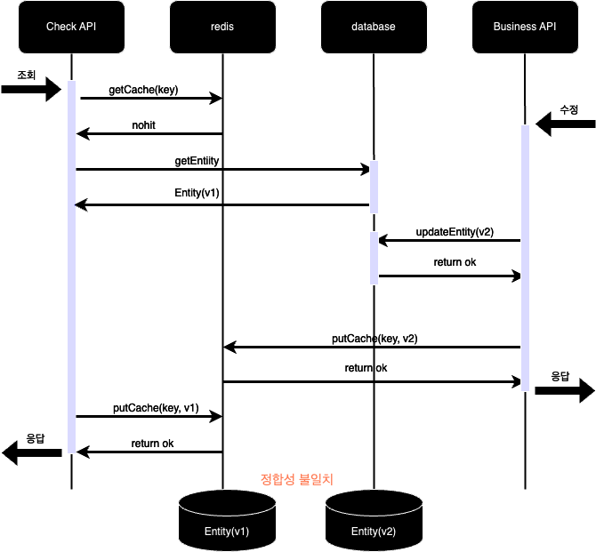

어느날 운영 중인 서비스에서 redis 캐싱 데이터와 DB 데이터 간의 정합성이 맞지 않은 문제가 발생했습니다.
분명 db의 상태가 변경되면 redis 캐시도 업데이트를 해주었기 때문에 캐싱된 데이터와 db 상태가 일치하지 않는 문제는 이해할 수 없었습니다. 

보통 redis는 다음과 같은 용도로 이용됩니다. 
- 클라이언트에게 전달되는 값이 동일할 때
- 빈번하게 호출될 때 
- 한 번 처리할 때 많은 서버 리소스를 요구 할 때

저 또한 redis를 db콜을 줄이기 위해 많이 사용했습니다. 예를 들면, 유저의 상태 정보를 가져오는 Check API가 있고, 다른 API에서는 유저의 상태 정보를 가져오기 위해 Check API를 이용합니다.  
만약 Check API를 호출할 때마다 DB콜을 한다면 트래픽이 증가할 경우 Database I/O가 증가하고 DB에 큰 부하가 발생할 수 있습니다. 그래서 Check API는 한번 DB에서 조회한 데이터를 redis에 캐싱합니다.  

기능 구현을 위해 사용했던 의존성은 ```spring-boot-starter```에서 제공하는 
```@Cacheable```과 ```@CachePut``` 어노테이션을 이용했습니다.

### @Cacheable
먼저 사용 방법에 대해 말씀 드리면 ```@Cacheable```은 키값으로 캐싱되어 있지 않으면 데이터를 캐시에 저장합니다. 하지만 키 값으로 캐싱되어 있다면 메서드 로직을 실행하지 않고 캐시를 반환합니다. 
코드로 보여드리면 아래와 같습니다. 
```java
// 캐시 저장 (Key를 지정한 경우)
@Cacheable(value = "memberCacheStore", key = "#member.name")
public Member cacheableByKey(Member member) {
    System.out.println("cacheable 실행");
    ...
    return member;
}
```
1. 만약 "dave" name을 가진 Member가 파라미터로 들어오면 처음에는 캐싱 전이므로 "cacheable 실행" 이라는 문자열이 출력됩니다.
2. 그리고 "dave" name을 가진 Member가 redis에 캐싱됩니다. 
3. 이후 "dave" name을 가진 Member가 다시 메서드를 호출하면 "cacheable 실행" 이라는 문자열은 출력하지 않고 캐싱 되어있는 "dave" name을 가진 Member 객체를 반환합니다. 

### @CachePut
```@CachePut```은 ```@CachePut```과 비슷하지만 캐싱되어 있는 내용을 사용하지 않고 항상 저장만 한다는 것이 다릅니다. 
```java
@CachePut(value = "memberCacheStore", key = "#member.name")
public Member cachePut(Member member) {
    System.out.println("cachePut 실행");
    ...
    return member;
}
```

위의 코드에서 "dave"라는 Member가 파라미터로 계속 들어와도 "cachePut 실행" 이라는 문자열은 계속 출력됩니다. 
그리고 계속 캐시를 업데이트 합니다.

## 문제 상황 
문제 상황을 파악해보니 서로 다른 API에서 ```@Cacheable```과 ```@CachePut```을 이용하면서 redis와 db의 정합성이 깨지는 문제였습니다. 
문제 상황을 간단한 이미지로 표현해 보았습니다. 



위의 이미지를 확인해 보면 다음과 같은 순서로 작업이 진행됩니다.  
1. Check API에서는 redis 캐시를 조회해 보고 nohit인 경우 db에서 엔티티(v1)를 조회합니다.  
2. Business API에서는 엔티티를 수정해서 엔티티(v2)를 redis에 캐싱합니다.
3. 모종의 이유로 v1 엔티티를 캐싱하는 작업이 v2에 캐싱하는 작업보다 뒤에 처리됩니다. 
4. redis에는 v1 엔티티가 캐싱되고 db에는 v2 엔티티가 업데이트 되는 부정합이 발생합니다. 


## 해결 방법 

해결 방법은 ```@Cacheable``` 동작시 putCache 대신 putIfAbsent(데이터 없을 시 insert)를 수행하면 됩니다.
putInAbsent를 적용하면 위의 사례에서 v2가 이미 캐싱되어 있다면 ```@Cacheable```에서 v1을 캐싱해서 덮어씌우지 않게됩니다. 

아래는 ```@Cacheable```에서는 putIfAbsent를 하도록 설정하는 코드입니다. Proxy 객체로 ```RedisCacheWriter```를 감싸서 접근제어를 합니다. 
Proxy 객체에서 put 요청시 putIfAbsent를 호출합니다.  
```java
public class PutToPutIfAbsentRedisCacheWriterProxy implements RedisCacheWriter {

	private final RedisCacheWriter proxyObject;

	public PutToPutIfAbsentRedisCacheWriterProxy(RedisCacheWriter proxyObject) {
		this.proxyObject = proxyObject;
	}

	// put 요청 시 put 대신 putIfAbsent
	@Override
	public void put(String name, byte[] key, byte[] value, Duration ttl) {
		proxyObject.putIfAbsent(name, key, value, ttl);
	}
    ...
```

그리고 생성한 Proxy 객체를 ```CacheResolver```에 등록해야 합니다. 

```java
@EnableCaching
@RequiredArgsConstructor
@Configuration
public class CacheConfig {

	private final RedisCacheWriter redisCacheWriter;

	@Bean
	public RedisCacheManager cacheableManager() {
		return RedisCacheManager.builder()
				.cacheWriter(
					new PutToPutIfAbsentRedisCacheWriterProxy(redisCacheWriter)
				).build();
	}

	@Bean
	public RedisCacheManager cachePutManger() {
		return RedisCacheManager.builder()
				.cacheWriter(redisCacheWriter)
				.build();
	}

	@Bean
	public CacheResolver cacheResolver() {
		CacheManager cacheableManager =  cacheableManager();
		CacheManager cachePutManager = cachePutManger();

		return context -> {
			Collection<Cache> caches = new ArrayList<>();
			if (context.getOperation() instanceof CachePutOperation) {
				caches.add(cachePutManager.getCache(context.getOperation().getCacheNames().iterator().next()));
			} else {
				caches.add(cacheableManager.getCache(context.getOperation().getCacheNames().iterator().next()));
			}
			return caches;
		};
	}
}
```
```@Cacheable``` 에는 Proxy RedisCacheWriter를 적용하고 ```@CachePut``` 에는 원본 RedisCacheWriter를 적용함을 확인할 수 있습니다. 

## 주의할 점 
위와 같이 ```@Cachealbe```에만 putIfAbsent를 적용하도록 하니 정합성이 깨지는 문제는 사라졌습니다. 하지만 위의 방법이 완벽하지는 않습니다. 
여전히 ```@CachePut``` 끼리의 동시성은 해결되지 않는 문제입니다. 

또한 ```@CachePut``` 상황에서 timeout 또는 redis 실패 시에도 정합성 오류가 납니다. 이 경우 ```@CachePut``` 에서 오류 발생시 예외를 발생시켜 정합성이 깨지는 문제를 방지했습니다. 

결과적으로 성능 개선을 위해 redis가 추가되었지만, 네트워크 I/O가 기존 db 조회 한번에서 0~2개 늘어납니다. ```@Cacheable```에서 cache hit이라면 redis 조회 한 번으로 동일하지만, no hit인 경우에는 redis 조회, db 조회, redis 캐시 삽입으로 3번의 네트워크 I/O가 발생합니다. 

이번 이슈를 해결하면서 느낀점은 redis를 사용하면 캐싱을 통해 성능 개선을 할 수 있지만, 변경이 많이 되는 데이터에 대해서는 오히려 reids 캐싱이 적절하지 않을 수 있다고 생각했습니다. 
위의 사례처럼 정합성이 깨지는 문제가 발생할 수 있고, 네트워크 I/O도 추가적으로 발생하기 때문입니다. 추가적으로 구현상의 복잡도도 생깁니다. 
그래서 많이 변경되는 데이터는 LocalCache를 적절히 함께 사용하는 것도 좋은 방법이라고 생각합니다. 
