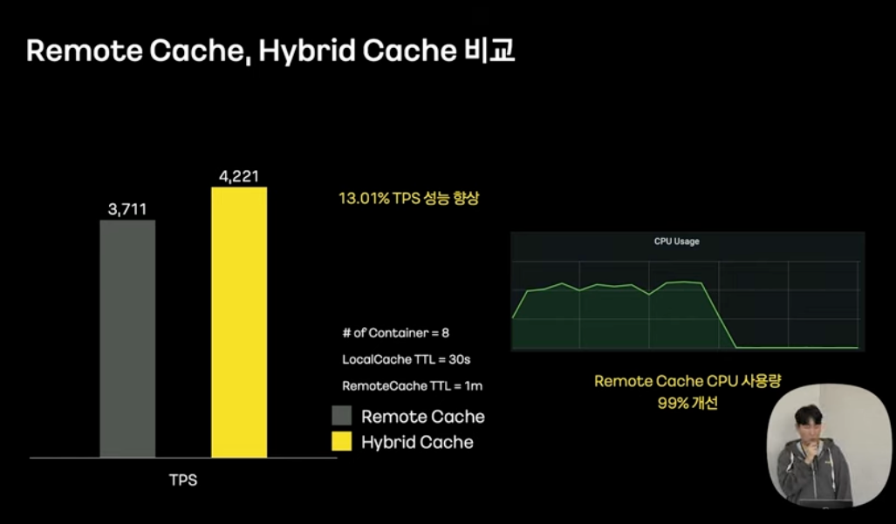

캐시를 이용한 대용량 트래픽 처리 

카카오에서 캐시를 이용해서 대용량 트래픽 처리를 했던 경험을 읽고 정리한 내용입니다. 

카카오의 선물하기 서비스는 트래픽이 많은 서비스입니다. 하지만 최근 KBO의 유행으로 야구와 관련된 상품에 대한 선물하기 트래픽이 급증했습니다. 
선물하기 서비스는 홈, 프로모션과 같은 전시 영역의 서비스를 제공합니다.

선물하기 서비스의 처리 구조를 살펴보겠습니다.

선물하기 서비스는 선물하기와 관련된 데이터를 DB 및 외부 api에 의존해서 데이터를 제공합니다.

그리고 한번 조회된 데이터는 캐싱합니다. 캐싱을 함으로써 아래와 같은 장점이 있습니다. 
- 캐싱된 데이터를 빠르게 응답할 수 있다. 
- 선물하기의 트래픽이 다른 서비스로 전달되는 것을 방지한다.

### 캐시 스템피드 현상 
그리고 캐시의 최신성을 위해서 만료시간을 설정해야 합니다. 만약 만료 시간이 없다면, 사용자는 최신의 데이터를 보지 못합니다.
하지만 여기서 캐시가 만료될 경우 다시 서비스로 요청이 흐르게 됩니다. 순간적으로 캐시가 만료되면서 여러개의 선물 서비스에서 동시에 캐시 갱신 요청을 보낼 수 있습니다.
결과적으로 순간적으로 흘러들어가는 트래픽이 연관된 서비스들에 부담을 주게됩니다. 이러한 현상을 "캐시 스템피드" 현상이라 합니다.  

캐시 스템피드 현상을 다음과 같은 문제점을 지닙니다. 
- 캐시가 만료될 때 여러 클라이언트가 동시에 동일한 리소스에 접근한다. 
- 동일한 리소스를 동시에 여러 번 캐싱할 수 있다. 
- 서버 부하 증가 및 성능 저하를 초해할 수 있다.

해결방법
- 캐시 ttl 증가한다.
  - 상품 정보가 긴 ttl 동안 변경되지 않는다면 사용자에게 안 좋은 경험을 줄 수 있다. 
- 요청에 Lock 걸기 
  - 오로지 하나의 요청만 처리하기 때문에 하나의 요청만 캐시 갱신을 하게된다. 하지만 그동안 다른 요청들에는 응답 지연이 발생한다. 
- 캐시 웜업
  - 별도의 배치를 통해서 미리 캐시에 적재
  - 짧은 주기로 캐시를 갱신하기 때문에 ttl을 길게 유지할 필요 없고, 요청에 대해 Lock을 걸지 않기 때문에 응답에 지연이 발생하지도 않는다. 

위의 방법 중 캐시 웜업을 선택해서 캐시 스템피드 현상을 방지할 수 있지만 여전히 해결해야할 문제가 남아있습니다.  
- 리모트 캐시 서버 I/O로 인한 응답 지연 발생 
- 캐시 웜업 대상 누락 시 Cache Stamped 이슈 반복 

## Hybrid Cache로 네트워크 I/O 최소화 
Hybrid Cache 전략은 리모트 캐시와 로컬 캐시를 함께 사용하여, 네트워크 I/O를 최소화 하는 전략입니다.

위의 화면에 노출되는 데이터는 몇가지 특징이 있습니다. 
- 개인화가 적용되지 않는다. 
- 업데이트 빈도가 낮다
- 데이터의 크기가 작고, 조회 키 범위가 작다.
- 하지만 빈번하게 조회된다. 

이런 데이터는 굳이 리모트 캐시 서버에서 항상 데이터를 조회할 필요 없이, 로컬 캐시에 캐싱해서 가져오는 것이 좋습니다. 
로컬 캐시에서 가져오기 때문에 네트워크 I/O가 최소화 되고, 응답속도가 빨라집니다. 
그리고 리모트 캐시는 최신 상태 데이터를 저장하면서 캐시 데이터의 중앙 관리 역할을 합니다.

Hybrid Cache의 갱신 플로우는 아래와 같습니다. 
- 만약 로컬 캐시가 존재한다면, 로컬 캐시로 응답합니다. 
- 만약 로컬 캐시가 없다면, 리모트 캐시로 응답합니다. 
- 만약 로컬 캐시, 리모트 캐시가 없다면, 외부 api 호출 및 DB 조회를 통해 리모트 캐시 및 로컬 캐시를 모두 갱신합니다. 

하지만 여기서 고려할 점이 있습니다. 만약 데이터의 변경이 이뤄진다면 어떻게 해야 할까요? 모든 로컬 캐시가 같은 정보로 동기화 되어야 합니다. 
이처럼 즉시 여러 서버의 로컬 캐시가 동기화 되도록 구현하기 위해 zookeeper를 이용했습니다. 

zookeeper의 분산 코디네이션을 활용한다면 watch 기능을 이용하여 여러 서버에서 변경 이벤트를 감지하고 데이터를 동기화 할 수 있습니다.  

zookeeper에 의해 캐시가 갱신되는 과정은 아래 흐름을 거칩니다. 
1. 먼저 리모트 캐시 서버의 데이터가 만료됩니다. 
2. zookeeper에 의해 캐시 갱신 이벤트가 발생하고, 서비스 서버는 이벤트를 통해 로컬 캐시를 만료하게 됩니다. 
3. 이후 새로운 요청이 들어오면 로컬 캐시와, 리모트 캐시가 갱신이 되면서 캐시 데이터의 동기화가 완료됩니다.

Hybrid 캐시 전략으로 인해 아래와 같은 성능 향상을 볼 수 있었습니다.
- TPS가 13% 성능 향상했습니다.
- Remote Cache CPU의 샤용향이 99% 개선되었습니다. 

## Auto Cache WarmUp

프로모션 페이지는 실시간으로 변경 가능
- 상품 리스팅은 사용자들에게 다양한 상품 노출
  - 응답 데이터가 크다. 따라서 로컬 캐시 기반의 Hybrid 캐시는 메모리에 부담이 될 수 있다. 
  - 프로모션 페이지는 따라서 리모트 캐시와 캐시 웜업을 주로 사용한다. 

모든 프로모션 페이지의 데이터를 캐시 웜업 할 수 없다. -> 대용량 트래픽이 예고된 프로모션 페이지를 수동 등록 Cache Warmup 하는 방식 

하지만 사람이 직접 등록하는 방식이기 때문에, 수동 처리 누락으로 인한 이슈가 발생할 수 있다.
캐시 누락으로 인한 캐시 스템피드 현상이 여전히 발생할 수 있다. 

캐시 갱신 자동화 방식이 필요 

PER 알고리즘 
-> 캐시 만료전 일정 확률로 캐시를 갱신하는 알고리즘 
-> 캐시 스템피드 해결 
고민되는 지점이 존재, 
- 캐시 갱신 여부를 캐시 만료 전 요청에만 의존
  - 사용자 요청이 캐시 갱신 확률 범위를 벗어나 캐시 갱신이 되지 않는 경우 발생 
  - 캐시 갱신의 확률을 높일 경우 -> 캐시 갱신 로직 중복 수행 & 사용자 응답 지연 발생 
- 프로모션 페이지는 일정한 캐시 갱신 시간을 기대하기 어려움 

캐시 갱싱 자동화 필요 
선물하기의 트래픽 양상은 아래와 같이 두가지 이다. 
steady, hot 프로모션 

Hot 프로모션 자동 수집, 주기적 캐시 웜업을 하여 
-> 대용량 트래픽 방어, 항상 빠른 응답 속도

사용자가 프로모션 페이지를 요청하면 고유 ID로 요청 
페이지 ID 별로 최근 호출 시간과 누적 호출 횟수를 저장한다.

사람들이 많이 봤지만 꾸준히 찾지는 않는 프로모션이다. -> 현재는 인기 없는 프로모션

최근에 찾은 사람은 있지만 호출 횟수가 적다. -> 일단은 지켜보자 

최근 호출시간도 빠르고, 누적 호출 횟수도 많다 -> 핫 프로모션 

저장소 기준
일관성 있는 결과 -> 원격 저장소 
속도 지연이 발생해서는 안됨 -> 인 메모리 저장소 
통계 및 수집 용이 -> 자료구조 지원 

-> Redis 

Redis의 Sorted Set을 이용하여 최근 호출된 프로모션 리스트를 저장  
score는 최근 호출된 시간, 값은 pageId
가장 최근에 호출된 페이지? 가장 마지막에 호출된 페이지?

Hash를 이용하여 프로모션 별 누적호출 횟수를 저장 
하나의 키 안에 여러 필드가 존재 
필드를 pageId, 값은 페이지 호출 횟수 

하지만 hGetAll은 ON이므로 자료구조에 아이템이 많으면 성능 저하 
누적 호출 횟수를 시간 별로 분리하여 저장 

가중치가 다르다. 
steady 프로모션
- 유저가 언제든 선호하는 프로모션이다. 누적 호출이 많은 프로모션 페이지 가중치 증가 

spike 프로모션 
- 최근에 호출된 프로모션 페이지 가중치, 실시간 호출 횟수가 많은 프로모션 가중치 

새부적으로 시간별로 분리해보면, 특정 시간에 갑자기 트래픽이 높아진 경우가 있다. 
실시간 호출 횟수가 많은 프로모션에 더 많은 가중치를 부여 

최종 스코어 계산 
가장 큰 순으로 특정 갯수까지만 저장하여 이를 hot 프로모션으로 정의 

대용량 트래픽 요청을 대비한 Hot Promotion Collector 분리 
사용자 요청이 들어올 때마다 Hot Promotion을 계산한다면 큰 부담이 된다. 

-> 사용자 요청이 들어오면, 로컬 스토리지에 id와 누적 횟수를 저장 
-> 이후 특정 시간이 지나면 Hot Promotion Collector로 전달 
-> Id당 최근 호출시간, ID 당 시간별 누적 호출 횟수를 이용해 Hot Promotion 계산 

이러한 방식으로 대용량 트래픽이 와도 Hot Promotion 계산 가능 

Cache Warmup 자동화 배치 
- 일정 시간마다 hot promotion 리스트 조회 
- 해당 프로모션의 최신 상품 상태 조회 
- Cache에 최신 데이터로 적용 

트래픽 전이를 방지하고, 캐시 웜업 중요 대상이 누락되는 현상을 방지할 수 있다. 

## 초단위 Cache Warm up
사용자에게 준실시간으로 보여주기 위해, 초 단위 캐시 웜업을 구현해야 한다. 

Dead Letter Queue 활용 

1초 후에 Dead Letter queue를 읽을 수 있게 된다. 

이로써 초단위 캐시 웜업을 구현하였다. 초단위 캐시 웜업을 구현하면서, 대용량 트래픽은 다른 서비스에 전이되지 않았다. 

