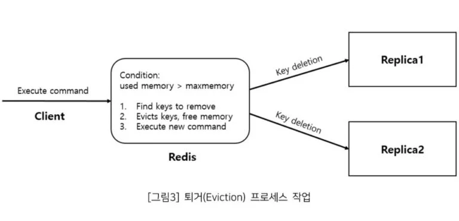

Redis 오픈소소는 굉장히 많이 사용되는 오픈소스 중 하나입니다. 제가 운영하는 서비스에서도 Redis를 캐시 용도로 활발히 사용하고 있습니다. Redis는 시스템의 성능을 높이는데 많은 역할을 하는 좋은 솔루션이지만, Redis라는 솔루션은 메모리 측면에서 제대로 관리하지 않으면 장애로 이어지기도 합니다. 
이번 글에서는 장애 상황에 대비해 Redis를 최적화 할 수 있는 방안에 대해 알아보고자 합니다. 

## Swap 메모리 사용

만약 Redis의 모든 메모리를 사용하게 되었다면 어떤 상황이 발생할까요? Redis에서는 시스템이 다운되는 것을 막기 위해 Swap 영역을 이용합니다. 따라서 물리메모리(RAM)의 양이 가득 차고 더 많은 메모리의 양이 필요할 때 디스크를 메모리 처럼 사용합니다. 
이 과정에서 메모리를 스왑에 저장하는 swap out과 스왑에서 메모리로 옮기는 swap in이 발생하면서 성능 저하가 발생할 수 있습니다.


만약 swap 영역에도 저장할 수 없으면 “Redis: OOM(Out of memory) command not allowed when used memory than ‘maxmemory’” 다음과 같은 에러를 보게 됩니다. 

그렇다면, Redis는 메모리에 대해 어떻게 관리해야 할까요?
Redis에서는 ```maxmemory``` 설정을 하여 최대로 사용할 수 있는 메모리를 지정할 수 있습니다. 

만약 redis의 메모리 사용량을 100mb로 구성하려면 redis.conf 파일 내에서 다음과 같이 설정할 수 있습니다. 
```shell
maxmemory 100mb
```

### maxmemory-policy 
추가적으로 redis는 메모리가 가득 찬 상황에서 기존 key를 제거하는 "maxmemory-policy" 정책을 제공합니다. 기본값은 key를 제거하지 않는 noEviction으로 설정됩니다.
noEviction으로 설정되면 redis의 메모리가 maxmemory에 도달했을 경우 더이상의 키를 저장하지 않습니다. 이 옵션은 memory가 가득차서 swap 영역까지 사용하는 문제는 막을 수 있을 것입니다. 
하지만 redis에 key를 더이상 저장하지 못하기 때문에 어플리케이션의 장애로 이어질 수 있습니다. 

따라서 redis에선 기존 키를 삭제하여 메모리를 확보하는 옵션들을 제공합니다. 기본적으로 어떤 Key를 삭제할지는 LRU, LFU 등의 알고리즘을 이용하여 결정합니다. 
- LRU 알고리즘에선 가장 오랫동안 참조되지 않은 key를 삭제합니다. 
- LFU 알고리즘에선 가장 적게 참조된 key를 삭제합니다. 


Redis eviction 프로세스는 다음과 같이 진행됩니다. 
- 클라이언트가 새로운 command를 실행하여, 더 많은 데이터가 추가됩니다. 
- Redis는 메모리 사용량을 확인하고, 설정된 maxmemory 값보다 크면 정책에 따라 keys를 evict합니다. 
- 새로운 command가 실행됩니다. 

### 쓰기 증폭 
하지만 문제는 위 과정 중에 Redis가 메모리를 회수하는 동안 write 증폭 문제가 발생할 수 있습니다. 

Redis의 eviction 작동 방식에서, maxmemory 제한이 설정되고, maxmemory-policy가 "noeviction"이 아닌 경우, Redis 메모리 회수 프로세스는 클라이언트가 새로운 command를 실행할 때마다 트리거됩니다. 
또한 Redis가 Replicas와 연결된 경우, Key 제거 작업이 replica 노드와 동기화 되어 write 증폭 문제가 발생할 수 있습니다. 



이처럼 쓰기 증폭으로 인해 오벼헤드가 발생할 수 있기 때문에 항상 maxmemory > used_memory 상태로 Redis 서버가 실행되도록 구성하는 것이 좋습니다. 

