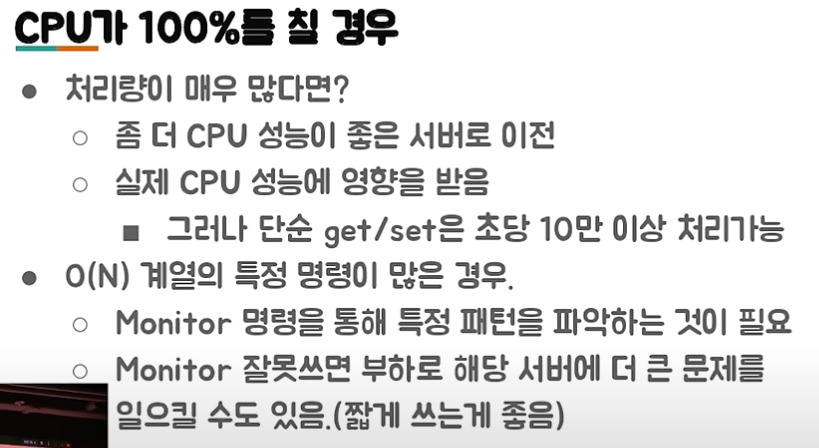

Redis는 in-memory 기반의 데이터베이스입니다. 

cache는 나중에 요청 결과를 미리 저장해두었다가 빠르게 서비스를 해주는 것을 의미 
보통 대부분의 서비스는 파레토의 법칙에 의해, 전체 사용자의 20%가 80%의 요청을 만들어낸다. 이런 상황에는 cache가 굉장히 효과적이다. 

Cache의 사용 예시 
- look-aside 
- write-back 

redis는 memcached와 달리 collection을 제공해준다. 
왜 Collection이 중요한가?
- 개발의 편의성 
- 개발의 난이도 

에를 들면 랭킹 서비스를 구현한다면? 실제로 랭킹을 구현하기 위한 기능을 만들어야 한다. 
하지만 Redis의 Sorted Set을 이용하면 별다른 구현 없이 랭킹 기능을 구현할 수 있다. 

Redis 경우는 자료구조가 Atomic 하기 때문에, 해당 Race Condition을 피할 수 있다.

외부의 Collection을 잘 이용하는 것으로, 여러가지 개발 시간을 단축시키고, 문제를 줄여줄 수 있기 때문에 Collection이 중요하다. 

Redis 사용처 
- Remote Data Store
- 한대에서만 필요하다면, 전역 변수를 쓰면 된다. 
- 주로 많이 쓰이는 곳들
  - 인증 토큰 등을 저장 
  - Ranking 보드로 사용 

Redis Collections 
- Strings
- List
- Set
- Sorted Set
- Hash

보통 prefix를 붙여서 작업별로 key를 분류한다. 

주의할 점 
- Sorted Set의 score는 실수형이기 때문에 실수할 여지가 있다.
- 하나의 컬렉션에 너무 많은 아이템이 들어가면 문제가 발생할 여지가 있다. O(N) 으로 동작하면 느려진다. 

Redis 운영 
- 메모리 관리를 잘하자 
- O(N) 관련 명령어 주의 
- Replication 
- 권장 설정 

## 메모리 관리를 잘하자 
swap 영역을 메모리로 사용하게 되면 redis의 성능이 나빠진다. 
MaxMemory를 설정하더라도 이보다 더 사용할 가능성이 크다. (jemalloc을 사용하는데 redis는 정확히 자신이 사용하는 메모리를 알지 못한다.) 결론은 RSS 값을 모니터링 해야 한다. 
작은 단위로 사용하는 것이 안전하다. 이유는 write가 많이 발생하는 redis 서버는 fork를 하게 되면 1.5 ~ 2배를 사용할 수 있다. 4버전 부터 파편화를 줄이도록 jemalloc에 힌트를 주는 기능이 들어갔다.

### 메모리가 부족할 때는 
- Cache is Cash
  - 좀 더 메모리 많은 장비로 migration
  - 메모리가 빡빡하면 Migration 중에 문제가 발생할 수도 
- 있는 데이터 줄이기 
  - 데이터를 일정 수준에서만 사용하도록 특정 데이터를 줄임 
  - 다만 이미 Swap을 사용중이라면, 프로세스를 재시작 해야함 
- 기본적으로 Collection 들은 다음과 같은 자료구조를 사용한다
  - Hash -> HashTable을 하나 더 사용 
  - Sorted Set -> Skiplist와 HashTable을 이용 
  - Set -> HashTable 사용 
  - 해당 자료구조들은 메모리를 많이 사용함 
  - ziplist를 이용 (성능은 떨어지지만, 매모리 사용은 효율적)
  - 몇개 까지는 ziplist를 사용하고, 개수가 늘어나면 skiplist를 사용 
- O(N) 관련 명령어를 주의하자 
  - Redis는 Single Thread이다. 그러면 Redis가 동시에 여러 개의 명령을 처리할 수 없다.
  - 따라서 다음과 같은 명령어를 사용해선 안된다. 
    - KEYS
      - scan 명령으로 대체 (짧게 여러번 호출한다.)
    - FLUSHALL, FLUSHDB
    - Delete Collections
    - Get All Collections 
      - Collection 일부만 가져오거나 
      - 큰 Collection을 작은 여러개의 Collection으로 나눠서 저장 
      - List(O(N)) 자료구조를 통해서 검색, 삭제시에 모든 item을 매번 찾아봐야 함 
      - Set(O(1))을 이용해서 검색, 삭제를 하도록 수정

## Replication
Replication 설정 과정 
1. Secondary에 replicaof or slaveof 명령을 전달 
2. Secondary는 Primary에 sync 명령 전달 
3. Primary는 현재 메모리 상태를 저장하기 위해 Fork 
4. Fork 한 프로세서는 현재 메모리 정보를 disk에 dump
5. 해당 정보를 secondary에 전달 
   - Fork 이후의 데이터를 secondary에 계속 전달

### 주의할 점 
- Replication 과정에서 fork가 발생하므로 메모리 부족이 발생할 수 있다. 
- Redis-cli--rdb 명령은 현재 상태의 메모리 스냅샷을 가져오므로 같은 문제를 발생시킨다. 
- AWS나 클라우드의 Redis는 좀 다르게 구현되어서 좀더 해당 부분이 안정적이다. 
- 많은 대수의 Redis 서버가 Replica를 두고 있다면(Master의 bandwidth를 초과한다면?) 
  - 네트웍 이슈나, 사람의 작업으로 동시에 replication이 재시도 되도록 하면 문제가 발생할 수 있음 

### 권장설정 
- Maxclient 설정 50000
- RDB/AOF 설정 off
- 특정 commands disable
  - Keys
  - AWS의 ElasticCache는 이미 하고 있음 
- 전체 장애의 90% 이상이 keys와 save 설정으로 인해 발생 
  - ex) 1분 안에 key가 만개가 바뀌면 메모리 덤프

## Redis 데이터 분산 
- Application 
  - Consistent Hashing 
    - 고르게 분산된다. 
  - Sharding 
    - Range
      - Range를 정의하고 Range에 속하면 거기에 저장
      - 그러나 고르게 분산되지 않는다. 
    - Modular
      - Range 보다 균등하게 분배됨 
      - 서버 한대가 추가될 때 재분배 양이 많아진다. 
    - Index
- Redis Cluster 
  - Hash 기반으로 Slot 16384로 구분 
  - Hash 알고리즘은 CRC16을 사용 
  - slot = crc16(key) % 16384
  - Key가 Key{hsahkey} 패턴이면 실제 crc16에 hashkey가 사용된다. 
  - 특정 Redis 서버는 이 slot range를 가지고 있고, 데이터 migration은 이 slot 단위의 데이터를 다른 서버로 전달하게 된다.
  - 자기 slotRange가 아닌 key를 저장하려고 하면 Primary에서 오류를 반환한다. 

### Redis Cluster의 장단점 
- 장점 
  - 자체적인 Primary, Secondary Failover
    - 클러스터 내부의 합의 알고리즘에 의해 Secondary가 Primary로 승격된다. 
  - slot 단위의 데이터 관리 
- 단점 
  - 메모리 사용량이 더 많음
  - Migration 자체는 관리자가 시점을 결정해야 함 
  - Library 구현이 필요함 

### Redis Failover
  

## Redis 모니터링 
- RSS
  - OS에서 Redis를 위해 할당한 물리적 메모리 
- Used Memory
- Connection 수 
- 초당 처리 요청 수 

CPU가 100%를 칠 경우 
- 처리량이 매우 많다면 
- O(N) 계열의 특정 명령이 많은 경우 

결론 
- 메모리를 빡빡하게 쓸 경우, 관리하기가 어려움 
- client-output-buffer-limit 설정이 필요 
 

Redis as Persistent Store
- Primary/Secondary 구조로 구성이 필요함 
- 메모리를 절대로 빡빡하게 사용하면 안됨 
  - 정기적인 migration이 필요 
  - 가능하면 자동화 툴을 만들어서 이용 
- RDB/AOF가 필요하다면 Secondary 에서만 구동 
  - Secondary에서만 구동 

///////////////////////////////////////////

## ElasticCache

### 완전 관리형 서비스 

- 자동으로 failover
- 주요 파라미터 설정인 인스턴스 타입별로 자동 변경 
- ElasticCache 권장 파라미터로 기본값 변경 
  - maxmemory-policy
  - latency-tracking

### 가상 이슈 사례로 알아보는 ElasticCache 

- CPU Utilization
- 메모리 
- 네트워크
  - inbound, outbound 
- 커넥션 
- 커맨드 
  - 어떤 커맨드가 문제를 일으키는지 
- 개발팀 
  - 새로 배포된 것은 없는지?
