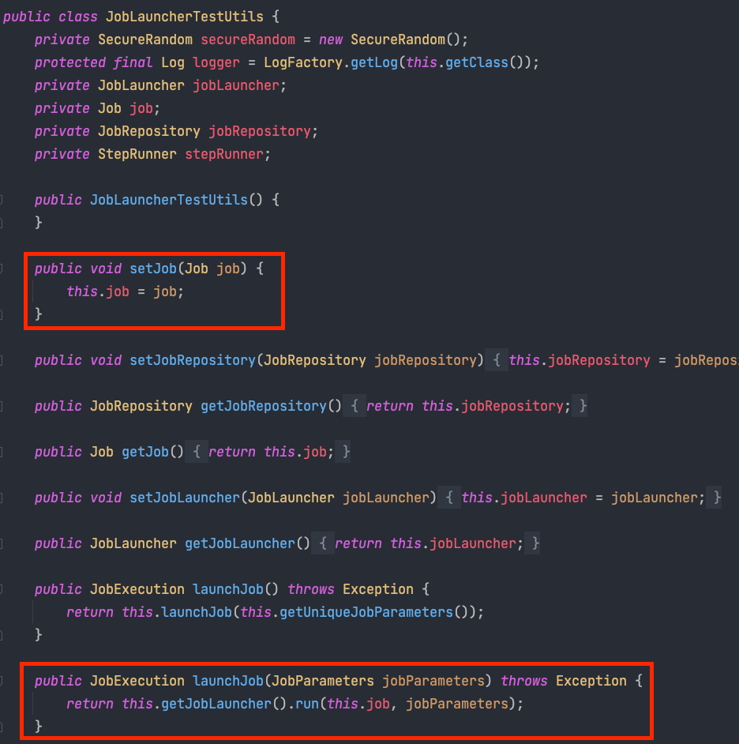
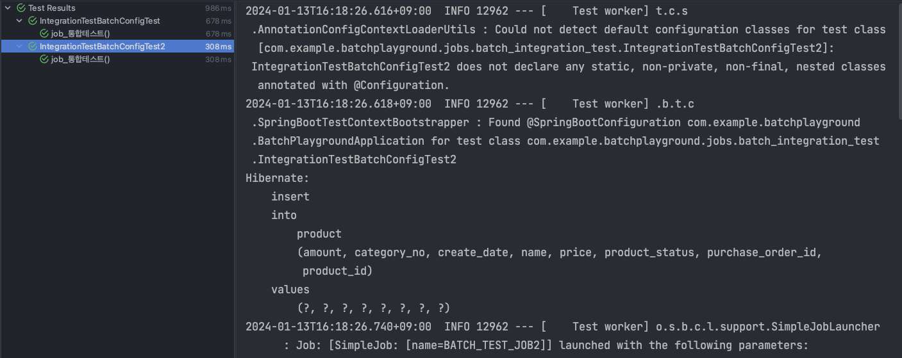

배치 어플리케이션을 관리하면서 어려운 점 중 하나는 QA를 하기 어렵다는 것입니다. 배치 어플리케이션의 특성상 사용자와의 상호작용이 없기 때문입니다. QA 엔지니어 분들이 동작을 테스트하기 위해서는 배치 어플리케이션을 수행하고 DB에 데이터가 제대로 적재되어 있는지를 봐야 합니다. 

이런 특징으로 인해 배치 어플리케이션 개발시에 테스트 코드의 중요성이 더욱 커집니다. 이번 글에는 배치 어플리케이션 테스트 방법과 테스트 코드 성능을 어떻게 높였는지 공유해보고자 합니다. 

## 통합 테스트 
스프링 배치에서 다행히 통합 테스트 코드 작성은 쉬운 편입니다. 스프링 배치에서 제공하는 의존성을 추가해야 합니다. 
```groovy
testImplementation 'org.springframework.batch:spring-batch-test'
```
위의 의존성이 추가되면 ```@SpringBatchTest``` 어노테이션을 이용해서 ```JobLauncherTestUtils``` 빈을 주입받을 수 있습니다. 이외에도 ```JobRepositoryTestUtils```, 
```StepScopeTestExecutionListener```, ```JobScopeTestExecutionListener``` 이 빈으로 등록됩니다. 

각 빈들의 주요 역할은 아래와 같습니다. 
- JobLauncherTestUtils: 스프링 배치에서 필요한 전반적인 유틸 기능들을 지원 
- JobRepositoryTestUtils: DB에 생성된 JobExecution을 쉽게 생성/삭제 
- StepScopeTestExecutionListener: 배치 단위 테스트시 StepScope Context를 생성해줍니다. 
  - 해당 컨텍스트를 통해서 JobParameter 등을 단위 테스트에서 DI 받을 수 있습니다.
- JobScopeTestExecutionListener: 배치 단위 테스트시 JobScope Context를 생성해줍니다. 
  - 해당 컨텍스트를 통해서 JobParameter 등을 단위 테스트에서 DI 받을 수 있습니다. 

스프링 배치 통합테스트에서는 JobLauncherTestUtils를 이용해서 진행할 예정입니다. 제가 작성한 테스트 코드는 이렇습니다. 
아래는 테스트 대상 코드입니다. 
```java
@RequiredArgsConstructor
@Configuration
public class IntegrationTestBatchConfig {

  private final JobRepository jobRepository;
  private final PlatformTransactionManager transactionManager;
  private final EntityManagerFactory entityManagerFactory;
  private int chunkSize;

  @Value("${spring.batch.chunk-size}")
  public void setChunkSize(int chunkSize) {
    this.chunkSize = chunkSize;
  }

  private static final String JOB_NAME = "BATCH_TEST_JOB";

  @Bean(name = JOB_NAME)
  public Job job() {
    return new JobBuilder(JOB_NAME, jobRepository)
            .start(step())
            .build();
  }

  @Bean(name = JOB_NAME + "step")
  public Step step() {
    return new StepBuilder(JOB_NAME + "step", jobRepository)
            .<Product, ProductBackup>chunk(chunkSize, transactionManager)
            .reader(reader(null))
            .processor(processor())
            .writer(writer())
            .build();
  }

  @Bean(name = JOB_NAME + "_reader")
  @StepScope
  public JpaPagingItemReader<Product> reader(
          @Value("#{jobParameters[createDate]}") String createDate
  ) {
    Map<String, Object> params = new HashMap<>();
    params.put("createDate", LocalDate.parse(createDate, DateTimeFormatter.ofPattern("yyyy-MM-dd")));

    return new JpaPagingItemReaderBuilder<Product>()
            .name(JOB_NAME + "reader")
            .entityManagerFactory(entityManagerFactory)
            .pageSize(chunkSize)
            .queryString("SELECT p FROM Product p WHERE p.createDate =:createDate")
            .parameterValues(params)
            .saveState(false) // (4)
            .build();
  }

  private ItemProcessor<Product, ProductBackup> processor() {
    return (product) -> new ProductBackup(product.getName(), product.getPrice());
  }

  @Bean(name = JOB_NAME +"_writer")
  @StepScope
  public JpaItemWriter<ProductBackup> writer() {
    return new JpaItemWriterBuilder<ProductBackup>()
            .entityManagerFactory(entityManagerFactory)
            .build();
  }
}
```
다음은 위의 코드를 검증하기 위한 통합 테스트 코드입니다. 
```java
@SpringBatchTest
@SpringBootTest(classes = {
		TestBatchConfig.class,
        TestBatchJob.class
})
class TestBatchJobTest {

	@Autowired
	private JobLauncherTestUtils jobLauncherTestUtils;

	@Autowired
	private ProductRepository productRepository;

	@Test
	void job_통합테스트() throws Exception {
		productRepository.save(
				Product.builder()
						.name("product")
						.price(4)
						.createDate(LocalDate.of(2023, 12, 11))
						.build());

		JobParameters jobParameters = new JobParametersBuilder()
				.addString("createDate", "2023-12-11")
				.toJobParameters();

		JobExecution jobExecution = jobLauncherTestUtils.launchJob(jobParameters);

		assertThat(jobExecution.getStatus()).isEqualTo(BatchStatus.COMPLETED);
	}
}

@TestConfiguration
@EnableAutoConfiguration
public class TestBatchConfig {
}
```
위의 테스트 코드에서 ```@SpringBootTest```의 classes = {}를 이용해 필요한 테스트 하려는 Job 빈을 등록합니다. 
그리고 ```JobLauncherTestUtils```는 등록된 Job 빈을 찾아 실행합니다. 

### Spring Context 캐싱하지 못하는 문제
하지만 위와 같은 코드는 문제가 있습니다. 테스트 케이스가 많아질수록 테스트 코드 수행 속도가 느려집니다.

```JobLauncherTestUtils```를 확인해보면 하나의 Job만 주입 받아서 launchJob으로 실행합니다. 즉, 테스트 수행시 Spring Context에 있는 Job 빈을 찾아서 launchJob으로 실행합니다. 
그래서 만약 두개 이상의 Job이 빈으로 등록되어 있으면 테스트에 실패합니다. 



문제 없이 테스트를 수행하려면, 모든 테스트 클래스에서 테스트 대상 Job 빈을 등록해야 합니다. 
그러면 아래 코드처럼 필요한 Job빈을 등록하기 위해 classes에 다른 파라미터를 넘겨야 하고, 이 과정에서 Spring Context를 캐싱 하지 못하게 됩니다.
```java
@SpringBootTest(classes = {
    TestBatchConfig.class,
    TestBatchJob1.class
})

@SpringBootTest(classes = {
    TestBatchConfig.class,
    TestBatchJob2.class
})
```
[이전글](https://wooktech.tistory.com/86)에서 살펴 보았듯이 ```@SpringBootTest```의 파라미터가 달라지기 때문에 Spring Context를 캐싱하지 못하기 때문입니다.

테스트 케이스가 별로 없다면 문제가 없겠지만, 테스트 케이스가 계속 추가되면 될수록 테스트 코드의 수행 속도가 급속도로 느려질 가능성이 있습니다.
이를 방지하기 위해서는 ```JobLauncherTestUtils```를 직접 생성하면 됩니다. 

### 하나의 Spring Context를 사용하도록 개선 
아래는 Spring Context를 재생성 하지 않도록 개선한 코드입니다.  
```java
@SpringBatchTest
@SpringBootTest
class IntegrationTestBatchConfigTest {

	private JobLauncherTestUtils jobLauncherTestUtils;

	@Autowired
	private IntegrationTestBatchConfig jobConfig; // (1)

	@Autowired
	private JobLauncher jobLauncher;

	@Autowired
	private JobRepository jobRepository;

	@Autowired
	private ProductRepository productRepository;

	@BeforeEach // (2)
	void setUp() {
		jobLauncherTestUtils = new JobLauncherTestUtils();
		jobLauncherTestUtils.setJob(jobConfig.job());
		jobLauncherTestUtils.setJobLauncher(jobLauncher);
		jobLauncherTestUtils.setJobRepository(jobRepository);
	}

	@Test
	void job_통합테스트() throws Exception {
		productRepository.save(
				Product.builder()
						.name("product")
						.price(4)
						.createDate(LocalDate.of(2024, 12, 21))
						.build());

		JobParameters jobParameters = new JobParametersBuilder()
				.addString("createDate", "2024-12-21")
				.toJobParameters();

		JobExecution jobExecution = jobLauncherTestUtils.launchJob(jobParameters);

		assertThat(jobExecution.getStatus()).isEqualTo(BatchStatus.COMPLETED);
	}
}
```
(1): 테스트 하고자 하는 Job Configuration 클래스를 빈으로 주입 받습니다. 

(2): ```jobLauncherTestUtils```를 빈으로 주입 받지 않고 직접 생성하는 부분입니다. ```@SpringBootTest``` 기능을 이용해서 전체 빈을 띄우고 (2)에서 테스트 대상인 Config 클래스만 @Autowired로 가져오기 때문에
모든 테스트 클래스에서 같은 Spring Context를 이용합니다. Spring Context를 재생성 하지 않아도 되는 것입니다.  
  - 만약 ```jobLauncherTestUtils```를 빈으로 주입 받아서 사용했다면, 모든 테스트 클래스가 주입 받아야 하는 빈이 다르기 때문에 Spring Context를 재사용할 수 없습니다.

확인 결과 첫번째 배치 통합 테스트와는 달리 두번째 배치 통합 테스트에서는 Spring Context를 생성하지 않습니다.


### 테스트 검증은 어떻게?
테스트 검증시 여러 테이블에 대해 변경이 발생했을 경우, 모든 변경에 대해 테스트가 작성되어야 합니다. 따라서 테스트가 Repository에 의존한다면
테이블 개수 만큼 Repository를 주입받아야 합니다. 하지만 테스트 검증을 위한 조회를 Repository에 의존하게 되면 테스트 코드 검증을 위한 조회 로직이 필요하게 됩니다. 
```java
class IntegrationTestBatchConfigTest {
    ...
	@Test
	void job_통합테스트() throws Exception {
		productRepository.save(
				Product.builder()
						.name("product")
						.price(4)
						.createDate(LocalDate.of(2024, 12, 21))
						.build());

		JobParameters jobParameters = new JobParametersBuilder()
				.addString("createDate", "2024-12-21")
				.toJobParameters();
		JobExecution jobExecution = jobLauncherTestUtils.launchJob(jobParameters);
		
		assertThat(jobExecution.getStatus()).isEqualTo(BatchStatus.COMPLETED);
		int size = productBackupRepository.findByCreateDate("2024-12-21").size();
		assertThat(size).isEqualTo(1);
	}
}
```
즉 위의 테스트 메서드에서 처럼 테스트에만 필요한 ```findByCreateDate``` 메서드가 필요합니다.

테스트 만을 위한 메서드를 테스트 스코프가 아닌 위치에 만든다는 것은 좋지 않은 패턴이라고 생각합니다. 
그래서 이런 부분들을 개선하기 위해서 Query Dsl 기반으로 조회할 수 있는 queryFactory를 이용했습니다. 추상 클래스에 EntityManagerFactory를 주입 받고 EntityManager를 직접 생성했습니다.
그리고 EntityManager를 이용해서 queryFactory를 생성했습니다. 아래는 제가 만들었던 추상 클래스입니다. 
```java
@SpringBootTest
@SpringBatchTest
@TestInstance(TestInstance.Lifecycle.PER_CLASS)
@TestConstructor(autowireMode = TestConstructor.AutowireMode.ALL)
@ActiveProfiles("test")
public abstract class BatchTestSupport {
	@Autowired
	protected EntityManagerFactory entityManagerFactory;
	protected EntityManager entityManager;
	protected JPAQueryFactory queryFactory;

	@PostConstruct
	void setUp() {
		entityManager = entityManagerFactory.createEntityManager();
		queryFactory = new JPAQueryFactory(entityManager);
	}

	protected <T> void deleteAll(EntityPath<T> path) {
		entityManager.getTransaction().begin();
		queryFactory.delete(path).execute();
		entityManager.getTransaction().commit();
	}
}
```
```@PostConstruct```를 이용해서 entityManager에서 queryFactory를 생성했습니다. 이제 만들어진 추상클래스를 상속 받아서 상황에 맞게 queryFactory를 이용해 주면 됩니다.
```java
class IntegrationTestBatchConfigTest extends BatchTestSupport {
  ...

  @Test
  void job_통합테스트() throws Exception {
    productRepository.save(
        Product.builder()
            .name("product")
            .price(4)
            .createDate(LocalDate.of(2024, 12, 21))
            .build());

    JobParameters jobParameters = new JobParametersBuilder()
            .addString("createDate", "2024-12-21")
            .toJobParameters();

    JobExecution jobExecution = jobLauncherTestUtils.launchJob(jobParameters);

    assertThat(jobExecution.getStatus()).isEqualTo(BatchStatus.COMPLETED);
    int size = queryFactory.selectFrom(productBackup).fetch().size();
    assertThat(size).isEqualTo(1);
  }
}
```
위의 코드에서 볼 수 있듯이, queryFactory로 조회로직을 구현했기 때문에 실제 로직에서는 불필요한 메서드를 Repository에 만들 필요가 없어졌습니다.

### 테스트 검증 이후 데이터 제거 
스프링 배치 테스트에서 여러 케이스를 검증하기 위해서는, 특정 케이스가 다른 케이스의 테스트에 영향을 미쳐서는 안됩니다. 그렇기 때문에 특정 테스트 케이스가 검증이 완료되면 검증을 위해 저장되어 있던 데이터를 
없애는 작업이 필수적입니다. 그래서 이전에 조회로직을 위해 만들었던 추상 클래스에 ```deleteAll()``` 메서드를 추가했습니다. 
해당 메서드에 EntityPath를 전달하면 테이블의 모든 데이터를 삭제합니다. 
```java
public abstract class BatchTestSupport {
  ...
  protected <T> void deleteAll(EntityPath<T> path) {
    entityManager.getTransaction().begin();
    queryFactory.delete(path).execute();
    entityManager.getTransaction().commit();
  }
}
```
이 ```deleteAll()``` 메서드를 ```@AfterEach```에서 호출하면 테스트 종료후 테이블을 깨끗이 비우게 됩니다.
```java
@AfterEach
void tearDown() {
	deleteAll(product);
}
```

이상 스프링 배치에서 통합 테스트를 작성하는 방법에 대해 알아보았습니다. 
다음에는 스프링 배치에서 유닛 테스트 작성하는 방법에 대해 알아보겠습니다. 
감사합니다.

