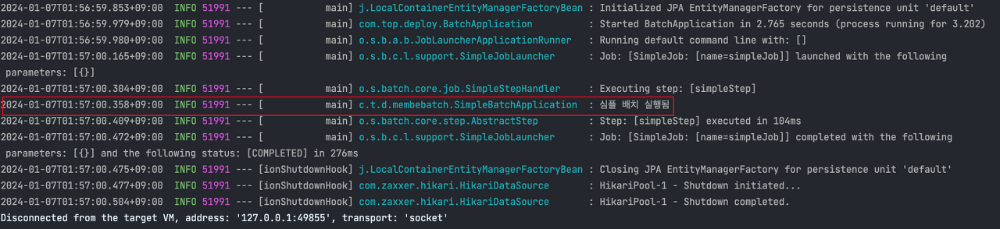

이번 글은 Jenkins를 이용해서 Spring Batch 배포 서버를 구축했던 과정을 이야기해보고자 한다. 

물론 Jenkins가 아니더라도 Spring Batch를 관리하는 방법은 다양하다.

- Cron
- 클라우드 서버리스
- API 기반의 직접 만든 관리자 페이지
- Quartz를 이용한 관리자 페이지
- CI 서비스 (Jenkins/TeamCity 등)

이 중에서 이번 글에서는 Jenkins를 이용한 Spring Batch 관리에 대해 글을 작성해보고자 한다.

## Jenkins
jenkins는 java 진영에서 많이 사용되는 CI 툴로 대부분의 경우 배포 용도로 사용된다. 그러다보니 배치에서도 Jenkins를 써야 한다면 거부감이 들기 마련이다.
이는 배포를 하는 Jenkins에서 Spring Batch까지 관리를 하기 때문에 생기는 거부감이다. 하지만 만약 배포용 Jenkins와 Spring Batch 관리용 Jenkins를 분리한다면 관심사가 분리가 되면서 효율적인 관리가 가능하다고 생각한다. 그래서 이번 글에서는 아래 그림 처럼 Jenkins의 역할을 나누어 두 개의 Jenkins로 Spring Batch 실행환경을 만들고자 한다.


위의 그림에서 보듯이, 하나의 Jenkins는 배포용으로 사용되어 배치 어플리케이션을 빌드하고 S3에 업로드한다. 이후 Code Deploy에 요청하여 배치용 Jenkins에 jar 파일을 배포한다.
이렇게 별도로 Batch jar을 실행하는 Jenkins를 둘 경우, 배포와 실행이 개별 과정으로 수행될 수 있다. 여기서 하나의 Jenkins로 수행되면 안될까에 대해 궁금할 수 있다. Jenkins를 나누는 궁극적 이유는 배포용 Jenkins가 DB 접근 권한까지 가지는 것은 위험하기 때문이다. 또한, 배포용 Jenkins가 업데이트 중이라도, Spring Batch 관리용 Jenkins는 영향 없이 배치 작업을 수행할 수 있다.

## IAM Role 생성
배포용 Jenkins와 Batch용 Jenkins에 IAM Role을 할당한다.

- AmazonS3FullAccess
- AWSCodeDeployFullAccess

해당 IAM Role을 두개의 jenkins 서버에 할당해 주면 된다.


**실습에서 배치용 jenkins 서버는 Docker를 이용해서 설치했다. 아래는 배치용 jenkins 서버를 설치했던 docker 명령어이다.**

```shell
docker run --name jenkins -d -p 8080:8080 -v ~/jenkins:/var/jenkins_home
-u root jenkins/jenkins:latest
```

주목할 점은 호스트의 jenkins 디렉토리가 도커 컨테이너의 /var/jenkins_home 디렉토리에 마운트 되었다는 것이다. 나중에 배치 Jar가 배포되면 /jenkins 디렉토리 밑에 배포가 되어야 한다. 그래야 jenkins 컨테이너 내부에서 해당 jar 파일을 볼 수 있고, 직접 실행할 수 있다. 

## Code Deploy 용 IAM Role 생성

빌드된 batch jar 파일을 배포하기 위해 AWS의 Code Deploy를 이용한다. Code Deploy에 적용할 역할을 생성한다.


## S3 버킷 생성
다음은 빌드된 Batch의 jar파일을 저장할 S3 버킷을 만드는 단계이다. 배포용 jenkins 서버에서 빌드된 이후 zip 파일로 s3에 업로드 된다.


S3까지 만들어졌으니 Code Deploy를 생성할 것이다.

## Code Deploy 생성

code deploy의 애플리케이션 이름은 batch-deploy로 했다. 그리고 배치용 jenkins가 설치된 ec2에 배포할 것이기 때문에 플랫폼은 EC2/온프레미스로 선택했다.


다음으로는 배포 그룹을 생성한다.


배포 대상으로는 배치용 jenkins 서버를 지정한다.


이렇게 하면 AWS에서 수행해야 할 모든 작업이 끝났다. 다음으로는 간단한 배치 프로젝트를 만들어 볼 것이다.

```java
package com.top.deploy.membebatch;

import lombok.RequiredArgsConstructor;
import lombok.extern.slf4j.Slf4j;
import org.springframework.batch.core.Job;
import org.springframework.batch.core.Step;
import org.springframework.batch.core.job.builder.JobBuilder;
import org.springframework.batch.core.repository.JobRepository;
import org.springframework.batch.core.step.builder.StepBuilder;
import org.springframework.batch.repeat.RepeatStatus;
import org.springframework.context.annotation.Bean;
import org.springframework.context.annotation.Configuration;
import org.springframework.transaction.PlatformTransactionManager;

@Configuration
@RequiredArgsConstructor
@Slf4j
public class SimpleBatchApplication {

   private final JobRepository jobRepository;
   private final PlatformTransactionManager transactionManager;

   @Bean
   public Job job() {
      return new JobBuilder("simpleJob", jobRepository)
            .start(step())
            .build();
   }

   @Bean
   public Step step() {
      return new StepBuilder("simpleStep", jobRepository)
            .tasklet((contribution, chunkContext) -> {
               log.info("심플 배치 실행됨");
               return RepeatStatus.FINISHED;
            }, transactionManager)
            .build();
   }
}
```

위의 배치 어플리케이션을 실행해보면 아래와 같이 info 레벨의 로그가 잘 찍히는 것을 볼 수 있다.




## Code Deploy 연동
프로젝트에 배포를 위한 설정 파일을 추가해야 한다. 먼저 member-batch 프로젝트 안에 codedeploy 디렉토리를 생성한다. 그리고 해당 디렉토리 안에 2개의 파일을 추가한다.


### appspec.yml
```yaml
version: 0.0
os: linux
files:
  - source:  /
    destination: /home/ubuntu/jenkins/batch/deploy

permissions:
  - object: /
    pattern: "**"
    owner: root
    group: root

hooks:
  ApplicationStart:
    - location: deploy.sh
      timeout: 60
      runas: root
```

- file.destination: /home/ubuntu/jenkins/batch/deploy 
  - Code Deploy로 배포되는 서버의 /home/ubuntu/jenkins/batch/deploy 위치로 파일을 모두 옮긴다는 것을 의미한다.

- permissions
  - 모든 실행 권한을 jenkins:jenkins로 하겠다는 의미이다.

- hooks.ApplicationStart
  - 배포 파일을 모두 옮긴 후, 지정한 파일(deploy.sh)를 실행한다.

  
appspec.yml을 생성했으면 다음으로는 deploy.sh 파일을 codedeploy 디렉토리에 생성한다. 코드는 아래와 같다.

```shell
ORIGIN_JAR_PATH='/home/ubuntu/jenkins/batch/deploy/*.jar'
ORIGIN_JAR_NAME=$(basename ${ORIGIN_JAR_PATH})
TARGET_PATH='/home/ubuntu/jenkins/batch/application.jar'
JAR_BOX_PATH='/home/ubuntu/jenkins/batch/jar/'
JENKIN_JAR_PATH='/var/jenkins_home/batch/jar/'

echo "  > 배포 JAR: "${ORIGIN_JAR_NAME}

echo "  > chmod 770 ${ORIGIN_JAR_PATH}"
sudo chmod 770 ${ORIGIN_JAR_PATH}

echo "  > cp ${ORIGIN_JAR_PATH} ${JAR_BOX_PATH}"
sudo cp ${ORIGIN_JAR_PATH} ${JAR_BOX_PATH}

echo "  > chown -h jenkins:jenkins ${JAR_BOX_PATH}${ORIGIN_JAR_NAME}"
sudo chown -h jenkins:jenkins ${JAR_BOX_PATH}${ORIGIN_JAR_NAME}

echo "  > sudo ln -s -f ${JAR_BOX_PATH}${ORIGIN_JAR_NAME} ${TARGET_PATH}"
sudo ln -s -f ${JENKINS_JAR_PATH}${ORIGIN_JAR_NAME} ${TARGET_PATH}
```

- sudo cp ${ORIGIN_JAR_PATH}${JAR_BOX_PATH}
  - 배포 파일들 중, jar 파일을 찾아 jar를 모아두는 디렉토리로 복사

- echo">chown-h jenkins:jenkins${JAR_BOX_PATH}${ORIGIN_JAR_NAME}"
  - 복사된 jar 파일의 권한은 jenkins:jenkins로 변경

- sudo ln -s -f ${JENKINS_JAR_PATH}${ORIGIN_JAR_NAME}${TARGET_PATH}
  - 심볼릭 링크로 application.jar를 배포된 jar 파일에 연결
 
이제 프로젝트 설정까지 끝났다. 다음 글에서는 본격적으로 배포용 Jenkins 서버와 배치용 Jenkins 서버를 설정해볼 것이다.
