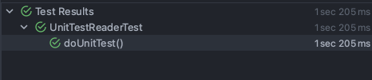

이전글에 이어서 이번에는 스프링 배치에서 단위 테스트를 다려보려고 합니다. 스프링 배치는 QA로 검증하기가 어렵기 때문에 테스트의 중요성이 높다고 
말씀드렸습니다. 그에 따라 통합 테스트의 중요성이 컸습니다. 그래서 많은 분들이 스프링 배치에서 통합 테스트만 작성하는 것을 보았습니다. 

하지만 스프링 배치 단위 테스트도 통합 테스트에 못지 않게 중요하다고 생각합니다. 그래서 이번 글에서는 itemReader를 검증하는 두가지 포인트에 집중해보고자 합니다.
- stepScope, jobScope의 jobParameter가 제대로 전달되는지
- itemReader의 쿼리문이 제대로 동작하는지 

## ItemReader
itemReader는 보통 DB와 결부되어서 많이 사용됩니다. 그래서 DB에서 데이터를 읽어오는 JpaPagingItemReader, JdbcPagingItemReader와 같은 reader들은 단위 테스트를 
진행할 때 데이터베이스에 미리 데이터를 넣어놓고 단위테스트를 진행하게 됩니다. 아래는 실제 테스트 대상이 되는 코드입니다. 
```java
@RequiredArgsConstructor
@Configuration
public class BatchConfiguration {
    ...
    
    @Bean
    @StepScope
    public JpaPagingItemReader<Product> reader(
            @Value("#{jobParameters[createDate]}") String createDate
    ) {
        Map<String, Object> params = new HashMap<>();
        params.put("createDate", LocalDate.parse(createDate, DateTimeFormatter.ofPattern("yyyy-MM-dd")));
    
        return new JpaPagingItemReaderBuilder<Product>()
                .name(JOB_NAME + "reader")
                .entityManagerFactory(entityManagerFactory)
                .pageSize(chunkSize)
                .queryString("SELECT p FROM Product p WHERE p.createDate =:createDate")
                .parameterValues(params)
                .saveState(false) 
                .build();
    }
}
```

위의 코드를 확인해 보면, reader가 @StepScop를 이용해서 JobParamter를 사용하는 것을 확인할 수 있습니다. 그렇다면 테스트 코드에서도 JobParamter를 주입받을 수 있어야 겠습니다. 
다행히도 테스트 시점에 JobParamter를 입력받아 reader에 전달해주는 기능을 ```StepScopeTestExecutionListener```가 제공합니다.
그리고 ```@SpringBatchTest``` 어노테이션을 이용하면 자동으로 ```StepScopeTestExecutionListener```이 지원됩니다. 

아래는 위의 reader를 단위테스트로 검증하는 코드입니다. 
```java
class UnitTestReaderTest extends BatchTestSupport {

	@Autowired
	private ProductRepository productRepository;

	@Autowired
	private JpaPagingItemReader<Product> reader;
	private static final String ORDER_DATE = "2024-01-16";
	private static final LocalDate PRODUCT_CREATE_DATE = LocalDate.of(2024, 1, 16);

	@BeforeEach
	void setUp() { // (1)
		productRepository.deleteAllInBatch();
	}


	public StepExecution getStepExecution() { // (2)
		JobParameters jobParameters = new JobParametersBuilder()
				.addString("createDate", ORDER_DATE)
				.toJobParameters();

		return MetaDataInstanceFactory.createStepExecution(jobParameters);
	}

	@Test
	void doUnitTest() throws Exception {
		saveProduct("product1", PRODUCT_CREATE_DATE);
		saveProduct("product2", PRODUCT_CREATE_DATE);
		saveProduct("product3", PRODUCT_CREATE_DATE);

		reader.open(new ExecutionContext());

		assertThat(reader.read()).isNotNull();
		assertThat(reader.read()).isNotNull();
		assertThat(reader.read()).isNotNull();
		assertThat(reader.read()).isNull(); // (3)
	}

	private void saveProduct(String product, LocalDate createDate) {
		productRepository.save(new Product(product, createDate));
	}
}
```
(1): 다른 단위 테스트간의 격리를 위해 테스트 작업 직전에 db를 지워주고 작업을 진행합니다. 

(2): 해당 getStepExecution 메서드가 JobParamter를 가지고 있는 StepExecution로 교체해주고, reader는 교체된 StepExecution으로 작업을 합니다.

(3): reader의 read 메서드의 경우 더 이상 데이터가 없으면, null을 반환합니다. 예제의 경우 3개의 item을 저장했으므로 4번째 read 메서드는 null을 반환해야 합니다. 

유닛 테스트를 정상적으로 테스트가 통과된 것을 확인하실 수 있습니다. 



그렇다면 ```StepScopeTestExecutionListener```는 어떻게 getStepExecution 메서드를 읽어서 StepExecution을 교체해 주는 걸까요? 
```java
public class StepScopeTestExecutionListener implements TestExecutionListener {
    ...

	protected StepExecution getStepExecution(TestContext testContext) {
		Object target = testContext.getTestInstance();

		ExtractorMethodCallback method = new ExtractorMethodCallback(StepExecution.class, "getStepExecution");
		ReflectionUtils.doWithMethods(target.getClass(), method);
		if (method.getName() != null) {
			HippyMethodInvoker invoker = new HippyMethodInvoker();
			invoker.setTargetObject(target);
			invoker.setTargetMethod(method.getName());
			try {
				invoker.prepare();
				return (StepExecution) invoker.invoke();
			} catch (Exception e) {
				throw new IllegalArgumentException("Could not create step execution from method: " + method.getName(),
						e);
			}
		}

		return MetaDataInstanceFactory.createStepExecution();
	}
}
```
위의 코드를 보면 getStepExecution을 가져오는 부분을 확인하실 수 있습니다. StepExecution 타입을 반환하는 메서드를 찾아서 호출합니다. 
```java
ExtractorMethodCallback method = new ExtractorMethodCallback(StepExecution.class, "getStepExecution");
```
그리고 context에 새로운 StepExecution이 적용됩니다. 
```java
@Override
public void prepareTestInstance(TestContext testContext) throws Exception {
    StepExecution stepExecution = getStepExecution(testContext);

    if (stepExecution != null) {
        testContext.setAttribute(STEP_EXECUTION, stepExecution);
    }
}
```
