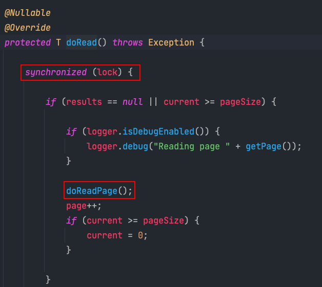

일반적으로 Spring Batch는 단일 쓰레드에서 실행된다. 즉, 모든 것이 순차적으로 실행되는 것을 의미한다. 그래서 Spring Batch에서는 이를 병렬로 실행 시킬 수 있는 여러가지 방법을 제공한다.

물론, Spring Batch로 처리해야 하는 데이터가 적은 경우에는 단일 쓰레드로 처리해도 문제가 없을 것이다. 하지만 데이터가 일정 규모 이상이 되면 서버를 Scaling 하듯이 배치 어플리케이션 역시 확장이 필요하다.
그 중 이야기 해 볼 Scaling 방법은 멀티쓰레드 Step과 파티셔닝이다. 이 두 가지 방식은 하나의 배치 어플리케이션에서 여러 쓰레드를 이용해 Scaling 하는 방법이다.

- 멀티쓰레드 Step: 하나의 Step에서 처리하는 각 Chunk를 여러 쓰레드에서 실행하는 방법이다. 
- 파티셔닝: 데이터를 일정 기준으로 나눠서 여러 Step에서 처리하는 방법이다.

물론 배치 어플리케이션을 수행하는 인스턴스의 CPU 자원이 부족하다면, 멀티쓰레드의 적용이 별다른 성능 향상을 보여주지 못할 것이다. 하지만 충분한 자원이 있다면 분명 멀티쓰레드를 적용하여 배치 어플리케이션의 성능 향상을 보여줄 수 있을 것이다.
먼저 멀티쓰레드 Step에 대해서 다루어보자.

## 멀티쓰레드 Step

Spring Batch의 멀티쓰레드 Step은 Spring의 TaskExecutor를 이용하여 각 쓰레드가 Chunk 단위로 실행하게 되는 방식이다. 멀티쓰레드 방식의 구조는 아래와 같다.


먼저 살펴보아야 할 부분은 ItemReader와 ItemWriter가 멀티쓰레드를 지원하는지 확인해야 한다. 아래는 JpaPagingItemReader의 JavaDoc 이다. 아래와 같이 thread-safe 라는 표현이 있어야 멀티쓰레드 환경에서 사용해도 문제가 없다. 


또 한가지 주목할 부분이 있는데, saveState=fasle로 사용되어야 한다는 점이다. 실패한 부분부터 다시 시작할 수 있는 것이 스프링 배치의 큰 장점인데 왜 멀티쓰레드 환경에서는 사용하지 말라고 할까? 이유는 작업이 순차적으로 처리되는 것이 보장되지 않기 때문이다. 만약 단일 쓰레드에서 처리가 된다면 첫번째 작업이 완료되고 두번째 작업이 시작되는 것이 보장된다. 하지만 멀티쓰레드로 배치 작업을 수행한다면, 첫번째 작업이 두번째 작업보다 무조건 더 빨리 처리된다고 보장할 수 없다. 
만약, 두번째 작업이 완료되고, 첫번째 작업에서 실패가 발생한다면? saveState=true로 지정되면 배치 작업은 세번째 작업 부터 시작할 것이기 때문에 첫번째 작업에 대한 처리는 누락되는 문제가 발생한다. 
그럼 이제 본격적으로 코드로 멀티쓰레드 Step을 어떻게 구현하는지 살펴보자

먼저 TaskExecutor 부분이다.
```java
@Bean(name = JOB_NAME + "taskPool")
public TaskExecutor executor() {
    ThreadPoolTaskExecutor executor = new ThreadPoolTaskExecutor();
    executor.setCorePoolSize(poolSize); // (1)
    executor.setMaxPoolSize(poolSize);
    executor.setThreadNamePrefix("multi-thread-");
    executor.setWaitForTasksToCompleteOnShutdown(Boolean.TRUE);
    executor.initialize();
    return executor;
}
```

- poolSize
  - TaskExecutor의 poolSize를 지정해준다. Step의 chunk를 처리하는 쓰레드의 갯수를 지정해주었다.
- corePoolSize: Pool의 기본 사이즈
- maxPoolSize: Pool의 최대 사이즈

```java
@Bean(name = JOB_NAME)
public Job job() throws Exception {
    return new JobBuilder(JOB_NAME, jobRepository)
            .start(step())
            .build();
}

@Bean(name = JOB_NAME + "_step")
public Step step() throws Exception {
    return new StepBuilder(JOB_NAME, jobRepository)
            .<Product, ProductBackup>chunk(chunkSize, transactionManager)
            .reader(reader(null))
            .processor(processor())
            .writer(writer())
            .taskExecutor(executor()) // (1)
            .build();
}

@Bean(name = JOB_NAME + "_reader")
@StepScope
public JdbcPagingItemReader<Product> reader(
        @Value("#{jobParameters[createDate]}") String createDate
) throws Exception {
    Map<String, Object> params = new HashMap<>();
    params.put("createDate", createDate);

    SqlPagingQueryProviderFactoryBean queryProvider = new SqlPagingQueryProviderFactoryBean();
    queryProvider.setDataSource(readerDataSource);
    queryProvider.setSelectClause("id, name, price, create_date");
    queryProvider.setFromClause("from product");
    queryProvider.setWhereClause("where create_date = :createDate");
    queryProvider.setSortKey("id");

    return new JdbcPagingItemReaderBuilder<Product>()
            .name(JOB_NAME + "_reader")
            .pageSize(chunkSize)
            .rowMapper(new RowMapper<Product>() {
                @Override
                public Product mapRow(ResultSet rs, int rowNum) throws SQLException {
                    return new Product(
                            rs.getString("name"),
                            rs.getLong("price"),
                            rs.getObject("create_date", LocalDate.class)
                    );
                }
            })
            .dataSource(readerDataSource)
            .queryProvider(queryProvider.getObject())
            .parameterValues(params)
            .saveState(false) // (2)
            .build();
}

private ItemProcessor<Product, ProductBackup> processor() {
    return ProductBackup::new;
}

@Bean(name = JOB_NAME + "_writer")
@StepScope
public JpaItemWriter<ProductBackup> writer() {
    return new JpaItemWriterBuilder<ProductBackup>()
            .entityManagerFactory(entityManagerFactory)
            .build();
}
```

(1) taskExecutor
- 이전에 만들어 놓은 taskExecutor을 Step에 세팅하는 부분이다. 

(2) saveState

- 이전에 말했듯이 멀티쓰레드 step은 chunk 간의 순서가 보장되지 않기 때문에 saveState를 false로 둔다. 
- 만약 이 옵션을 켜면 앞쪽의 Chunk에서 실패가 발생했음에도, 재시작 시에 앞쪽의 Chunk에 대한 작업이 누락될 위험이 있다. 멀티 쓰레드 Step에서는 꼭 **saveState를 false로 두고 실패하면 처음부터 다시 실행될 수 있도록 해야 한다.**

보통 Paging으로 아이템을 조회하는 reader는 thread-safe 하기 때문에 멀티쓰레드 Step을 이용해서 성능 향상이 가능하다. 그렇다면 왜 PagingItemReader 들은 thread-safe할지 코드로 이해해보자.

우선 PagingItemReader에 taskExecutor을 지정하면 RepeatTemplate 대신 TaskExecutorRepeatTemplate이 stepOperations에 지정된다.  아래 코드는 AbstractTaskletStepBuilder에서 TaskletStep을 생성하는 build 메서드 내부이다.


그리고 해당 stepOperations는 chunk단위로 transaction을 생성하여 reader, processor, writer 작업을 처리한다. 


TaskExecutorRepeatTemplate이 RepeatTemplate과 다른 부분은, 아래 코드에서 보듯이 taskExecutor를 이용해서 개별 쓰레드를 chunk 단위로 처리한다는 점이다. 


그렇다면 궁금한 점이 생긴다. 멀티쓰레드에서 paging은 어떻게 할까? paging은 page의 순서가 중요하기 때문이다. 만약 특정 쓰레드에서 paging을 진행했는데, 동시에 다른 쓰레드에서 같은 page에 paging을 진행한다면 어떻게 될까? 일반적인 경우는 당연히 중복된 데이터를 조회하게 될 것이다. 하지만 멀티쓰레드 Step에서는 synchronized를 이용해 중복된 데이터를 읽는 문제를 막았다. 



보통 itemReader는 chunkSize만큼 read 메서드를 호출하게 되는데, read 메서드를 호출할 때마다 다른 쓰레드에서는 접근할 수 없게 되는 것이다. 그리고 doRead 메서드에서 호출되는 paging을 제공하는 메서드도 synchronize 블럭 안에서 수행되므로 thread-safe 하게 페이징을 수행할 수 있다. 하지만 itemReader에서의 성능 향상은 기대했던 것 만큼 향상되지 않을 것이다. 대신 itemProcessor, itemWriter의 성능은 멀티쓰레드 환경에서 확실하게 올라간다.

이번 글에서는 분량상 멀티쓰레드 Step만 다루었고, 다음 글에서는 파티셔닝으로 성능 향상을 이루는 방법에 다루어 볼 것이다.
