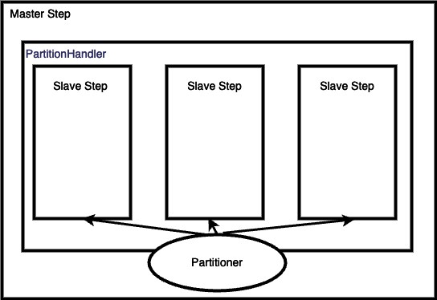
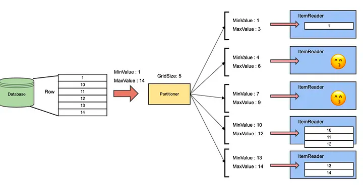

이번 글에서는 이전글의 멀티쓰레드 스텝에 이어서 스프링 배치의 Scale out 방법중의 하나인 파티셔닝에 대해 알아보겠습니다. 

멀티쓰레드 스텝과 파티셔닝은 공통적으로 멀티쓰레드로 성능을 높인다는 공통점을 가지고 있습니다. 하지만 큰 차이를 가지고 있습니다. 멀티 쓰레드 스텝에서는 ItemReader를 여러 쓰레드에서 공유해서 사용합니다. 따라서 멀티 쓰레드 스텝에서 synchronized로 동시성을 처리합니다.
PagingItemReader에서 동시성을 처리해주는 synchronized가 들어있는 것을 확인할 수 있습니다.  
```java
@Nullable
@Override
protected T doRead() throws Exception {

    synchronized (lock) {

        if (results == null || current >= pageSize) {

            if (logger.isDebugEnabled()) {
                logger.debug("Reading page " + getPage());
            }

            doReadPage();
            page++;
            if (current >= pageSize) {
                current = 0;
            }

        }
	...
```
이처럼 멀티쓰레드 스텝에서는 ItemReader가 synchronized로 동시성 처리를 하기 때문에 read의 성능 향상은 크지 않습니다.
반면에 파티셔닝은 멀티쓰레드 스텝과 달리 쓰레드간에 자원을 공유하지 않습니다. Step 자체를 분리해서 병렬적으로 작업하기 때문입니다. 따라서 파티셔닝은 멀티쓰레드 스텝에 비해 read 성능을 크게 향상시킬 수 있습니다. 

## 파티셔닝 구조

파티셔닝은 MasterStep 내부에 여러개의 SlaveStep이 존재하는 구조를 띄고있습니다. 그리고 PartitionHandler는 Partitioner를 이용해서 여러개의 SlaveStep으로 나눕니다.
이후 PartitionHandler에서 각 SlaveStep을 병렬적으로 실행합니다.  



코드로 보겠습니다. 아래는 ```PartitionHandler```의 handle 메서드입니다. ```Partitioner```를 가지고있는 ```StepSplitter```가 gridSize개수 만큼 StepExecution을 반환합니다.  
```StepSplitter``` 내부적으로 ```Partitioner```가 Step의 작업을 분리합니다. 그리고 ```doHandle``` 에서 나누어진 StepExecution으로 SlaveStep을 병렬적으로 수행합니다. 
```java
@Override
public Collection<StepExecution> handle(final StepExecutionSplitter stepSplitter,
        final StepExecution managerStepExecution) throws Exception {
    final Set<StepExecution> stepExecutions = stepSplitter.split(managerStepExecution, gridSize);

    return doHandle(managerStepExecution, stepExecutions);
}
```
```StepSplitter``` 내부의 ```Partitioner```는 어떻게 작업을 나눌까요? Partitioner의 코드를 보겠습니다. 
```java
@Slf4j
@RequiredArgsConstructor
public class ProductIdRangePartitioner implements Partitioner {

	private final ProductBatchRepository productBatchRepository;
	private final LocalDate startDate;
	private final LocalDate endDate;

	@Override
	public Map<String, ExecutionContext> partition(int gridSize) {
		long min = productBatchRepository.findMinId(startDate, endDate); //(1)
		long max = productBatchRepository.findMaxId(startDate, endDate); //(2)

		long targetSize = (max - min) / gridSize + 1;

		Map<String, ExecutionContext> result = new HashMap<>();
		long number = 0;
		long start = min;
		long end = start + targetSize - 1;

		while (start <= max) { //(3)
			ExecutionContext value = new ExecutionContext();
			result.put("partition" + number, value);

			if (end >= max) {
				end = max;
			}

			value.putLong("minId", start);
			value.putLong("maxId", end);
			start += targetSize;
			end += targetSize;
			number++;
		}

		return result;
	}
}
```
(1): 작업하고자 하는 아이템의 가장 첫번째 id를 찾습니다.
(2): 작업하고자 하는 아이템의 가장 마지막 id를 찾습니다.
(3): gridSize 만큼 작업들을 쪼개서 각 ExecutionContext에 각각의 최소 id, 최대 id를 할당합니다. 

이후 ItemReader에서는 최소 id, 최대 id를 가지고 있는 StepExecution을 주입받아서 필요한 작업을 진행합니다. 

```java
@Bean
@StepScope
public JpaPagingItemReader<Product> reader_230410(
        @Value("#{stepExecutionContext[minId]}") Long minId,
        @Value("#{stepExecutionContext[maxId]}") Long maxId
) {
    Map<String, Object> params = new HashMap<>();
    params.put("minId", minId);
    params.put("maxId", maxId);
	
    return new JpaPagingItemReaderBuilder<Product>()
            .name("reader_230410")
            .entityManagerFactory(entityManagerFactory)
            .pageSize(chunkSize)
            .queryString(
                    "SELECT p " +
                    "FROM Product p " +
                    "WHERE p.id BETWEEN :minId AND :maxId")
            .parameterValues(params)
            .build();
}
```

```doHandle``` 메서드에서는 각 SlaveStep의 작업을 task로 만든 후 TaskExecutor가 병렬적으로 처리합니다. 
```java
@Override
protected Set<StepExecution> doHandle(StepExecution managerStepExecution,
Set<StepExecution> partitionStepExecutions) throws Exception {
Assert.notNull(step, "A Step must be provided.");
final Set<Future<StepExecution>> tasks = new HashSet<>(getGridSize());
final Set<StepExecution> result = new HashSet<>();

		for (final StepExecution stepExecution : partitionStepExecutions) {
			final FutureTask<StepExecution> task = createTask(step, stepExecution);

			try {
				taskExecutor.execute(task);
				tasks.add(task);
			}
        ...		
```

병렬적으로 수행된 각 SlaveStep의 작업들은 ```StepExecutionAggregator```에 의해 합쳐집니다. 
```java
@Override
protected void doExecute(StepExecution stepExecution) throws Exception {
    stepExecution.getExecutionContext().put(STEP_TYPE_KEY, this.getClass().getName());

    // Wait for task completion and then aggregate the results
    Collection<StepExecution> executions = partitionHandler.handle(stepExecutionSplitter, stepExecution);
    stepExecution.upgradeStatus(BatchStatus.COMPLETED);
    stepExecutionAggregator.aggregate(stepExecution, executions);

    // If anything failed or had a problem we need to crap out
    if (stepExecution.getStatus().isUnsuccessful()) {
        throw new JobExecutionException("Partition handler returned an unsuccessful step");
    }
}
```

## 생각해볼점
지금까지 스프링 배치의 파티셔닝에 대해 살펴보았습니다. 파티셔닝은 작업을 나누고 여러개의 Step이 병렬적으로 작업을 진행하기 때문에 멀티쓰레드 스텝과 달리 공유 자원에 대해 신경쓸 필요가 없습니다. 따라서 동시성 처리에 의한 성능 감소도 없습니다. 
하지만 파티셔닝에서는 ```Paritioner```를 어떻게 잘 나눠줄 수 있을지를 상황에 맞게 고민해봐야 합니다. 

```Partitioner``` 예제에서는 Database에서 id라는 순차적인 값의 첫번째 id와 마지막 id를 가지고 와서 GridSize에 맞게 MinId, MaxId로 값을 전달해 주었습니다. 
그런데 만약 Id가 중간중간 값이 비어 있다면 어떻게 될까요?



데이터가 고르게 분포되지 않아서, 위의 2번째 3번째 스텝은 작업을 하지 않고 놀고 있습니다. 이처럼 파티셔닝에서는 id가 고르게 분포하고 있지 않다면 심한 불균형을 가져올 수 있습니다. 

