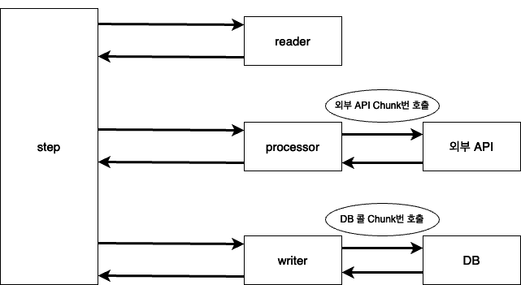
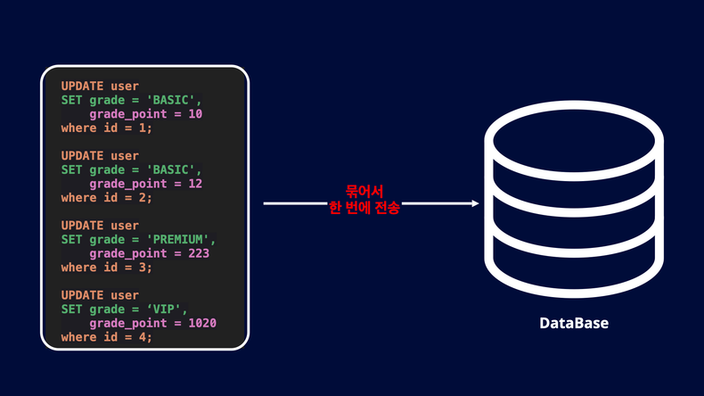

이전 글에서 스프링 배치의 read에서 성능 최적화를 다룬 적이 있습니다. 

[배치에서 QuerydslItemReader 개발하기](https://wooktech.tistory.com/71)

스프링 배치에서 read만 빨리해도 큰 성능 최적화를 할 수 있지만, write에서 병목이 발생한다면 성능 효과가 줄어들 수 밖에 없습니다. 
그래서 이번 글에서는 processor, writer에서 성능 향상을 했던 경험에 대해 다루어 보겠습니다.

먼저 배치 성능 향상에서 초점을 맞췄던 점은 processor, writer에서 발생하는 Network I/O와 Database I/O 그리고 DirtyCheck 제거입니다. 


유저의 등급을 올리기 위해 유저의 사용 정보를 외부 api를 통해 조회하는 배치 프로그램을 개발한다고 가정하겠습니다. 
아래는 유저의 등급을 업데이트 한다는 가정하에 대략적인 flow 입니다. 



위 이미지에서 processor에서 외부 api를 통해 유저의 정보를 조회합니다. 하지만 문제는 단건으로 조회하기 때문에 chunk size만큼의 Network I/O가 발생합니다.
만약 외부 api의 응답속도가 150ms라고 해도 chunk size가 1000이라면 모든 chunk를 처리하기 위해서 150,000ms가 필요합니다. api 요청이 동기적으로 처리되기 때문입니다. 
또한 writer에선 단건으로 db에 update를 요청합니다. 즉 chunk size 만큼의 Database I/O가 발생합니다. 

## Network I/O 개선 

우선 배치 성능을 개선하기 위해서는 processor에서 발생하는 Network I/O를 개선해야 합니다. 하지만 processor는 단건으로 처리하도록 설계되어 있습니다. processor에선 단건으로 아이템을 처리하고 chunk size만큼 모이면 writer로 chunk를 넘기기 때문입니다.
따라서 processor에서 하던 외부 api 요청 작업은 writer에서 처리했습니다. 

writer에선 유저 정보를 chunk size 만큼 묶어서 한번에 api로 요청할 수 있습니다. 물론 단 건 조회 api와는 별개로 벌크 처리할 수 있는 대량 유저 조회 api가 만들어져야 할 것입니다. 

```java
@StepScope
public ItemWriter<User> writer() {
    return chunk -> {
        List<? extends User> users = chunk.getItems();

        // 유저를 chunk size 만큼 api에 대량 조회
        List<UserData> data = getUserData(users);
		
        ...
    };
}
```
만약 위와 같이 대량 조회 api를 만들기 어려운 상황이라면 클라이언트 측에서 병렬처리를 활용해서 최적화를 진행할 수 있습니다. 
하나의 api를 처리하는데 150ms의 대기 시간이 필요하다면, 동일한 150ms의 시간 동안 병렬로 처리되기 때문에 배치의 처리 성능이 훨씬 향상됩니다.

## Dirty Checking 제거

Spring batch 조회에서 JPA를 사용했다면 엔티티로 조회시 영속성 컨텍스트에 엔티티를 저장하고 트랜잭션 커밋 시점에 dirty checking을 위해 엔티티의 변경을 감지합니다. 
하지만 여기서 두가지 비효율이 발생합니다. 

- 영속성 컨텍스트에 엔티티를 캐싱하기 때문에 메모리 사용 
- commit 완료 시점에 엔티티 변경 감지

대용량 처리를 하는 배치 어플리케이션의 특성상 영속성 컨텍스트에 대량의 엔티티가 캐싱된다면 메모리 부족 문제가 발생할 수 있습니다. 
또한, 대량의 데이터를 영속성 컨텍스트에 올리고 commit 시점에 Dirty Checking을 위한 변경 감지를 한다면 분명 성능에 악영향을 끼치게 됩니다. 

그래서 저는 위의 두가지 이슈를 피하기 위해 Querydsl을 기반으로 업데이트 작업을 하였습니다. 

## Database I/O 개선

이젠 writer에서 발생하는 Database I/O를 개선해야 합니다. 위에서 말했듯이 chunk size 만큼 단건으로 db에 update 요청을 한다면 chunk size 만큼의 Database I/O가 발생합니다. 
이는 배치 성능을 느리게 하는 주요 요인이 됩니다. 

이를 개선하기 위해 위해 동일한 업데이트를 하는 유저는 묶어서 한 번에 처리해야 합니다. In Update를 사용하면 됩니다. 
만약 3가지의 등급(common, epic, legend)이 있다고 가정하면 common에서 epic으로 이동하는 유저, epic에서 legend로 이동하는 유저 이렇게 두 그룹으로 묶어서 In Update를 진행할 수 있습니다.

```sql
UPDATE user
SET grade = 'EPIC'
WHERE id in (1, 2, 3, 4, 5)

UPDATE user
SET grade = 'LEGEND'
WHERE id in (6, 7, 8, 9, 10, 11)
```

위의 두가지 케이스에 해당하는 유저끼리 묶어서 한번에 업데이트를 하면 Database I/O를 최소화할 수 있습니다. 
chunk size가 1000이 었다면 1000번의 Database I/O가 발생했다면, 유저를 묶어서 업데이트 한다면 2번의 Database I/O만 발생합니다.

```java
@Repository
public class UserBatchRepository extends QuerydslRepositorySupport {
	private final JPAQueryFactory queryFactory;

	public UserBatchRepository(JPAQueryFactory queryFactory) {
		super(User.class);
		this.queryFactory = queryFactory;
	}

	public void updateUserGrade(String grade, List<Long> ids) {
		queryFactory
            .update(user)
            .set(user.grade, grade)
            .where(user.id.in(ids));
	}
}
```

하지만 In Update는 한가지 제약사항이 있습니다. 만약 유저의 등급 뿐만 아니라 등급 점수도 update 해야 한다면 유저들을 묶어서 처리할 수 없습니다. 
유저들이 가지고 있는 점수가 제각각이기 때문에 개별로 업데이트 할 수밖에 없습니다. 하지만 이 방식은 Chunk Size 만큼의 Database I/O가 발생하기 때문에 배치 어플리케이션의 성능에 문제가 발생합니다. 

이런 경우에는 JDBC Execute Batch를 이용하여 최적화 합니다. JDBC Execute Batch를 사용하면 여러 개의 쿼리를 한 번에 묶어서 Database로 전송할 수 있습니다. 
즉 Database I/O 작업을 한 번으로 최소화 할 수 있습니다. 



```java
@StepScope
	public ItemWriter<Product> writer() {
		return chunk -> {
			List<? extends Product> items = chunk.getItems();

			Connection connection = dataSource.getConnection();

			PreparedStatement statement = connection.prepareStatement(
                """
                    UPDATE user
                    SET grade = ?,
                        greade_point = ?
                    where id = ?
                """
            );

			try {
				for (User user : List<User> users) {
					statement.setString(1, user.getGrade());
					statement.setInt(2, user.getGradePoint());
					statement.setLong(3, user.getId());
					statement.addBatch(); // (1)
				}
				
				statement.executeBatch(); // (2)
			} catch (Exception e) {
				throw e;
			} finally {
				if (!statement.isClosed()) {
					statement.close();
				}
				if (!connection.isClosed()) {
					connection.close();
				}
			}
		};
	}
```

(1): addBatch를 통해 유저의 누적된 레코드를 Chunk Size 만큼 모읍니다.
(2): executeBatch 메서드를 통해 Chunk Size 만큼 누적된 레코드를 DB에 한번에 전송합니다. 


## 정리 
이번에 ItemWriter의 성능 최적화에 대해 정리하면서, Network I/O나 Database I/O를 최소화하는 최적화는 배치 어플리케이션 말고도 다른 곳에서도 충분히 적용해볼 만하다고 생각했습니다. 
대용량 데이터를 처리하면서 발생하는 I/O는 배치 어플리케이션에만 존재하지 않기 때문입니다. 

정리해보면 
- Netowrk I/O는 한번의 대량 요청으로 최소화하였습니다. 대량 요청이 불가능한 경우는 병렬 처리로 최적화하였습니다. 
- 대용량 처리를 하는 배치 어플리케이션에선 영속성 컨텍스트와 Dirty Checking 사용을 최소화하였습니다. 
- Database I/O는 In Update로 I/O를 최소화 하였고, In Update가 불가한 경우에는 Jdbc Execute Batch로 I/O를 최소화 하였습니다.

### Reference
https://tech.kakaopay.com/post/spring-batch-performance/#%EC%9C%A0%EC%A0%80-%EB%93%B1%EA%B8%89-%EC%97%85%EB%8D%B0%EC%9D%B4%ED%8A%B8-batch-flow


