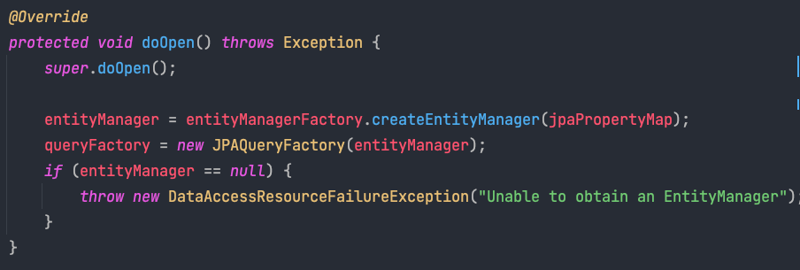
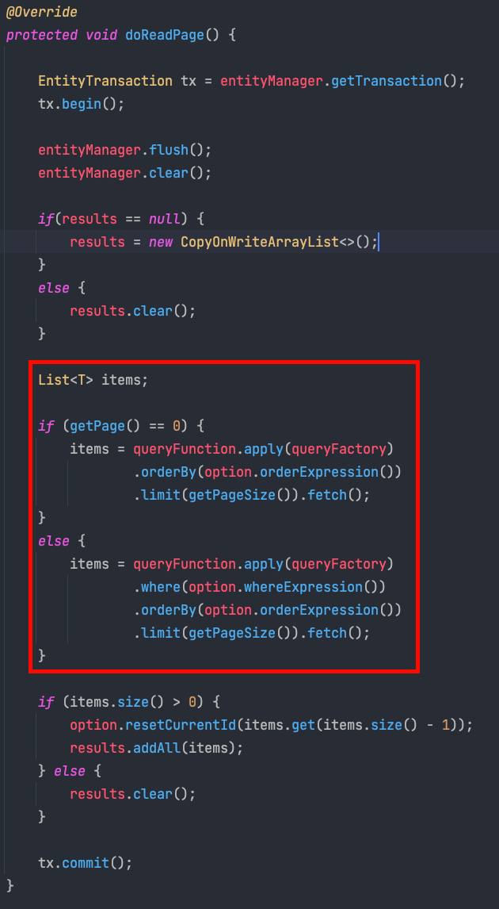

Spring Batch를 사용할 때 QueryDsl을 이용해서 PagingItemReader를 만들었던 경험을 공유하고자 한다. 내가 생각하는 Querydsl을 이용해서 ItemReader를 구현하면 생기는 장점은 이렇다.

- 타입 안정성
- 자동완성
- 컴파일 단계 문법 체크

만약 JpaPagingItemReader를 사용했다면 아래와 같이 코드를 작성해야 했을 것이다.

```java
@Bean
public JpaPagingItemReader<PassEntity> reader() {
    HashMap<String, Object> paramValues = new HashMap<>();
    paramValues.put("status", PassStatus.EXPIRED);

    return new JpaPagingItemReaderBuilder<PassEntity>()
        .pageSize(chunkSize)
        .name("itemReader")
        .entityManagerFactory(entityManagerFactory)
        .queryString("SELECT ps FROM pass_entity ps WHERE pass_status = :status")
        .parameterValues(paramValues)
        .build();
}
```

여기서 queryString을 보면 문자열로 전달하기 때문에, 컴파일 시점에 타입 체크를 할 수 없을 뿐더러, 오타를 치더라도 문제를 알 수 없다. 뿐만아니라 문자열이라서 자동완성도 기대할 수 없는 상황이다. 
하지만 queryDsl로 itemReader를 작성하면 이런 문제점이 모두 사라진다.
아래는 내가 작성한 QueryDslPagingItemReader를 이용한 코드이다.
```java
@Bean
public QuerydslPagingAdvancedItemReader<PassEntity> reader() {
    return new QuerydslPagingAdvancedItemReaderBuilder<PassEntity>()
            .pageSize(chunkSize)
            .name("QuerydslPagingAdvancedItemReader")
            .entityManagerFactory(entityManagerFactory)
            .queryFunction(queryFactory ->
                    queryFactory.selectFrom(passEntity)
                            .where(
                                    passEntity.passStatus.eq(PassStatus.EXPIRED)
                            )
            )
            .option(new QuerydslPagingAdvancedItemReaderOption(passEntity.passSeq, QuerydslPagingAdvancedItemReaderExpression.ASC))
            .build();
}
```
위의 JpaPagingItemReader와는 같은 작동을 하지만, QueryDsl로 작성했기 때문에 쿼리를 자바 코드로 작성할 수 있게 되었다. 따라서 컴파일 시점에 타입체크, 오류 검출을 할 수 있고, IDE의 자동완성 기능도 사용할 수 있다. 이런 장점이 있기에 Querydsl을 이용한 PagingItemReader를 만들어야 겠다고 생각하였다.
우선 시작하기에 앞서, 가장 고려했던 점은 성능이다.


위 코드는 JpaPagingItemReader에서 page를 읽어오는 부분인데, 빨간색 박스를 보면 limit과 offset을 이용해서 쿼리를 생성하는 것을 볼 수 있다. 이렇게 작성하게 되면, page의 크기가 커지면 커질수록 더 많은 범위의 인덱스 레코드 및 디스크를 접근하게 된다. 
배치의 특성상 대용량 데이터에 접근하는 경우가 많은데, page의 크기가 커지면 커질수록 더 많은 성능 저하가 일어날 수밖에 없다.
물론 커버링 인덱스를 이용하면 어느정도는 개선할 수 있다. 하지만 커버링 인덱스를 사용하면 그 만큼 많은 인덱스를 만들어야 하고, 디스크 접근은 줄겠지만 여전히 페이지가 증가할 수록 인덱스 스캔은 증가를 한다.
그래서 내가 선택한 방법은 offset을 없애는 것이다. 기존의 쿼리에 아래의 쿼리를 limit, offset 대신 추가하면 된다.

```sql
AND id < 마지막조회ID # 직전 조회 결과의 마지막 id
ORDER BY id DESC
LIMIT 페이지사이즈
```

이렇게 하면 마지막 조회 ID 부터 페이지 사이즈 만큼만 스캔을 하기 때문에, 쿼리의 성능이 크게 증가한다. 실제 내가 작성했던 코드로 예시를 들어보자면, 아래의 코드는 limit, offset을 이용한 쿼리이다. 이 쿼리에서는 심한 경우 10000 + 10 번의 디스크 접근을 하게 된다.

```sql
SELECT * FROM pass_entity WHERE pass_status = 'EXPIRED' LIMIT 10000, 10
```

반면에 아래와 같이 쿼리를 작성하면, 같은 결과임에도 인덱스를 제대로 활용하면 10번만 디스크에 접근하게된다.

```sql
SELECT * FROM pass_entity WHERE pass_status = 'EXPIRED' AND id > 10000 ORDER BY id ASC LIMIT 10
```

offset을 사용하지 않고 마지막 id를 이용하면, 쿼리의 성능을 비약적로 늘릴 수 있다. 그리고 대용량 데이터를 처리하는 배치에서는 이러한 차이가 큰 차이를 만들게 된다.
그래서 이제부터는 NoOffset 방식으로 설계한 QuerydslPagingItemReader에 대해 이야기해보고자 한다.

## QuerydslPagingItemReader 구현
QuerydslPagingItemReader는 이전에 언급했듯이 NoOffset 방식으로 구현하였다. 그래서 마지막으로 조회한 ID를 계속 갱신하면서 조회를 해야 한다. 그리고 offset을 사용하지 않기 위해, 쿼리가 진행하면서 WHERE id < [마지막 ID],  Order By [마지막 ID] DESC와 같은 구문이 지속적으로 들어가야 한다.  그래서 이를 처리하기 위한 QuerydslPagingItemReaderOption 클래스를 생성하였다. 이 클래스에서는 마지막 ID를 계속 갱신하면서 QuerydslPagingItemReader가 요청을 하면 마지막ID를 기반으로 where 조건과 order by 절을 생성해서 제공한다.

Querydsl도 결국 내부적으로 entityManager를 사용하기 때문에 JpaPagingItemReader와 모양이 비슷하다. 그래서 처음에 만들 때에는 JpaPagingItemReader에서 쿼리를 만드는 부분만 재정의 해주면 될 것이라고 생각했다.


하지만 createQuery는 private 메서드라서 재정의가 불가하다. 그래서 어쩔 수 없이 AbstractPagingItemReader를 상속받고, JpaPagingItemReader의 코드를 복사하여 만들었다.

### doOpen, doClose 메서드 구현
우선 doOpen 부분이다. 여기서는 entityManager를 생성해서 queryFactory에 전달한다. 이후 queryFactory를 통해서 querydsl의 쿼리를 생성한다. doClose에서는 entityManger를 종료하여 자원을 회수한다.




### doReadPage 메서드 구현
여기서는 실질적인 페이징 작업을 구현하였다. entityManger를 이용해서 트랜잭션을 시작하고, 작업이 완료되면 트랜잭션을 커밋한다. 그리고 트랜잭션 진행 중에는 외부에서 전달 받은 queryFunction을 이용해서 쿼리를 생성한다. 아래는 쿼리를 생성하는 부분이다.



빨강색 박스를 보면 option(QuerydslPagingItemReaderOption) 객체에 where 조건절과 order 구문을 요청한다. QuerydslPagingItemReaderOption 객체는 마지막 조회 id를 가지고 있기 때문에 이를 기반으로 where, order by 구문을 생성해서 제공한다. 그리고 page가 0일 경우에는 where 조건절이 빠진 것을 확인할 수 있다. 이렇게 한 이유는 첫 페이지일 경우 마지막 조회 id가 없기 때문이다. 그래서 첫 페이지에서는 첫번째 id 부터 조회해야 하기 때문에 where 조건절이 빠졌다. 하지만 두번째 페이지 부터는 마지막 조회 id가 생기기 때문에 where 조건절을 통해 마지막 조회 id 부터 조회하도록 하였다.

그리고 밑에 resetCurrentId 부분이 있는데, 이 부분은 이전에 말했듯이 QuerydslPagingItemReaderOption 객체에 마지막 조회 id를 저장하는 부분이다.

## QuerydslPagingItemReaderOption 구현

QuerydslPagingItemReaderOption 클래스에서는 마지막 조회 id를 세팅하는 메서드가 필수적이다. 이 마지막 조회 Id를 통해서 NoOffset을 위한 where 조건절과 order by 절을 만들어서 QuerydslPagingItemReader에 제공한다.                                                                                                                                                                                                                                                                                                                                                                                                                                                                                                                                                                                                                                                                                                                                                                                                                                                                                                                                                                                                                                               
아래는 QuerydslPagingItemReaderOption의 코드이다.


resetCurrentId에서는 item을 받아서, id를 currentId에 기록한다. orderExpression과 whereExpression은 QuerydslPagingItemReader에 제공할 order 절과, where 조건절을 생성한다. QuerydslPagingItemReader에서는 페이지를 읽을 때마다, QuerydslPagingItemReaderOption에 마지막 id를 제공하고 order절과 where 조건절을 제공받는 것이다.

## QuerydslPagingItemReader 사용


QuerydslPagingItemReader를 이용해서 itemReader를 만드는 부분이다. 여기서 눈 여겨 볼 점은 queryFunction을 제공하는 부분과 option을 제공하는 부분이다. 각 역할은 이렇다.

queryFunction는 기본적으로 배치에서 수행할 쿼리를 제공한다.
option은 마지막 id를 제공받고, NoOffset 쿼리에서 수행해야 할 where, order by 절을 제공한다.

아래는 내가 만들었던 QuerydslPagingItemReader 코드이다.

[https://github.com/devforlove/blog-batch/tree/master/src/main/java/blog/study/top/job/blog/spring_batch%EC%99%80_QuerydslItemReader]


