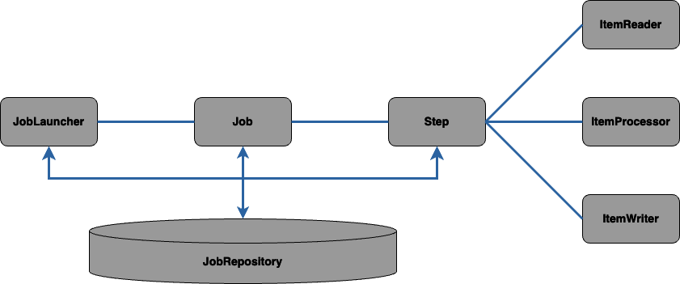
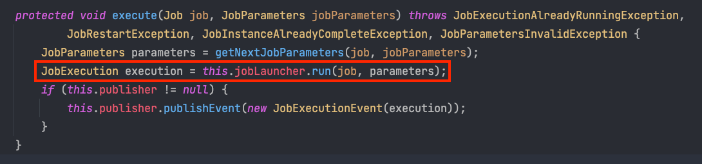
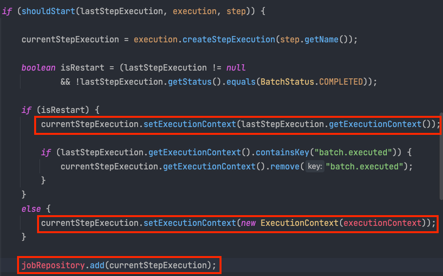
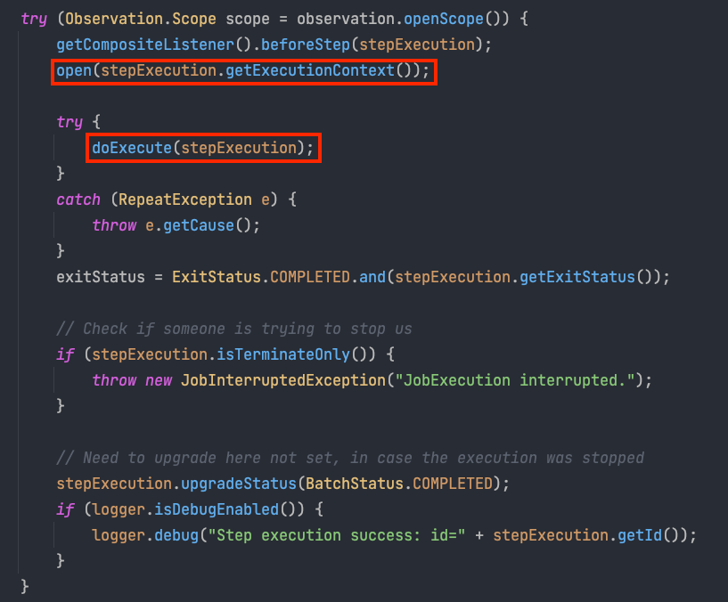
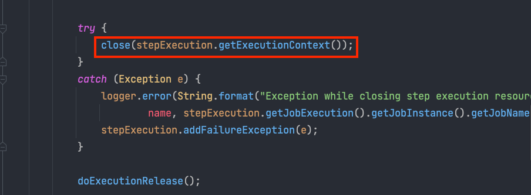
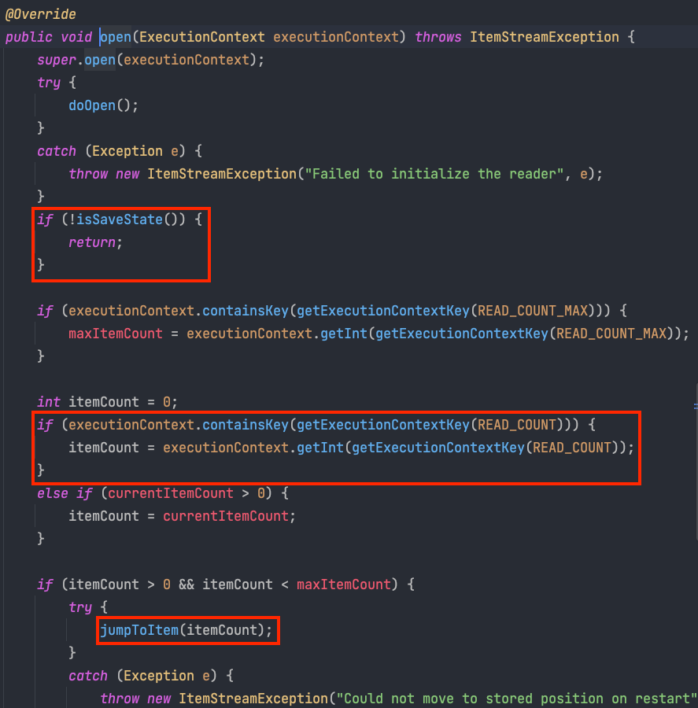

스프링 배치를 나름대로 많이 써봤지만, 아직도 스프링 배치 아키텍처에 대해 잘 모른다고 생각합니다. 그래서 이번 글에는 제가 정리한 스프링 배치 아키텍처에 대해 이야기해 보고자 합니다. 

스프링 배치는 아래와 같은 아키텍처를 가지고 있습니다.



- JobLauncher: JobLauncher는 이름 그대로 잡을 실행하는 역할을 합니다. Job.execute 메서드를 호출하는 역할 이외에도, 잡의 재실행 가능 여부 검증, 잡의 실행 방법, 파라미터 유효성 검증 등의 처리를 수행합니다. 
- Job: 잡은 각 스텝을 실행합니다. 하나의 스텝만 실행할 수도 있고, 여러 스텝을 실행할 수도 있습니다. 
- Step: 스텝은 잡에 속한 실행단위입니다. 스텝은 Tasklet 기반 스텝과, 청크 기반 스텝 두가지 주요 스텝 유형이 있습니다. 청크 기반의 스텝은 ItemReader, ItemProcessor, ItemWriter를 갖습니다.  
- JobRepository: 다양한 배치 수행과 관련된 수치 데이터 뿐만 아니라 잡의 상태를 유지 관리합니다. 

## 코드로 확인해 보자
그러면 JobLauncher, Job, Step, JobRepository가 어떻게 동작하는지 직접 소스 코드로 확인해보겠습니다. 

먼저 JobLauncher로 Job을 실행하는 부분입니다. 아래는 ```JobLauncherApplicationRunner``` 클래스의 일부입니다.
해당 클래스 부터가 Job 수행의 시작이라고 볼 수 있습니다. 
```--job.name```을 통해 전달된 Job 이름으로 빈을 찾아서, JobLauncer에 전달해 줌을 확인할 수 있다. 잡 이외에도 JobParamter도 함께 전달해줌을 확인할 수 있습니다.



### JobLauncer의 run 메서드   
JobLauncer의 ```run()``` 메서드 내부에서는 메타 테이블에서 마지막 JobExecution을 확인합니다. JobExecution이 있었는지에 따라 두가지 상황이 있습니다.
- 이미 같은 Job name, jobParamter로 실행한 JobExecution이 있을 경우
  - ```FAILED``` 상태일 경우에만 JobExecution을 메타 테이블에 새로 생성하고 배치 작업을 수행합니다. 
  - 이외의 상태는 더 이상 배치 작업을 진행하지 않고 예외를 throw 합니다. 
- 같은 Job name, jobParameter로 실행한 JobExecution이 없을 경우 
  - JobInstance와 JobExecution을 메타 테이블에 생성하고, 배치 작업을 수행합니다. 

위의 flow에서 spring batch의 메타 테이블에 대해 다음의 사실을 알 수 있습니다. 
- JobInstance는 Job name, JobParameter 당 하나의 row가 생성됩니다. 
- JobExecution은 작업 실행 한 번에 하나의 row가 생성됩니다. 
- JobExecution이 여러 row 생기는 경우는 이전 JobExecution이 실패 했을 경우입니다. 

### Job의 execute 메서드
JobLauncer에서는 Job의 execute() 메서드를 호출합니다. 그리고 실질적인 작업은 ```AbstractJob```의 ```doExecute```에서 이루어집니다.
아래는 ```AbstractJob의``` 구현 클래스인 ```SimpleJob```의 ```doExecute``` 메서드입니다.
```java
@Override
protected void doExecute(JobExecution execution)
        throws JobInterruptedException, JobRestartException, StartLimitExceededException {

    StepExecution stepExecution = null;
    for (Step step : steps) {
        stepExecution = handleStep(step, execution);
        if (stepExecution.getStatus() != BatchStatus.COMPLETED) {
            //
            // Terminate the job if a step fails
            //
            break;
        }
    }
	...
}
```
Step을 for문을 돌면서 ```handleStep``` 메서드를 이용해 실행합니다. 
```handleStep```은 내부에서 ```stepHandler```의 ```handleStep```을 호출합니다.
```java
protected final StepExecution handleStep(Step step, JobExecution execution)
			throws JobInterruptedException, JobRestartException, StartLimitExceededException {
		return stepHandler.handleStep(step, execution);

}
```

### StepHandler의 handleStep 메서드 
StepHandler의 구현체인 ```SimpleStepHandler```의 ```handleStep``` 메서드를 살펴보겠습니다.
Step의 ```execute()``` 메서드를 호출하기 이전에 같은 jobInstance와 Step name으로 실행된 stepExecution이 존재하는지 확인합니다.
만약 stepExecution이 재시작 하는 경우라면 기존의 stepExecution Context를 재사용합니다.


위의 이미지는 ```SimpleStepHandler```의 ```handleStep``` 메서드 일부분입니다. 
stepExecution을 재시작 하는 경우 이전 stepExecution context를 현재의 stepExection에 넘겨주는 것을 확인할 수 있습니다. 
재시작 하지 않을 경우는 아래 빨간색 박스 처럼 stepExection context를 생성합니다.

이후 stepExection과 stepExecution context를 메타 테이블에 저장합니다. 
- StepExecution과 StepExecution context는 step이 실행될 때마다 메타 테이블에 저장됨을 알 수 있습니다. 

### Step의 exeucte 메서드
이후 StepHandler에서 Step을 실행하기 위해 ```execute``` 메서드가 호출됩니다.
```execute()``` 메서드에서 중요한 부분은 ```open()```, ```doExecute()```, ```close()``` 메서드입니다. 


```open```: open 메서드는 작업을 시작하기 이전에 필요한 사전 작업을 합니다. 
```JpaPagingItemReader```를 예로 들면 ```open``` 메서드가 호출되면 ```entityManager```를 생성합니다.  
```java
@Override
protected void doOpen() throws Exception {
    super.doOpen();

    entityManager = entityManagerFactory.createEntityManager(jpaPropertyMap);
    if (entityManager == null) {
        throw new DataAccessResourceFailureException("Unable to obtain an EntityManager");
    }
    // set entityManager to queryProvider, so it participates
    // in JpaPagingItemReader's managed transaction
    if (queryProvider != null) {
        queryProvider.setEntityManager(entityManager);
    }

}
```
```doExecute```: Step의 실질적인 작업을 수행합니다. 청크 기반 Step일 경우 ```doExecute``` 메서드 내부에서 ItemReader, ItemProcessor, ItemWriter가 수행됩니다.

```close```: 배치 작업을 위해 사용되었던 자원을 다시 회수하는 부분입니다. ```JpaPagingItemReader```를 예로 들면 사용되었던 ```entityManager```를 다시 회수합니다. 
```java
@Override
protected void doClose() throws Exception {
    entityManager.close();
    super.doClose();
}
```

### 작업이 중간에 실패했을 경우 

Step이 실행중이다가, Exception 발생으로 인해 작업이 실패할 수 있습니다. 이 경우 스프링 배치에서는 마지막 실패 위치부터 재시작 할 수 있는 기능을 제공합니다. 
이전에 StepExecution이 이미 실행된 적이 있으면 StepExecution context를 현재의 StepExecution에서 재사용한다고 말씀드렸습니다.

이전 StepExecution context에는 마지막으로 읽은 item 위치가 저장되어 있습니다. 
만약 saveState가 true로 설정되어 있고, 해당 StepExecution context에 마지막 읽은 위치인 ```READ_COUNT```가 기록되어 있다면 해당 위치로 이동해서 아이템을 읽습니다.



## 정리 
스프링 배치의 전체적인 아키텍쳐에 대해 알아보았습니다. 위에서 살펴보았듯이 스프링 배치는 
JobLauncer, Job, Step(ItemReader, ItemProcessor, ItemWriter) 순으로 수행이 됩니다.
그리고 각각의 과정 중간에 JobRepository를 이용해서 각 단계의 정보를 기록합니다. Job name과 JobParameter 당 하나씩 기록되는 JobInstance, Job 실행당 하나씩 생성이 되는 JobExecution,
Step 실행당 하나씩 생성되는 StepExecution, Step의 context 정보를 기록하는 StepExecutionContext가 있었습니다.
마지막으로 스프링 배치는 Step의 작업이 중간에 실패했을 경우에 이전 StepExecution의 context를 이용해 실패했던 위치 부터 재시작 할 수 있는 기능을 제공합니다. 


