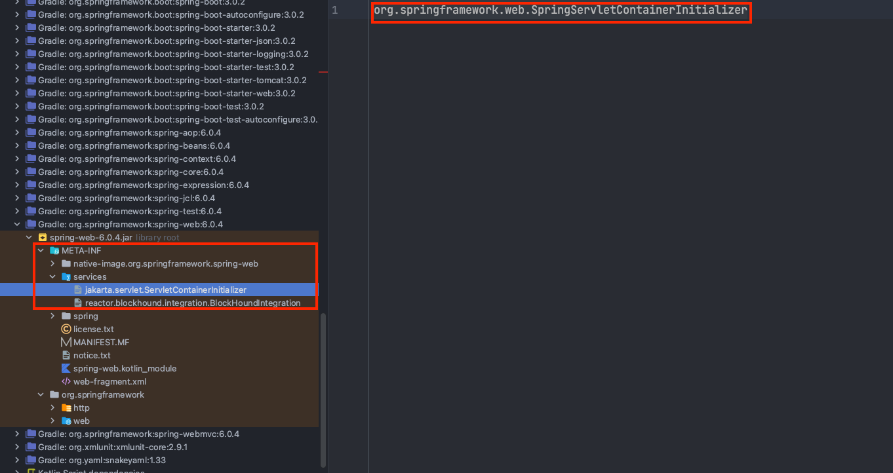
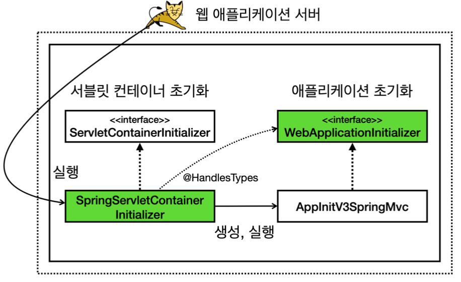
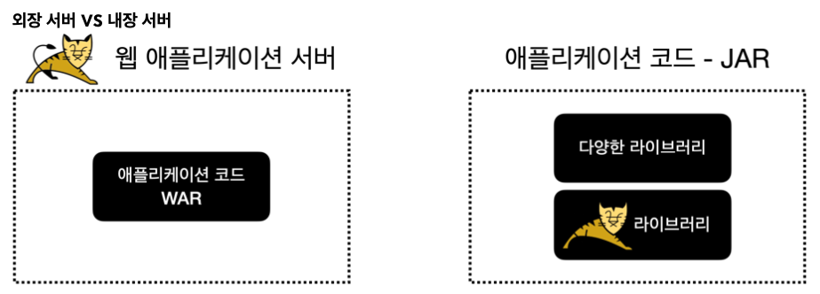

스프링 부트를 많이 안다고 생각했지만 아직 모르는 부분이 많다고 생각합니다. 그래서 이번 글에서는 김영한님의 '스프링 부트 - 핵심 원리와 활용' 강의를 듣고 정리한 내용에 대해 이야기해보고자 합니다. 

## 스프링 부트 

스프링 프레임워크는 의존성 주입 프레임워크로서 자바 개발자들에게 많은 편의성을 주었습니다. 하지만 여전히 개발자들을 어렵게 하는 것들이 있었습니다. 
- WAS를 설치하고 WAS에 빌드 파일을 업로드 해야 한다. 
- 버전관리가 어렵다. 
- 필요한 빈들을 일일히 등록해주어야 한다. 

위와 같이 스프링 프레임워크를 사용하더라도 해결되지 않는 부분들이 있었고, 이러한 문제들을 해결하는 것이 '스프링 부트'입니다.
지금 부터 어떻게 스프링 부트가 위에 나열한 문제점들을 해결하였는지에 대해 이야기해보겠습니다. 

## 내장 톰캣 

먼저 스프링에서 톰캣(WAS)으로 어떻게 어플리케이션을 구동하는지에 대해 설명하겠습니다. 

WAS를 사용하기 위해 필요한 기본적인 초기화 과정이 있습니다. 
- 서블릿 컨테이너 초기화 
- 어플리케이션 초기화 

서블릿 컨테이너 초기화를 하기 위해서 ```ServletContainerInitializer``` 인터페이스를 구현하고, 인터페이스를 ````resources/META-INF/services/jakarta.servlet.ServletContainerInitializer```` 경로에 입력해야 합니다. 

spring-MVC도 서블릿 컨테이너 초기화를 위해 다음 경로에 org.springframework.web.SpringServletContainerInitializer 라는 서블릿 컨테이너 초기화 클래스를 지정했습니다.



WAS의 규칙에 의해, WAS가 구동하는 시점에 ```SpringServletContainerInitializer```의 onStartup 메서드를 호출합니다. 


서블릿 컨테이너 초기화 이후에 어플리케이션 초기화가 진행됩니다. 

```java
@HandlesTypes(WebApplicationInitializer.class)
public class SpringServletContainerInitializer implements ServletContainerInitializer {
    ...
}
```

방금전에 언급했던 ```SpringServletContainerInitializer``` 클래스 위에 ```@HandlesTypes(WebApplicationInitializer.class)``` 어노테이션을 볼 수 있을 것입니다. 
```@HandlerTypes``` 어노테이션에 어플리케이션 초기화 인터페이스를 지정하면 ```onStartup``` 메서드의 파라미터로 넘어오는 ```Set<Class<?>> c```에 애플리케이션 초기화 인터페이스의 구현체들을 모두 찾아서 클래스 정보로 전달합니다.

스프링에서는 ```WebApplicationInitializer``` 인터페이스를 어플리케이션 초기화 인터페이스로 지정했습니다. 따라서 서블릿 컨테이너 초기화 시점에 ```WebApplicationInitializer``` 인터페이스의 구현체들이 파라미터로 넘어옵니다. 



위의 내용은 모두 서블릿 컨테이너 위에서 동작하는 방식입니다. 따라서 항상 톰캣 같은 서블릿 컨테이너에 배포를 해야만 동작하는 방식입니다. 


### WAR 배포 방식의 단점 

WAS에 WAR 파일을 배포하는 방식은 번거롭습니다. 먼저 WAS를 설치해야 하고, WAR 파일을 그 위에 배포해야 합니다. 
스프링 부트는 이러한 번거로움을 제거하고 ```main()``` 메서드만 실행하면 웹 서버까지 실행되도록 프로세스를 단순화했습니다. 기존의 스프링 프레임워크는 톰캣에 WAR를 배포했다면, 스프링 부트는 JAR 파일안에 톰캣 라이브러리도 함께 포함된 형태입니다. 



스프링 부트에선 내부 라이브러리로 톰캣을 포함하기 때문에, main 메서드만 실행하면 톰캣도 함깨 실행할 수 있습니다.  
시작 클래스를 살펴보면 main 메서드에서 스프링 부트 어플리케이션을 시작합니다. 
```java
@SpringBootApplication
public class StartApplication {
    public static void main(String[] args) {
        SpringApplication.run(StartApplication.class, args);
    }
}
```
```SpringApplication.run()``` 메서드가 실행되면 다양한 일들이 일어납니다. 
- 서블릿 컨테이너 초기화 
- 스프링 컨테이너 생성  
- 톰캣 실행 
- 컴포넌트 스캔 
- 등등 

개발자가 ```java -jar``` 명령어를 이용해 스프링 부트 프로젝트를 실행하면 ```SpringApplication.run()``` 메서드가 수행되면서 스프링 부트가 실행됩니다. 

### jar 파일 빌드와 배포
추가적으로 내장 톰캣을 사용하면 jar 패키징을 하게됩니다. 
스프링 부트의 jar 파일을 압축 해제하면 내부적으로 아래와 같은 디렉토리 구조를 확인할 수 있습니다.  

- META-INF
  - MANIFEST.MF 파일을 읽어서 ```Main-Class```를 읽어서 main 메서드를 실행합니다.
  - ```Start-Class```에는 개발자가 지정한 main 메서드를 갖는 클래스가 지정됩니다.
- org/springframework/boot/loader
  - 해당 디렉토리에는 스프링 부트에서 넣어주는 ```JarLauncher``` 클래스가 있습니다. 이 클래스는 jar 내부의 jar 파일을 읽어들이는 작업을 수행합니다. 따라서 스프링 부트의 시작 클래스 보다 더 먼저 main 메서드를 수행합니다. 
- BOOT_INF
  - classes
    - 개발자가 작성한 클래스가 위치하는 디렉토리 
  - libs
    - 의존하고 있는 라이브러리가 위치하는 디렉토리입니다. jar 상태로 라이브러리가 존재합니다.  


스프링 부트에서는 main 메서드 호출을 통해 톰캣을 시작하기 때문에 jar 안에 ```META-INF/MANIFEST.MF``` 파일에 실행한 ```main()``` 메서드의 클래스를 지정해주어야 합니다.
```
task buildJar(type: Jar) {
     manifest {
         attributes 'Main-Class': 'com.example.StartApplicationClass'
     }
with jar }
```

## 라이브러리 관리 

프로젝트를 처음으로 구성할 때, 라이브러리를 추가한다면 현재 스프링 부트와 호환되는 라이브러리를 세팅하기가 쉽지는 않을 것입니다. 예를 들면 스프링 WEB, 내장 톰캣, JSON 처리기, 로거 등등 수 많은 라이브러리를 선택해야 합니다. 추가로 라이브러리 버전까지 고민해야 합니다. 
과거에는 이러한 라이브러리 세팅에 상당히 많은 시간을 소비해야만 했습니다. 

스프링 부트는 개발자가 라이브러리를 쉽게 사용할 수 있도록 기능을 제공합니다. 
- 외부 라이브러리 버전 관리 
- 스프링 부트 스타터 제공 

스프링 부트를 새로 만들어서 ```build.gradle```을 확인해본다면 ```io.spring.dependency-management``` 플러그인을 확인할 수 있습니다. 

```
plugins {
    id 'java'
    id 'org.springframework.boot' version '3.0.2'
    id 'io.spring.dependency-management' version '1.1.0'
}
```

```io.spring.dependency-management``` 플러그인을 사용하면 ```spring-boot-dependencies```에 있는 bom 정보를 참고합니다.

버전 정보 bom ([https://github.com/spring-projects/spring-boot/blob/main/spring-boot-project/spring-
boot-dependencies/build.gradle]())

bom 정보를 확인한다면, 스프링 부트 버전에 맞는 라이브러리들이 명시되어 있는 것을 확인할 수 있습니다. 
만약 스프링 부트 버전이 '3.0.2' 라면, '3.0.2'에 맞는 라이브러리들이 적용되는 것입니다. 

스프링 부트를 사용하기만 하면, 개발자는 스프링 부트의 버전만 지정해주면 됩니다. 

### 스프링 부트 스타터 
하나의 프로젝트를 완성하기 위해 수 많은 라이브러리가 필요합니다. 그런데 라이브러리를 사용함에 있어서도 요구되는 라이브러리가 있습니다. 개발자 입장에서는 그냥 웹 프로젝트를 하나 시작하고 싶은 것이고, 일반적으로 많이 사용되는 대중적인 라이브러리르 사용하고 싶을 것입니다. 
스프링 부트에서는 관련된 라이브러리를 모아서 제공하는 '스프링 부트 스타터'를 제공합니다. 

만약 스프링과 웹을 사용하고 싶다면 ```spring-boot-starter-web```을 추가합니다. 
  - 그러면 스프링 웹 MVC, 내장 톰캣, JSON 처리, 스프링 부트 관련 LOG, YML 등등의 라이브러리가 함께 세팅됩니다. 


## 자동구성 

## 외부설정과 프로필 
