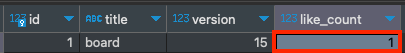

JPA는 기본적으로 영속성 컨텍스트 내에서 쓰기 작업을 하게되면 쓰기 지연이 발생합니다. 쓰기 지연은 한 번의 네트워크 I/O 만을 발생시키기 때문에 데이터베이스와의 통신 횟수를 줄이고, 데이터베이스 커넥션을 효율적으로 사용하게 해줍니다. 
하지만 멀티 클라이언트 환경에서 같은 공유 자원에 접근 하게 된다면, 데이터 정합성을 보장하지 못합니다. 

만약 Board 엔티티를 여러 클라이언트에서 접근해서 변경한다고 가정해보겠습니다. 

- Board (Entity)
```java
@Getter
@Slf4j
@NoArgsConstructor(access = AccessLevel.PROTECTED)
public class Board {

	@Id
	@GeneratedValue(strategy = GenerationType.IDENTITY)
	private Long id;
	private String title;

	@Version
	private Integer version;

	private Integer likeCount;
}
```

- Board Repository
```java
public interface BoardRepository extends Repository<Board, Long> {
	
	@Query("SELECT b FROM Board b WHERE b.id = :id")
	Board selectById(@Param("id") long id);
}
```

- Board Service
```java
@Service
@RequiredArgsConstructor
public class BoardService {

	private final BoardRepository boardRepository;

	@Transactional
	public void increaseLikeCount(long id) {
		Board board = boardRepository.selectById(id);
		board.increaseLikeCount();
	}
}
```

- Board Controller
```java
@RestController
@RequiredArgsConstructor
public class BoardController {

	private final BoardService boardService;

	@GetMapping(path = "/board/{id}/like")
	public String increaseLike(@PathVariable long id) {
		boardService.increaseLikeCount(id);
		return "success";
	}
}
```

위와 같이 기능을 만들고 동시에 여러번 호출을 하면 어떻게 될까?
curl url & curl url & curl url & .... 이런식으로 입력해주면 간단하게 테스트가 가능합니다. 
```
curl 'http://localhost:8080/board/1/like' & curl 'http://localhost:8080/board/1/like' & curl 'http://localhost:8080/board/1/like' & curl 'http://localhost:8080/board/1/like' & curl 'http://localhost:8080/board/1/like' & curl 'http://localhost:8080/board/1/like'
```

총 6번을 호출해보았습니다. 결과는 어떨까요?
좋아요 수가 1로 6번의 업데이트 중 한 번만 반영이 되어있습니다. 


확인한 것처럼 JPA에서 공유 자원에 대한 접근은 데이터 정합성을 보장하지 못합니다. 
이런 상황에서 사용할 수 있는 것이 선점 잠금 기능입니다. 비선점 잠금은 [이전글](https://wooktech.tistory.com/94)에서 설명한 적이 있습니다. 
선점 잠금은 다른 말로 비관적 락으로 작업중에 다른 트랜잭션이 공유 자원에 접근하여 데이터를 변경할 것이라고 '비관적'으로 예측합니다. 그렇기에 작업 전에 미리 잠금을 획득하여 다른 트랜잭션의 접근을 막습니다. 

JPA에서는 ```@Lock``` 어노테이션을 사용하여 선점 잠금을 구현하고 있습니다. 
옵션으로는 아래와 같은 옵션들이 제공됩니다. 
- PESSIMISTIC_WRITE
  - select ... for update 를 통해 조회하는 레코드에 대해 배타적 잠금을 획득합니다. 
- PESSIMISTIC_READ
  - select .. for share mode 를 통해 조회하는 레코드에 대해 공유 잠금을 획득합니다. 


