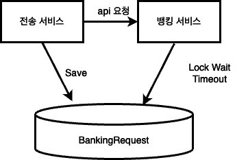
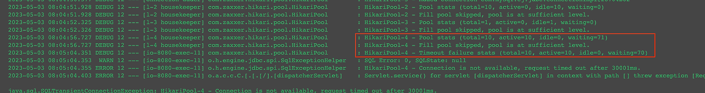

해당 글은 JPA로 서비스를 운영하면서 발생했던 이슈에 대해 작정한 내용입니다. 

아래 코드의 내용은 예시를 위해 만든 간단한 프로젝트입니다. 

## 송금 서비스
송금 서비스는 BankingRequest 라는 객체를 만들어서 DB에 저장합니다. 그리고 뱅킹 API에 요청합니다. 뱅킹 서비스에서는 작업을 완료하고 BankingRequest의 상태를 변경합니다.
이를 코드로 나타내면 아래와 같습니다. 

```java
@Service
@RequiredArgsConstructor
public class TransferService {
    private final TransferRepository transferRepository;
    private final BankingRequestRepository bankingRequestRepository;
    private final BankingApiAdaptor bankingApiAdaptor;

    @Transactional
    public void transfer(TransferRequest transferRequest) {
        // Transfer를 생성 후 저장
        Transfer transfer = new Transfer(
            transferRequest.senderAccountId(),
            transferRequest.receiverAccountId(),
            transferRequest.amount()
        );
        transferRepository.save(transfer);

        // BankRequest 생성 후 저장
        BankingRequest bankingRequest = BankingRequest.from(transfer);
        bankingRequestRepository.save(bankingRequest);

        // BankingAPIAdaptor 호출
        // BankingAPI에서 처리 후 BankingRequest의 상태를 변경
        BankingResponse response = bankingApiAdaptor.banking(bankingRequest);

        // Transfer 상태 조정
        if (response.isSuccess())
            transfer.setSuccess();
        else
            transfer.setFail();
    }
}
```

언뜻 보면 문제는 없어보입니다. 하지만 뱅킹 서비스에는 아래와 같은 로그가 찍혀 있습니다. 
```
MySQLTransasctionRollbackException:
    Lock wait timeout exceeded; try restarting transaction
```

이 문제의 원인은 전송 서비스와 뱅킹 서비스가 같은 BankingRequest 레코드에 접근하기 때문에 발생하는 문제입니다. 전송 서비스에서 BankingRequest를 save 하면서 잠금을 갖게 되는데, commit을 하지 않고 뱅킹 서비스에 요청을 합니다. 
그리고 뱅킹 서비스에서는 잠금이 반납 되지 않은 BankingRequest 레코드의 상태를 변경하려고 하므로 Lock Wait Timeout이 발생했습니다.



## REQUIRES_NEW

이러한 상황을 해결하려면, JPA에서 제공하는 Nested Transaction을 이용할 수 있습니다. ```REQUIRES_NEW``` propagation을 이용하여 다른 트랜잭션에서 BankingRequest를 커밋할 수 있습니다. 
BankingRequest는 commit된 상태이기 때문에 뱅킹 서비스에서 접근해서 상태를 변경할 수 있습니다. Lock Wait Timeout도 발생하지 않습니다. 

하지만 REQUIRES_NEW를 사용한다면 트랜잭션을 새로 만들어서 처리하기 때문에 DB 커넥션을 한 번 더 사용합니다. 즉, 커넥션 풀에 고갈이 발생할 수 있습니다. 실제 운영환경에서도 아래와 같이 HikariCP 로그 에러를 확인할 수 있습니다.



**각 요청에서 커넥션을 점유한 채로 하나의 커넥션을 더 요구하면서 CP 데드락이 생길 수 있는 것입니다.** 
이런 이유로 REQUIRES_NEW를 제거하고 비동기 방식의 요청으로 변경했습니다. 

## 비동기 방식 

사실 위의 코드는 뱅킹 서비스에 동기 요청으로 처리할 필요가 없는 코드였습니다. 만약 뱅킹 서비스에서 Lock Wait Timewait 으로 인해 지연이 발생하면 전송 서비스에서도 지연이 발생하는 장애의 전파가 발생할 수 있습니다.  
비동기 방식에서 전송 서비스는 BankingRequest를 저장하면서 이벤트를 발행하기만 하면 됩니다. 그러면 뱅킹 서비스는 이벤트를 구독하여 BankingRequest의 상태를 변경합니다. 

한 가지 생각할 부분은 뱅킹 서비스 프로세스가 돌아가는 시점에 DB에 커밋이 되어 있는 것을 보장할 수 있느냐는 것입니다. 하지만 잠금은 오히려 순서를 보장하는 역할을 합니다. 
**메인 트랜잭션에서 DB에 INSERT 하면서 락을 획득했고 뱅킹 서비스에서는 이를 기다려야 데이터를 수정할 수 있기 때문에 순서가 보장되었습니다.**

결과적으로 API 호출을 비동기 방식으로 변경하면서, 커넥션 풀에서 데드락이 더 이상 발생하지 않았습니다. 