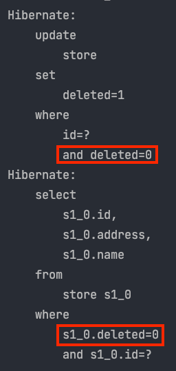
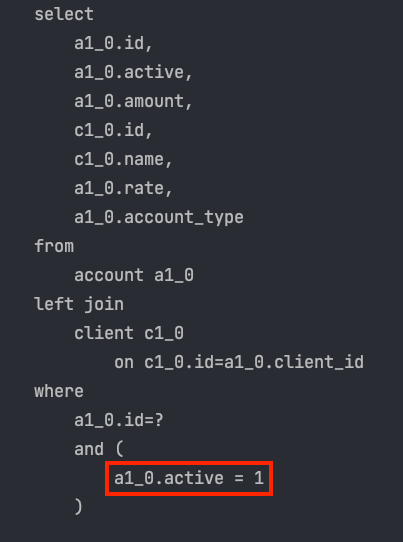
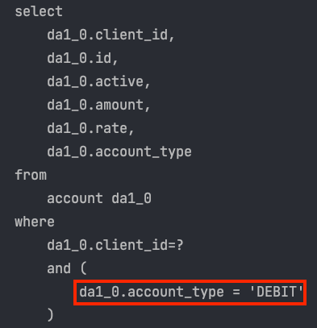
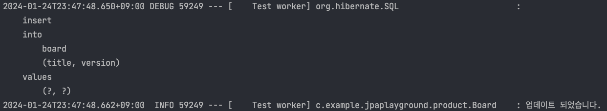

Spring JPA 기반에서 개발하다보면 아래 라이브러리를 사용하게 됩니다. 
- Jakarta Persistence API
- Hirbernate ORM
- Spring Data Jpa

```Jakarta Persistence APi```는 명세에 해당합니다. 실제 구현 기술은 ```Hibernate ORM```에 있습니다. 

이번 글에서는 Hirbernate ORM 공식문서를 보고 생소했던 기능들을 정리해보는 시간을 가질 것입니다.

## @SoftDelete 

데이터를 삭제하는 방법에는 hard delete, soft delete 두가지 방법이 있습니다.
- hard delete는 db에 직접 delete 쿼리를 날려 row를 삭제합니다.
- soft delete는 db에 특정 칼럼의 상태값을 deleted 상태로 update 하여, 해당 row가 삭제되었음을 나타냅니다. 

기존에는 delete 쿼리를 오버라이드하는 ```@SQLDelete``` 어노테이션을 사용하여 delete 쿼리를 변경해주었습니다. 
그리고 ```@Where``` 어노테이션을 사용하여 deleted 상태의 row는 가져오지 않도록 soft delete를 구현하였습니다. 
아래는 예시 코드입니다. 
```java
@Entity
@SQLDelete(sql = "UPDATE shop SET deleted = true WHERE id = ?")
@Where(clause = "deleted = false")
public class Shop {

	@Id
    @GeneratedValue(strategy = GenerationType.IDENTITY)
    private Long id;
    
    private String name;
    
    private String address;
    
    private boolean deleted = Boolean.FALSE; // 삭제 여부 기본값 false
}
```
Hibernate ORM 6.4 부터는 ```@SoftDelete``` 어노테이션이 추가되었습니다. 
```java
@NoArgsConstructor
@Getter
@Entity
@SoftDelete(columnName = "deleted")
public class Store {

	@Id
	@GeneratedValue(strategy = GenerationType.IDENTITY)
	private Long id;

	@Column
	private String name;

	@Column
	private String address;

	public Store(String name, String address) {
		this.name = name;
		this.address = address;
	}
}
```

테스트 코드로 실행해 보면, 엔티티를 delete 하면 update 쿼리가 나가고, select 하면 where 조건절에 ```deleted``` 추가된  쿼리가 나가는 것을 확인할 수 있습니다. 
```java
@Test
void softDeleteTest() {
    Store store = new Store("name", "address");
    storeSoftDeleteRepository.save(store);

    storeSoftDeleteRepository.delete(store);
    Optional<Store> optionalStore = storeSoftDeleteRepository.findById(store.getId());

    assertThat(optionalStore.isPresent()).isFalse();
}
```


## @ElementCollection, @CollectionTable

```@OneToMany```를 사용하는 대신 ```@ElementCollection```을 사용할 수 있습니다. 

```java
@Entity
public class Store {

	@Id
	@GeneratedValue(strategy = GenerationType.IDENTITY)
	private Long id;

	@ElementCollection
	@CollectionTable(
			name = "phone_number_table",
			joinColumns = @JoinColumn(name = "id", referencedColumnName = "id")
	)
	private final List<String> phoneNumberList = new ArrayList<>();
}
```

```@ElementCollection```을 이용해서 컬렉션 객체임을 JPA가 알 수 있게 합니다. 
엔티티가 아닌 값 타입, 임베디드 타입에 대한 테이블을 생성하고 1대다 관계로 다룹니다. 

```@CollectionTable``` 값 타입 컬렉션을 매핑할 테이블에 대한 역할을 지정하는데 사용합니다. 
테이블의 이름과 조인정보를 적어줘야 합니다. 

```@ElementCollection```은 아래의 특징을 가집니다. 
- 단순한 값의 컬렉션을 나타낸다. 
- 컬렉션만 조회, 삭제 등 어떤 행위도 할 수 없다. 반드시 부모를 통해 쿼리가 실행된다. 
- 컬렌션은 엔티티가 아니므로 ID 생성 전략을 사용할 수 없다. 
- ID를 가지지 않으므로 컬렉션 값이 변결될 시 전체 삭제 후 생성한다. 

이와는 달리 ```@OneToMany```를 이용하면 Many 측이 단순한 컬렉션이 아닌 자식 엔티티로 인정 받습니다. 
만약 자식 엔티티로써 인정받을 필요가 없고, 엔티티의 속성 뿐이라면 ```@ElementCollection```만 사용하는 것이 Fit한 처리일 수 있습니다. 

## @SqlRestriction

soft delete된 데이터는 가져오지 않기 위해 기존에는 ```@Where``` 어노테이션을 이용하여 제외했습니다. 
하지만 ```@Where``` 는 deprecated 되었습니다. 대신 이젠 ```@SqlRestriction```을 사용합니다. 

아래 Account 클래스를 보면 active 칼럼이 true인 레코드만 조회합니다. 
```java
@Entity(name = "Account")
@SQLRestriction("active = true")
public static class Account {

	@Id
	private Long id;

	@ManyToOne
	private Client client;

	@Column(name = "account_type")
	@Enumerated(EnumType.STRING)
	private AccountType type;

	private Double amount;

	private Double rate;

	private boolean active;
}
```
쿼리를 직접 확인해 보면 active가 true인 레코드만 조회합니다. 



만약 연관관계를 맺고 있는 엔티티에서 타입 별로 다른 필드로 나누어야 할 경우에도 ```@SqlRestriction```을 이용할 수 있습니다. 
아래 Client 엔티티 클래스를 보겠습니다. 
```java
@Getter
@Entity(name = "CLIENT_TABLE")
@NoArgsConstructor
public class Client {
    @Id
    @GeneratedValue(strategy = GenerationType.IDENTITY)
    private Long id;

    @SQLRestriction("account_type = 'DEBIT'")
    @OneToMany(mappedBy = "client")
    private List<Account> debitAccounts = new ArrayList<>();

    @SQLRestriction("account_type = 'CREDIT'")
    @OneToMany(mappedBy = "client")
    private List<Account> creditAccounts = new ArrayList<>();

    public void addAccount(Account account) {
        if(account.getType() == AccountType.CREDIT) {
            creditAccounts.add(account);
        } else {
            debitAccounts.add(account);
        }
        account.setClient(this);
    }
}
```
타입별로 ```DEBIT```과 ```CREDIT```이 있습니다. 그리고 해당 타입별로 다른 필드로 연관관계 엔티티를 매핑합니다. 
아래는 적용시 쿼리입니다. 



## Persistence Callbacks

Hibernate ORM은 다양한 콜백을 제공합니다.

- @PrePersist: 엔티티가 persist 되기 전에 호출됩니다. 
- @PreRemove: 엔티티가 remove 될 때 호출됩니다. 
- @PostPersist: 엔티티가 persist 된 이후에 호출됩니다.
- @PostRemove: 엔티티가 remove 된 이후에 호출됩니다. 
- @PreUpdate: 엔티티가 update 되기 이전에 호출됩니다. 
- @PostUpdate: 엔티티가 update 된 이후에 호출됩니다. 
- @PostLoad: 엔티티가 현재의 영속성 컨텍스트에 로드 된 이후에 호출됩니다. 

테스트 코드로 작성해서 제대로 동작하는지 확인해보겠습니다. 

```java
@Entity
@Getter
@Slf4j
@NoArgsConstructor(access = AccessLevel.PROTECTED)
public class Board {

	@Id
	@GeneratedValue(strategy = GenerationType.IDENTITY)
	private Long id;
	private String title;

	@Version
	private Integer version;

	public Board(String title) {
		this.title = title;
	}

	@PostPersist
	public void afterPersist() {
		log.info("업데이트 되었습니다.");
	}
}
```

```java
@SpringBootTest
class CallbackTest {

	@Autowired
	private BoardRepository boardRepository;

	@Test
	public void testCallback() {
		Board board = new Board("board");
		boardRepository.save(board);
	}
}
```



다음과 같이 엔티티를 저장하면 자동으로 ```@PostPersist``` 어노테이션이 추가된 메서드가 호출됨을 확인할 수 있습니다.


