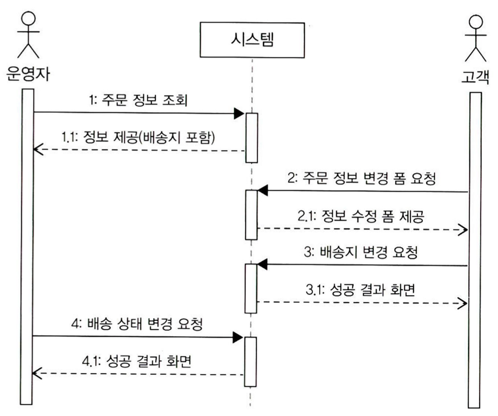
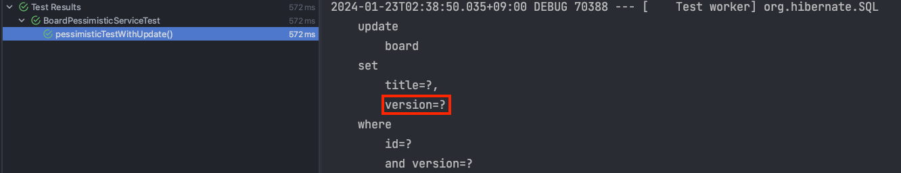
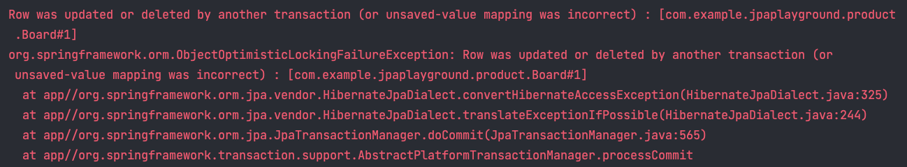

트랜잭션은 ACID(원자성, 일관성, 격리성, 지속성)을 보장해야 합니다. 트랜잭션은 원자성, 일관성, 지속성을 보장해야 하지만 문제는 격리성입니다. 
격리 수준을 높이면  동시성 측면에서 많은 손해를 보기 때문입니다. ANSI 표준에서는 트랜잭션 격리 수준을 4단계로 구분하여 병행성과 격리성을 설정할 수 있습니다. 
격리성과 병행성은 서로 역비례 관계이므로 무턱대고 격리성을 높이게 되면 성능이 약화될 수 있습니다. 따라서 상황에 따라 적절한 격리 수준을 설정하는 것이 중요합니다. 

하지만 이런 트랜잭션 트랜잭션 격리 수준으로도 해결하지 못하는 문제가 존재합니다. 



위의 실행순서는 다음과 같습니다. 
1. 운영자는 배송을 위해 주문 정보를 조회합니다. 시스템은 정보를 제공합니다.
2. 고객이 배송지 변경을 위해 변경 폼을 요청합니다. 시스템은 변경 폼을 제공합니다. 
3. 고객이 새로운 배송지를 입력하고 폼을 전송하여 배송지를 변경합니다. 
4. 운영자가 1번에서 조회한 주문 정보를 기준으로 배송지를 정하고 배송 상태 변경을 요청합니다. 

여기서 문제는 운영자가 배송 정보를 조회하고 배송 상태를 변경하는 사이에 고객이 배송지를 변경한다는 것입니다. 
즉, 운영자는 고객이 변경하기 전 배송지 정보를 이용하여 배송준비를 하게 됩니다. 고객은 배송지 정보를 변경했음에도 불구하고 
엉뚱한 배송지로 배송을 받게 됩니다. 

이러한 문제는 트랜잭션 격리 수준으로 보장되는 선점 잠금으로는 해결하지 못합니다. 이때 필요한 것은 **비선점 잠금**입니다.
비선점 잠금은 동시에 접근하는 것을 막는 대신, 변경한 데이터를 실제 DBMS에 반영하는 시점에 변경 가능 여부를 확인합니다. 

## @Version
JPA는 ```@Version``` 어노테이션을 제공하여 비선점 잠금을 제공합니다. ```@Version``` 어노테이션을 붙이고 매핑되는 테이블에 버전을 저장할 칼럼을 추가하기만 하면 됩니다.

```java
@Entity
@Getter
@NoArgsConstructor(access = AccessLevel.PROTECTED)
public class Board {

	@Id
	@GeneratedValue(strategy = GenerationType.IDENTITY)
	private Long id;
	private String title;

	@Version
	private Integer version;

	public Board(String title) {
		this.title = title;
	}

	public void changeTitle(String title) {
		this.title = title;
	}
}

@Service
@Transactional
@RequiredArgsConstructor
public class BoardPessimisticService {

	private final BoardRepository boardRepository;

	public void changeTitle(Long id, String title) {
		Board board = boardRepository.findById(id);
		board.changeTitle(title);
	}
}
```
만약 ```Board``` 엔티티가 변경된다면 ```version``` 이 자동으로 하나씩 증가합니다. 
그리고 엔티티를 수정할 때, 엔티티를 조회한 시점의 버전과 수정한 시점의 버전이 일치하지 않으면 예외가 발생합니다.

테스트 코드로 확인해보니, ```Board``` 엔티티가 변경되면 자동으로 version 칼럼도 +1 해줍니다.
```java
@Test
void pessimisticTestWithUpdate() {
    Board savedBoard = boardRepository.save(new Board("title"));

    boardService.changeTitle(savedBoard.getId(), "title2");

    Board changedBoard = boardRepository.findById(savedBoard.getId());
    assertThat(changedBoard.getVersion()).isEqualTo(1);
}
```


만약 update 시점에 version이 달라진다면 아래와 같은 오류가 생깁니다.



## 주의점 
Embedded 타입의 경우 논리적으로 해당 엔티티의 값이므로 수정하면 엔티티의 버전이 증가합니다. 이는 값 타입 컬렉션도 마찬가지입니다. 
반면 연관관계 필드의 경우 연관관계 주인 필드를 변경할 때만 버전이 증가합니다. 

또한, ```@Version``` 으로 추가한 버전 관리 필드는 JPA가 직접 관리하므로 임의로 수정해서는 안됩니다. 
하지만 벌크 연산의 경우 버전을 무시하므로, 벌크 연산을 수행할 때에는 아래와 같이 버전 필드를 강제로 증가시켜야합니다. 

```java
update Member m set m.name = '변경', m.version = m.version + 1
```