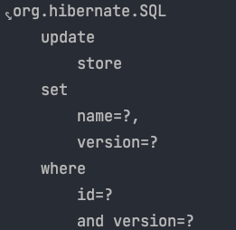
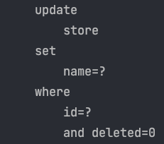

JPA에서 ```@Version``` 어노테이션을 이용해서 비선점 잠금을 구현하고 있습니다.
이 @Version은 버전 관리용 필드를 추가해 트랜잭션 내에서 처음 조회되었을때의 버전과 이후 수정 후 커밋될때의 버전을 비교합니다.
만약 버전이 일치한다면 업데이트가 성공하지만, 버전이 일치하지 않는다면 충돌이 발생한 것으로 판단하고 예외를 발생시킵니다. 

하지만 ```@Version```을 쓰다보면, 더티체킹에 의해 변경 감지되어 업데이트된 경우에만 정상 동작합니다.
만 영속성 컨텍스트를 이용하지 않는 JPQL의 update문은 ```@Version``` 어노테이션이 제대로 적용되지 않습니다. 

더티 체킹에서만  ```@Version``` 어노테이션이 적용되는 이유에 대해 JPA 코드를 분석해보겠습니다.

우선 상점 정보를 저장하는 Store 엔티티를 정의하였습니다.
```java
@NoArgsConstructor
@Getter
@Entity
public class Store {

	@Id
	@GeneratedValue(strategy = GenerationType.IDENTITY)
	private Long id;

	@Column
	private String name;

	@Column
	private String address;

	@Version
	private Integer version;
}
```

더티 체킹으로 Store의 정보를 변경하는 로직입니다. 
```java
@Transactional
public void changeStoreName(Long id, String name) {
    Optional<Store> storeOptional = storeRepository.findById(id);
    Store store = storeOptional.orElseThrow(
            () -> new IllegalArgumentException("no store")
    );

    store.changeName(name);
}
```

이렇게 작성하고 실행시켜 보면 현재 version을 where 조건절에서 비교하고, 
다음 version으로 1증가해서 update를 해줌을 확인할 수 있습니다.



하지만 영속성 컨텍스트를 이용하지 않는 JPQL로 업데이트를 진행한다면 어떻게 될까요? 

```java
@Modifying
@Query("UPDATE Store s SET s.name = :name WHERE s.id = :id")
void updateStoreName(@Param("name") String name, @Param("id") Long id);
```

```java
@Transactional
public void changeStoreNameInJPQL(Long id, String name) {
	storeRepository.updateStoreName(name, id);
}
```

위의 코드를 실행해보면 예상하셨듯이 ```@version```이 적용되지 않습니다. 



## 이유를 알아보자 

이런 차이가 발생한 원인은 ```EntityPersister``` 객체에 있습니다. 

우선 ```EntityPersister```에 대해 알아보기 전에 JPA에서 변경 감지를 하여 업데이트 하는 로직을 보겠습니다. 
JPA 에서는 트랜잭션 commit 시점에 영속성 컨텍스트에 저장되어 있는 엔티티들을 이전에 저장하고 있던 스냅샷과 비교를 합니다. 
```DefaultFlushEntityEventListener.onFlushEntity``` 메서드를 살펴보면 ```requiresDirtyCheck``` 메서드에서 엔티티에 대한 변경 감지를 수행하고 만약 변경이 감지되면 ```scheduleUpdate``` 메서드 내부에서 큐에 ```EntityUpdateAction```을 넣습니다.

```java
public void onFlushEntity(FlushEntityEvent event) throws HibernateException {
		final Object entity = event.getEntity();
		final EntityEntry entry = event.getEntityEntry();

		final boolean mightBeDirty = entry.requiresDirtyCheck( entity ); // 변경 감지 

		final Object[] values = getValues( entity, entry, mightBeDirty, event.getSession() );

		event.setPropertyValues( values );

		boolean substitute = wrapCollections( event, values );

		if ( isUpdateNecessary( event, mightBeDirty ) ) {
			substitute = scheduleUpdate( event ) || substitute; // 변경이 감지되면 큐에 액션 추가 
		}
        ...
```

이후 큐에 들어있는 ```EntityUpdateAction```는 execute 메서드가 호출되면서 엔티티를 업데이트 하기 위한 쿼리를 생성합니다.
아래는 ```EntityUpdateAction.execute``` 메서드 내부입니다. 

```java
@Override
public void execute() throws HibernateException {
    if ( !preUpdate() ) {
        final EntityPersister persister = getPersister();
        final SharedSessionContractImplementor session = getSession();
        final Object id = getId();
        final Object instance = getInstance();
        final Object previousVersion = getPreviousVersion();
        final Object ck = lockCacheItem( previousVersion );
        persister.update( id, state, dirtyFields, hasDirtyCollection, previousState, previousVersion, instance, rowId, session );
        final EntityEntry entry = session.getPersistenceContextInternal().getEntry( instance );
        if ( entry == null ) {
            throw new AssertionFailure( "possible non thread safe access to session" );
        }
    ...
```

execute 메서드 내부에서 ```EntityPersister```를 호출하고 update 메서드를 호출함을 볼 수 있습니다.

```java
persister.update( id, state, dirtyFields, hasDirtyCollection, previousState, previousVersion, instance, rowId, session );
```

이 메서드를 쭉 따라가다 보면 ```processLock``` 메서드 내부에서 ```@Version``` 어노테이션과 관련된 낙관적 락을 처리합니다.

```java
private void processLock(
        UpdateValuesAnalysisImpl analysis,
        SingularAttributeMapping attributeMapping,
        SharedSessionContractImplementor session,
        Object attributeLockValue) {
    attributeMapping.decompose(
            attributeLockValue,
            0,
            analysis,
            null,
            (valueIndex, updateAnalysis, noop, jdbcValue, columnMapping) -> {
                if ( !columnMapping.isFormula() ) {
                    final EntityTableMapping tableMapping = entityPersister().getPhysicalTableMappingForMutation( columnMapping );
                    updateAnalysis.registerColumnOptLock( tableMapping, columnMapping.getSelectionExpression(), jdbcValue );
                }
            },
            session
    );
}
```

**결과적으로 ```EntityPersister``` 내부에서 ```@Version``` 어노테이션과 관련된 작업들을 처리합니다. 그리고 더티 체킹에 의해 변경 감지된 엔티티만 업데이트시에 ```EntityPersister```를 호출합니다.** 그래서 영속성 컨텍스트를 이용하는 더티 체킹에서는 낙관적 락이 정상적으로 처리될 수 있었던 것입니다. 
하지만 영속석 컨텍스트를 이용하지 못하는 JPQL, QueryDsl의 UPDATE 쿼리에서는 ```@Version``` 어노테이션이 적용되지 않습니다.
