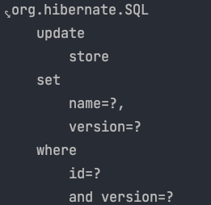
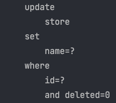

JPA에서 ```@Version``` 어노테이션을 이용해서 비선점 잠금을 구현하고 있습니다. 영속성 컨텍스트에 올라온 Entity는 더티체킹이 발생하면서, ```@Version``` 어노테이션이 잘 적용되는 것을 확인할 수 있었습니다. 
그런데 영속성 컨텍스트를 이용하지 않는 JPQL의 update문은 ```@Version``` 어노테이션이 제대로 적용되지 않습니다. 

더티 체킹에서만  ```@Version``` 어노테이션이 적용되는 이유에 대해 JPA 코드를 분석해보겠습니다.

우선 상점 정보를 저장하는 Store 엔티티를 정의하였습니다.
```java
@NoArgsConstructor
@Getter
@Entity
public class Store {

	@Id
	@GeneratedValue(strategy = GenerationType.IDENTITY)
	private Long id;

	@Column
	private String name;

	@Column
	private String address;

	@Version
	private Integer version;
}
```

더티 체킹으로 Store의 정보를 변경하는 로직입니다. 
```java
@Transactional
public void changeStoreName(Long id, String name) {
    Optional<Store> storeOptional = storeRepository.findById(id);
    Store store = storeOptional.orElseThrow(
            () -> new IllegalArgumentException("no store")
    );

    store.changeName(name);
}
```

이렇게 작성하고 실행시켜 보면 현재 version을 where 조건절에서 비교하고, 
다음 version으로 1증가해서 update를 해줌을 확인할 수 있습니다.



하지만 영속성 컨텍스트를 이용하지 않는 JPQL로 업데이트를 진행한다면 어떻게 될까요? 

```java
@Modifying
@Query("UPDATE Store s SET s.name = :name WHERE s.id = :id")
void updateStoreName(@Param("name") String name, @Param("id") Long id);
```

```java
@Transactional
public void changeStoreNameInJPQL(Long id, String name) {
	storeRepository.updateStoreName(name, id);
}
```

위의 코드를 실행해보면 예상하셨듯이 ```@version```이 적용되지 않습니다. 



## 이유를 알아보자 

이런 차이가 발생한 원인은 Persister 객체에 있습니다. 

```java
private void processLock(
        UpdateValuesAnalysisImpl analysis,
        SingularAttributeMapping attributeMapping,
        SharedSessionContractImplementor session,
        Object attributeLockValue) {
    attributeMapping.decompose(
            attributeLockValue,
            0,
            analysis,
            null,
            (valueIndex, updateAnalysis, noop, jdbcValue, columnMapping) -> {
                if ( !columnMapping.isFormula() ) {
                    final EntityTableMapping tableMapping = entityPersister().getPhysicalTableMappingForMutation( columnMapping );
                    updateAnalysis.registerColumnOptLock( tableMapping, columnMapping.getSelectionExpression(), jdbcValue );
                }
            },
            session
    );
}
```