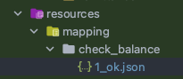

이번 글에서는 WireMock을 이용해서 통합 테스트에서 외부 API 서버를 테스트하는 방법에 대해 다루어 보고자 합니다. 

외부 API를 포함하는 통합 테스트 구현 방법에는 다양한 방법이 있습니다. 
- 실제 테스트용 서버 구축
- ```@MockBean```
- WireMock 


## 실제 테스트용 서버 구축, @MockBean 방식은? 

통합 테스트는 어플리케이션 전반을 커버합니다. 그렇기에 단위 테스트가 보지 못하는 부분도 통합테스트를 이용해 검증할 수 있습니다. 
이런 통합 테스트의 주요 목적은 어플리케이션을 이루는 구성요소 간에 제대로 된 상호 작용을 하는지입니다. 
외부 의존성과의 상호작용을 하기 위해 테스트 API 서버를 구축하거나, MockBean을 이용해서 행위를 모방하는 방식을 이용할 수 있습니다.  

### 문제점 
만약 테스트시에 실제 테스트용 서버로 통합 테스트를 한다면 어떨까요? 테스트에 너무 많은 유지보수 비용이 발생할 것입니다. 실제 서버를 구축하고 관리해야 하기 때문입니다. 서버 비용도 무시할 수 없습니다.
그리고 여러 개발자들이 통합 테스트를 진행 하면서, 항상 테스트용 서버가 동일한 상태라고 보장할 수도 없습니다. 쉽게 말해 테스트 마다 결과가 달라지는 문제도 발생할 수 있습니다.

그렇다면 ```@MockBean```을 이용해서 행위를 Mocking 하는 방식은 어떨까요? 
Web 영역에는 아래의 영역을 포함합니다. 
1. Request 직렬화 
2. Response 역직렬화 
3. 네트워크 통신 

하지만 ```@MockBean```의 방식은 세 가지 영역중 어떤 것도 커버하지 못합니다. 
제품 코드에 아래와 같이 ```ObjectMapper```를 빈으로 등록하고 직렬화 하는 코드가 있다고 가정하겠습니다. 
```java
@Configuration
class ObjectMapperConfig {
    @Bean
    fun objectMapper(): ObjectMapper = ObjectMapper()
}
```
Naming 전략이 Camel Case 에서 Snake Case 로 변경되었다면 ```@MockBean```은 이렇게 바뀐 부분을 커버하지 못합니다.
직렬화 직전에 인터페이스의 행위만을 Mocking을 하기 때문에 테스트 코드에서 문제를 검출하지 못합니다.  
```java
@Configuration
class ObjectMapperConfig {
    @Bean
    fun objectMapper(): ObjectMapper =
        ObjectMapper()
            .setPropertyNamingStrategy(PropertyNamingStrategies.SNAKE_CASE)
}
```

위에서 언급한 방식들의 문제점은 WireMock을 이용한다면, 개선할 수 있습니다. 

## 그렇다면 WireMock은?

WireMock은 api 서버를 stub 서버로 만들어주는 라이브러리입니다. 그렇기에 실제 서버를 구축할 필요 없이 통합 테스트를 작성할 수 있습니다. 
그리고 ```@MockBean``` 이 인터페이스의 행위만을 Mocking 하는 것과 달리 WireMock은 서버를 stub 하기 때문에 실제 네트워크 통신까지 넓은 범위의 테스트 커버리지를 갖습니다.    
지금까지 왜 WireMock을 사용하는지 알아보았고, 이젠 WireMock을 실제 어떻게 사용하는지에 대해 알아보겠습니다.  

### WireMock 설정을 위한 test-fixtures 설정 
이런 방식들의 문제점을 해결한 것이 WireMock입니다. 외부 API 서버를 Stub 하는 WireMock 라이브러리를 사용해서 외부 API 와의 상호작용을 검증할 수 있습니다.
저는 test-fixtures 플러그인을 이용하기 위해 core-web 모듈에 wiremock 라이브러리를 추가해 보았습니다. 
```groovy
// core-web 모듈의 build.gradle
dependencies {
    testFixturesImplementation('org.springframework.cloud:spring-cloud-contract-wiremock')
}

// core-web에 의존하는 다른 모듈 build.gradle
dependencies {
    ...
    
    testImplementation(testFixtures(project(':core-web')))
    
    ...
}
```

그리고 core-web 모듈에서 다른 모듈의 테스트 클래스에서 상속하는 추상 클래스를 만들었습니다.
```java
@AutoConfigureWireMock(port = 0, stubs = "classpath:mapping")
public abstract class IntegrationSupport {

}
```
제일 먼저 ```@AutoConfigureWireMock``` 어노테이션을 달아주어서 WireMock 어플리케이션이 실행될 수 있도록 하였습니다. 
그리고 port와 stubs 옵션이 있는 것을 확인할 수 있을 것입니다. 여기서 port는 WireMock 서버와 통신할때 사용할 포트 번호입니다. 0으로 설정하면 랜덤 포트가 지정됩니다. 
stubs는 WireMock 서버가 반환할 응답값을 정의하는 json 파일들의 위치입니다. 기본 설정으로 ```src/test/resources/mappings```으로 지정이 되지만, test-fixtures 플러그인을 사용하고 있기 때문에 classpath에 있는 mappings 디렉토리로 지정했습니다.

통합 테스트에서는 아래와 같이 테스트 클래스에 상속해주면 됩니다. 
```java
class IntegrationTest extends IntegrationSupport {
    ...
}
}
```

### 테스트 yml 파일 설정
```yaml
spring:
  config:
    activate:
      on-profile: test

client:
  httpbin-api:
    access-url: http://localhost:${wiremock.server.port}
```
테스트를 위한 yaml 파일은 위와 같이 지정합니다. 위에서 언급했듯이 port는 0으로 지정해서 랜덤한 값이 지정됩니다. 이 경우 yaml 파일에 ```${wiremock.server.port}```를 사용하면 쉽게 해결됩니다.

이후에 아무런 추가 작업 없이 테스트 코드를 실행하면 아래와 같은 오류를 보게됩니다.
```
Caused by: java.io.FileNotFoundException: class path resource [mappings/] cannot be resolved to URL because it does not exist
    at org.springframework.core.io.ClassPathResource.getURL(ClassPathResource.java:214)
    at org.springframework.core.io.support.PathMatchingResourcePatternResolver.findPathMatchingResources(PathMatchingResourcePatternResolver.java:501)
    at org.springframework.core.io.support.PathMatchingResourcePatternResolver.getResources(PathMatchingResourcePatternResolver.java:298)
    at org.springframework.cloud.contract.WireMock.WireMockConfiguration.registerStubs(WireMockConfiguration.java:217)
    ... 120 more
```
방금 전에 언급했던 classpath의 mappings 디렉토리에 요청에 대한 응답값을 가진 json stub 파일을 만들어두어야 합니다. 
저 같은 경우는 {api 구분}/{id}_{case}.json 이런 이름으로 파일을 만들었습니다.


파일 내용을 보면 request와 일치하는 요청하면 어떤 response를 주겠다는 내용입니다.
```json
{
  "request": { // (1)
    "method": "GET", 
    "urlPath": "/bank/1/balance"
  },
  "response": { // (2)
    "headers": {
      "Content-Type": "application/json"
    },
    "status": 200,
    "jsonBody": {
      "balance": 1000
    }
  }
}
```
(1): request로 GET메서드를 이용해서 /bank/1/balance 라는 요청을 보내면 해당 json 파일로 stub 서버가 적용될 것입니다.
(2): request가 일치하면 해당하는 response를 stub 서버에서 반환할 것입니다. 예시에서는 headers, status, body 만 설정하였습니다. 


### ReadTimeout 테스트 

WireMock으로 테스트 하면 생기는 장점은 실제 서버를 이용해서 통신하는 것처럼 테스트 할 수 있다는 것입니다. request 직렬화, response 역직렬화, 네트워크 통신까지 테스트 커버리지 범주에 넣을 있습니다. 
이는 단순히 행위만을 Mocking하는 ```@MockBean```이 검증할 수 없는 부분입니다. 

이런 WireMock의 장점으로 외부 Api 서버에서 응답시간이 늦을 경우 Read Timeout이 제대로 발생하는지도 테스트할 수 있습니다. 
아래는 Read Timeout을 검증하기 위한 stub json 파일입니다. 
```json
{
  "request": {
    "method": "GET",
    "urlPath": "/bank/2/balance"
  },
  "response": {
    "headers": {
      "Content-Type": "application/json"
    },
    "status": 200,
    "fixedDelayMilliseconds": 5000,
    "jsonBody": {
      "data": {
        "balance": 2000
      }
    }
  }
}
```
이전의 json 파일과 비슷하지만 url의 path variable이 2로 변경되었고, 지연된 응답을 주기 위한 설정인 ```fixedDelayMilliseconds```가 추가되었습니다. 해당 설정으로 인해 응답이 5초 정도 지연됩니다. 
이후에 응답이 지연되는지 확인하기 위해 아래와 같은 테스트 코드를 작성할 수 있습니다. 
```java
class ReadTimeoutTest extends IntegrationSupport {

	@Autowired
	BankBalanceClient bankBalanceClient;

	@Test
	void testReadTimeout() {
		Throwable throwable = catchThrowable(() -> bankBalanceClient.checkBalance(2));

		assertThat(throwable)
				.as("SocketTimeoutException 발생")
				.hasCauseInstanceOf(SocketTimeoutException.class)
				.hasMessageContaining("Read timed out");
	}
}
```

### Priority를 이용한 Default 응답 만들기 

WireMock으로 테스트를 작성하다 보면, 400, 500 에러가 발생하는 케이스만 발생하진 않을 것입니다. 정상 상태의 응답을 반환해야 하는 케이스도 분명 있을 것입니다. 
그런데 그때마다 정상 상태를 반환하는 json 파일을 만들어야 한다면, 그만큼 테스트 작성에 많은 시간이 들어가고, json 파일을 많이 만들어야 합니다. 

이런 불편함을 해결하기 위해 Default 응답을 만들어주는 기능을 제공합니다. 
어떤 값을 기준으로 구분하는지에 따라 2가지 경우로 나뉩니다.
- Path variable을 통해 구분하는 경우
- Body의 내용을 통해 구분하는 경우


#### Path Vairable로 구분하는 요청 

Path Variable로 구분하는 경우 우선순위(priority)를 최하(9999)로 두어서 특별한 케이스(400, 500 응답)가 아닌 경우에 기본적인 응답값이 적용되도록 할 수 있습니다.
```json
{
  "priority": 9999,
  "request": {
    "method": "GET",
    "urlPathPattern": "/anything/([0-9]+)"
  },
  "response": {
    "headers": {
      "Content-Type": "application/json"
    },
    "status": 200,
    "jsonBody": {
      "data": ""
    }
  }
}
```

위의 예시에서 보면 ```urlPathPattern```을 지정해서 설정한 정규 표현식을 만족한다면 기본적인 응답값이 내려가게 됩니다. 그런데 만약 특이 케이스를 정의한 json 파일과 url이 겹친다면 기본 응답은 우선순위가 최하이기 때문에 특이 케이스의 요청이 적용됩니다.

여기서 주의할 점은 ```urlPathPattern```과 비슷한 동작을 하는 ```urlPattern```도 있습니다.
- urlPattern : Query parameter 가 있는 경우 Query parameter도 같이 판단
- urlPathPattern : Query parameter를 무시하고 단순 Path까지만 판단

그래서 ```urlPathPattern```을 이용하는 경우에는 ```queryParameters```을 함께 이용해서 parameter 조건도 포함해야 합니다. 

#### Path Vairable로 구분하는 요청 

Body의 내용을 통해 구분하는 내용은 마찬가지로 
- 우선순위를 최하(9999)로 둡니다. 
- bodyPatterns[].equalToJson.data에 아래와 같은 placeholder 적용
  ${json-unit.regex}[A-Z]+
  ${json-unit.any-string}
  ${json-unit.any-boolean}
  ${json-unit.any-number}

두 가지 설정을 통해 body의 내용으로 기본 응답값을 설정할 수 있습니다. 
아래는 request의 body에 대한 기본 응답값을 적용한 stub json 파일 내용입니다. 
```json
{
  "priority": 9999, // (1)
  "request": {
    "method": "POST",
    "urlPath": "/anything",
    "bodyPatterns" : [ { // (2)
      "equalToJson" : {
        "data": "${json-unit.any-string}"
      }
    } ]
  },
  "response": {
    "headers": {
      "Content-Type": "application/json"
    },
    "status": 200,
    "jsonBody": {
      "data": ""
    }
  }
}
```
(1): path variable로 기본 응답을 정의했던 것과 마찬가지로 우선순위를 최하로 설정했습니다.
(2): bodyPatterns 의 equalToJson에서 data에 어떠한 문자열이 오든 기본 값이 내려갑니다.

지금까지 WireMock을 이용해서 외부 API에 대한 통합 테스트를 작성하는 방법을 알아보았습니다. WireMock을 사용하면 통합 테스트의 커버리지를 시스템의 가장 끝 부분(네트워크 통신) 까지 검증할 수 있다는 것이 가장 큰 장점이라고 생각합니다. 
그래서 WireMock을 이용해서 통합 테스트를 작성하면 테스트 코드가 오류를 검출하는 능력을 더욱 올릴 수 있을 것이라고 생각합니다. 

다음 글에서는 통합 테스트 작성시에 Rest Assured를 이용하는 방법에 대해 설명해보겠습니다.  