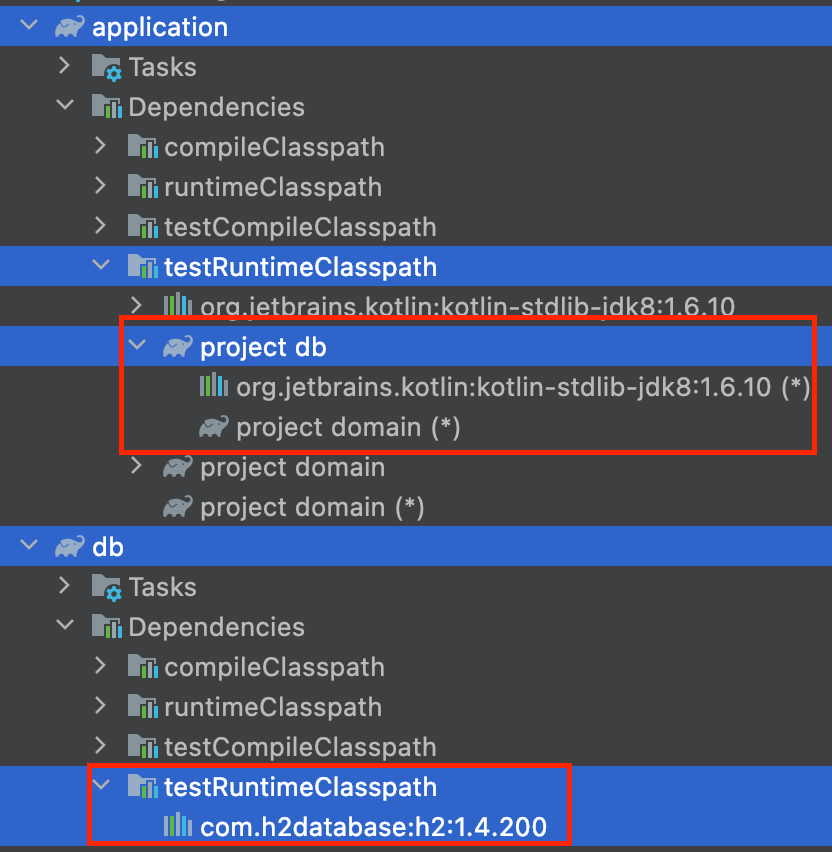

멀티 모듈 프로젝트를 진행하면서 한가지 의문점이 생겼습니다. 고민은 어떻게 테스트 코드를 관리할지에 대한 것입니다. 

만약 application 모듈이 domain 모듈과 db 모듈을 의존하고 있고, 
db 모듈도 domain 모듈에 의존한다고 가정하겠습니다. 


- domain 모듈: 핵심 비즈니스 로직에만 관심이 있는 모듈입니다. 
- db 모듈: 데이터의 CRUD에만 관심이 있는 모듈입니다. 
- application 모듈: 클라이언트의 요청을 받아 처리하는 모듈입니다. 클라이언트의 요구사항을 처리하기 위해 domain 모듈과, 데이터 조작을 위해 db 모듈에 의존하고 있습니다. 

고민은 다음과 같습니다. 
만약 application, db 모듈에서 테스트를 작성할 때, domain 모듈의 domain 객체 테스트 픽스쳐를 만들어야 한다면 어디에 만들어야 할까요? domain 모듈의 테스트 픽스쳐이기 때문에 domain/src/test 에 만들어야 할 것 같습니다. 
하지만 한가지 문제에 부딪혔습니다. 문제가 발생한 이유는 domain/src/test에 다른 모듈(application 모듈, db 모듈)이 접근할 수 없기 때문입니다. 

### 다양한 시도들 
테스트 픽스쳐를 어디에 두어야 할지 결정하기 위해 다양한 시도를 하였습니다.

첫번째 시도는 domain 모듈에 의존하는 모듈(application 모듈, db 모듈)의 src/test에 domain 객체의 픽스쳐를 만드는 것입니다. 하지만 이 방법도 문제를 가지고 있습니다. 픽스쳐 코드가 중복되기 때문입니다. 
만약 도메인 객체가 변경되어서 픽스쳐 코드도 변경되어야 한다면, 모든 중복된 코드를 변경해야 합니다. 

두번째 시도는 domain 모듈의 운영 코드에 domain 객체 픽스쳐 코드를 추가하는 것입니다. 다른 모듈에서는 domain 모듈의 운영 코드에 접근할 수 있기 때문에 중복 문제는 해결할 수 있습니다. 
하지만 이 방법은 테스트에만 필요한 코드가 운영 코드에 노출된다는 문제에 직면합니다. 만약 개발자가 실수로 운영 코드에서 테스트 픽스쳐를 이용한다면 큰 장애로 이어질 수도 있습니다. 

## java-test-fixtures
그렇다면 도메인 객체의 픽스쳐는 어디다 만들어야 할까요? 해답은 Gradle에서 제공하는 플러그인인 [java-test-fixtures 플러그인](https://docs.gradle.org/current/userguide/java_testing.html#sec:java_test_fixtures)입니다.

```java
plugins {
    id 'java-test-fixtures'
}
```

java-test-fixtures를 추가하면 testFixturesCompileClasspath와 testFixturesRuntimeClasspath가 추가됨을 확인할 수 있습니다.


java-test-fixtures 플러그인이 적용된 모듈에서 디렉토리를 생성하려고 하면 testFixtures라는 디렉토리가 자동완성 됩니다.  


빌드를 수행하면 testFixtures 관련한 task가 수행됩니다. 
```
./gradlew :domain:build

...
> Task :domain:compileTestFixturesKotlin
> Task :domain:compileTestFixturesJava NO-SOURCE
> Task :domain:processTestFixturesResources NO-SOURCE
> Task :domain:testFixturesClasses UP-TO-DATE
> Task :domain:testFixturesJar
...
```

하지만 아직 domain 모듈을 의존하는 다른 모듈(application, db 모듈)에서 testFixtures의 코드를 import 할 수 있는 것은 아닙니다. 
아래와 같이 각 모듈에서 test-fixtures.jar에 의존하도록 build.gradle에 추가해줘야 합니다. 

```java
// application/db 모듈의 build.gradle
dependencies {
    implementation(project(":domain"))
    testImplementation(testFixtures(project(":domain")))
    // 기타 디펜던시들...
}
```

위와 같이 의존성을 추가해주어야 비로소 application 모듈과 db 모듈에서 testFixtures에 존재하는 테스트 픽스쳐를 의존할 수 있게 됩니다.
아래는 java-test-fixtures 적용시 디렉토리 관계입니다. 


## 테스트 전용 의존성을 다른 모듈에 노출 시키기 

특정 모듈의 테스트에서 필요한 의존성을 다른 모듈의 테스트에서 사용해야할 경우도 있습니다. 
db 모듈의 통합테스트를 위해 인메모리 db인 H2를 테스트 전용으로 추가했다고 가정해보겠습니다.

```java
// db 모듈의 build.gradle
dependencies {
    // 기타 디펜던시들...
    testRuntimeOnly("com.h2database:h2")
}
```

이 상태에서는 db 모듈의 테스트에선 H2 db를 이용해서 통합 테스트를 진행하는 것이 가능합니다. 하지만 db 모듈을 의존하는 application 모듈에서는 h2에 대한 의존성을 가지지 못합니다.
db 모듈에서 testRuntimeOnly를 이용해서 H2 db를 추가하면 해당 의존성은 testRuntimeClasspath에 추가됩니다. 하지만 application 모듈에서는 db 모듈의 testRuntimeClasspath에 접근할수 없습니다. 

아래와 같이 runtimeOnly로 db 모듈을 추가한다면 application 모듈의 runtimeClasspath에 추가될 뿐입니다. 
```java
// application 모듈의 build.gradle
dependencies {
    // 기타 디펜던시들...
    runtimeOnly(project(":db"))
}
```

gradle 모듈의 디펜던시를 보게되면 db 모듈의 testRuntimeClasspath에는 h2에 대한 의존성이 존재하지만, application 모듈의 testRuntimeClasspath에는 h2에 대한 의존성이 존재하지 않습니다.



이 문제는 application 모듈의 test에 h2에 대한 의존성을 직접 추가해서 해결할 수도 있습니다. 하지만 이는 관심사 문제에 어긋납니다. application 모듈의 관심사는 '어떻게 클라이언트의 요청사항을 처리할 것인가'이지 '어떤 저장소를 선택해야 할 것인가'가 아닙니다.
만약 application 모듈의 테스트에서 h2 의존성을 직접 추가한다면, 적절한 관심사 분리가 어려워집니다. 

이를 해결하기 위해서 이번에도 java-test-fixtures 플러그인을 이용할 수 있습니다. 

```java
// db 모듈의 build.gradle
plugins {
    // 기타 플러그인들...
    `java-test-fixtures`
}

dependencies {
    // 기타 디펜던시들...
    testFixturesRuntimeOnly("com.h2database:h2")
}
```


db 모듈에서 testFixturesRuntimeOnly를 이용하면 h2 의존성이 testFixturesRuntimeClasspath에 추가됩니다. 
그리고 여기서 주요한 점은 testFixturesRuntimeClasspath에 추가된 의존성이 testRuntimeClasspath에도 추가된 다는 점입니다. 
즉 테스트 소스에서 testFixtures에 추가된 의존성을 참조할 수 있도록 구성됩니다. 따라서 db 모듈의 테스트 코드에서도 h2를 이용해서 여전히 테스트가 가능합니다. 

하지만 application 모듈의 테스트는 여전히 db 모듈의 testRuntimeClasspath에 추가된 H2 의존성을 참조할 수 없습니다. 외부 모듈에서는 testRuntimeClasspath를 볼 수 없기 때문입니다. 
따라서 application 모듈에서 testFixturesRuntimeClasspath를 볼 수 있도록 build.gradle에 추가해주어야 합니다.

```java
// application 모듈의 build.gradle
dependencies {
    // 기타 디펜던시들...
    runtimeOnly(project(":db"))
    testRuntimeOnly(testFixtures(project(":db")))
}
```
이렇게 application 모듈의 build.gradle에 추가해주면, application 모듈의 testRuntimeClasspath에 db 모듈의 testFixturesRuntimeClasspath가 추가됩니다.


이젠 application 모듈의 테스트에서도 h2 의존성을 이용해서 통합 테스트를 작성할 수 있게 되었습니다. 

## 결론

테스트 코드는 운영 코드에 비해 관리의 우선순위가 뒤로 밀리는 상황을 많이 겪었습니다. 하지만 테스트 코드도 운영 코드와 비슷한 중요도로 관리될 필요가 있다고 생각합니다. 테스트 코드의 가치는 개발자가 지속 가능한 개발을 가능케하고, 설계의 문제를 알려주는 역할을 하기 때문입니다. 
따라서 테스트 코드를 잘 관리하는 방법이 필수적입니다. 그리고 이번에 정리한 java-test-fixtures 플러그인은 테스트 코드를 효과적으로 관리하는데 큰 도움을 주는 플러그인입니다. 특히 모듈 간에 의존하는 멀티모듈 프로젝트에서는 테스트 코드의 관심사를 분리하기 위해서 큰 도움을 줍니다. 
이번 정리를 통해 java-test-fixtures를 이용하면 테스트 코드의 중복을 막을 수 있고, 테스트 코드의 응집도를 높일 수 있음을 확인할 수 있었습니다. 
